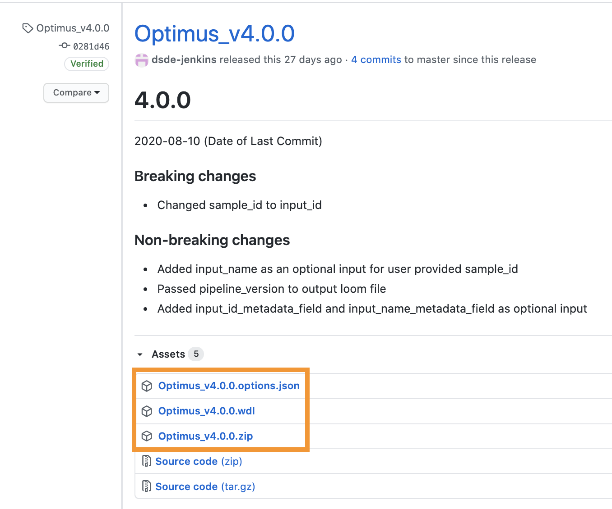
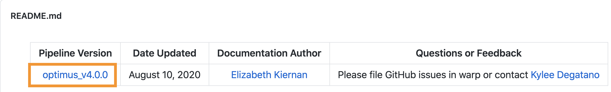
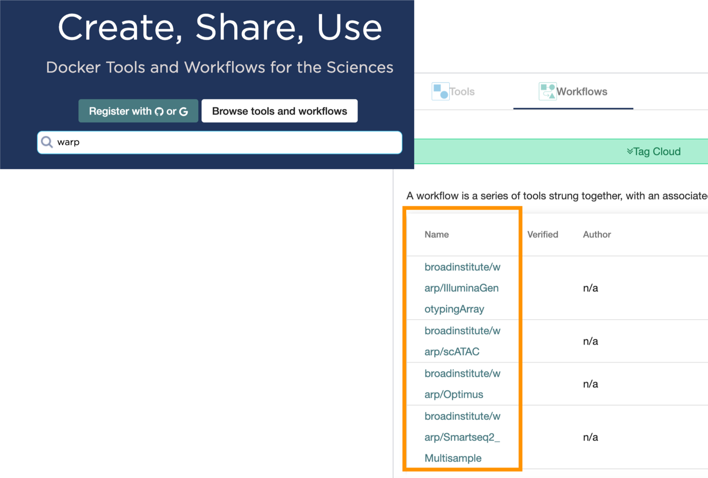

# Welcome to WARP
WARP (WDL Analysis Research Pipelines) repository is a collection of cloud-optimized pipelines for processing biological data from the Broad Institute Data Sciences Platform and collaborators. 

The contents of this repository are open source and released under the [BSD 3-Clause license](https://github.com/broadinstitute/warp/blob/master/LICENSE).

### Table of Contents
- [WARP Overview](#warp-overview)
- [Navigating WARP](#navigating-warp)
- [Using WARP](#using-warp)
- [WARP Versioning and Releasing](#warp-versioning-and-releasing)
- [Testing in WARP](#testing-in-warp)
- [Feedback](#feedback)
- [Acknowledgements](#acknowledgements)

## WARP Overview
WARP pipelines provide robust, standardized data analysis for the Broad Institute Genomics Platform and large consortia like the Human Cell Atlas and the BRAIN Initiative. You can count on WARP for rigorously scientifically validated, high scale, reproducible and open source pipelines. 

Our pipelines are written as “workflows” using the [Workflow Description Language (WDL)](https://openwdl.org/) and they process a broad spectrum of “omic” and array-related datasets (see the overview table below).

| Pipeline Category | Data Types |
| --- | --- |
| Germline Variant Discovery | Genomes, Exomes |
| Genotyping Arrays | Variant discovery, Chip validation, Joint array analysis |
| Single-cell/nuclei Transcriptomics | Droplet based (10x Genomics), Smartseq2 |
| Single-cell Epigenomics | Single nuclei ATAC-seq, Single nuclei MethylC-seq |
| Joint Genotyping | Genomes, Exomes | 
| Somatic Alignment (beta) | Exomes |

\
*Try our pipelines in [Terra](https://app.terra.bio/#workspaces?tagsFilter%5B0%5D=warp-pipelines&tab=public), a platform for collaborative cloud analysis! Learn how  in the [Using WARP](#2-run-the-pipeline-in-terra) section.*

## Navigating WARP
All versioned and released pipelines are in one of the three [pipelines](https://github.com/broadinstitute/warp/tree/master/pipelines) subdirectories: broad (pipelines for the Broad Institute’s Genomics Platform), cemba (pipelines for the BRAIN Initiative) or skylab (pipelines for the Human Cell Atlas Project). 

Each pipeline directory hosts a main workflow WDL that includes a pipeline version number and a corresponding changelog file. 

Workflows may call additional WDLs, referred to as tasks, that are located in the [tasks](https://github.com/broadinstitute/warp/tree/master/tasks) directory. 

Pipelines that are in progress or have not yet been validated are in the [beta-pipelines](https://github.com/broadinstitute/warp/tree/master/beta-pipelines) folder.

## Using WARP
There are three ways to use WARP pipelines:
### 1. Download the workflow and run on a WDL-compatible execution engine 

WDL workflows run on multiple systems, including [Cromwell](https://cromwell.readthedocs.io/en/stable/), [miniWDL](https://github.com/chanzuckerberg/miniwdl), and [dxWDL](https://github.com/dnanexus/dxWDL) (see the [openwdl documentation](https://github.com/openwdl/wdl#execution-engines)). To run a pipeline’s latest release, first navigate to WARP [Releases](https://github.com/broadinstitute/warp/releases), search for your pipeline’s tag, and download the pipeline’s assets (the WDL workflow, the JSON, and the ZIP with accompanying dependencies; see Optimus example below). 

You can also access a pipeline’s release page by selecting the pipeline version number at the top of the pipeline’s README. 

After downloading the pipeline’s assets, launch the workflow following your execution engine’s instructions.
### 2. Run the pipeline in [Terra](https://app.terra.bio/#workspaces?tagsFilter%5B0%5D=warp-pipelines&tab=public)

Several WARP pipelines are available in public workspaces on the Terra cloud platform. These workspaces include both the WDL workflow and downsampled data so that you can test the pipeline at low-cost. 

If you are new to Terra, you can get started by registering with your Google account and visiting [Terra Support](https://support.terra.bio/hc/en-us). After registration, search for WARP-related workspaces with the “warp-pipelines” tag. 

To test the pipeline, clone (make a copy of) the workspace following the instructions in this Terra Support [guide](https://support.terra.bio/hc/en-us/articles/360026130851).

### 3. Run or export the pipeline from Dockstore

[Dockstore](https://dockstore.org/) is a GA4GH compliant open platform for sharing Docker-based tools like WDL workflows. You can find WARP pipelines in Dockstore and run them on the Dockstore platform or export them to other platforms (including Terra).

To view all available pipelines, just search “warp” in the Dockstore search and browse the workflow list. See [Dockstore documentation](https://docs.dockstore.org/en/develop/index.html) for details on launching the workflow.

## WARP Versioning and Releasing
Pipelines in WARP are versioned [semantically](https://semver.org/) to support reproducibility in scientific analysis and provide clearer analysis provenance. Version numbers allow researchers to confirm their data has all been processed in a compatible way. Semantic versioning gives immediate insight into the compatibility of pipeline outputs. Read more about [versioning and releasing](docs/VersionAndReleasePipelines.md) in WARP.

## Testing in WARP
Each pipeline in WARP has accompanying continuous integration tests that run on each pull request (PR). These tests help ensure that no unexpected changes are made to each pipeline and confirm that each affected pipeline is tested with any changes to shared code. To support rapid development iteration, only the pipelines affected by a PR are tested and PRs to the `develop` branch run “plumbing” tests using small or downsampled inputs. When the `staging` branch is promoted to `master`, the updated pipelines will be tested more rigorously on a larger selection of data that covers more scientific test cases. Read more about our [testing process](docs/TestingPipelines.md).

## Feedback
WARP is always evolving! Please file any issues in GitHub or contact [Kylee Degatano](mailto:kdegatano@broadinstitute.org) with suggestions, feedback, or questions. We are always excited to discuss cloud data processing, provenance and reproducibility in scientific analysis, new pipeline features, or potential collaborations. Don’t hesitate to reach out!

Our planned upcoming improvements include:

1. A unified testing infrastructure that eases the overhead for contribution
2. Full contribution guidance
3. Automated GitHub releases of pipelines after merge to master
4. Improved Docker images and tracking of image tool versions
5. Continued additions of pipeline documentation
6. Pre-written methods sections and DOIs to enable easy publication citations
7. More pipelines: Somatic genome alignment, bulk RNAseq processing, single nuclei support for SmartSeq2

## Acknowledgements
WARP is maintained by the Broad Institute Data Sciences Platform (DSP) in collaboration with partner organizations. The Lantern Pipelines team maintains the repository with invaluable scientific oversight and pipeline contributions from the DSP Methods group as well as the HCA and BRAIN Initiative Analysis Working Groups. We thank the DSP Customer Delivery team for their help with user-, documentation-, and Terra- support. WARP pipelines have been made in collaboration with or informed by scientists across many institutions, including: labs at the Broad Institute, the European Bioinformatics Institute, Chan Zuckerburg Initiative, NY Genome Center, University of California Santa Cruz, Berkeley, and San Diego, the Allen Institute, Johns Hopkins Medical Institute, and the Baylor College of Medicine.
