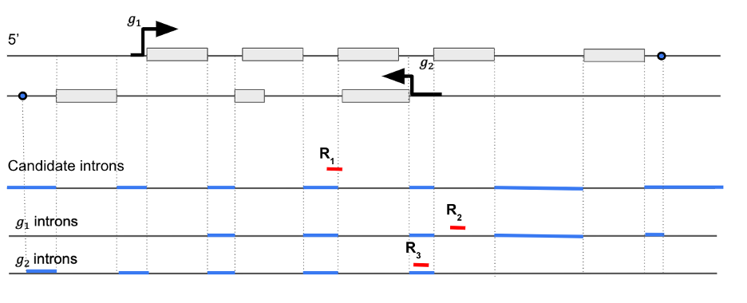

# Creating WARP pipeline references
WARP pipelines for single-cell RNA seq analysis (Optimus and Multi-snSS2) use reference files for alignment and gene annotation that are based on the Ensembl GRCm38 (Release M23) [reference FASTA]( https://ftp.ebi.ac.uk/pub/databases/gencode/Gencode_mouse/release_M23/GRCm38.p6.genome.fa.gz) and a modified version of the [gencode M23 annotated GTF](https://ftp.ebi.ac.uk/pub/databases/gencode/Gencode_mouse/release_M23/gencode.vM23.annotation.gtf.gz). These references are created using the [BuildIndices workflow]( https://github.com/broadinstitute/warp/tree/master/pipelines/skylab/build_indices), which calls on custom python scripts to add introns and specific biotypes to the GTF.
## Modifying the GTF
The BuildIndices workflow modifies the GTF to include or exclude preselected biotypes, and to add intron annotations, as described below.
### Selecting biotypes
The BuildIndices workflow requires both an input GTF file, containing gene_type and transcript_type attributes, and a [list of biotypes](https://www.gencodegenes.org/pages/biotypes.html) marked with either ‘Y’ or ‘N’ values. By default, these biotypes are chosen to be consistent with CellRanger 6. This list includes protein coding, lncRNA, Immunoglobulin (Ig) variable chain and T-cell receptor (TcR) genes and Inactivated immunoglobulin gene. Having the biotypes option allows for additional flexibility for future pipelines, where desired.
 
BuildIndices runs these inputs through a custom [Python script](https://github.com/broadinstitute/warp/blob/develop/dockers/skylab/build-indices/modify_gtf.py) that filters the input GTF to include only those biotypes selected in the biotype input. Specifically, it finds all gene_ids that meet the following criteria:
* A gene_type or transcript_type attributes allowed by the biotypes list
* At least one transcript for the gene
* A transcript attribute tag that does not include the values ‘readthrough_transcript’ (marks RNA molecules formed via the splicing of exons from more than one distinct gene) or ‘PAR’ (indicates that a region is identical between chromosomes X and Y; Ensembl does not provide different feature ids for both chromosomes)
 
After modification, the resulting GTF contains all annotations for any gene_id that has at least one transcript.
### Adding intron annotations
The [Optimus](https://broadinstitute.github.io/warp/docs/Pipelines/Optimus_Pipeline/README) and [Multi-snSS2](https://broadinstitute.github.io/warp/docs/Pipelines/Smart-seq2_Single_Nucleus_Multi_Sample_Pipeline/README) pipelines process single-nucleus data, which is enriched in pre-mRNAs containing introns. To account for this, the BuildIndices workflow uses a custom [Python script](https://github.com/broadinstitute/warp/blob/master/dockers/skylab/build-indices/add-introns-to-gtf.py) to add intron annotations to the GTF. These annotations contain additional information identifying intron and exon locations. For the purposes of WARP pipelines, introns are regions within a gene body that excludes any exons (from any genes).
 

Figure 1: Example of intronic region annotation when two gene locus overlap. The two genes are shown as g1 and g2 with boxes as exons and the two lines depict two DNA strands. The second exon for g2 overlaps an intronic region of g1. For g1, any region outside the exons are potential candidate introns. Then those regions are trimmed from the transcription start site to the end excluding exonic regions of any overlapping genes (g2 in this case). R1, R2 and R3 are three reads aligned to the genomic regions. R1 is in the intron-exon junction region, R2 is in the exon of g1 and R3 is in the intron of g1.
 
