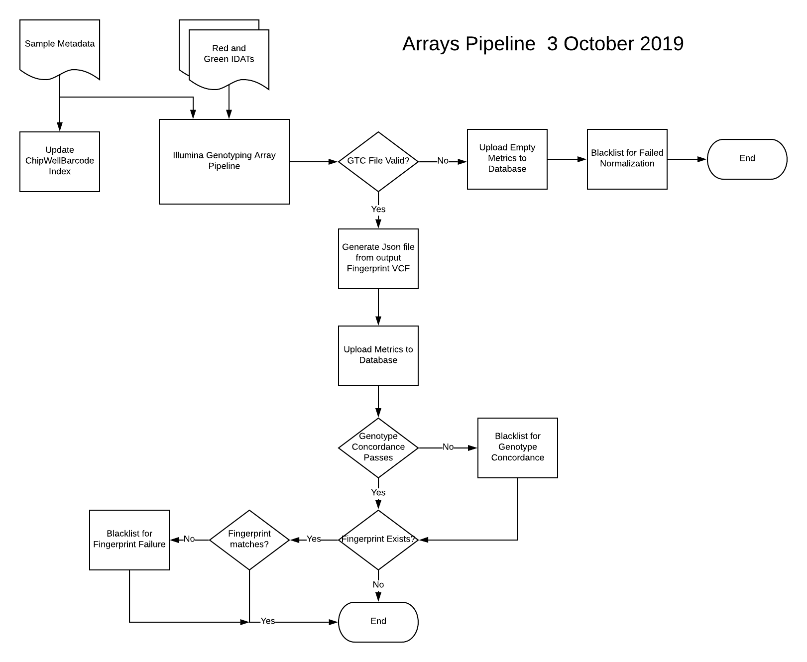

# Arrays Pipeline

This document describes version 2.6.0 of the Arrays Pipeline. The Arrays Pipeline is used internally within the Broad Institute.  It is written in WDL and designed to work on the Cromwell execution engine using Google Cloud Services and Google Cloud Storage as its backend and storage.  

The Arrays Pipeline is designed to process Illumina genotyping data (in the form of IDATs) with metadata about the genotyping chip, the sample being processed, and reference information. The pipeline generates several outputs, including an extensively annotated VCF and associated metrics.  The Arrays Pipeline differs from the ‘Illumina Genotyping Array Pipeline’ in that the former calls the latter to do primary analysis, and then uploads the metrics from these analyses to several tables in a cloud database.

## Pipeline Inputs

The Arrays Pipeline takes the inputs described below. Inputs are grouped by functional section. Optional inputs are noted.

### Sample-specific
*   chip_well_barcode. The unique identifier of the section of the chip on which the sample was run on. This is the concatenation of the chip barcode and the coordinates of the sample on the chip. 
        * Example: 7991775143_R01C01

*   analysis_version_number [Optional]. A numeric value that is used to track the number of times the pipeline has been run on this chip_well_barcode. If not specified, the pipeline will look in the database for previous runs of this chip_well_barcode and set the analysis_version_number appropriately.

*   sample_alias. The name of the sample that was run on the chip segment specified in the chip well barcode above.

*   sample_lsid. The lsid of the sample in BSP.  This is used for generating the JSON file of fingerprint genotypes that is to be uploaded to Mercury.

*   reported_gender. The reported sex/gender of the sample.

*   red_idat_cloud_path. The cloud path of the red IDAT file.

*   green_idat_cloud_path. The cloud path of the green IDAT file.
    
Additional information about the sample from the Mercury LIMS can be passed in the optional params_file or as discrete inputs.

*   params_file [Optional]. A text file containing information about the sample parameters metadata - as generated by the on-prem pipeline.

    If the params_file is NOT provided, the following inputs are used in its place:

        *   sample_id [Optional]. The ID of the sample as specified by the Mercury LIMS.

        *   collaborator_participant_id [Optional]. The collaborator-supplied name of the participant from which the sample was derived.

        *   participant_id [Optional]. The ID of the participant from which the sample was derived, as specified by the Mercury LIMS.

        *   lab_batch [Optional]. The lab batch on which the sample was run, as specified by the Mercury LIMS.

        *   product_family [Optional]. The product family, as specified by the Mercury LIMS.

        *   product_name [Optional]. The product name, as specified by the Mercury LIMS.

        *   product_order_id [Optional]. The product order ID, as specified by the Mercury LIMS.

        *   product_part_number [Optional]. The product part number, as specified by the Mercury LIMS.

        *   product_type. The product type, as specified by the Mercury LIMS.

        *   regulatory_designation [Optional]. The regulatory designation, as specified by the Mercury LIMS.

        *   research_project_id [Optional]. The research project ID, as specified by the Mercury LIMS.
    
### Reference
*   ref_fasta. The cloud path of the reference FASTA used. Note: The pipeline is only designed to work with HG19 and has only been tested with it.

*   ref_fasta_index. The cloud path of the index file for the reference FASTA.

*   ref_fasta_dict. The cloud path of the dictionary file for the reference FASTA.

*   dbSNP_vcf. The cloud path of the dbSnp VCF. Used for metrics collection.

*   dbSNP_vcf_index. The cloud path of the index file for the dbSnp VCF.

### Chip Metadata
*   arrays_metadata_path [Optional]. The cloud path where chip-specific metadata will be looked for by the workflow under certain conditions as explained below:

*   bead_pool_manifest. The cloud path of the Illumina bead pool manifest file (.bpm) that will be used to process the array data is determined based on which of the following inputs are provided:

*   bead_pool_manifest_filename [Optional]. The **name** of the Illumina bead pool manifest file that will be used to process the array data. If specified, a file by this name will be looked for in arrays_metadata_path. If **NOT** specified, the pipeline will use the **bead_pool_manifest_file**.

*   bead_pool_manifest_file [Optional]. The cloud path of the Illumina bead pool manifest file for the genotyping array to be processed.

*   extended_chip_manifest_file [Optional]. The cloud path of the Illumina chip manifest for the genotyping array to be processed, in CSV form, as extended by the Picard tool CreateExtendedIlluminaManifest. **Note** that this is optional - if NOT specified, the pipeline will use a lookup strategy: It will look for a file in arrays_metadata_path named 'extended_manifest_map.txt' and select the extended_chip_manifest_file entry in that file for the specified bead_pool_manifest_filename and cluster_filename.

*   minor_allele_frequency_file [Optional].  The cloud path to a chip-specific text file containing locus-id to minor allele frequency used as an input to the BAFRegress tool used for calculating contamination.  **Note** that this is optional - if NOT specified, the pipeline will use a lookup strategy: It will look for a file in arrays_metadata_path named 'maf_map.txt' and select the minor_allele_frequency_file entry in that file for the specified bead_pool_manifest_filename.

**zcall thresholds**

The zcall_thresholds file is tobe used with zCall. zCall](https://www.ncbi.nlm.nih.gov/pmc/articles/PMC3463112/) is a rare variants caller that can be used to improve the calls on rare variant assays on the genotyping array. If this optional parameter is provided, the pipeline will run zCall using the specified thresholds file. The cloud path of the zcall_thresholds_file that is used is determined based on which of the following inputs are provided:

*   zcall_thresholds_filename [Optional]. The **name** of the thresholds file  If specified, a file by this name will be looked for in arrays_metadata_path. If **NOT** specified, the pipeline will use **zcall_thresholds_file**. 

*   zcall_thresholds_file [Optional]. The cloud path of a zcall thresholds file to be used with zCall.

**Cluster files**

The cloud path of the Illumina cluster file (.egt) that will be used to process the array is determined based on which of the following inputs are provided:

*   cluster_filename [Optional]. The **name** of the Illumina cluster file (.egt) that will be used to process the array data. If specified, a file by this name will be looked for in arrays_metadata_path. If **NOT** specified, the pipeline will use the **cluster_file**.

*   cluster_file [Optional]. The cloud path of the Illumina cluster file (.egt) for the genotyping array to be processed.

*   gender_cluster [Optional]. The gender cluster file is an Illumina cluster file (.egt) that is used to run IAAP/gencall specifically for calling the gender of the sample.  It typically is designed with all assays other than those at specific sites on the sex chromosomes zeroed out. The cloud path of the gender_cluster_file that is used is determined based on which of the following inputs are provided:   

*   gender_cluster_filename [Optional]. The **name** of the Illumina cluster file (.egt) that will be used to process the array data for gender calling. If specified, a file by this name will be looked for in arrays_metadata_path. If **NOT** specified, the pipeline will use **gender_cluster_file**. 

*   gender_cluster_file [Optional]. The cloud path of the Illumina cluster file (.egt) that will be used to process the array data for gender calling.

   

### Fingerprinting
*   read_fingerprint_from_mercury. If this boolean is true, the pipeline will read the fingerprint from the Mercury Fingerprint Store. If it is false (default), the pipeline will use the (optional) fingerprint_genotypes_vcf_file, below.

*   write_fingerprint_to_mercury. If this boolean is true, the pipeline will write the fingerprint **generated from the output vcf** back to the Mercury Fingerprint Store. Default is set to false.

*   fingerprint_genotypes_vcf_file [Optional]. The cloud path of a VCF containing a ‘fingerprint’ (a set of genotypes - typically generated on an orthogonal genotyping platform - for the sample to be processed). If provided, this file is used by CheckFingerprint to verify that the sample being processed is the same as that reported in the fingerprint_genotypes_file.

*   fingerprint_genotypes_vcf_index_file [Optional]. The cloud path of the index file for the fingerprint_genotypes_vcf_file.

*   haplotype_database_file. The cloud path of the ‘haplotype_database_file’. This is a file that contains the haplotype block information for the sites used in the fingerprint_genotypes_vcf_file.

*   variant_rsids_file. The cloud path to the variant_rsids_file. This file contains a list of rsids for fingerprint sites that can be supplied to the pipeline to have it generate a subset of the output VCF containing genotypes only at these sites. This output VCF can then be used as a source of fingerprint information from the sample processed by the pipeline.

### Genotype concordance
*   arrays_control_data_path [Optional]. The cloud path where control sample VCF and related files will be looked for by the workflow **under certain conditions as explained below**:

*   control_sample_name [Optional]. The name of the control sample in the control_sample_vcf_file. Note that **if this is specified, and the remaining three fields (control_sample_vcf_file, control_sample_vcf_index_file, and control_sample_intervals_file) are NOT specified,** then the pipeline will look for the VCF and related files for 'control_sample_name' in the path specified in 'arrays_control_data_path'

*   control_sample_vcf_file [Optional]. The cloud path of a VCF containing the genotypes from a control sample. If this file is provided, the pipeline will do a genotype concordance between the VCF of the sample generated by the pipeline and this file. If this file is in the path specified by  `arrays_control_data_path`, you do not need to provide this input.

 *   control_sample_vcf_index_file [Optional]. The cloud path of the index file for the control_sample_vcf_file. If this file is in the path specified by  `arrays_control_data_path`, you do not need to provide this input.

*   control_sample_intervals_file [Optional]. The cloud path of the interval_list file of the control_sample_vcf_file. If this file is in the path specified by `arrays_control_data_path`, you do not need to provide this input.

### Other
*   call_rate_threshold. A numeric value for determining whether the pipeline reports this sample as passing or failing. If the call rate calculated by the pipeline is greater than this value the sample is reported as passing.

*   genotype_concordance_threshold. A numeric value for determining whether a sample with control data passes genotype_concordance.  If the genotype concordance calculated by the pipeline is greater than this value the sample is reported as passing genotype concordance.

*   contamination_controls_vcf.  The cloud path to a VCF of samples run on this chip type to be used to supplement contamination calling.

*   subsampled_metrics_interval_list. The cloud path to the subsampled_metrics_interval_list. This file contains a list of sites that can be supplied to the pipeline to have it subset the output VCF and generate metrics specifically for those sites.

*   disk_size. The default disk size (in GiB) for cloud VMs spun up for the tasks in this pipeline.

*   premptible_tries. The number of times a task may be preempted by GCE before it is submitted to a non-preemptible VM.

*   environment.  A string value indicating which environment (dev, staging, or prod) this WDL is to run on.  This value is used in looking up cloud database information.

*   vault_token_path. The cloud path to the vault token.  This value is used in looking up cloud database information.

## Pipeline Tasks

The pipeline executes the following tasks:

*   UpdateChipWellBarcodeIndex. This task runs a program that loads metadata about the sample and chip into the cloud SQL database.

*   IlluminaGenotypingArray. This task runs the IlluminaGenotypingArray pipeline (another pipeline WDL).

*   GenerateEmptyVariantCallingMetricsFile.  This task will be run if the IlluminaGenotypingArray task returns an empty GTC file.  This condition typically indicates that normalization has failed. The task creates a metrics file with minimal information in it, suitable for uploading to the cloud SQL database.

*   UploadEmptyArraysMetrics. This task will be run if the IlluminaGenotypingArray task returns an empty GTC file. It uploads the empty metrics to the cloud SQL database.

*   BlacklistFailedNormalization. This task will be run if the IlluminaGenotypingArray task returns an empty GTC file. It creates a record in the blacklist table in the cloud SQL database, indicating that the chip_well_barcode failed normalization.

*   VcfToMercuryFingerprintJson [Optional]. This task will be run if the IlluminaGenotypingArray task generates a non-empty GTC file.  It takes the fingerprint VCF generated by this task and creates a json file suitable for uploading to Mercury from it.

*   UploadArraysMetrics.  This task will be run if the IlluminaGenotypingArray task returns a non-empty GTC file.  It uploads array-specific metrics to the cloud SQL database.

*   BlacklistFailedGenotypeConcordance.  This task will be run if the IlluminaGenotypingArray task returns a non-empty GTC file and if the sample was a control sample and it failed genotype concordance.  It creates a record in the blacklist table in the cloud SQL database, indicating that the chip_well_barcode failed genotype concordance.

*   BlacklistFailedFingerprint.  This task will be run if the IlluminaGenotypingArray task returns a non-empty GTC file and if the sample had an associated fingerprint and it failed fingerprint check.  It creates a record in the blacklist table in the cloud SQL database, indicating that the chip_well_barcode failed fingerprinting.

## Pipeline Outputs

The pipeline generates the following outputs:

*   chip_well_barcode_output. The chip_well barcode (this is the same as the input parameter 'chip_well_barcode').

*   analysis_version_number_output. The analysis version number (this is the same as the input parameter 'analysis_version_number').

*   output_vcf. The VCF generated by the pipeline.

*   output_vcf_index. The index file of the VCF generated by the pipeline.

*   gtc_file. The GTC file generated by IlluminaGenotypingArray Autocall.

*   baf_regress_metrics_file.  A metrics file containing the metrics generated by BafRegress.

*   contamination_metrics_file. A metrics file containing the metrics generated by VerifyIDIntensity.

*   reference_fingerprint_vcf. The fingerprint VCF that was used for comparison with the Arrays output_vcf by CheckFingerprints

*   reference_fingerprint_vcf_index. The index file of the fingerprint VCF that was used for comparison with the Arrays output_vcf by CheckFingerprints

*   output_fingerprint_vcf. A VCF containing genotypes selected from the output_vcf at certain designated sites.

*   output_fingerprint_vcf_index. The index file of the output_fingerprint_vcf.

*   output_fingerprint_json_file.  A JSON file containing genotypes selected from the ouptut_vcf at certain designated sites.  Suitable for uploading to Mercury.

*   arrays_variant_calling_summary_metrics_file. The summary metrics file for the output VCF as generated by IlluminaGenotypingArray.CollectArraysVariantCallingMetrics. CollectArraysVariantCallingMetrics.summary_metrics.

*   arrays_variant_calling_detail_metrics_file. The detailed metrics file for the output VCF as generated by IlluminaGenotypingArray.CollectArraysVariantCallingMetrics. CollectArraysVariantCallingMetrics.detail_metrics.

*   arrays_variant_calling_control_metrics_file. The control code metrics file for the output VCF as generated by IlluminaGenotypingArray.CollectArraysVariantCallingMetrics.

*   arrays_subset_variant_calling_summary_metrics_file. The summary metrics file for the subsetted VCF as generated by IlluminaGenotypingArray.CollectArraysVariantCallingMetrics.

*   arrays_subset_variant_calling_detail_metrics_file. The detailed metrics file for the subsetted VCF as generated by IlluminaGenotypingArray.CollectArraysVariantCallingMetrics.

*   arrays_subset_variant_calling_control_metrics_file. The control code metrics file for the subsetted VCF as generated by IlluminaGenotypingArray.CollectArraysVariantCallingMetrics.

*   fingerprint_summary_metrics_file. The summary metrics as calculated by IlluminaGenotypingArray.CheckFingerprint between the pipeline output VCF and the optionally specified input fingerprint VCF.

*   fingerprint_detail_metrics_file. The detail metrics as calculated by IlluminaGenotypingArray.CheckFingerprint between the pipeline output VCF and the optionally specified input fingerprint VCF.

*   genotype_concordance_summary_metrics_file. The summary metrics as calculated by IlluminaGenotypingArray.GenotypeConcordance between the pipeline output VCF and the optionally specified control VCF.

*   genotype_concordance_detail_metrics_file. The detail metrics as calculated by IlluminaGenotypingArray.GenotypeConcordance between the pipeline output VCF and the optionally specified control VCF.

*   genotype_concordance_contingency_metrics_file. The contingency metrics as calculated by IlluminaGenotypingArray.GenotypeConcordance between the pipeline output VCF and the optionally specified control VCF.

*   chip_well_barcode_params_file. A text file containing information about the sample parameters metadata 

*   red_idat_md5_cloud_path. A file containing the md5 of the (input) red_idat.

*   green_idat_md5_cloud_path. A file containing the md5 of the (input) green_idat.

*   output_vcf_md5_cloud_path. A file containing the md5 of the output VCF.

