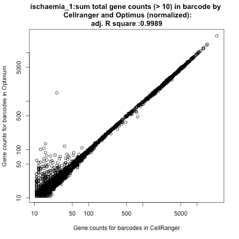
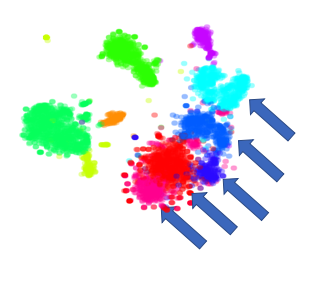
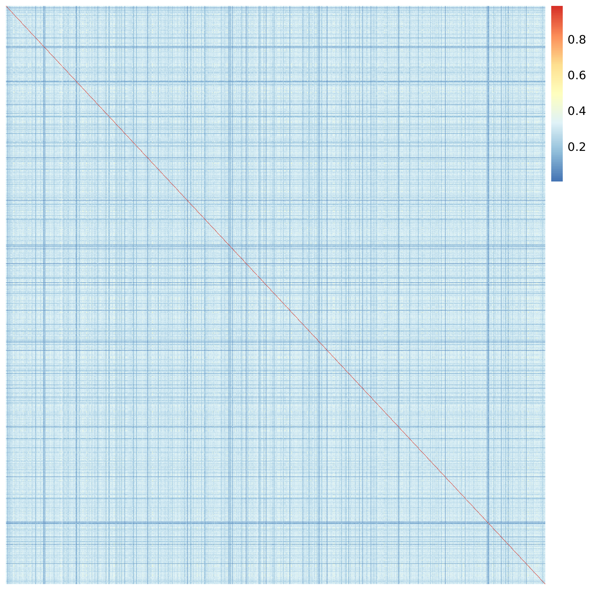

Executive Summary
=================

This document is presented to the Analysis Working Group for the
approval of the Optimus pipeline as the data processing pipeline for 3’
single-cell RNA-seq data for the Human Cell Atlas (HCA) project.

The report summarizes the main challenges associated with processing 3’
assay data and presents the minimal viable product (MVP) requirements
for the Optimus pipeline to be able to process this type of input data.
An overview of the Optimus pipeline is then presented outlining the main
scientific tasks and the tools used for completing those.

We propose the adoption of the Optimus pipeline as the standard data
processing pipeline supporting the analysis of the 10X V2 3’
transcriptomics assay for the Human Cell Atlas because, as we
demonstrate in the present document, it is fundamentally equivalent in
both methodology and results to the current standard. Additionally, it
is open source and uses peer reviewed methodologies where possible.

Specifically, we evaluate the output of the pipeline as a whole against
the output of Cell Ranger (version 3.0) on diverse datasets, including
the extensively characterized 4k PBMC and 8k PBMC datasets released to
the public domain by 10X, and find minimal differences. Furthermore, the
main scientific tasks are evaluated component-wise. Several datasets are
used to assess the validity of the cell barcode correction, the effect
of the UMI correction, and the suitability of the cell vs background
differentiation approach. Finally the output of the pipeline is
evaluated for reproducibility across multiple runs.

Table of Contents
=================

`Executive Summary <#executive-summary>`__\ **0**

`Table of Contents <#table-of-contents>`__\ **1**

`Introduction <#introduction>`__\ **3**

`The 3’ scRNA-seq assay <#the-3-scrna-seq-assay>`__\ **3**

   `Computational Challenges <#computational-challenges>`__ 4

   `CB and UMI Sequence Errors <#cb-and-umi-sequence-errors>`__ 4

   `Cell and Empty Droplet
   Differentiation <#cell-and-empty-droplet-differentiation>`__ 4

   `Doublet and multiplet
   detection <#doublet-and-multiplet-detection>`__ 5

   `Chimera Correction <#chimera-correction>`__ 5

`Minimum Viable Product
Requirements <#minimum-viable-product-requirements>`__\ **6**

`Description of the Optimus
Pipeline <#description-of-the-optimus-pipeline>`__\ **7**

   `Scientific Description of the Optimus
   Pipeline <#scientific-description-of-the-optimus-pipeline>`__ 8

   `Input Preparation and Appending of
   Tags <#input-preparation-and-appending-of-tags>`__ 8

   `Align to Genome and Identify Gene of
   Origin <#align-to-genome-and-identify-gene-of-origin>`__ 8

   `Metric Generation <#metric-generation>`__ 8

   `Count Matrix Calculation <#count-matrix-calculation>`__ 9

   `Convert to Zarr <#convert-to-zarr>`__ 9

`Testing MVP Functionality <#testing-mvp-functionality>`__\ **10**

   `Overall Testing <#overall-testing>`__ 10

   `Selection of Datasets <#selection-of-datasets>`__ 10

   `Comparison of 8k PBMC Processing with Optimus and Cell
   Ranger <#comparison-of-8k-pbmc-processing-with-optimus-and-cell-ranger>`__
   11

   `Generalization of Optimus and Cell Ranger
   Comparison <#generalization-of-optimus-and-cell-ranger-comparison>`__
   14

   `Individual Component Testing <#individual-component-testing>`__ 22

   `Cell Barcode Correction <#cell-barcode-correction>`__ 22

   `UMI Correction <#umi-correction>`__ 25

   `Improved Cluster Definition <#improved-cluster-definition>`__ 25

   `Apparent Loss of Clusters <#apparent-loss-of-clusters>`__ 26

   `Cell vs Background
   Differentiation <#cell-vs-background-differentiation>`__ 29

   `Reproducibility Testing <#reproducibility-testing>`__ 30

`References <#references>`__\ **32**

`Appendix 1: Supplementary Tables and
Figures <#appendix-1-supplementary-tables-and-figures>`__\ **34**

   `Tables <#tables>`__ 34

   `Figures <#figures>`__ 35

`Appendix 2: Detailed description of the Optimus
pipeline <#appendix-2-detailed-description-of-the-optimus-pipeline>`__\ **37**

   `FastqToUBam <#fastqtoubam>`__ 37

   `Attach10XBarcodes <#attach10xbarcodes>`__ 37

   `MergeSortBamFiles and
   SplitByCellBarcode <#mergesortbamfiles-and-splitbycellbarcode>`__ 38

   `StarAlignBamSingleEnd and
   TagGeneExon <#staralignbamsingleend-and-taggeneexon>`__ 38

   `PreUMISort and UMIcorrection <#preumisort-and-umicorrection>`__ 38

   `GeneSortBam, CalculateGeneMetrics and
   MergeGeneMetrics <#genesortbam-calculategenemetrics-and-mergegenemetrics>`__
   38

   `CellSortBam, CalculateCellMetrics and
   MergeCellMetrics <#cellsortbam-calculatecellmetrics-and-mergecellmetrics>`__
   38

   `Pre-count Sort, CreateSparseCountMatrix and
   MergeCountFiles <#pre-count-sort-createsparsecountmatrix-and-mergecountfiles>`__
   38

   `PostUMISort and
   MergeSortBamFile <#postumisort-and-mergesortbamfile>`__ 39

   `RunEmptyDrops <#runemptydrops>`__ 39

`Appendix 3: Additional Comparisons Between Optimus and Cell
Ranger <#appendix-3-additional-comparisons-between-optimus-and-cell-ranger>`__\ **40**

   `Additional Dataset 1: 4k PBMC <#additional-dataset-1-4k-pbmc>`__ 40

   `Additional Dataset 2:
   Ischaemia_1 <#additional-dataset-2-ischaemia_1>`__ 42

   `Additional Dataset 3: Immune Atlas
   MantonBM_1 <#additional-dataset-3-immune-atlas-mantonbm_1>`__ 44

Introduction
============

This report outlines the computational challenges associated with 10X v2
3’ transcriptomics data processing, the landscape of tools available to
process such datasets, the rationale for the selection of tools used in
the first draft of the Optimus processing pipeline, and verification
that the initial pipeline has appropriate performance to support
scientific inquiry.

This document does not focus on other 3’ single cell transcriptomics
assays, methodology that does not exist as computational tools, or the
evaluation of data processing pipeline speed/cost tradeoff. Software
engineering design is not the focus of this document, only the
scientific validity of the processed data.

The 3’ scRNA-seq assay
======================

The development of the 3’ scRNA-seq transcriptomic assay has allowed the
interrogation of thousands of individual single cell transcriptomes in
parallel. Different protocols (inDrop, dropSeq, and 10X) for this assay
are currently available and all share some common elements. The main
commonality is the co-encapsulation of cells and beads in microfluidic
droplets, which allows generation of barcoded next-generation sequencing
(NGS) libraries for each cell individually before pooling and sequencing
all cells simultaneously.

One of the most highly used assays as of this writing, and the focus of
the Optimus pipeline, is the 10X v2 assay. This assay results in
next-generation reads composed of nine segments as outlined in Figure 1.

Of critical importance to the processing of the data are the Cellular
Barcode (CB) and Unique Molecular Identifier (UMI) segments. Both
originate from the bead that is co-encapsulated with the cell. The 16 bp
cell barcode is common for all the reads bound to a given bead and
serves to identify the cell of origin for each read. The 10 bp UMI (12
bp in 10X v3), is a random sequence that is different for each original
mRNA molecule bound to the bead and serves to discern reads that are PCR
duplicates from multiple copies of the same transcript present in the
original cell.

|image0|

**Figure 1: Read Structure for 10X v2 scRNA-seq. The read is composed of
the following segments. The Illumina P5 and P7 sequences are necessary
for cluster generation and sequencing of the libraries using Illumina
technology. The Truseq Read 1 and Truseq Read 2 sequences serve as
priming sites for read sequencing. The cell barcode, unique molecular
identifier and cDNA sequence are most important for computational
processing and are discussed further in the main text.**

Computational Challenges
------------------------

A simplified summary of the computational approach to processing 3’
assay data is the mapping of reads to the transcriptome while counting
the number of times molecules from each gene and cell appear. However
this basic workflow is complicated by the need to account for
experimentally introduced artifacts in the data.

Known biases in the data are produced by CB and UMI sequence errors
during sequencing, doublet and multiplet formation, chimera formation,
and uneven transcript representation.

CB and UMI Sequence Errors
~~~~~~~~~~~~~~~~~~~~~~~~~~

CB sequence errors occur when one or more bases in the CB are
incorrectly amplified or sequenced. When a predetermined set of
sequences for CBs is used during bead formation, it is possible to
correct single (or in some cases more than one) errors in the sequence
by identifying CBs within a specific edit distance of each other and
collapsing them. Similar approaches are also possible, but less
reliable, when CBs are random sequences. Furthermore, in the absence of
a whitelist containing the expected CB sequences, the CB correction
problem is complicated by the fact that there is a large background of
CBs that are not associated with cells.

Most pipelines utilize simple barcode correction by correcting barcodes
to one edit distance and discarding any reads that don’t fulfill these
criteria. The dropest pipeline (*Petukhov et al, 2018*) however,
evaluates the “likelihood that two independent cells will end up
producing equivalent UMI-gene combinations”.

UMI sequence errors occur for the same reason as CB errors. However,
unlike CBs, UMIs are random sequences and a whitelisting approach can’t
be utilised. Complicating the UMI correction is the fact that the UMIs
are known to map in multiple nearby sequences (*Sena et al, 2018*) and
that the UMI frequency distribution is known to be highly skewed
(*Petukhov et al, 2018*). The umi-tools package utilizes network-based
approaches (termed cluster, adjacency and directional) to collapse UMIs
(*Smith et al, 2017*).

Cell and Empty Droplet Differentiation
~~~~~~~~~~~~~~~~~~~~~~~~~~~~~~~~~~~~~~

A problem related to cell barcode correction is that of differentiation
of empty droplets from real cells. The traditional approach for
differentiating between background and real cells is to impose a strict
cutoff on the basis of the cumulative distribution of UMIs per barcode.
This approach has been widely used (*Azizi et al 2018, Macosko, et al
2015, Cell Ranger*) but it has the potential to discard droplets that
contain cells of small size.

More recent approaches attempt to discern background empty droplets from
real cells on the basis of their transcriptomic profile. The emptyDrops
function from the dropletUtils Bioconductor Package (*Lun A, et al 2018*
and *Griffiths JA, et al 2018*) identifies very small barcodes that with
a high level of certainty correspond to a background and constructs a
profile against which it compares all droplets, whereas dropEst
(*Petukhov et al, 2018*) trains a classifier on the basis of known
positives and negatives and uses that to classify intermediate droplets.

Doublet and multiplet detection
~~~~~~~~~~~~~~~~~~~~~~~~~~~~~~~

Doublets and multiplets occur when two or more cells are encapsulated in
a single droplet and therefore all reads share the same CB. Doublets can
occur due to either stochastic co-encapsulation of cells or due to cell
aggregates. Doublets generate data points that exhibit a profile of
expression characteristic of two encapsulated cells and can lead to the
incorrect interpretation that there are intermediate states between two
populations.

Doublet detection is a computationally challenging problem that is
complicated by the presence of genuine intermediate cell states in some
samples. At least three tools to tackle this problem have been proposed:
Scrublet (*Wolock et al, 2019*), DoubletDecon (*DePasquale et al, 2018*)
and DoubletFinder (*McGinnis et al, 2018*). However, none of these
methods are peer-reviewed or in widespread use in the community. All
available tools are targeted towards the problem of stochastic doublet
generation and not to the generation of doublets due to aggregation.

Scrublet and DoubletFinder both utilize synthetic doublets from the
clusters identified in the data and use nearest neighbor graphs to
identify doubles. DoubletDecon instead attempts to deconvolute all cells
into reference cell states and then identifies cells that closely match
the profile of combination of cell states as doublets. It then performs
a second ‘rescue’ step to identify cells that were erroneously marked as
doublets in the original assignment.

Due to the fact that none of the above solutions are in widespread use
in the scientific community and that no clear standard exists this is a
challenge not tackled in the current version of Optimus.

Chimera Correction
~~~~~~~~~~~~~~~~~~

The term chimera refers to the chimeric molecules that are composed of
parts of two different original reads. Chimera formation is a well
documented phenomenon that occurs during PCR amplification; overall
chimera abundance in scRNA-seq has been estimated to be up to 5.2%
(*Dixit et al, 2019*). Due to the read structure for 3’ assays, chimera
formation predominantly results in the generation of reads that have a
CB and UMI pair incorrectly assigned to a transcript (see Figure 1).

Currently available solutions for chimera correction include a
proprietary closed source algorithm implemented, of unknown mode of
operation, by Cell Ranger (10X Genomics) and two algorithms available as
part of the Schimera package (*Dixit A, bioRxiv, 2019*), that use either
supervised or unsupervised approaches to identify contaminating
molecules.

**Table 1: Available tools and features for tackling major challenges in
3’ scRNA-seq datasets**

+-----------+-----------+-----------+-----------+-----------+-----------+
| **Tool**  | **Feature |
|           | s**       |
+===========+===========+===========+===========+===========+===========+
|           | **CB      | **UMI     | **Empty   | **Doublet | **Chimera |
|           | Correctio | Correctio | Droplet   | Detection | Correctio |
|           | n**       | n**       | Detection | **        | n**       |
|           |           |           | **        |           |           |
+-----------+-----------+-----------+-----------+-----------+-----------+
| **UMItool |           | Yes       |           |           |           |
| s**       |           |           |           |           |           |
+-----------+-----------+-----------+-----------+-----------+-----------+
| **umis**  |           | Yes       |           |           |           |
+-----------+-----------+-----------+-----------+-----------+-----------+
| **emptyDr |           |           | Yes       |           |           |
| ops**     |           |           |           |           |           |
+-----------+-----------+-----------+-----------+-----------+-----------+
| **Doublet |           |           |           | Yes       |           |
| Finder**  |           |           |           |           |           |
+-----------+-----------+-----------+-----------+-----------+-----------+
| **Scruble |           |           |           | Yes       |           |
| t**       |           |           |           |           |           |
+-----------+-----------+-----------+-----------+-----------+-----------+
| **Doublet |           |           |           | Yes       |           |
| Decon**   |           |           |           |           |           |
+-----------+-----------+-----------+-----------+-----------+-----------+
| **dropEst | Yes       | Yes       | Yes       |           |           |
| **        |           |           |           |           |           |
+-----------+-----------+-----------+-----------+-----------+-----------+
| **Alevin* |           | Yes       | Yes       |           |           |
| *         |           |           |           |           |           |
+-----------+-----------+-----------+-----------+-----------+-----------+
| **schimer |           |           |           |           | Yes       |
| a**       |           |           |           |           |           |
+-----------+-----------+-----------+-----------+-----------+-----------+
| **Cell    | Yes       | Yes       | Yes       |           | Yes       |
| Ranger**  |           |           |           |           |           |
+-----------+-----------+-----------+-----------+-----------+-----------+
| **Cellben |           |           | Yes       |           | Yes       |
| der**     |           |           |           |           |           |
+-----------+-----------+-----------+-----------+-----------+-----------+

Minimum Viable Product Requirements
===================================

In addition to the generation of a valid gene expression count matrix, a
data processing pipeline is also required to have a very basic
complement of features (MVP Requirements) that ensure the scientific
accuracy of the result, in line with the current understanding of
corrections required for 3’ datasets. These are listed in Table 2 along
with the status of the Optimus pipeline with respect to this
functionality.

**Table 2: Minimum Viable Product Requirements for a pipeline that can
process 10X v2 datasets**

+-----------------------+-----------------------+-----------------------+
|                       | **Minimum standard**  | **Met by current      |
|                       |                       | code?**               |
+=======================+=======================+=======================+
| Bam file generation   | Provide unfiltered    | Yes                   |
|                       | aligned BAM file      |                       |
+-----------------------+-----------------------+-----------------------+
| Count matrix          | Provide count matrix  | Yes                   |
| generation            | generated             |                       |
+-----------------------+-----------------------+-----------------------+
| Cell/background       | Discern between       | Yes                   |
| differentiation       | background and        |                       |
|                       | foreground by         |                       |
|                       | observing the         |                       |
|                       | expression profile of |                       |
|                       | each cell.            |                       |
+-----------------------+-----------------------+-----------------------+
| CB correction         | At least 1 edit       | Yes, when whitelist   |
|                       | distance with         | is present (as in 10X |
|                       | whitelisting          | v2)                   |
+-----------------------+-----------------------+-----------------------+
| Read deduplication    | At least 1 edit       | Yes, exceeded         |
| with UMI correction   | distance UMI          |                       |
|                       | correction            |                       |
|                       | deduplication taking  |                       |
|                       | into account nearby   |                       |
|                       | mapping UMIs          |                       |
+-----------------------+-----------------------+-----------------------+
| Chimera correction    | Unknown               | No                    |
+-----------------------+-----------------------+-----------------------+
| Doublet detection     | None                  | N/A                   |
+-----------------------+-----------------------+-----------------------+
| Generation of detail  | Report basic          | Exceeded              |
| metrics on output     | statistics about      |                       |
|                       | output matrix         |                       |
+-----------------------+-----------------------+-----------------------+

Description of the Optimus Pipeline
===================================

|image1|
--------

**Figure 2: Simplified schematic and scientific outline of the Optimus
pipeline.**

**Scientific Description of the Optimus Pipeline**
--------------------------------------------------

This section provides a high level overview of the underlying
methodology of the Optimus pipeline. Additional details can be found in
Appendix 2. The inputs to the Optimus pipeline are sequencing and sample
index reads in FASTQ format, as well as an alignment reference and
barcode whitelist. The output of the pipeline consists of the unfiltered
count matrix, gene and cell metrics, and an unfiltered BAM file with
information encoded in tags, that allows the end user to carry out
customized analysis.

Input Preparation and Appending of Tags
~~~~~~~~~~~~~~~~~~~~~~~~~~~~~~~~~~~~~~~

During this sequence of steps, input fastqs are converted to unmapped
BAMs. UMI and CB sequences are appended as tags.

**FastqToUBam** In this step, the second FASTQ file (R2) is converted
into unaligned BAM format using Picard FastqToSam (see Picard
documentation reference) .

**Attach10XBarcodes** During this step, Optimus extracts the UMI and
cell-barcode sequences from read 1 (R1) with the respective quality
scores and appends them to the corresponding read 2 (R2) sequence as
tags. This step also corrects the cellular barcodes if they are within a
Levenshtein edit distance of 1 from a whitelist of cell barcodes,
storing the result in the CB tag. UMIs are not corrected during this
step.

**MergeSortBamFiles and SplitByCellBarcode** These steps split the data
into fragments that allow efficient distributed processing. The steps
are not expected to have any impact on the scientific analysis.

Align to Genome and Identify Gene of Origin
~~~~~~~~~~~~~~~~~~~~~~~~~~~~~~~~~~~~~~~~~~~

**StarAlignBamSingleEnd** The reads in the BAM file from the preceding
step are aligned to the reference genome using the STAR aligner to
create an aligned BAM. The STAR aligner is selected for compatibility
with pipelines currently in wide use in the single-cell community.

**TagReadWithGeneExon** The resulting BAM is processed with the
TagReadWithGeneExon from DropSeqTools to identify the gene that each
read overlaps and annotate the read with the GE tag denoting this
information. Currently, the tool tags the read with the part of the
genome (intronic, coding, utr, intergenic) and with a gene tag when the
read aligns to an exon.

**UMI correction** Next the BAM file is processed though UMI-tools
(*Smith T., et al*) for UMI correction, using the network-based
“directional” method.

Metric Generation
~~~~~~~~~~~~~~~~~

**GeneSortBam, CalculateGeneMetrics and MergeGeneMetrics** After UMI
sequence correction, the BAMs are sorted by gene, cell barcode, and UMI
in the GeneSortBam stage and then gene metrics are calculated for each
chunk before the information from different chunks is combined. All
these steps are performed using sctools.

**CellSortBam, CalculateCellMetrics and MergeCellMetrics** Similar steps
to the above for gene metrics calculations are performed on the
UMI-corrected BAM file to obtain the cell metrics.

Count Matrix Calculation
~~~~~~~~~~~~~~~~~~~~~~~~

**CreateSparseCountMatrix and MergeCountFiles** The sorted BAM output
from the CellSortBam stage is used here to generate the count matrix.
The counting script considers every read, and if a read is mapped to
different genomic locations that span multiple genes, it is discarded.
Reads that remain are counted provided that the triplet of cell barcode,
molecule barcode and gene name has not been encountered before. Files
from this stage of the pipeline are then merged to produce a single
unified count matrix.

**MergeSortBamFile** Individual Bam files are merged and sorted by
genomic coordinate into a single BAM file.

**RunEmptyDrops** The emptyDrops function from the dropletUtils R
package is called on the final matrix to identify barcodes that
represent real cells against background empty droplets. The full output
of this utility consists of the table output of emptyDrops along with an
additional column with binary identification of droplets as cells or
empty droplets based on an FDR cutoff of 1% (as recommended by the
emptyDrops manuscript) and a minimum number of 100 molecules (in order
to exclude cells that may be real but are too small for useful
downstream analysis).

Convert to Zarr
~~~~~~~~~~~~~~~

**ZarrConversion** In this final step, the cell and gene metrics and the
count matrix are stored in a Zarr file format, a format optimized for
sparse matrices.

Testing MVP Functionality
=========================

The purpose of this section is three-fold:

1. Test the pipeline as a whole and compare it to the current *de facto*
      standard (Cell Ranger)

2. Test components of the pipeline that impact on the scientific output
      and provide justification of the selection of tools used

3. Characterize the reproducibility of the pipeline

Overall Testing
---------------

The purpose of this section is to test the overall pipeline and compare
it to the *de facto* standard, Cell Ranger.

We note here that the approach utilized by Optimus is methodologically
highly similar to that of all other pipelines used for the analysis of
3’ single-cell data, including to that of Cell Ranger. However, unlike
Cell Ranger, Optimus currently does not perform chimera correction as
there are no widely accepted solutions for this task by the scientific
community. Despite this, we do not observe any significant differences
in the output.

Selection of Datasets
~~~~~~~~~~~~~~~~~~~~~

In testing the pipeline we selected a diverse set of datasets that
encompass standard datasets extensively analysed by the community and
datasets specific to the Human Cell Atlas Project. As the majority of
the datasets available in the public domain are blood datasets, we
specifically aimed to include an additional dataset that is not of
hematological origin (‘ischaemia_1’, a sample obtained from spleen). The
reader is referred to Table 3 for more details. A full complement of
datasets processed and inspected, but not used for comparison to Cell
Ranger can be found in Table 1 of Appendix 1.

**Table 3: Datasets used for overall testing of the Optimus Pipeline**

+-------------+-------------+-------------+-------------+-------------+
| **Dataset   | **Source**  | **Descripti | **Number of | **Reference |
| Name**      |             | on**        | Cells**     | **          |
+=============+=============+=============+=============+=============+
| 8k PBMC     | 10X         | A standard  | ~8000       | `link <http |
|             | Genomics    | extensively |             | s://support |
|             |             | used        |             | .10xgenomic |
|             |             | dataset     |             | s.com/singl |
|             |             |             |             | e-cell-gene |
|             |             |             |             | -expression |
|             |             |             |             | /datasets/2 |
|             |             |             |             | .1.0/pbmc8k |
|             |             |             |             | >`__        |
+-------------+-------------+-------------+-------------+-------------+
| 4k PBMC     | 10X         | A standard  | ~4000       | `link <http |
|             | Genomics    | extensively |             | s://support |
|             |             | used        |             | .10xgenomic |
|             |             | dataset     |             | s.com/singl |
|             |             |             |             | e-cell-gene |
|             |             |             |             | -expression |
|             |             |             |             | /datasets/2 |
|             |             |             |             | .1.0/pbmc4k |
|             |             |             |             | >`__        |
+-------------+-------------+-------------+-------------+-------------+
| Ischaemia_1 | HCA         | Cells from  | ~3000       | `link <http |
|             |             | Fresh       |             | s://prod.da |
|             |             | Spleen      |             | ta.humancel |
|             |             |             |             | latlas.org/ |
|             |             |             |             | explore/pro |
|             |             |             |             | jects/6ac9d |
|             |             |             |             | 7b5-f86d-4c |
|             |             |             |             | 23-82a9-485 |
|             |             |             |             | a6642b278>` |
|             |             |             |             | __          |
+-------------+-------------+-------------+-------------+-------------+
| MantonBM1_1 | HCA         | Immune      | ~4000       | `link <http |
|             |             | Census,     |             | s://prod.da |
|             |             | Human Bone  |             | ta.humancel |
|             |             | Marrow      |             | latlas.org/ |
|             |             | Sample 1    |             | explore/pro |
|             |             | replicate 1 |             | jects/179bf |
|             |             |             |             | 9e6-5b33-4c |
|             |             |             |             | 5b-ae26-96c |
|             |             |             |             | 7270976b8>` |
|             |             |             |             | __          |
+-------------+-------------+-------------+-------------+-------------+

Comparison of 8k PBMC Processing with Optimus and Cell Ranger
~~~~~~~~~~~~~~~~~~~~~~~~~~~~~~~~~~~~~~~~~~~~~~~~~~~~~~~~~~~~~

The goal of this section is to investigate if the unfiltered and raw
count matrices produced by Optimus and Cell Ranger are nearly similar.
We analysed the 8k PBMC dataset with both Optimus and Cell Ranger
(version 3) and compared the output matrices. We observed differences in
the overall dimensions of the matrices that we examined further. The
output matrix from Cell Ranger contained 737,280 barcode entries,
whereas the output of Optimus only 439,905. We traced this difference to
the fact that Cell Ranger returns empty barcodes with no reads counted
for them. Once the Cell Ranger output is subset to only barcodes with at
least one read 415,940 barcodes remain, in close agreement it Optimus.

We further examined the barcodes present in only one of the matrices and
found that the barcodes in Cell Ranger that are absent in Optimus have a
median read sum of 1 and a max sum of 4 reads. Those in Optimus that are
all zero in Cell Ranger have a median read sum of 2, third quartile of 5
and maximum value of 182 reads. Therefore any differences concern only
droplets that are poorly sequenced and/or do not correspond to real
cells.

The Cell Ranger output furthermore reported 23,181 fewer genes than
Optimus (33,467 against 56,648). These additional genes are missing due
to the extended filtering that Cell Ranger imposes on the input
annotation that only retains the following biotypes: “protein_coding”,
“lincRNA”, “antisense”, “IG_LV_gene”, “IG_V_gene”, “IG_V_pseudogene”,
“IG_D_gene”, “IG_J_gene”, “IG_J_pseudogene”, “IG_C_gene”,
“IG_C_pseudogene”, “TR_V_gene”, “TR_V_pseudogene”, “TR_D_gene”,
“TR_J_gene”, “TR_J_pseudogene”, and ”TR_C_gene”. However despite
comprising 40% of the overall genes in the output matrix the additional
23,181 genes only contain 8% of the total number of aligned and counted
reads.

We proceeded to compare the output matrices for the cells identified as
real by Optimus and the genes common in both output matrices. Direct
comparison of the sum of gene counts between the two analyses approaches
suggested good agreement (Figure 3, panel A). We identified only a
single gene with very high discrepancy (bottom right of plot) that we
found to be MALAT1, a gene often found to exhibit wide fluctuation in
analyses with Cell Ranger. Examination of the total per gene differences
suggested that the majority of genes show no or little change in overall
expression across all cells (Figure 3, panel B). The mean sum (across
all cells) of difference magnitude per gene is 5.87 molecules (7.16e-4
per entry).

We examined the cross correlation of cells between the output of the two
pipelines. We found that cell barcodes always maximally cross-correlated
to the same barcode when pairwise correlations are calculated between
the two processing pipelines, strongly suggesting that any variations
are small compared to the signal (Figure 4 panel A). Furthermore, we
examined the distribution of the correlation coefficients between
identical barcodes and found it to be very high. (Figure 4, panel B).

We expanded this analysis to other datasets (See Appendix 3).

+----------+----------+
| |image2| | |image3| |
+==========+==========+
| (A)      | (B)      |
+----------+----------+

**Figure 3: (A) Comparison of total read counts per gene between Optimus
and Cell Ranger analysis for the 8k PBMC dataset (rho = 0.986, excluding
(0,0) elements ) (B) Histogram of the sum in log10 scale of the
magnitude of per entry differences in the two matrices,excluding entries
equal to 0 in both analyses.**

+----------+----------+
| |image4| | |image5| |
+==========+==========+
| (A)      | (B)      |
+----------+----------+

**Figure 4: (A) Spearman cross-correlation heatmap between Optimus and
Cell Ranger count matrices for 1000 randomly selected cells from the 8k
PBMC datasets, shows that maximal correlation always occurs between the
corresponding cells, strongly suggesting any variation in output is
small compared to the cell-specific signal. Rows and columns are not
ordered. (B) Histogram of distribution of same cell cross-correlation
between the two outputs of Optimus and Cell Ranger (diagonal values in
heatmap).**

+----------+----------+
| |image6| | |image7| |
+==========+==========+
| (A)      | (B)      |
+----------+----------+

**Figure 5: tSNE embedding of the 8k PBMC sample processed by (a)
Optimus and (b) Cell Ranger and colored by clusters identified in the
Optimus processing, shows a consistent data structure.**

Generalization of Optimus and Cell Ranger Comparison
~~~~~~~~~~~~~~~~~~~~~~~~~~~~~~~~~~~~~~~~~~~~~~~~~~~~

To confirm the results found in the 8k PBMC dataset are not bespoke and
do generalize we performed several other tests to investigate if the
similarity of Optimus and Cell Ranger outputs holds true with additional
datasets. To perform this check, we ran the Optimus and Cell Ranger
pipelines on 3 additional datasets (Ischaemia 1, PBMC 4k, and 4K Pan T)
. For the Cell Ranger runs, we processed the Ischaemia 1, PBMC 4k, and
PBMC 8K samples through Cell Ranger (version 2.20) and the 4K Pan T data
set using Cell Ranger (version 3.0.0). We will show that, irrespective
of the version of the Cell Ranger, the resulting matrices are nearly
equal. We will focus all analysis on the submatrices of common
observations and genes between the Optimus and Cell Ranger pipelines as
described above.

To illustrate how similar the Optimus matrix (O) and Cell Ranger matrix
(C) are similar we: (a) compare the total counts, across various columns
(genes or biotypes) in O and C for individual barcodes (Figure 5), (b)
compare the pearson correlation for a barcode from the across the counts
for the genes from O and C (Figure 5), and (c) demonstrate that randomly
perturbing the matrices during correlation calculation leads to almost
always near-zero correlation (Figure 5).

In Figure 5 we show the scatter plots for the barcode wise total gene
counts follow a near linear relationship indicating that in the two
count matrices the total number of molecules for a barcode are almost
equal.

|image8|\ |image9|\ |image10|\ |image11|

**Figure 5. The figure shows scatter plots of raw counts for the for
50,000 randomly selected barcodes for the four samples. The scatter
plots (in log10 scale) for the sum of the total gene counts for 50,000
randomly sampled barcodes. A point with coordinates (x, y) corresponds
to a barcode, where x is the sum of the counts for a barcode in Optimus
(O) matrix and y is the sum of the counts for the same barcode in Cell
Ranger (C) matrix.**

In Figure 6 we have similar scatter plots where each count value for a
gene is normalized (by dividing) by the total count for each gene in the
same matrix (total sum scaled). This crude normalization is done to
avoid giving higher weights to the counts of highly expressed genes in
the correlation calculations provided in the subsequent diagrams. Figure
6, as in Figure 5, shows the relationship between the total counts for
each barcode compared between both Optimus and Cell Ranger outputs. The
counts show a highly correlated relationship between the two outputs.
Figure 7 is a similar scatter plot for the barcodes with more that 10
counts, more than 99 percent of the barcode, are retained, which shows a
clearer indication of the linear relationship between x and y.

.. _section-1:

.. _section-2:

|image12|\ |image13|\ |image14|\ |image15|

**Figure 6. Scatter plots of the for 50,000 randomly selected barcodes
with normalized counts, where barcodes with 0 gene counts are removed,
in both Optimus (O) and Cell Ranger (C) matrices.**

|image16|\ |image17|\ |image18|\ |image19|

**Figure 7: The following figure shows scatter plots of the for 50,000
randomly selected barcodes with normalized counts, where barcodes with
reads counts more than 10, in both Optimus (O) and Cell Ranger (C)
matrices, are retained .**

To investigate the barcode-wise equality of the respective counts
associated with cell barcodes in the Optimus (O) and Cell Ranger (C)
matrices, we compute the Pearson correlation between the rows (one row
is from O and the other from C) for 50,000 randomly selected barcodes.
Figure 8 shows that almost all the correlations are clustered near 1.0
(the red colored median lines for the box-plot). Therefore, Figure 7,
combined with Figures 5 and 6, indicates that the two rows of values for
any barcode are almost similar without any systematic scaling or
translation of the individual row counts.

|image20|

**Figure 8: Boxplots for the correlations among the row vectors from
Optimus (O) and Cell Ragger (C) count matrices for 50,000 randomly
selected barcodes for the four samples. For the purpose of the plot
barcodes with counts more that 10, that constitute more than 99% of the
barcodes, are used. The correlations are concentrated near 1.0.**

In order to confirm that the above correlations are not due to
systematic structure in the count matrices, we compute the correlation
after randomly permuting one of the rows for a barcode. The resulting
Figure 9 shows that these correlations are clustered near 0, leading us
to believe that the correlations in the previous plots are commenting on
expression from biological signal and not general matrix structure.

|image21|

**Figure 9: Boxplots for the correlations among the row vectors from
Cell Ranger (C) and Optimus (O) matrices, after randomly permuting one
of them, for 50,000 randomly selected barcodes for the four samples. For
the purpose of the plot barcodes with counts more that 10, that
constitute more than 99% of the barcodes, are used. The correlations are
concentrated near 0.0.**

In Figure 10 we show a box plot of the correlation between the gene
counts (one from O and the other from C) of two randomly selected
barcodes. The figure shows that all the correlations are near 0.0,
indicating the row counts of O and C for two different barcodes are very
unlikely to be similar.

|image22|

**Figure 10: Boxplots for the correlations among the row vectors from
Cell Ranger( C) and Optimus (O) matrices for 50,000 randomly selected
pairs of barcodes for each of the four samples. For the purpose of the
plot barcodes with counts more than 10 (which constitutes more than 99%
of the barcodes) are used. The correlation for the pairs of barcodes,
the two barcodes are very likely correspond to two distinct barcodes, of
the are concentrated near 0.0.**

To summarize the above boxplots: (i) We observe in Figure 8 that
barcodes with reasonable number of gene counts (more than 10 in our
case) the array of gene counts in the matrices O and C are strongly
correlated, (ii) We confirm that once we randomly permute the elements
of one of gene count vector the correlation drops to near 0 (Figure 9),
and (iii) Figure 10 suggests that each barcode has it own characteristic
gene count pattern since the correlation between the gene counts of any
two barcodes is low.

In the Table 4 we present the L2 norm for the matrix difference, i.e,
\||O-C|\|\ :sub:`2` and the L2 norm computed after taking matrix
difference with the columns of C randomly permuted. We notice that the
norm for the randomly permuted case is an order of magnitude larger than
without the random permutation. Furthermore, these ratios can be further
reduced if barcodes with lower counts are not considered.

**Table 4: The table compares the L2 norms computed for the differences
of the matrices Optimus (O) and Cell Ranger (C), with and without
permuting the columns of C. Note that the number of genes in the last
sample is due to the change in the version of Cell Ranger for that
sample**

+-----------+-----------+-----------+-----------+-----------+-----------+
| **Sample  | **# cell  | **#       | **L2**    | **L2**    | **Ratio** |
| name**    | barcodes* | genes**   |           |           |           |
|           | *         |           |           | **(random |           |
|           |           |           |           | permutati |           |
|           |           |           |           | on)**     |           |
+===========+===========+===========+===========+===========+===========+
| ischaemia | 265079    | 32877     | 2726.54   | 22869.13  | 0.12      |
| _1        |           |           |           |           |           |
+-----------+-----------+-----------+-----------+-----------+-----------+
| PMBC 4K   | 301672    | 32877     | 4396.73   | 22510.23  | 0.19      |
+-----------+-----------+-----------+-----------+-----------+-----------+
| PMBC 8K   | 439905    | 32877     | 5615.08   | 31106.96  | 0.18      |
+-----------+-----------+-----------+-----------+-----------+-----------+
| 4K PanT   | 390166    | 33467     | 3605.22   | 23739.72  | 0.15      |
+-----------+-----------+-----------+-----------+-----------+-----------+

Individual Component Testing
----------------------------

Cell Barcode Correction
~~~~~~~~~~~~~~~~~~~~~~~

This section documents that, for the four test datasets examined,
approximately 98% of the cell barcodes are accepted by the Optimus
pipeline following cell barcode correction. Optimus employs, in the
Attach10XBarcodes step, correction on the cell barcode sequences. The
correction method leverages the whitelist of approximately 737 thousand
valid cell barcodes used by the 10X V2 library construction protocol.

The cell barcode correction step works as follows: each raw cell barcode
sequence is accepted as a correct cellbarcode if it appears in the
whitelist. If the raw sequence is within one Levenshtein distance of any
of the barcodes in the whitelist then the raw cell barcode is corrected
to be the synthetic cell barcode in the whitelist. Otherwise, the raw
cell barcode is deemed uncorrectable.

Table 5 summarizes the cell barcode correction results for four samples
with different characteristics as computed directly from the BAM file.
The overwhelming majority of the raw cell barcode sequences were already
correct and a small percentage (ranging between 1 and 3 %) of the
barcodes were corrected based on the whitelist.

**Table 5: Cell barcode correction results for four data sets processed
through Optimus. The table shows that barcodes from most reads can be
corrected, or are already correct, (97% or more) to valid whitelist
barcodes. The percentage of barcodes that are corrected because they are
within one edit of some barcode in the whitelist does not exceed 4%.**

+---------+---------+---------+---------+---------+---------+---------+
| **Sampl | **Total | **#     | **#     | **#     | **%     | **%     |
| e       | #       | reads   | reads 1 | reads   | correct | valid   |
| Name**  | reads** | with    | edit    | outside | ed      | barcode |
|         |         | perfect | distanc | of 2 or | cell    | s**     |
|         |         | match** | e       | more    | barcode |         |
|         |         |         | away**  | edit    | s**     |         |
|         |         |         |         | distanc |         |         |
|         |         |         |         | e**     |         |         |
+=========+=========+=========+=========+=========+=========+=========+
| ischaem | 203,668 | 193,225 | 6,573,7 | 3,870,1 | 3.22%   | 98.10%  |
| ia_1    | ,862    | ,024    | 32      | 06      |         |         |
+---------+---------+---------+---------+---------+---------+---------+
| 4K PanT | 395,537 | 383,887 | 5,541,9 | 6,108,0 | 1.40%   | 98.46%  |
|         | ,423    | ,399    | 26      | 98      |         |         |
+---------+---------+---------+---------+---------+---------+---------+
| PBMC 4K | 436,845 | 423,053 | 4,911,7 | 8,880,6 | 1.12%   | 97.97%  |
|         | ,628    | ,259    | 02      | 67      |         |         |
+---------+---------+---------+---------+---------+---------+---------+
| PBMC 8K | 903,911 | 880,448 | 9,944,7 | 13,517, | 1.10%   | 98.51%  |
|         | ,269    | ,840    | 28      | 701     |         |         |
+---------+---------+---------+---------+---------+---------+---------+

**Corrected barcodes are not spurious**

Next we argue that the corrected cell barcodes are most likely not
spurious. Observe that from a droplet a sufficiently large of read pairs
with similar cell barcodes are originated. Therefore, any barcode *b*
corrected to some whitelist barcode *w* is very unlikely to be a
spurious barcode if w is already seen in a larger number of read pairs,
i.e., the probability of a random b being one edit distance away from a
whitelist barcode *w* by random chance is very little if w is present in
the sample in a larger number of read pairs. Based on this intuition,
below we argue that in the case of the four samples above the set of
corrected barcodes are not spurious with very high probability.

As mentioned above, we rely on the intuition that such barcodes (as
*w*), if they originate from droplets, must appear in at least some
reasonable number of reads *t.* Below we show that if we are to consider
all the corrected cell barcodes where each whitelist barcode appears at
least in *t* reads then the probability of any of the cell barcodes
being spurious is very low (we derive *t* to make this probability less
than 0.001). Note that *t* depends on the number of reads in the
samples, which we denote by r. Moreover, we assume that spurious
barcodes appear independently of other barcodes and are distributed
uniformly randomly over the N = 4.29 X 10\ :sup:`9` possible choices---
4\ :sup:`16` each of 16 base pairs. We denote by *n* the size of the
whitelist, i.e., *n = 737,000*. By design, each whitelist barcode
:math:`b_{i}`\ has a neighborhood :math:`B(b_{i})` of 48 (=3 x 16)
possible raw barcodes that are one edit distance away and, therefore, in
Optimus will be corrected as :math:`b_{i}`. The probability that at
least *t* raw barcode lands from the r reads in a neighborhood
:math:`B(b_{i})`\ is

|image23|

Next, by Boole’s inequality the probability that there is a whitelist
*b* such that at least *t* spurious barcodes landed in its neighborhood
is

|image24|

where we assumed that *t* is large enough for the convergence conditions
to hold. Based on this upper bound on probability of error, we estimate
the values of *t* such that the probability of error is less than 0.001,
and present in the following table the percentage of reads that are very
unlikely to be spurious cell barcodes.

Table 6 shows the percentage of the corrected cell barcodes such that
there is less than 0.001 probability that any one of them is a spurious
barcode for each of the four samples. According to the table at least
77% of the barcodes are corrected to the actual barcode it most likely
originated from.

**Table 6: The percentage of the corrected cell barcodes such that there
is less than 0.001 probability that any one of them is a spurious
barcode for each of the four samples**

+-----------+-----------+-----------+-----------+-----------+-----------+
| **Sample  | **#       | **t**     | **#       | **%       | **# reads |
| name**    | Corrected |           | barcodes  | corrected | with      |
|           | barcodes* |           | corrected | barcodes  | barcodes  |
|           | *         |           | to        | corrected | corrected |
|           |           |           | barcodes  | to at     | to at     |
|           |           |           | with at   | least t   | least t   |
|           |           |           | least t   | reads**   | reads**   |
|           |           |           | reads**   |           |           |
+===========+===========+===========+===========+===========+===========+
| ischaemia | 424,849   | 20        | 350,374   | 82.47%    | 6,408,665 |
| _1        |           |           |           |           |           |
+-----------+-----------+-----------+-----------+-----------+-----------+
| 4k panT   | 442,657   | 30        | 362,124   | 81.81%    | 4,566,815 |
+-----------+-----------+-----------+-----------+-----------+-----------+
| PBMC 4K   | 285,235   | 30        | 219,963   | 77.18%    | 1,047,945 |
+-----------+-----------+-----------+-----------+-----------+-----------+
| PBMC 8K   | 800,568   | 50        | 661,535   | 82.63%    | 9,196,532 |
+-----------+-----------+-----------+-----------+-----------+-----------+

The above analysis demonstrates that:

1. approximately 98% of the reads match a whitelist barcode

2. 1-3 % of the reads can be corrected

3. the remaining barcodes cannot be corrected because the minimum edit
      distance of most of the whitelisted barcodes is equal to or over 2

4. of the reads (or their barcodes) that undergo correction more than
      75% of them are very likely to be corrected to the true cell
      barcodes.

UMI Correction
~~~~~~~~~~~~~~

UMI correction is performed using the umi-tools package and the
‘directional’ method. The umi-tools package was selected as it a mature
package with a maintained code base that also uses a non-trivial
peer-reviewed approach to correcting UMIs. The package offers three
competing methods to perform the correction. The ‘directional’ method is
used in Optimus as is recommended by the package authors after extensive
validation (*Smith et al, 2017*).

This section evaluates the effect of the umi correction on the data and
characterizes the effect this can have on downstream analysis. In our
evaluation we found that umi correction results in an increase in
cluster granularity and unexpectedly the loss of some clusters, that is,
however, in agreement with current community practices and the output of
Cell Ranger.

Improved Cluster Definition 
^^^^^^^^^^^^^^^^^^^^^^^^^^^^

We observed an improvement in cluster definition and granularity when
UMI correction was introduced to the processing of the 4k PBMC sample.
tSNE embedding and multilevel clustering (*Csardi G, Nepusz, 2006*) on
the k-nearest neighbours graph of the cells revealed the identification
of two extra clusters (Figure 12). We further evaluated the consistency
of the increase in the number of clusters by performing 100 independent
sub-samplings of the cells in the input matrix for both versions of the
matrix, and comparing the difference in the number of clusters
identified. The distribution of the differences can be seen in Figure 1.
Use of UMI correction results in a consistent increase in the number of
clusters identified.

|image25|

**Figure 11: Change in number of clusters between umi corrected and umi
uncorrected subsampling of the data (n=100). Positive denotes an
increase in clusters in the umi-corrected analysis. There is a
consistent increase in the number of clusters detected when
umi-correction is applied.**

+--------------------------------+-----------------------------+
| |image26|                      | |image27|                   |
+================================+=============================+
| **(A) Without UMI Correction** | **(B) With UMI Correction** |
+--------------------------------+-----------------------------+

**Figure 12: Comparison of clustering of the 4k PBMC sample based on
counts generated with and without UMI correction. Introduction of UMI
correction results in the identification of more clusters.**

Apparent Loss of Clusters 
^^^^^^^^^^^^^^^^^^^^^^^^^^

The analysis of the Immune Atlas sample MantonBM1_1 with and without UMI
correction showed an unexpected loss of three clusters upon introduction
of the UMI correction, as judged by clusters called on the matrices
produced without UMI correction. A visualization of this cluster loss
can be seen in Figure 13. Cells comprising these lost clusters were
present in both analyses but following UMI correction, they were
subsumed into other, larger clusters (Figure 14). Examination of
differentially expressed genes in these clusters revealed that they were
predominantly defined by the punctate and identical expression pattern
of predominantly ribosomal genes (see Figure 15).

This finding was surprising, but closely recapitulated the output of
Cell Ranger (version 3), where the exact same clusters were also not
distinct demonstrating that the correction performed by Optimus is in
agreement with community practices. A similar effect was observed when
processing the 8k PBMC dataset (see Supplementary Figure 1).

+-----------------+-----------------+-----------------+-----------------+
|                 | **Optimus**     | **Optimus**     | **Cell Ranger** |
|                 |                 |                 |                 |
|                 | **No UMI        | **UMI           |                 |
|                 | Correction**    | correction**    |                 |
+=================+=================+=================+=================+
| **Multilevel    | |image40|       | |image41|       | |image42|       |
| Cluster 1**     |                 |                 |                 |
|                 |                 |                 |                 |
| **(n=136)**     |                 |                 |                 |
+-----------------+-----------------+-----------------+-----------------+
| **Multilevel    | |image43|       | |image44|       | |image45|       |
| Cluster 3**     |                 |                 |                 |
|                 |                 |                 |                 |
| **(n=97)**      |                 |                 |                 |
+-----------------+-----------------+-----------------+-----------------+
| **Multilevel    | |image46|       | |image47|       | |image48|       |
| Cluster 4**     |                 |                 |                 |
|                 |                 |                 |                 |
| **(n = 120)**   |                 |                 |                 |
+-----------------+-----------------+-----------------+-----------------+
| **Multilevel    | |image49|       | |image50|       | |image51|       |
| Cluster 10**    |                 |                 |                 |
|                 |                 |                 |                 |
| **(n = 32)**    |                 |                 |                 |
|                 |                 |                 |                 |
| **Not Lost**    |                 |                 |                 |
+-----------------+-----------------+-----------------+-----------------+

**Figure 13: Some small clusters identified without UMI correction are
merged into larger clusters following introduction of UMI correction
(middle column). These clusters are also merged into larger clusters
following analysis with Cell Ranger (right column). Note that not all
small clusters are subsumed into larger ones (Multilevel cluster 10).**

|image52|

**Figure 14: Cluster correspondence, as defined by number of overlapping
cells, of independent cluster calling between analysis of the
MantonBM1_1 sample without UMI correction (x-axis) and with UMI
correction (y-axis). We predominantly observe a 1-to-1 cluster
correspondence, but notably see clusters 1,3 and 4 being merged into
cluster 1 following UMI correction.**

+-----------------------------------+-----------------------------------+
| **Cluster**                       | **Heatmap of identically          |
|                                   | expressed genes defining the      |
|                                   | cluster**                         |
+===================================+===================================+
| Multilevel_1                      | |image56|                         |
+-----------------------------------+-----------------------------------+
| Multilevel_3                      | |image57|                         |
+-----------------------------------+-----------------------------------+
| Multilevel_4                      | |image58|                         |
+-----------------------------------+-----------------------------------+

**Figure 15: Identical, punctate and cluster specific expression of
ribosomal genes in each cluster that is non-discernable following UMI
correction.**

Cell vs Background Differentiation
~~~~~~~~~~~~~~~~~~~~~~~~~~~~~~~~~~

In this section we seek to evaluate the performance of Optimus in
differentiating between cells and background empty droplets. This
differentiation is based on the emptyDrops R package (*Lun, et al,
2018*). Table 7 compares the number of cells identified as real cells in
Optimus and Cell Ranger with the number of expected cells, when known.

Overall we observe good agreement, with the exception of the “Manton
BM1_1” sample where.Optimus identifies 1.8-fold more cells than Cell
Ranger and is also closer to the expected number of cells. Further
examination of the data suggests that the cells identified by Optimus
but not Cell Ranger form distinct clusters that include cells that are
identified as real in both pipelines, suggesting that they are indeed
real cells that are otherwise missed (Figure 16).

**Table 7: Comparison of the number of cells identified by Optimus
against the number of cells identified expected and identified by Cell
Ranger for different datasets.**

+-----------------+-----------------+-----------------+-----------------+
|                 | **Expected      | **Number of     | **Number of     |
|                 | Number of       | Cells           | Cells           |
|                 | Cells**         | Identified by   | Identified by   |
|                 |                 | Optimus**       | Cell Ranger**   |
+=================+=================+=================+=================+
| 4k PBMC         | ~4000           | 4091            | 4584            |
+-----------------+-----------------+-----------------+-----------------+
| 8k PBMC         | ~8000           | 8201            | 8674            |
+-----------------+-----------------+-----------------+-----------------+
| Manton BM1      | ~4000           | 4766            | 2640            |
+-----------------+-----------------+-----------------+-----------------+
| Ischaemia_1     | ~3000           | 1976            | 2056            |
+-----------------+-----------------+-----------------+-----------------+

|image59|

**Figure 16: tSNE embedding of the MantonBM1_1 sample (processed with
Cell Ranger), showing cells that are called as real cells by Optimus but
not Cell Ranger, in red. Additional Cells identified by the Optimus
pipeline in the MantonBM1_1 co-cluster with cells identified in the Cell
Ranger only analysis, suggesting that they correspond to real cells that
were otherwise missed.**

Reproducibility Testing
-----------------------

In testing the pipeline we wanted to ensure that the output of the
pipeline does not vary stochastically between different executions on
the exact same input. Although the pipeline and individual steps have
been developed with reproducibility in mind the use of externally
developed tools for some of the steps raised the possibility that there
is some element of stochasticity in the processing. In order to
characterize any potential stochasticity we performed three runs of the
pipeline with identical input (4k pan T-cell sample) and examined the
output. We found the count matrix output of the pipeline to be identical
between runs. Furthermore, we examined the emptyDrops output and found
that the output varied slightly as recorded in Table 8. The differences
in all cases affected fewer 0.1 % of all droplets identified and were
specific to cells with very low count (Q3 < 31 reads per cell). We
therefore conclude that these differences are negligible.

**Table 8: Quantification of the differences between the output of
emptyDrops among successive Optimus runs with identical input.**

+-----------------+-----------------+-----------------+-----------------+
|                 | **Run1 vs       | **Run1 vs       | **Run2 vs       |
|                 | Run2**          | Run3**          | Run3**          |
+=================+=================+=================+=================+
| Total number of | 390,166         |                 |                 |
| unique CBs      |                 |                 |                 |
+-----------------+-----------------+-----------------+-----------------+
| Number of       | 114             | 240             | 212             |
| Droplets not    |                 |                 |                 |
| identically     |                 |                 |                 |
| called          |                 |                 |                 |
+-----------------+-----------------+-----------------+-----------------+
| Percent of      | 0.029 %         | 0.062 %         | 0.054 %         |
| droplets with   |                 |                 |                 |
| different call  |                 |                 |                 |
+-----------------+-----------------+-----------------+-----------------+
| 1st quartiles   | 8.00            | 4.00            | 3.00            |
| of cell size    |                 |                 |                 |
| with different  |                 |                 |                 |
| call            |                 |                 |                 |
+-----------------+-----------------+-----------------+-----------------+
| Median Cell     | 20              | 8.50            | 10              |
| Size with       |                 |                 |                 |
| different call  |                 |                 |                 |
+-----------------+-----------------+-----------------+-----------------+
| 3rd quartiles   | 30.75           | 23.25           | 30.00           |
| of cell size    |                 |                 |                 |
| with different  |                 |                 |                 |
| call            |                 |                 |                 |
+-----------------+-----------------+-----------------+-----------------+

References
==========

Azizi, E., Carr, A.J., Plitas G., Cornish A. E., Konopacki, C.,
Prabhakaran, S., Nainys, J., Wu Kenmin, Kiseliovas V., Setty, M., Choi
K., Fromme, R. M., Dao, P., McKenney P.T., Wasti R.C., Kadaveru K.,
Mazutis L., Rudensky A.Y., Pe’er D. Single-Cell Map of Diverse Immune
Phenotypes in the Breast Tumor Microenvironment. Cell,
174(5):1293-1308.e36, 2018.

Csardi G, Nepusz T: The igraph software package for complex network
research, InterJournal, Complex Systems 1695. 2006.
`http://igraph.org <http://igraph.org/>`__

DePasquale, EAK, Schell DJ, Valiente I, Blaxal BC, Grimes HL, Singh H,
Salomonis N. DoubletDecon: Cell-State Aware Removal of Single-Cell
RNA-Seq Doublets. bioRxiv, https://doi.org/10.1101/364810

Dixit A, Correcting Chimeric Crosstalk in Single Cell RNA-seq
Experiments, bioRxiv, https://doi.org/10.1101/093237

Griffiths JA, Richard AC, Bach K, Lun ATL, Marioni JC (2018). “Detection
and removal of barcode swapping in single-cell RNA-seq data.” Nat.
Commun., 9(1), 2667. doi:
`10.1038/s41467-018-05083-x <http://doi.org/10.1038/s41467-018-05083-x>`__.

Lun A, Riesenfeld S, Andrews T, Dao T, Gomes T, participants in the 1st
Human Cell Atlas Jamboree, Marioni J (2018). “Distinguishing cells from
empty droplets in droplet-based single-cell RNA sequencing data.”
biorXiv. doi: `10.1101/234872 <http://doi.org/10.1101/234872>`__.

Macosko, E.Z., Basu, A., Satija R, Shekhar, K., Goldman M, Tirosh I,
Bialas A.R., Kamitaki N., Martersteck, E.M., Trombetta J.J., Weitz D.A.,
Sanes, J.R., Shalek, A.K., Regev A., McCarroll S.A, Highly Parallel
Genome-wide Expression Profiling of Individual Cells Using Nanoliter
Droplets. Cell, 2015

McGinnis CS, Murrow LM, Gartner ZJ, DoubletFinder: Doublet detection in
single-cell RNA sequencing data using artificial nearest neighbors.
bioRxiv, https://doi.org/10.1101/352484

Petukhov V, Guo J, Baryawno N, Severe N, Scadden DT, Samsonova MG,
Kharchenko PV, dropEst: pipeline for accurate estimation of molecular
counts in droplet-based single-cell RNA-seq experiments. Genome Biology,
2018

Picard Documentation: UmiAwareMarkDuplicatesWithMateCigar.
https://software.broadinstitute.org/gatk/documentation/tooldocs/4.0.0.0/picard_sam_markduplicates_UmiAwareMarkDuplicatesWithMateCigar.php

Sena, JA, Galotto, G, Devitt NP, Connick MC, Jacobi JL, Umale PE, Vidali
L, Bell CJ. Unique Molecular Identifiers reveal a novel sequencing
artefact with implications for RNA-Seq based gene expression analysis.
Nature Scientific Reports, 2018
(https://www.nature.com/articles/s41598-018-31064-7)

Smith, T, Heger, A, UMI-tools: Modelling sequing error sin Unique
Molecular Identifier to improve quantification accuracy. Genome
Research, 2017

Wolock, SL, Lopez R, Klein AM, Scrublet: computational identification of
cell doublets in single-cell transcriptomic data. bioRxiv,
https://doi.org/10.1101/357368

Appendix 1: Supplementary Tables and Figures
============================================

Tables
------

**Supplementary Table 1: List of available tools for umi-correction,
cell barcode correction, doublet detection and empty droplet
identification**

+-------------+-------------+-------------+-------------+-------------+
| **Tool**    | **URL for   | **Publicati | **Peer      | **Notes**   |
|             | Code**      | on/**       | Reviewed?** |             |
|             |             |             |             |             |
|             |             | **Manuscrip |             |             |
|             |             | t**         |             |             |
+=============+=============+=============+=============+=============+
| UMI-tools   | `github <ht | `Smith et   | Yes         |             |
|             | tps://githu | al <https:/ |             |             |
|             | b.com/CGATO | /genome.csh |             |             |
|             | xford/UMI-t | lp.org/cont |             |             |
|             | ools>`__    | ent/early/2 |             |             |
|             |             | 017/01/18/g |             |             |
|             |             | r.209601.11 |             |             |
|             |             | 6.abstract> |             |             |
|             |             | `__         |             |             |
+-------------+-------------+-------------+-------------+-------------+
| emptyDrops  | `bioconduct | `Lun et     | No          |             |
|             | or <http:// | al <https:/ |             |             |
|             | bioconducto | /www.biorxi |             |             |
|             | r.org/packa | v.org/conte |             |             |
|             | ges/release | nt/early/20 |             |             |
|             | /bioc/html/ | 18/12/05/23 |             |             |
|             | DropletUtil | 4872>`__    |             |             |
|             | s.html>`__  |             |             |             |
+-------------+-------------+-------------+-------------+-------------+
| DoubletFind | `github <ht | `McGinnis   | No          |             |
| er          | tps://githu | et          |             |             |
|             | b.com/chris | al <https:/ |             |             |
|             | -mcginnis-u | /www.biorxi |             |             |
|             | csf/Doublet | v.org/conte |             |             |
|             | Finder>`__  | nt/early/20 |             |             |
|             |             | 18/07/19/35 |             |             |
|             |             | 2484>`__    |             |             |
+-------------+-------------+-------------+-------------+-------------+
| Scrublet    | `github <ht | `Wolock et  | No          |             |
|             | tps://githu | al <https:/ |             |             |
|             | b.com/Allon | /www.biorxi |             |             |
|             | KleinLab/sc | v.org/conte |             |             |
|             | rublet>`__  | nt/early/20 |             |             |
|             |             | 18/07/09/35 |             |             |
|             |             | 7368>`__    |             |             |
+-------------+-------------+-------------+-------------+-------------+
| DoubletDeco | `github <ht | `DePasquale | No          |             |
| n           | tps://githu | et          |             |             |
|             | b.com/EDePa | al <https:/ |             |             |
|             | squale/Doub | /www.biorxi |             |             |
|             | letDecon>`_ | v.org/conte |             |             |
|             | _           | nt/early/20 |             |             |
|             |             | 18/07/17/36 |             |             |
|             |             | 4810>`__    |             |             |
+-------------+-------------+-------------+-------------+-------------+
| Alevin      |             | `Srivastava | No          | Part of     |
|             |             | et          |             | Salmon.     |
|             |             | al <https:/ |             | `docs <http |
|             |             | /www.biorxi |             | s://salmon. |
|             |             | v.org/conte |             | readthedocs |
|             |             | nt/10.1101/ |             | .io/en/late |
|             |             | 335000v2>`_ |             | st/alevin.h |
|             |             | _           |             | tml>`__     |
+-------------+-------------+-------------+-------------+-------------+
| dropEst     | `github <ht | `Petukhov   | Yes         | UMI and CB  |
|             | tps://githu | et          |             | correction  |
|             | b.com/hms-d | al <https:/ |             | are coupled |
|             | bmi/dropEst | /genomebiol |             |             |
|             | >`__        | ogy.biomedc |             |             |
|             |             | entral.com/ |             |             |
|             |             | articles/10 |             |             |
|             |             | .1186/s1305 |             |             |
|             |             | 9-018-1449- |             |             |
|             |             | 6>`__       |             |             |
+-------------+-------------+-------------+-------------+-------------+
| Schimera    | `github <ht | `Dixit <htt | No          | Two         |
|             | tps://githu | ps://www.bi |             | approaches  |
| (Yorimasa   | b.com/asncd | orxiv.org/c |             |             |
| and         | /schimera>` | ontent/10.1 |             |             |
| Theseus)    | __          | 101/093237v |             |             |
|             |             | 1>`__       |             |             |
+-------------+-------------+-------------+-------------+-------------+
| zUMI        | `github <ht | `Parekh et  | Yes         |             |
|             | tps://githu | al <https:/ |             |             |
|             | b.com/sdpar | /academic.o |             |             |
|             | ekh/zUMIs>` | up.com/giga |             |             |
|             | __          | science/art |             |             |
|             |             | icle/7/6/gi |             |             |
|             |             | y059/500502 |             |             |
|             |             | 2>`__       |             |             |
+-------------+-------------+-------------+-------------+-------------+
| scPipe      | `bioconduct |             | Yes         |             |
|             | or <https:/ |             |             |             |
|             | /bioconduct |             |             |             |
|             | or.org/pack |             |             |             |
|             | ages/releas |             |             |             |
|             | e/bioc/html |             |             |             |
|             | /scPipe.htm |             |             |             |
|             | l>`__       |             |             |             |
+-------------+-------------+-------------+-------------+-------------+
| umis        | `github <ht | `Svennson   |             |             |
|             | tps://githu | et          |             |             |
|             | b.com/vals/ | al <https:/ |             |             |
|             | umis>`__    | /www.nature |             |             |
|             |             | .com/articl |             |             |
|             |             | es/nmeth.42 |             |             |
|             |             | 20>`__      |             |             |
+-------------+-------------+-------------+-------------+-------------+
| CellRanger  |             |             |             | `docs <http |
|             |             |             |             | s://support |
|             |             |             |             | .10xgenomic |
|             |             |             |             | s.com/singl |
|             |             |             |             | e-cell-gene |
|             |             |             |             | -expression |
|             |             |             |             | /software/p |
|             |             |             |             | ipelines/la |
|             |             |             |             | test/what-i |
|             |             |             |             | s-cell-rang |
|             |             |             |             | er>`__      |
+-------------+-------------+-------------+-------------+-------------+
| demuxlet    | `github <ht | `Kang et    |             | Using       |
|             | tps://githu | al <https:/ |             | genetic     |
|             | b.com/statg | /www.nature |             | variation   |
|             | en/demuxlet | .com/articl |             | (not useful |
|             | >`__        | es/nbt.4042 |             | in general  |
|             |             | >`__        |             | case)       |
+-------------+-------------+-------------+-------------+-------------+

**Supplementary Table 2: Complete complement of datasets used in the
analysis**

+-------------+-------------+-------------+-------------+-------------+
| **Dataset   | **Source**  | **Descripti | **Number of | **Reference |
| Name**      |             | on**        | Cells**     | **          |
+=============+=============+=============+=============+=============+
| 8k PBMC     | 10X         | A standard  | ~8000       | `link <http |
|             | Genomics    | extensively |             | s://support |
|             |             | used        |             | .10xgenomic |
|             |             | dataset     |             | s.com/singl |
|             |             |             |             | e-cell-gene |
|             |             |             |             | -expression |
|             |             |             |             | /datasets/2 |
|             |             |             |             | .1.0/pbmc8k |
|             |             |             |             | >`__        |
+-------------+-------------+-------------+-------------+-------------+
| 4k PBMC     | 10X         | A standard  | ~4000       | `link <http |
|             | Genomics    | extensively |             | s://support |
|             |             | used        |             | .10xgenomic |
|             |             | dataset     |             | s.com/singl |
|             |             |             |             | e-cell-gene |
|             |             |             |             | -expression |
|             |             |             |             | /datasets/2 |
|             |             |             |             | .1.0/pbmc4k |
|             |             |             |             | >`__        |
+-------------+-------------+-------------+-------------+-------------+
| Ischaemia_1 | HCA         | Cells from  | ~3000       | `link <http |
|             |             | Fresh       |             | s://prod.da |
|             |             | Spleen      |             | ta.humancel |
|             |             |             |             | latlas.org/ |
|             |             |             |             | explore/pro |
|             |             |             |             | jects/6ac9d |
|             |             |             |             | 7b5-f86d-4c |
|             |             |             |             | 23-82a9-485 |
|             |             |             |             | a6642b278>` |
|             |             |             |             | __          |
+-------------+-------------+-------------+-------------+-------------+
| MantonBM1_1 | HCA         | Immune      | ~4000       | `link <http |
|             |             | Census,     |             | s://prod.da |
|             |             | Human Bone  |             | ta.humancel |
|             |             | Marrow      |             | latlas.org/ |
|             |             | Sample 1    |             | explore/pro |
|             |             | replicate 1 |             | jects/179bf |
|             |             |             |             | 9e6-5b33-4c |
|             |             |             |             | 5b-ae26-96c |
|             |             |             |             | 7270976b8>` |
|             |             |             |             | __          |
+-------------+-------------+-------------+-------------+-------------+
| 4k panT     | 10X Genomic | A publicly  | ~4000       | `link <http |
|             |             | available   |             | s://support |
|             |             | datasets by |             | .10xgenomic |
|             |             | 10X         |             | s.com/singl |
|             |             |             |             | e-cell-gene |
|             |             |             |             | -expression |
|             |             |             |             | /datasets/2 |
|             |             |             |             | .1.0/t_4k>` |
|             |             |             |             | __          |
+-------------+-------------+-------------+-------------+-------------+

Figures
-------

+-----------------------------------+-----------------------------------+
| |image64|                         | |image65|                         |
+===================================+===================================+
| (A) Multilevel_1 without UMI      | (B) Multilevel_1 with UMI         |
| correction                        | correction                        |
+-----------------------------------+-----------------------------------+
| |image66|                         | |image67|                         |
+-----------------------------------+-----------------------------------+
| (C) Multilevel_5 without UMI      | (D) Multilevel_5 with UMI         |
| correction                        | correction                        |
+-----------------------------------+-----------------------------------+

**Supplementary Figure 1: Some clusters (multilevel_1 in red and
multilevel_5 in green) are subsumed into larger clusters following UMI
correction in the 8k PBMC dataset.**

Appendix 2: Detailed description of the Optimus pipeline
========================================================

The aim of this section is to provide an authoritative and up to date
outline of the steps in the pipeline.

|image68|

**Supplementary Figure 2: Detailed diagram showing the Optimus
Pipeline**

FastqToUBam
-----------

The first step of the pipeline accepts the incoming fastq files of read
1 and read 2 and converts them into unaligned bams. Optionally it
accepts fastq files of the index read and appends this information as a
tag onto the bam entries. This step uses the FastqToSam utility from
picard.

Attach10XBarcodes
-----------------

The second step of the pipeline extracts the UMI and Cell barcode
sequence from read 1 and appends it to the read 2 sequence as tags.
Optionally, it error corrects the barcodes if provided with a whitelist
(up to an edit distance of 1).

MergeSortBamFiles and SplitByCellBarcode
----------------------------------------

The next two steps of the pipeline merge the bam files and split them by
cellular barcode. The first step MergeSortBamFiles simply merges the
files, but doesn’t sort them. The second step SplitByCellBarcode splits
the resulting bam file into approximately 1 GB shards for subsequent
parallel processing, while ensuring that all the reads from each cell
are only contained in a given file. Splitting is done on the basis of
the corrected barcode (CB) and then by the raw barcode if the former is
absent.

StarAlignBamSingleEnd and TagGeneExon
-------------------------------------

After splitting, the reads in individual shards are aligned using STAR
in the StarAlignBamSingleEnd step. The gene to which they align is then
annotated in the read as the GE tag in the TagGeneExon step. This is
performed by the dropseqtools utility (*Macosko etal, 2015*)
TagReadWithGeneExon.

PreUMISort and UMIcorrection
----------------------------

After alignment and exon annotation the reads are sorted by genomic
position, as required by umi-tools (*Smith et al, 2017*) and UMI
correction is performed using the directional method from the umi-tools
package. Read collapse is not performed. Furthermore an reads discarded
by umi-tools in the correction process are restored to ensure that the
output bam contains all the input reads.

GeneSortBam, CalculateGeneMetrics and MergeGeneMetrics
------------------------------------------------------

After UMI duplicate detection the BAMs are sorted by Gene (and then by
cell barcode and UMI), in the GeneSortBam stage and then Gene Metrics
are calculated for each chunk before the information from different
chunks is combined. All these steps are performed using script in
sctools.

CellSortBam, CalculateCellMetrics and MergeCellMetrics
------------------------------------------------------

A similar procedure is performed to obtain the cell metrics in the steps
CellSortBam, CalculateCellMetrics and MergeCellMetrics.

Pre-count Sort, CreateSparseCountMatrix and MergeCountFiles
-----------------------------------------------------------

On the basis of the sorted output from the CellSortBam stage the count
matrix is generated. The counting script considers every read, and if a
read is mapped to more than one gene it is discarded. Reads that remain
are counted provided the triplet (cell barcode, molecule barcode and
gene name) has not been encountered before.

Files from this stage of the pipeline processing are merged into a
unified matrix in the MergeCountFiles stage.

PostUMISort and MergeSortBamFile
--------------------------------

Individual Bam files are merged and sorted by genomic coordinate into a
single BAM file in the MergeSortBamFile stage giving rise to the output
BAM file.

RunEmptyDrops
-------------

The emptyDrops function from the dropletUtils R package (*Lun et al,
2018*) is called on the final matrix in order to identify barcodes that
represent real cells against background empty droplets. The full output
of this utility consists of a csv along with a binary call of which
droplets represent real cells based on a predetermined cutoff.

Appendix 3: Additional Comparisons Between Optimus and Cell Ranger
==================================================================

Additional Dataset 1: 4k PBMC
-----------------------------

+-----------+-----------+
| |image69| | |image70| |
+===========+===========+
| (A)       | (B)       |
+-----------+-----------+

**Supplementary Figure 3: (A) Comparison of total read counts per gene
between Optimus and Cell Ranger analysis for the 4k PBMC dataset (rho =
0.987, excluding (0,0)) (B) Histogram of the sum in log10 scale of the
magnitude of per entry differences in the two matrices,excluding entries
equal to 0 in both analyses. (Distribution Mean = 0.6021 corresponding
to mean count difference per cell of 9.77e-4)**

|image71|

**Supplementary Figure 4: Spearman cross-correlation heatmap between
Optimus and Cell Ranger count matrices for 1000 randomly selected cells
from the 4k PBMC datasets, shows maximal correlation always occurs
between the corresponding cells, strongly suggesting any variation in
output is small compared to the overall signal.**

+-------------+-----------------+
| |image72|   | |image73|       |
+=============+=================+
| (A) Optimus | (B) Cell Ranger |
+-------------+-----------------+

**Supplementary Figure 5: tSNE embedding of the 4k PBMC sample processed
by (a) Optimus and (b) Cell Ranger and colored by clusters identified in
the Optimus processing, shows a consistent data structure.**

Additional Dataset 2: Ischaemia_1
---------------------------------

+-----------+-----------+
| |image74| | |image75| |
+===========+===========+
| (A)       | (B)       |
+-----------+-----------+

**Supplementary Figure 6: (A) Comparison of total read counts per gene
between Optimus and Cell Ranger analysis for the ischemia_1 PBMC dataset
(rho =0.987, excluding (0,0)) (B)** **Histogram of the sum in log10
scale of the magnitude of per entry differences in the two
matrices,excluding entries equal to 0 in both analyses. (Distribution
Mean = 0.376 corresponding to mean count difference per cell of
1.18e-4)**

|image76|

**Supplementary Figure 7: Spearman cross-correlation heatmap between
Optimus and Cell Ranger count matrices for 1000 randomly selected cells
from the ischaemia_1 datasets, shows maximal correlation always occurs
between the corresponding cells, strongly suggesting any variation in
output is small compared to the overall signal.**

.. _section-3:

+-------------+-----------------+
| |image77|   | |image78|       |
+=============+=================+
| (A) Optimus | (B) Cell Ranger |
+-------------+-----------------+

**Supplementary Figure 8: tSNE embedding of the ischaemia_1 PBMC sample
processed by (a) Optimus and (b) Cell Ranger and colored by clusters
identified in the Optimus processing, shows a consistent data
structure.**

.. _section-4:

Additional Dataset 3: Immune Atlas MantonBM_1
---------------------------------------------

+-----------+-----------+
| |image79| | |image80| |
+===========+===========+
| (A)       | (B)       |
+-----------+-----------+

**Supplementary Figure 9: (A) Comparison of total read counts per gene
between Optimus and Cell Ranger analysis for the MantonBM1_1 dataset
(rho = 0.9899, excluding (0,0) ) (B) Histogram of the sum in log10 scale
of the magnitude of per entry differences in the two matrices,excluding
entries equal to 0 in both analyses. (Distribution Mean = 0.5077
corresponding to mean count difference per cell of 6.75e-4)**

|image81|

**Supplementary Figure 10: Spearman cross-correlation heatmap between
Optimus and Cell Ranger count matrices for 1000 randomly selected cells
from the MantonBM1_1 datasets, shows maximal correlation always occurs
between the corresponding cells, strongly suggesting any variation in
output is small compared to the overall signal.**

+-------------+-----------------+
| |image82|   | |image83|       |
+=============+=================+
| (A) Optimus | (B) Cell Ranger |
+-------------+-----------------+

**Supplementary Figure 10: tSNE embedding of the MantonBM1_1 sample
processed by (a) Optimus and (b) Cell Ranger and colored by clusters
identified in the Optimus processing, shows a consistent data
structure.**

.. |image6| image:: media/image34.png
   :width: 3.10417in
   :height: 2.95833in

.. |image10| image:: media/image60.png
   :width: 3.19271in
   :height: 3.19271in
.. |image11| image:: media/image47.png
   :width: 3.21354in
   :height: 3.21354in

.. |image22| image:: media/image52.png
   :width: 5in
   :height: 5in

.. |image26| image:: media/image38.png
   :width: 3.00521in
   :height: 2.82908in

.. |image39| image:: media/image22.png
   :width: 1.47917in
   :height: 1.375in

.. |image51| image:: media/image22.png
   :width: 1.47917in
   :height: 1.375in

.. |image68| image:: media/image64.png
   :width: 6.5in
   :height: 3.63889in

.. |image72| image:: media/image62.png
   :width: 3.10417in
   :height: 2.5625in

.. |image78| image:: media/image21.png
   :width: 3.10417in
   :height: 2.69792in

