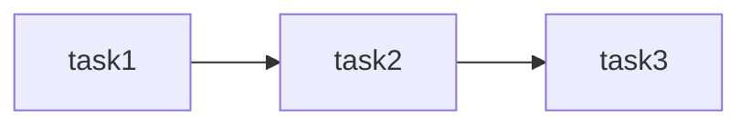
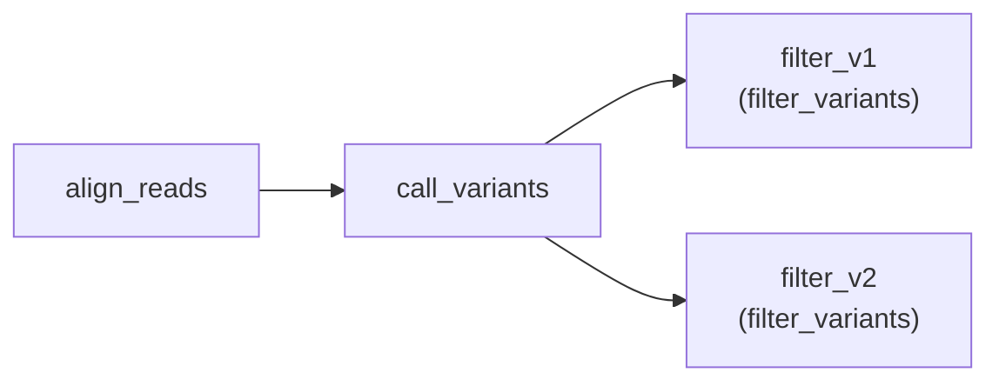
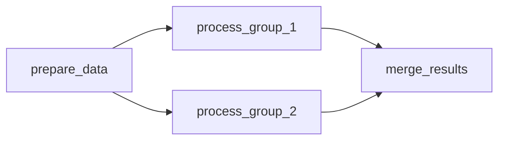

# WDL DAG Diagram Generator

Generate Mermaid diagrams visualizing WDL workflow DAGs (Directed Acyclic Graphs) directly from workflow definitions.

## Features

- **Automatic DAG Generation**: Parse WDL files and generate dependency diagrams
- **Task Aliasing**: Shows both task aliases and underlying task names
- **Workflow Summary**: Displays all tasks, calls, and their execution order
- **File Output**: Save diagrams as Mermaid markdown files
- **Nested Structure Support**: Handles conditional (`if`) blocks and scatter loops

## Quick Start

### Generate diagram to stdout
```bash
./scripts/run_test.py diagram --wdl pipelines/wdl/my_pipeline/pipeline.wdl
```

### Save diagram to file
```bash
./scripts/run_test.py diagram --wdl pipelines/wdl/my_pipeline/pipeline.wdl -o my_diagram.mmd
```

## Output Format

The diagram output includes three main sections:

### 1. Workflow Summary
Lists all tasks, workflow calls (with aliases), and their execution order:
```
WDL: mt_coverage_merge.test.wdl
Tasks: 10
Calls: 17

Calls in execution order:
  - subset_data_table
  - process_tsv_files
  - annotate_coverage
  - make_vcf_shards_from_tsv (make_vcf_shards_from_tsv)
  - ...

Available tasks:
  - add_annotations
  - annotate_coverage
  - build_vcf_shard_mt
  - ...
```

### 2. Mermaid Diagram
A Mermaid graph showing all task nodes and their dependencies:
```
graph LR
    subset_data_table["subset_data_table"]
    annotate_coverage["annotate_coverage"]
    process_tsv_files["process_tsv_files"]
    
    subset_data_table --> process_tsv_files
    subset_data_table --> annotate_coverage
```

For task aliases, both the alias and underlying task name are displayed:
```
    merge_round_1["merge_round_1\n(merge_mt_shards)"]
```

## Dependency Inference

The diagram generator infers task dependencies based on WDL execution order:

- **Sequential Calls**: Each call depends on previous calls at the same indentation level
- **Nested Calls**: Calls inside `if` blocks or `scatter` loops depend on their containing block's context
- **Scope-based**: Tasks are ordered based on their position in the workflow structure

## Viewing Mermaid Diagrams

### Option 1: GitHub

Push the `.mmd` file to a GitHub repository and view directly in the web interface.

### Option 2: VS Code Extension

Install the [Mermaid extension](https://marketplace.visualstudio.com/items?itemName=bierner.markdown-mermaid):
```
Extension: Markdown Preview Mermaid Support
```

Then preview the file in VS Code with `Cmd+Shift+V` (or `Ctrl+Shift+V` on Linux).

### Option 3: Mermaid Live Editor

Visit [mermaid.live](https://mermaid.live/) and paste the diagram content.

### Option 4: Render in VS Code (Custom)

Use VS Code's built-in rendering if available, or install:
- [vscode-markdown-mermaid](https://marketplace.visualstudio.com/items?itemName=vstirbu.vscode-markdown-mermaid)

## Examples

### Simple Pipeline with Sequential Calls


### Pipeline with Aliases


### Complex Workflow with Multiple Branches


## Troubleshooting

### "miniwdl command not found"
Install miniwdl:
```bash
pip install miniwdl
```

### "WDL file not found"
Ensure the path to the WDL file is correct. Use absolute or repository-relative paths:
```bash
./scripts/run_test.py diagram --wdl /workspaces/warp/pipelines/wdl/optimus/optimus.wdl
```

### Incomplete or incorrect dependencies
The diagram generator infers dependencies from WDL structure. Complex workflows with multiple branches or dynamic dependencies may not be perfectly represented. Review the actual WDL file for precise dependency information.

## Implementation Details

The diagram generator uses `miniwdl check` to parse WDL workflows and extract:
- All workflow calls with their aliases
- Task definitions
- Workflow structure and nesting levels
- Conditional blocks (`if` statements)
- Scatter loops

Dependencies are inferred based on the relative indentation and structure of calls in the workflow.

## Integration with run_test.py

The diagram generation is built into the WARP test harness:

```bash
# View all run_test.py commands
./scripts/run_test.py --help

# Use diagram subcommand
./scripts/run_test.py diagram --help
```

This allows unified access to both test execution and workflow visualization tools.
