# Forking WARP

The best way to make pipelines your own is to fork WARP. Forking is also a great way to create new pipelines or to suggest improvements to existing pipelines. Here we take you through all the steps needed to fork WARP using Github, and what the best options are for how to deploy your forked code to run in the cloud.

   * Start Forking. To start a fork, find the WARP repo on github and select the fork button. You can also choose which branch you want to fork, in this case we will fork the develop branch but you may also wish to fork the released `master` branch. Note you will need to be logged into a github account:

   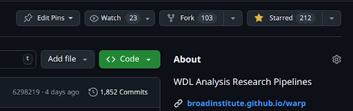
   * Configure Fork. From the “Create…” dialog, you can choose a new owner such as yourself and update the description with the purpose of your fork. You can uncheck the lower option if you want to fork all branches rather than the specific one.

   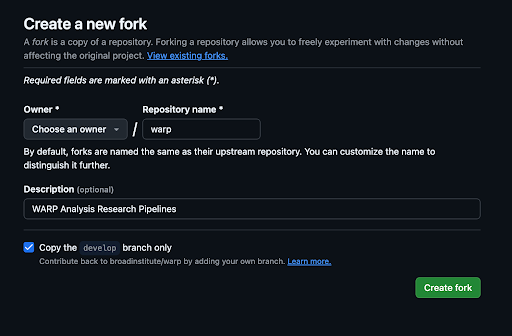
   * Clone Repo. Now you are almost ready to start modifying your code. This can be managed on github and git as normal. For very small changes, you can edit code directly on github with the edit dialog and submit them directly. For larger changes you might want to use an IDE and git to synchronize your changes with the repo. To do this use the CODE button in github and copy the clone repo line.  Then create a local copy of your repo either using your IDE, the github desktop client, or running the `git clone` command (e.g. `git clone git@github.com:rsc3/warp.git`) in your preferred local directory.

   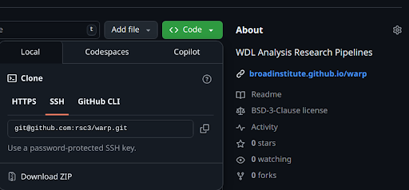

   * Edit code. Note that you will be on the same branch that you forked from. Here we will stay on this branch though you may want to create a new branch for your code changes. Let’s change the code of the `StarAlign.wdl` workflow so that the task STARsoloFastq can run on a different cloud backend, such as AWS or Azure rather than only GCP. This is the alignment and metric calculation task for single-cell RNA-Seq, and since it is a costly step we might want to change the cloud platform it runs on. So we can add a cloud_provider input to the task, and decide which values are allowed and how they will change the execution. Note that every workflow dependent on `StarAlign.wdl` will also have to be updated to pass the `cloud_provider` input. Commit and push your modifications back to your repository.

   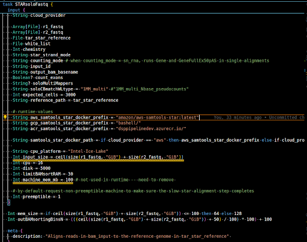

   * Now that you have modified your fork of WARP, you have several options to deploy your WDL workflows to a backend execution environment. We recommend GA4GH Dockstore for this purpose as a flexible hosting solution which you can use to deploy your code to a variety of execution options. One of those options is Broad Terra, for complete instructions on deploying to Dockstore and then to Terra see [this document on Terra deployment](https://support.terra.bio/hc/en-us/articles/8888504224283-How-to-set-up-a-WDL-on-Github-Dockstore). Continue following this guide to synchronize your code to Dockstore and choose how to deploy it from there.

   * Make an account on [Dockstore](https://dockstore.org/) and link your account to your Github account. This will allow you to find your WARP fork branch on Dockstore. Connect your Warp fork to Dockstore.

   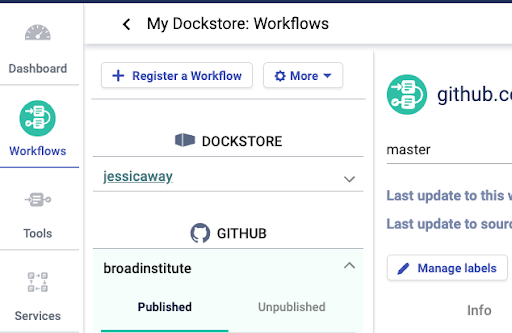

   * Register your workflow to Dockstore: From the workflows tab in Dockstore, select “Register a Workflow”. This will bring up a panel. Select “Register using GitHub Apps”, then “Next”.

   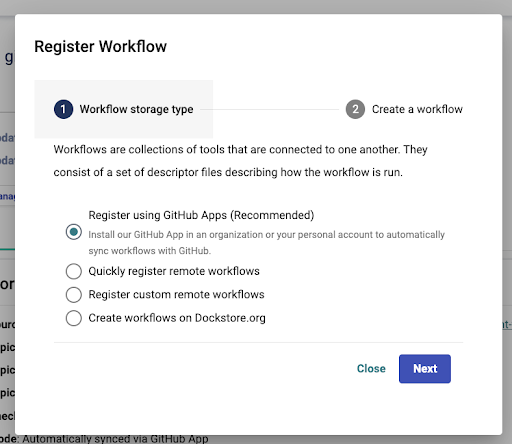

   * Select “Manage Dockstore installations on GitHub”. This will take you to GitHub with a view of your organizations.

   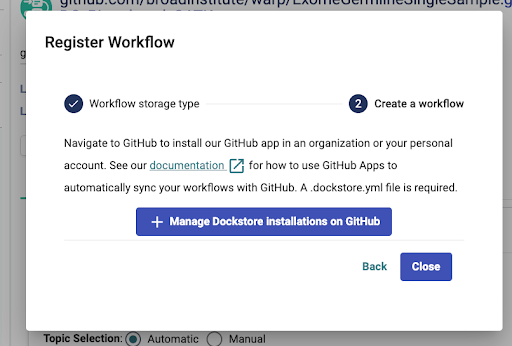

   * Select the organization with your fork. 

   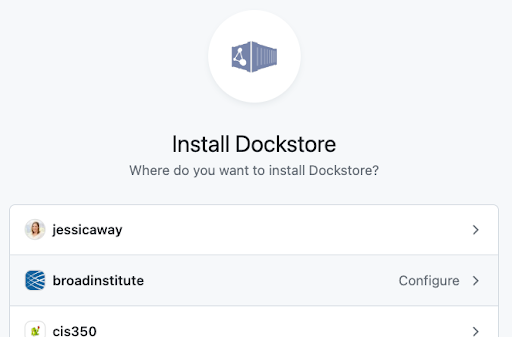

   * This will open a new view. You can choose to install Dockstore for all repositories or select just your fork. Select “Install”.

   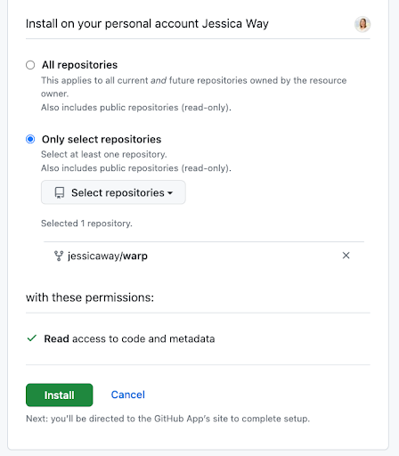

   * Find your workflow in Dockstore: In the workflows tab in Dockstore, you will see your organization. Expand it and scroll down to find your workflow of interest. 

   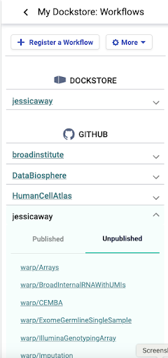
   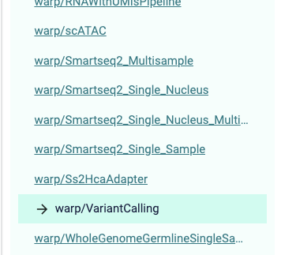

   * NOTE: you may need to push another commit to your branch to get this to show up. 
   * NOTE: you will need a .dockstore.yml file in the root of your branch in the forked repository. Warp includes this file which will be included in your fork.
   * NOTE: If for some reason your workflow of interest is not in the .dockstore.yml file on the commit you checked out you will need to add it.
   * Publish your workflow in Dockstore: On the page for your workflow, select the “Versions” tab. Find and select  the version for your branch (there may be many versions). Click the “Actions” dropdown and select “Set as Default Version” (it will not be greyed out if it has not already been set as the default version). 

   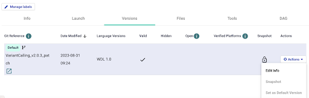

   * Back at the top of the page, click “Publish”. This will change the “Publish” button to an “Unpublish” button and add a link to “View public page”. Click “View public page”.

   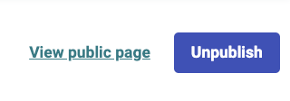

   * Your new workflow is now published to Dockstore! GA4GH Dockstore provides documentation on deploying your WDL workflows into containers on Dockerhub, Quay, Amazon ECR, and running them on several choices for cloud services.

    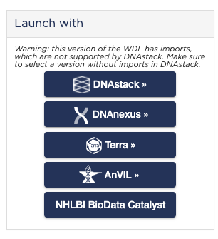

   * See the [Best Practices for Building Pipelines](https://broadinstitute.github.io/warp/docs/About_WARP/BestPractices) page for information on how to execute WDL Workflows. Also see the [cromwell docs](https://cromwell.readthedocs.io/en/latest/backends/Backends/#backends) for some options for backend execution, and [this document describing other options for deploying workflows from Dockstore](https://docs.dockstore.org/en/stable/advanced-topics/tools-vs-workflows.html).

