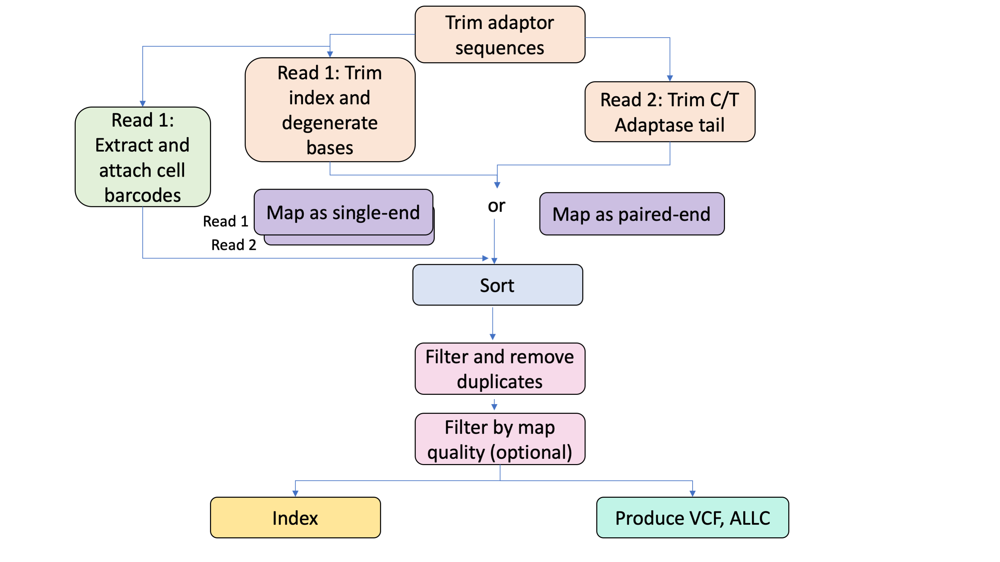

# CEMBA Overview

:::warning
10/16/2024

The CEMBA pipeline has been officially deprecated, with support ending on October 16, 2024. Users currently utilizing this pipeline are advised to transition to other options. A recommended alternative is the [Single-nucleus Methyl-seq and Chromatin Capture](../../Pipelines/snM3C/README.md) workflow, which offers similar capabilities for methylation and chromatin analysis.
:::

| Pipeline Version | Date Updated | Documentation Author | Questions or Feedback |
| :----: | :---: | :----: | :--------------: |
| [CEMBA_v1.1.6](https://github.com/broadinstitute/warp/releases) | December, 2023 | Elizabeth Kiernan| Please [file an issue in WARP](https://github.com/broadinstitute/warp/issues). |

## Introduction to the CEMBA Workflow

CEMBA is a pipeline developed by the [BRAIN Initiative](https://braininitiative.nih.gov/) that supports the processing of multiplexed single-nuclei bisulfite sequencing data. It is an alignment and methylated base calling pipeline that trims adaptors, attaches cell barcodes, aligns reads to the genome, filters reads based on quality, and creates both a VCF and ALLC file with methylation-site coverage.

:::tip
Interested in using the pipeline for your publication? See the [“CEMBA publication methods”](./CEMBA.methods.md) for a generic "methods" style description of the pipeline.
:::

## Quick Start Table

| Pipeline Features | Description | Source |
|-------------------|---------------------------------------------------------------|-----------------------|
| Assay Type | Single-nucleus methylcytosine sequencing (snmC-seq) | [Luo et al. 2017](https://science.sciencemag.org/content/357/6351/600/tab-pdf)
| Overall Workflow  | Aligns reads and identifies methylated bases | Code available from [Github](https://github.com/broadinstitute/warp/blob/develop/pipelines/cemba/cemba_methylcseq/CEMBA.wdl) |
| Workflow Language | WDL 1.0 | [openWDL](https://github.com/openwdl/wdl) |
| Genomic Reference Sequence| GRCH38 and GRCM38  |  [GENCODE](https://www.gencodegenes.org/)  |
| Aligner  | BISMARK v0.21.0 with  --bowtie2 | [Bismark](https://www.bioinformatics.babraham.ac.uk/projects/bismark/) |
| Variant Caller | GATK 4.5.0.0 | [GATK 4.5.0.0](https://gatk.broadinstitute.org/hc/en-us)
| Data Input File Format | File format in which sequencing data is provided | [Zipped FASTQs (.fastq.gz)](https://support.illumina.com/bulletins/2016/04/fastq-files-explained.html) |
| Data Output File Format | File formats in which CEMBA output is provided | [BAM](http://samtools.github.io/hts-specs/), [VCF](https://samtools.github.io/hts-specs/VCFv4.2.pdf), [ALLC](https://github.com/yupenghe/methylpy#output-format) |

# Set-up

## CEMBA Installation and Requirements
The CEMBA pipeline code is written in the [Workflow Description Language (WDL)](https://openwdl.org/) and can be downloaded by cloning the GitHub repository [WARP](https://github.com/broadinstitute/warp). For the latest release of CEMBA, please see the release tags prefixed with "CEMBA" [here](https://github.com/broadinstitute/warp/tags). CEMBA can be deployed using [Cromwell](https://github.com/broadinstitute/cromwell), a GA4GH compliant, flexible workflow management system that supports multiple computing platforms.

The workflow can also be run on Terra using the [Methyl-c-seq_Pipeline workspace](https://app.terra.bio/#workspaces/brain-initiative-bcdc/Methyl-c-seq_Pipeline). This workspace contains the CEMBA workflow, workflow configurations, required reference data and other inputs, and demultiplexed example testing data.

## Inputs

CEMBA pipeline inputs are detailed in the example human configuration file ([CEMBA.inputs.json](https://github.com/broadinstitute/warp/blob/develop/pipelines/cemba/cemba_methylcseq/example_inputs/CEMBA.inputs.json)). Genomic reference files were built using the [BuildCembaReferencesWDL script (private repository)](https://github.com/BICCN/CEMBA/blob/master/pipelines/build_cemba_references/BuildCembaReferences.wdl). See descriptions of all inputs in the tables below.

### Sample data input
The pipeline accepts paired-end reads in the form of two compressed FASTQ files (fastq.gz). FASTQ files may represent a single cell sample or in the case of multiplexed samples, multiple cells.

| Parameter Name | Description |
| --- | --- |
| fastq_r1_gzipped_input | Compressed FASTQ (.gz) for R1 |
| fastq_r2_gzipped_input | Compressed FASTQ (.gz) for R2 |

### Additional inputs

| Parameter Name | Description |
| --- | --- |
| barcode_white_list | List of known cell barcodes |
| output_base_sample_name | Prefix for all pipeline output files (final and intermediate)  |
| barcode_start_pos | Base location of barcode start  |
| barcode_length | Length of cell barcode (bp)  | NA  |
| reference_fasta | Reference FASTA  |
| reference_fasta_index | Reference FASTA index  |
| fwd_converted_reference_fasta | Bisulfite-converted forward reference genome reads for Bismark alignment  |
| rev_converted_reference_fasta | Bisulfite-converted reverse reference genome reads for Bismark alignment  |
| reference_dictionary | Reference genome dictionary  |
| fwd_bowtie2_index_files | Forward bowtie2 index files  |
| rev_bowtie2_index_files | Reverse bowtie2 index files  |
| quality_cutoff | Interval representing the number of base pairs to remove from 5’ and 3’ end in order to trim low quality reads  |
| min_length_paired_end_trim | An interval to specify a minimum read length to avoid empty reads in paired-end mode   |
| min_length_single_end_trim | An interval to specify a minimum read length to avoid empty reads in single-end mode  |
| read1_adapter_seq | The R1 adaptor sequence  |
| read2_adapter_seq | The R2 adaptor sequence  |
| cut_length | Interval provided to trim degenerate bases, random primer indexes, and Adaptase C/T tail  |
| paired_end_run | Boolean; if true, workflow will run in paired-end mode   |
| remove_duplicates | Boolean; if true Picard will remove duplicates and report duplication removal metrics  |
| extract_and_attach_barcodes_in_single_end_run | Boolean; if true, workflow will create an unaligned BAM and extract barcodes   |
| min_map_quality | Numerical value that represents minimum map quality; if provided Samtools will filter reads and produce a BAM for reads above value and reads below value   |
| read_group_library_name | Library preparation type used for read group; default is "Methylation" |
| read_group_platform_name | Sequencing platform used for read group; default is "Illumina" |
| read_group_platform_unit_name | Platform unit for the read group (i.e. run barcode); default is "smmC-Seq" |

# CEMBA Tasks and Tools

The [CEMBA.wdl](https://github.com/broadinstitute/warp/blob/develop/pipelines/cemba/cemba_methylcseq/CEMBA.wdl) implements the workflow by importing individual "tasks" written in the [WDL script](https://openwdl.org/).

## CEMBA Task Summary

The table and summary sections below detail the tasks and tools of the CEMBA pipeline; [the code](https://github.com/broadinstitute/warp/blob/develop/pipelines/cemba/cemba_methylcseq/CEMBA.wdl) is available through GitHub. Each task can be found in the [CEMBA WDL](https://github.com/broadinstitute/warp/blob/develop/pipelines/cemba/cemba_methylcseq/CEMBA.wdl). If you are looking for the specific parameters of each task/tool, please see the  `command {}` section of the WDL script.

| Task | Tool(s) | Purpose | Docker |
| :-- | :-- | :-- | :-- |
| Trim | [Cutadapt v1.18](https://cutadapt.readthedocs.io/en/stable/)   | Trim adaptors | quay.io/broadinstitute/cutadapt:1.18 |
| CreateUnmappedBam | [Picard v2.26.10](https://broadinstitute.github.io/picard/)  | Create uBAM for attaching barcodes | us.gcr.io/broad-gotc-prod/picard-cloud:2.26.10 |
| ExtractCellBarcodes | [sctools v0.3.4](https://sctools.readthedocs.io/en/latest/sctools.html)  | Use whitelist to extract barcodes and tag to uBAM | quay.io/humancellatlas/secondary-analysis-sctools:v0.3.4 |
| Trim | [Cutadapt v1.18](https://cutadapt.readthedocs.io/en/stable/)    | Trim degenerate bases, primer index, C/T Adaptase tail of R1 | quay.io/broadinstitute/cutadapt:1.18 |
| Trim | [Cutadapt v1.18](https://cutadapt.readthedocs.io/en/stable/)   | Trim bases, primer index, C/T Adaptase tail of R2 | quay.io/broadinstitute/cutadapt:1.18 |
| Align | [Bismark v0.21.0](https://www.bioinformatics.babraham.ac.uk/projects/bismark/)  | Map multiplexed samples as single-end with --bowtie2 | quay.io/broadinstitute/bismark:0.21.0 |
| Sort |  [Picard v2.26.10](https://broadinstitute.github.io/picard/) | Sort BAM(s) in coordinate order | us.gcr.io/broad-gotc-prod/picard-cloud:2.26.10 |
| FilterDuplicates |  [Picard v2.26.10](https://broadinstitute.github.io/picard/)  | Removes duplicate reads from BAM | us.gcr.io/broad-gotc-prod/picard-cloud:2.26.10 |
| Get MethylationReport |[Bismark v0.21.0](https://www.bioinformatics.babraham.ac.uk/projects/bismark/)  | Produce methylation report for duplicates-filtered BAM |quay.io/broadinstitute/bismark:0.21.0 |
| FilterMapQuality | [Samtools v1.9](http://www.htslib.org/)  | Further filter duplicate-removed BAM by map quality | quay.io/broadinstitute/samtools:1.9 |
| GetMethylationReport | [Bismark v0.21.0](https://www.bioinformatics.babraham.ac.uk/projects/bismark/)  | Produce methylation report for reads above map quality and below map quality | quay.io/broadinstitute/bismark:0.21.0 |
| AttachBarcodes |  [Picard v2.26.10](https://broadinstitute.github.io/picard/)  | Add barcodes from the tagged uBAM to the aligned BAM | us.gcr.io/broad-gotc-prod/picard-cloud:2.26.10 |
| MergeBams |  [Samtools v.19](http://www.htslib.org/)  | Merge R1 and R2 BAM files into single BAM | quay.io/broadinstitute/samtools:1.9 |
| AddReadGroup |  [GATK v4.5.0.0](https://gatk.broadinstitute.org/hc/en-us)  | Add read groups to the merged BAM | us.gcr.io/broad-gatk/gatk:4.5.0.0 |
| Sort | [Picard v2.26.10](https://broadinstitute.github.io/picard/) | Sort in coordinate order after adding read group | us.gcr.io/broad-gotc-prod/picard-cloud:2.26.10 |
| IndexBam |  [Samtools v1.9](http://www.htslib.org/)  | Index the output BAM | quay.io/broadinstitute/samtools:1.9 |
| MethylationTypeCaller | [GATK v4.5.0.0](https://gatk.broadinstitute.org/hc/en-us)  | Produce a  VCF with locus-specific methylation information | us.gcr.io/broad-gatk/gatk:4.5.0.0 |
| VCFtoALLC | Python | Creates an [ALLC](https://github.com/yupenghe/methylpy#output-format) file from the VCF produced with MethylationTypeCaller | quay.io/cemba/vcftoallc:v0.0.1 |
| ComputeCoverageDepth | [Samtools v1.9](http://www.htslib.org/)  | Compute number of sites with coverage greater than 1 | quay.io/broadinstitute/samtools:1.9 |

### Prior to running: set-up the workflow for using multiplexed samples

The pipeline uses paired-end reads, but it can only perform multiplexing when running in single-end mode. If you have multiplexed samples and want to attach cell barcodes, you must run the pipeline in single-end mode. If you do not wish to attach cell barcodes, you may run in paired-end mode (even if your samples are multiplexed). You can specify single-end mode or paired-end mode using the paired_end_run boolean in the configuration file. You will also need to adjust the extract_and_attach_barcodes_in_single_end_run boolean to true if you want to attach barcodes.

### 1. Trim adaptors

The CEMBA workflow Trim task uses Cutadapt software to remove the Read1 (R1) and Read2 (R2) adaptor sequences specified in the input configuration from the zipped R1 and R2 FASTQ files. Low-quality reads are trimmed from the 5’ and 3’ ends using the interval specified in the quality_cutoff input parameter.  To avoid empty reads, a threshold for read length is set using the min_length_paired_end_trim option.

### 2. Extract cell barcodes

CEMBA can extract cell barcodes from multiplexed samples if the extract_and_attach_barcodes_in_single_end_run boolean is true and the samples are run in single-end mode. To do this, the workflow uses the CreateUnmappedBam and ExtractCellBarcodes tasks to first make an unaligned BAM (uBAM) for the trimmed R1 FASTQ and then tag barcodes identified with the barcode_white_list input to the uBAM.

### 3. Trim degenerate bases, random primer indexes, and Adaptase C/T tail

After barcode extraction, the Trim task is used a second time to remove additional bases resulting from R1 random primer indexes (often used as barcodes) and the R2 C/T tail introduced by the Adaptase enzyme. Reads are trimmed using the cut_length input. The read length threshold is set by the min_length_single_end input.

### 4. Align to a reference genome

The resulting trimmed FASTQ files can be aligned to a reference either in single-end mode for multiplexed samples or paired-end mode. For all modes, the workflow aligns with Bismark with --bowtie2 option. For paired-end or the single-end mode for R1, the workflow uses a directional option with --pbat parameter. For R2, the directional option is turned off.

### 5. Sort, remove duplicates, and filter

The aligned BAM(s) are scattered and sorted in coordinate order using Picard. Duplicate reads are then removed from the sorted BAM. If a min_map_quality is provided in the input, reads will be filtered accordingly and a BAM produced for all reads above the min_map_quality and a BAM for reads below the min_map_quality.

### 6. Generate methylation reports

Methylation reports are generated using the Bismark at two steps in the workflow: after the removal of duplicates and again after filtering on min_map_quality. The bismark_methylation_extraction function with the -- comprehensive --merge_non_CpG --report options outputs multiple reports which are detailed in the [Bismark documentation](https://www.bioinformatics.babraham.ac.uk/projects/bismark/Bismark_User_Guide.pdf). These outputs include mbias, splitting, CpG context, and non-CpG context reports.

### 7. Attach barcodes, merge BAMs, add read groups, sort and index BAMs

In the AttachBarcodes task, Picard attaches the barcodes in the R1 uBAM to the aligned, duplicate-removed, and if applicable, filtered, R1 BAM. This produces a tagged_mapped.bam file. Once the barcodes are attached, the MergeBams task uses Samtools to merge the (barcoded if applicable) R1 BAM with the aligned and filtered R2 BAM. Read groups are then attached to the merged BAM file with GATK4 and the BAM is sorted with Picard. The BAM is indexed with Samtools.

### 8. Call methylated bases

Methylated bases are identified using the MethylationTypeCaller task which calls the GATK4 function MethylationTypeCaller. This produces a VCF with methylation calls.

### 9. Create ALLC file
The VCF containing methylation calls is used to create an additional [ALLC ("all-cytosine") file](https://github.com/yupenghe/methylpy#output-format) which can be used for downstream differential methylated regions in downstream analyses.

### 10. Compute coverage depth

The ComputeCoverageDepth task uses Samtools to calculate any region in the filtered, sorted BAM with a coverage depth greater than 1. This interval is read in the stdout of the workflow.

# Outputs

The table below details the pipeline outputs. **If using multiplexed samples, the final files will represent reads from multiple cells and the output is not yet split by cell barcode.**

| Workflow Output Name | Description | File Type (when applicable) |
| --- | --- | --- |
| bam_sort_output | Final aligned, filtered, (barcoded), and sorted BAM | BAM |
| bam_index_output | Index file for the final BAM  | INDEX |
| methylation_vcf | VCF file demarcating methylation sites  | VCF |
| methylation_vcf_index | Index file for the VCF  | INDEX
| total_depth_count | Interval demarcated in the stdout file for reads with coverage greater than 1 | NA |
| mapping_reports | Mapping reports generated by Bismark alignment  | Array |
| metric_remove_dup_output | Duplication metrics generated by Picard | TXT |
| methylation_mbias_report_output | Mbias reports generated by Bismark for the sorted duplicate-removed BAM and the two map quality-filtered BAMs (reads above map quality and reads below map quality) | TXT |
| methylation_splitting_report_output | Splitting reports generated by Bismark for the sorted duplicate-removed BAM and the two map quality-filtered BAMs (reads above map quality and reads below map quality)| TXT |
| methylation_CpG_context_report_output | CpG context reports generated by Bismark for the sorted duplicate-removed BAM and the two map quality-filtered BAMs (reads above map quality and reads below map quality) | TXT |
| methylation_non_CpG_context_report_output | Non-CpG context reports generated by Bismark for the sorted duplicate-removed BAM and the two map quality-filtered BAMs (reads above map quality and reads below map quality) | TXT |

## Versioning

All CEMBA pipeline releases are documented in the [CEMBA changelog](https://github.com/broadinstitute/warp/blob/develop/pipelines/cemba/cemba_methylcseq/CEMBA.changelog.md).

## Citing the CEMBA Pipeline

If you use the CEMBA Pipeline in your research, please identify the pipeline in your methods section using the [CEMBA SciCrunch resource identifier](https://scicrunch.org/resources/data/record/nlx_144509-1/SCR_021219/resolver?q=SCR_021219&l=SCR_021219&i=rrid:scr_021219).

* Ex: *CEMBA MethylC Seq Pipeline (RRID:SCR_021219)*

Please also consider citing our preprint:

Degatano, K., Awdeh, A., Cox III, R.S., Dingman, W., Grant, G., Khajouei, F., Kiernan, E., Konwar, K., Mathews, K.L., Palis, K., et al. Warp Analysis Research Pipelines: Cloud-optimized workflows for biological data processing and reproducible analysis. Bioinformatics 2025; btaf494. https://doi.org/10.1093/bioinformatics/btaf494

## Consortia Support
This pipeline is supported and used by the [BRAIN Initiative Cell Census Network](https://biccn.org/) (BICCN). 

If your organization also uses this pipeline, we would love to list you! Please reach out to us by [filing an issue in WARP](https://github.com/broadinstitute/warp/issues).

## Have Suggestions?

Please help us make our tools better by [filing an issue in WARP](https://github.com/broadinstitute/warp/issues); we welcome pipeline-related suggestions or questions.

