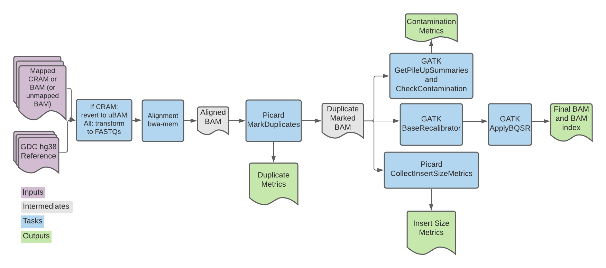

# Genomic Data Commons (GDC) Whole Genome Somatic Single Sample Overview
:::warning
9/12/2014

We are deprecating the Genomic Data Commons Whole Genome Somatic Single Sample Pipeline. Although the code will continue to be available, we are no longer supporting it.
:::

| Pipeline Version | Date Updated | Documentation Author | Questions or Feedback |
| :----: | :---: | :----: | :--------------: |
| [GDCWholeGenomeSomaticSingleSample_v1.3.1](https://github.com/broadinstitute/warp/releases) | January, 2024 | Elizabeth Kiernan | Please [file an issue in WARP](https://github.com/broadinstitute/warp/issues). |

## Introduction to the GDC Whole Genome Somatic Single Sample pipeline
The GDC Whole Genome Somatic Single Sample (abbreviated GDC here) pipeline is the alignment and preprocessing workflow for genomic data designed for the National Cancer Institute's [Genomic Data Commons](https://gdc.cancer.gov/about-gdc).

A high-level overview of the pipeline in addition to tool parameters are available on the [GDC Documentation site](https://docs.gdc.cancer.gov/Data/Bioinformatics_Pipelines/DNA_Seq_Variant_Calling_Pipeline/).

Overall, the pipeline converts reads (CRAM or BAM) to FASTQ and (re)aligns them to the latest human reference genome (see the [GDC Reference Genome](#gdc-reference-genome) section below). Each read group is aligned separately. Read group alignments that belong to a single sample are then merged and duplicate reads are flagged for downstream variant calling.

## Set-up

### Workflow installation and requirements

The workflow is written in the Workflow Description Language WDL and can be downloaded by cloning the [warp repository](https://github.com/broadinstitute/warp/tree/master) in GitHub. The workflow can be deployed using [Cromwell](https://github.com/broadinstitute/cromwell), a GA4GH compliant, flexible workflow management system that supports multiple computing platforms.

For the latest workflow version and release notes, please see the [changelog](https://github.com/broadinstitute/warp/blob/develop/pipelines/wdl/dna_seq/somatic/single_sample/wgs/gdc_genome/GDCWholeGenomeSomaticSingleSample.changelog.md).

### Software version requirements

* GATK 4.5.0.0
* Picard 2.26.10
* Samtools 1.11
* Python 3.0
* Cromwell version support
    * Successfully tested on v52
    * Does not work on versions < v23 due to output syntax
* Papi version support
	* Successfully tested on Papi v2

### Input descriptions

The table below describes each of the GDC pipeline inputs. The workflow requires a **single** aligned CRAM or BAM file, or a **single** unmapped BAM (uBAM) as input, and is set up to run on samples with reads greater than 75 bp.

For examples of how to specify each input as well as cloud locations for different example input files, see the [input configuration file (JSON)](https://github.com/broadinstitute/warp/blob/develop/pipelines/wdl/dna_seq/somatic/single_sample/wgs/gdc_genome/input_files/GDCWholeGenomeSomaticSingleSample.inputs.json).

| Input name | Description | Type |
| --- | --- | --- |
| input_cram (optional)| A single mapped CRAM file; alternatively, input can be a mapped BAM (`input_bam`) or unmapped BAM (uBAM; `ubam`). If using a CRAM file aligned to a reference different than the reference chosen for the GDC workflow (the `ref_fasta` input), then you must specify both the `cram_ref_fasta` and the `cram_ref_fasta_index` inputs. | File |
| input_bam (optional)| A single mapped BAM file; alternatively input can be a CRAM (`input_cram`) or uBAM (`ubam`). | File |
| cram_ref_fasta (optional)| The reference file that was used to align the CRAM input (if used); if unspecified, the workflow will use the `ref_fasta` input file by default. | File |
| cram_ref_fasta_index (optional) | CRAM reference FASTA index for the `cram_ref_fata` if CRAM is used as workflow input. | File |
| output_map (optional)| Tab-separated file containing two columns: a list of all the read group IDs found in the input_cram (or input_bam) and a list of the desired name of the uBAMs generated for read group. | File |
| unmapped_bam_suffix (optional) | Optional string used to name the output uBAM file. | String |
| ubam (optional)| A single uBAM file; alternatively, input can be a mapped BAM (`input_bam`) or CRAM (`input_cram`). | File |
| contamination_vcf | VCF file of common variant sites that is used for the check_contamination task. | File |
| contamination_vcf_index | Index file for the `contamination_vcf` input. | File |
| dbsnp_vcf | VCF file of known variation sites that can be used to exclude these sites from the analysis; used for the gatk_baserecalibrator task. | File |
| dbsnp_vcf_index | Index file for the `dbsnp_vcf` input. | File |
| ref_fasta | Reference FASTA used to convert an input CRAM to BAM; if CRAM is not used, this file does not need to be specified. | File |
| ref_fai | Reference FASTA index for the `ref_fasta` input. | File |
| ref_dict | BWA reference dictionary used for alignment. | File |
| ref_amb | BWA reference file used for alignment. | File |
| ref_ann | BWA reference file used for alignment. | File |
| ref_bwt | BWA reference file used for alignment. | File |
| ref_pac | BWA reference file used for alignment. | File |
| ref_sa | BWA reference file used for alignment. | File |

### GDC reference genome
The GDC uses the human reference genome GRCh38.d1.vd1 for all data processing. Unlike the GRCh38 reference used by WARP pipelines for production, the GDC reference includes decoy viral sequences for ten types of human viral genomes. You can learn more about the reference from the [GDC documentation](https://docs.gdc.cancer.gov/Data/Bioinformatics_Pipelines/DNA_Seq_Variant_Calling_Pipeline/#reference-genome).

The reference files required for the GDC workflow are hosted in a [public Google Bucket](https://console.cloud.google.com/storage/browser/gcp-public-data--broad-references/hg38/v0/gdc).

## Workflow tasks and tools

The [workflow](https://github.com/broadinstitute/warp/blob/develop/pipelines/wdl/dna_seq/somatic/single_sample/wgs/gdc_genome/GDCWholeGenomeSomaticSingleSample.wdl) imports a series of tasks either from the Workflow script or the Broad [tasks library](https://github.com/broadinstitute/warp/tree/master/tasks/broad).

| Task name in WDL | Tool | Software | Description |
| --- | --- | --- | --- |
| [CramToUnmappedBams](https://github.com/broadinstitute/warp/blob/develop/pipelines/wdl/reprocessing/cram_to_unmapped_bams/CramToUnmappedBams.wdl) | view, index, RevertSam, ValidateSamFile, SortSam | [SamTools](http://www.htslib.org/terms/) and [Picard](https://broadinstitute.github.io/picard/) | If a CRAM file is used as input, the task converts to uBAM and generates an output map that is then used to split the uBAM by readgroup. The resulting BAM is sorted by query name using Picard. |
| bam_readgroup_to_contents | view | [Samtools](http://www.htslib.org) | Extracts all the readgroups from the BAM header and returns a WDL array where each row is a readgroup. |
| biobambam_bamtofastq | bamtofastq | [biobambam2](https://gitlab.com/german.tischler/biobambam2) | Converts the uBAMs to FASTQ. |
| emit_pe_records/emit_se_records | --- | --- | Associates the fasta file(s) generated by biobambam_bamtofastq with their respective readgroup; creates an array of structs to be used as input for alignment. |
| bwa_pe/ bwa_se | BWA mem, view | [BWA](http://bio-bwa.sourceforge.net/) and [Samtools](http://www.htslib.org) | Aligns FASTQ reads to the reference genome, generating an aligned BAM file. |
| picard_markduplicates | [MarkDuplicates](https://gatk.broadinstitute.org/hc/en-us/articles/360037052812-MarkDuplicates-Picard-) | [Picard](https://broadinstitute.github.io/picard/) | Runs MarkDuplicates in silent mode to locate and tag duplicate reads. Outputs a tagged BAM and metrics file. |
| sort_and_index_markdup_bam | sort | [Samtools](http://www.htslib.org) | Sorts and indexes the BAM file; outputs the sorted BAM and index file. |
| [check_contamination](https://github.com/broadinstitute/warp/blob/master/tasks/wdl/CheckContaminationSomatic.wdl) | [GetPileUpSummaries](https://gatk.broadinstitute.org/hc/en-us/articles/360037593451) and [CalculateContamination](https://gatk.broadinstitute.org/hc/en-us/articles/360036888972) | [GATK](https://gatk.broadinstitute.org/hc/en-us) | Summarizes counts of reads that support reference, alternate and other alleles for given sites and then calculates the fraction of reads coming from cross-sample contamination. |
| gatk_baserecalibrator | [BaseRecalibrator](https://gatk.broadinstitute.org/hc/en-us/articles/360036898312) | [GATK](https://gatk.broadinstitute.org/hc/en-us) | Generates recalibration table for Base Quality Score Recalibration (BQSR). |
| gatk_applybqsr | [ApplyBQSR](https://gatk.broadinstitute.org/hc/en-us/articles/360037055712) | [GATK](https://gatk.broadinstitute.org/hc/en-us) | Recalibrates the base qualities of the input reads based on the recalibration table produced by the BaseRecalibrator tool and outputs a recalibrated BAM file; uses the emit_original_quals parameter to write the original base qualities under the BAM OQ tag. |
| collect_insert_size_metrics | [CollectInsertSizeMetrics](https://gatk.broadinstitute.org/hc/en-us/articles/360037055772) | [Picard](https://broadinstitute.github.io/picard/) | Generates metrics about insert size distribution in the form of both a histogram and table (txt file). |

## Workflow outputs
The following table describes the workflow outputs. If running the workflow using Cromwell, these outputs will automatically be placed in the respective task execution directory.

Alternatively, Cromwell allows you to specify an output directory using an options.json, as described in Cromwell's [Workflow Options Overview](https://cromwell.readthedocs.io/en/stable/wf_options/Overview/)(see the section on [Output Copying](https://cromwell.readthedocs.io/en/stable/wf_options/Overview/#output-copying)).

| Output name | Description | Type |
| --- | --- | --- |
| validation_report (optional)| Samtools validation report(s); only returned if an aligned CRAM or BAM file is used as workflow input  | TXT |
| unmapped_bams (optional) | uBAM file only returned if an aligned CRAM or BAM is used as workflow input. | BAM |
| bam | Base recalibrated BAM file. | BAM |
| bai | Index file for the BAM. | BAI |
| md_metrics | Picard MarkDuplicates metrics. | TXT |
| insert_size_metrics | Picard insert size metrics. | TXT |
| insert_size_histogram_pdf | Histogram representation of insert size metrics. | PDF |
| contamination | File containing a value indicating the fraction contamination. | TXT |

## Important notes

- Runtime parameters are optimized for Broad's Google Cloud Platform implementation.
- Please visit the [GATK Technical Documentation](https://gatk.broadinstitute.org/hc/en-us/categories/360002310591) site for further documentation on GATK-related workflows and tools.

## Citing the GDC Pipeline

If you use the GDC Pipeline in your research, please consider citing our preprint:

Degatano, K., Awdeh, A., Cox III, R.S., Dingman, W., Grant, G., Khajouei, F., Kiernan, E., Konwar, K., Mathews, K.L., Palis, K., et al. Warp Analysis Research Pipelines: Cloud-optimized workflows for biological data processing and reproducible analysis. Bioinformatics 2025; btaf494. https://doi.org/10.1093/bioinformatics/btaf494

## Contact us
Please help us make our tools better by [filing an issue in WARP](https://github.com/broadinstitute/warp/issues); we welcome pipeline-related suggestions or questions.

## Licensing

Copyright Broad Institute, 2020 | BSD-3

The workflow script is released under the **WDL open source code license (BSD-3)** (full license text at https://github.com/broadinstitute/warp/blob/master/LICENSE). However, please note that the programs it calls may be subject to different licenses. Users are responsible for checking that they are authorized to run all programs before running this script.

- [GATK](https://software.broadinstitute.org/gatk/download/licensing.php)
- [BWA](http://bio-bwa.sourceforge.net/bwa.shtml#13)
- [Picard](https://broadinstitute.github.io/picard/)
- [Samtools](http://www.htslib.org/terms/)

