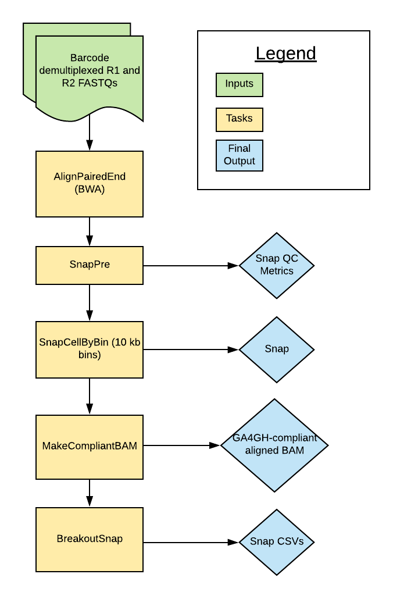

# scATAC Overview
:::warning
9/12/2024

We are deprecating the Single-cell ATAC Seq Pipeline. Although the code will continue to be available, we are no longer supporting it. This workflow has been replaced with the [ATAC workflow](../../Pipelines/ATAC/README.md).
:::
| Pipeline Version | Date Updated | Documentation Author | Questions or Feedback |
| :----: | :---: | :----: | :--------------: |
| [scATAC 1.3.2](https://github.com/broadinstitute/warp/releases) | May 2024 | Elizabeth Kiernan | Please [file an issue in WARP](https://github.com/broadinstitute/warp/issues). |



## Introduction

The scATAC Pipeline was developed by the Broad DSP Pipelines team to process single cell/nucleus ATAC-seq datasets. The pipeline is based on the [SnapATAC pipeline](https://github.com/r3fang/SnapATAC) described by [Fang et al. (2019)](https://www.biorxiv.org/content/10.1101/615179v2.full). Overall, the pipeline uses the python module [SnapTools](https://github.com/r3fang/SnapTools) to align and process paired reads in the form of FASTQ files. It produces an hdf5-structured Snap file that includes a cell-by-bin count matrix. In addition to the Snap file, the final outputs include a GA4GH compliant aligned BAM and QC metrics.

:::tip Want to use the scATAC Pipeline for your publication?
Check out the [scATAC Publication Methods](./scatac.methods.md) to get started!
:::

### Quick Start Table

| Pipeline Features | Description | Source |
| ---  |--- | --- |
| Assay Type | Single nucleus ATAC-seq | [Preprint here ](https://www.biorxiv.org/content/biorxiv/early/2019/05/13/615179.full.pdf)
| Overall Workflow  | Generates Snap file with cell-by-bin matrix | Code available from [GitHub](https://github.com/broadinstitute/warp/blob/master/pipelines/wdl/scATAC/scATAC.wdl) |
| Workflow Language | WDL 1.0 | [openWDL](https://github.com/openwdl/wdl) |
| Aligner  | BWA | [Li H. and Durbin R., 2009](https://pubmed.ncbi.nlm.nih.gov/19451168/) |
| Data Input File Format | File format in which sequencing data is provided | Paired-end FASTQs with cell barcodes appended to read names (read barcode demultiplexing section [here](https://github.com/r3fang/SnapATAC/wiki/FAQs#whatissnap)) |
| Data Output File Format | File formats in which scATAC output is provided | [BAM](http://samtools.github.io/hts-specs/), [Snap](https://github.com/r3fang/SnapATAC/wiki/FAQs#whatissnap) |

## Set-up
### Workflow Installation and Requirements

The [scATAC workflow](https://github.com/broadinstitute/warp/blob/master/pipelines/wdl/scATAC/scATAC.wdl) is written in the Workflow Description Language WDL and can be downloaded by cloning the GitHub [WARP repository](https://github.com/broadinstitute/warp/). The workflow can be deployed using [Cromwell](https://cromwell.readthedocs.io/en/stable/), a GA4GH compliant, flexible workflow management system that supports multiple computing platforms. For the latest workflow version and release notes, please see the scATAC [changelog](https://github.com/broadinstitute/warp/blob/master/pipelines/wdl/scATAC/scATAC.changelog.md).

### Pipeline Inputs

The pipeline inputs are detailed in the table below. You can test the workflow by using the [human_example.json](https://github.com/broadinstitute/warp/tree/master/pipelines/wdl/scATAC/example_inputs/human_example.json) example configuration file.

| Input name | Input type | Description |
| --- | --- | --- |
| input_fastq1 | File | FASTQ file of the first reads (R1) |
| input_fastq2 | File | FASTQ file of the second reads (R2) |
| input_id | String | Unique identifier for the sample; will also be used to name the output files  |
| input_reference | File | Reference bundle that is generated with bwa-mk-index-wdl found [here](https://github.com/broadinstitute/warp/tree/develop/tasks/wdl/accessory_workflows/build_bwa_reference/bwa-mk-index.wdl)|
| genome_name | String | Name of the genomic reference (name that precedes the “.tar” in the input_reference) |
| output_bam  | String  | Name for the output BAM; default is set to the `input_id` + "\_aligned_bam" |
| bin_size_list  | String  | List of bin sizes used to generate cell-by-bin matrices; default is 10000 bp |

### Input File Preparation

#### R1 and R2 FASTQ Preparation

The scATAC workflow requires paired reads in the form FASTQ files with the cell barcodes appended to the readnames. A description of the barcode demultiplexing can be found on the SnapATAC documentation (see barcode demultiplexing section [here](https://github.com/r3fang/SnapATAC/wiki/FAQs#CEMBA_snap)). The full cell barcode must form the first part of the read name (for both R1 and R2 files) and be separated from the rest of the line by a colon. You can find an example python code to perform demultiplexing in the [SnapTools documentation here](https://github.com/r3fang/SnapTools/blob/master/snaptools/dex_fastq.py). The codeblock below demonstrates the correct format.

```
@CAGTTGCACGTATAGAACAAGGATAGGATAAC:7001113:915:HJ535BCX2:1:1106:1139:1926 1:N:0:0
ACCCTCCGTGTGCCAGGAGATACCATGAATATGCCATAGAACCTGTCTCT
+
DDDDDIIIIIIIIIIIIIIHHIIIIIIIIIIIIIIIIIIIIIIIIIIIII
```

#### Input_reference Preparation

The input_reference is a BWA compatible reference bundle in TAR file format. You can create this BWA reference using the accessory workflow  [here](https://github.com/broadinstitute/warp/tree/develop/tasks/wdl/accessory_workflows/build_bwa_reference/bwa-mk-index.wdl).


## Workflow Tasks and Tools

The [scATAC workflow](https://github.com/broadinstitute/warp/blob/master/pipelines/wdl/scATAC/scATAC.wdl) is divided into multiple tasks which are described in the table below. The table also links to the Docker Image for each task and to the documentation or code for the relevant software tool parameters.

| Task | Task Description | Tool Docker Image | Parameter Descriptions or Code |
|--- | --- | --- | --- |
| AlignPairedEnd | Align the modified FASTQ files to the genome | [snaptools-bwa:1.0.0-1.4.8-0.7.17-1690310027](https://github.com/broadinstitute/warp-tools/blob/develop/3rd-party-tools/snaptools-bwa/Dockerfile) | [SnapTools documentation](https://github.com/r3fang/SnapTools) |
| SnapPre | Initial generation of snap file | [snaptools-bwa:1.0.0-1.4.8-0.7.17-1690310027](https://github.com/broadinstitute/warp-tools/blob/develop/3rd-party-tools/snaptools-bwa/Dockerfile) | [SnapTools documentation](https://github.com/r3fang/SnapTools) |
| SnapCellByBin | Binning of data by genomic bins | [snaptools-bwa:1.0.0-1.4.8-0.7.17-1690310027](https://github.com/broadinstitute/warp-tools/blob/develop/3rd-party-tools/snaptools-bwa/Dockerfile) | [SnapTools documentation](https://github.com/r3fang/SnapTools) |
| MakeCompliantBAM | Generation of a GA4GH compliant BAM | [warp-tools:1.0.1-1690997141](https://github.com/broadinstitute/warp-tools/blob/develop/tools/Dockerfile) | [Code](https://github.com/broadinstitute/warp-tools/blob/develop/tools/scripts/makeCompliantBAM.py) |
| BreakoutSnap | Extraction of tables from snap file into text format (for testing and user availability) | [snap-breakout:0.0.1](https://github.com/broadinstitute/warp/tree/master/dockers/skylab/snap-breakout) | [Code](https://github.com/broadinstitute/warp/tree/master/dockers/skylab/snap-breakout/breakoutSnap.py) |

### Task Summary

#### AlignPairedEnd

The AlignPairedEnd task takes the barcode demultiplexed FASTQ files and aligns reads to the genome using the BWA aligner. It uses the SnapTools min_cov parameter to set the minimum number of barcodes a fragment requires to be included in the final output. This parameter is set to 0. The final task output is an aligned BAM file.

#### SnapPre

The SnapPre task uses SnapTools to perform preprocessing and filtering on the aligned BAM. The task outputs are a Snap file and QC metrics. The table below details the filtering parameters for the task.

##### Filtering Parameters

| Parameter | Description | Value |
| --- | --- | --- |
| --min-mapq | Fragments with mappability less than value will be filtered | 30 |
| --min-flen | Fragments of length shorter than min_flen will be filtered | 0 |
| --max-flen | Fragments of length bigger than min_flen will be filtered | 1000 |
| --keep-chrm | Boolean variable indicates whether to keep reads mapped to chrM | TRUE |
| --keep-single | Boolean variable indicates whether to keep single-end reads | TRUE |
| --keep-secondary | Boolean variable indicates whether to keep secondary alignments | FALSE
| --max-num | Max number of barcodes to be stored. Based on the coverage, top max_barcode barcodes are selected and stored | 1000000 |
| --min-cov | Fragments with less than min-cov number of barcodes will be filtered | 100 |


#### SnapCellByBin

The SnapCellByBin task uses the Snap file to create cell-by-bin count matrices in which a “1” represents a bin with an accessible region of the genome and a “0” represents an inaccessible region. The bin_size_list sets the bin size to 10,000 bp by default but can be changed by specifying the value in the inputs to the workflow.

#### MakeCompliantBAM

The MakeCompliantBAM task uses a [custom python script](https://github.com/broadinstitute/warp-tools/blob/develop/tools/scripts/makeCompliantBAM.py) to make a GA4GH compliant BAM by moving the cellular barcodes in the read names to the CB tag.

#### BreakoutSnap

The BreakoutSnap task extracts data from the Snap file and exports it to individual CSVs. These CSV outputs are listed in the table in the Outputs section below. The code is available [here](https://github.com/broadinstitute/warp/tree/master/dockers/skylab/snap-breakout/breakoutSnap.py).

## Outputs

The main outputs of the scATAC workflow are the Snap file, Snap QC metrics, and the GA4GH compliant BAM file. All files with the prefix “breakout” are CSV files containing individual pieces of data from the Snap. The sessions for the Snap file are described in the [SnapTools documentation](https://github.com/r3fang/SnapTools). Additionally, you can read detailed information on the [Snap file fields for each session](https://github.com/r3fang/SnapTools/blob/master/docs/snap_format.docx) (select "View Raw").

| Output File Name | Description |
| --- | --- |
| output_snap_qc | Quality control file corresponding to the snap file |
| output_snap | Output snap file (in hdf5 container format) |
| output_aligned_bam  | Output BAM file, compliant with GA4GH standards |
| breakout_barcodes | Text file containing the FM ('Fragment session') barcodeLen and barcodePos fields  |
| breakout_fragments | Text file containing the FM ('Fragments session') fragChrom, fragLen, and fragStart fields |
| breakout_binCoordinates | Text file with the AM session ('Cell x bin accessibility' matrix) binChrom and binStart fields |
| breakout_binCounts  | Text file with the AM session ('Cell x bin accessibility' matrix) idx, idy, and count fields |
| breakout_barcodesSection  | Text file with the data from the BD session ('Barcode session' table) |
| output_pipeline_version | Strong describing the version of the scATAC pipeline used. | 

##### Snap QC Metrics

The following table details the metrics available in the output_snap_qc file.

| QC Metric | Abbreviation |
| --- | --- |
| Total number of unique barcodes | No abbreviation |
| Total number of fragments | TN |
| Total number of uniquely mapped | UM |
| Total number of single ends | SE |
| Total number of secondary alignments | SA |
| Total number of paired ends | PE |
| Total number of proper paired | PP |
| Total number of proper frag len | PL |
| Total number of usable fragments | US |
| Total number of unique fragments | UQ |
| Total number of chrM fragments | CM |

## Running on Terra

[Terra](https://app.terra.bio/) is a public, cloud-based platform for biomedical research. If you would like to try the scATAC workflow (previously named "snap-atac") in Terra, you can import the most recent version from [Dockstore](https://dockstore.org/workflows/github.com/broadinstitute/warp/scATAC:scATAC_v1.1.0?tab=info). Additionally, there is a public [scATAC workspace](https://app.terra.bio/#workspaces/brain-initiative-bcdc/scATAC) preloaded with the scATAC workflow and downsampled data.

## Versioning

All scATAC workflow releases are documented in the [scATAC changelog](https://github.com/broadinstitute/warp/blob/develop/pipelines/wdl/scATAC/scATAC.changelog.md).

## Citing the scATAC Pipeline

If you use the scATAC Pipeline in your research, please identify the pipeline in your methods section using the [scATAC SciCrunch resource identifier](https://scicrunch.org/resources/data/record/nlx_144509-1/SCR_018919/resolver?q=SCR_018919&l=SCR_018919&i=rrid:scr_018919).

* Ex: *scATAC Pipeline (RRID:SCR_018919)*

Please also consider citing our preprint:

Degatano, K., Awdeh, A., Cox III, R.S., Dingman, W., Grant, G., Khajouei, F., Kiernan, E., Konwar, K., Mathews, K.L., Palis, K., et al. Warp Analysis Research Pipelines: Cloud-optimized workflows for biological data processing and reproducible analysis. Bioinformatics 2025; btaf494. https://doi.org/10.1093/bioinformatics/btaf494

## Consortia Support
This pipeline is supported and used by the [BRAIN Initiative Cell Census Network](https://biccn.org/) (BICCN). 

If your organization also uses this pipeline, we would love to list you! Please reach out to us by [filing an issue in WARP](https://github.com/broadinstitute/warp/issues).

## Pipeline Improvements

Please help us make our tools better by [filing an issue in WARP](https://github.com/broadinstitute/warp/issues); we welcome pipeline-related suggestions or questions.
