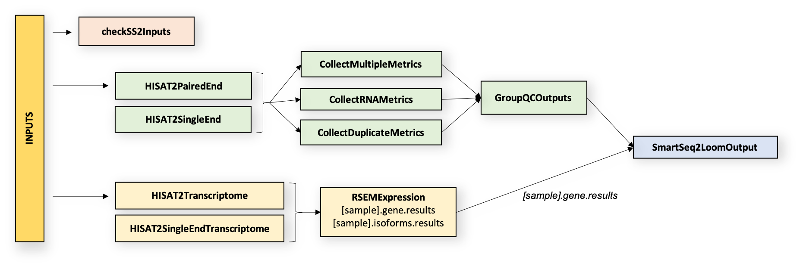

# Smart-seq2 Single Sample Overview

:::warning
9/12/2014

We are deprecating the Smart-seq2 Single Sample Pipeline. Although the code will continue to be available, we are no longer supporting it. For an alternative, see the [Smart-seq2 Single Nucleus Multi Sample workflow](../../Pipelines/Smart-seq2_Single_Nucleus_Multi_Sample_Pipeline/README.md).
:::

| Pipeline Version | Date Updated | Documentation Author | Questions or Feedback |
| :----: | :---: | :----: | :--------------: |
| [smartseq2_v5.1.20](https://github.com/broadinstitute/warp/releases) | February, 2024 | Elizabeth Kiernan | Please [file an issue in WARP](https://github.com/broadinstitute/warp/issues). |



## Introduction to the Smart-seq2 Single Sample Pipeline

The Smart-seq2 Single Sample Pipeline (SS2) is designed by the [Data Coordination Platform](https://data.humancellatlas.org/about) of the [Human Cell Atlas](https://www.humancellatlas.org/) to process single-cell RNAseq (scRNAseq) data generated by [Smart-seq2 assays](https://www.nature.com/articles/nmeth.2639). The pipeline's workflow is written in WDL, is freely available on [GitHub](https://github.com/broadinstitute/warp/blob/master/pipelines/wdl/smartseq2_single_sample/SmartSeq2SingleSample.wdl), and can be run by any compliant WDL runner (e.g. [Crowmell](https://github.com/broadinstitute/cromwell)). The pipeline is designed to process scRNA-seq data from an individual cell (to process multiple cells, see the [Smart-seq2_Multi Sample](https://github.com/broadinstitute/warp/blob/master/pipelines/wdl/smartseq2_multisample/MultiSampleSmartSeq2.wdl) pipeline).

The SS2 workflow is divided into two parts which run in parallel. In part one, the workflow aligns reads to the genome and performs quality control on genome-aligned BAMs. In part two, it aligns reads to the transcriptome and generates gene expression estimates from transcriptome-aligned BAMs. The pipeline returns reads and expression estimates in BAM, and read counts and QC metrics in Loom and CSV file format.

The pipeline has been validated to support [human](https://docs.google.com/document/d/1MonsTG8UnROHZ_XpulrSZNTxO988KEH6T6h45plFYQg/edit#heading=h.ixoqmhbabdvh) and [mouse](https://docs.google.com/document/d/12zGTFROrcXEByt9z0h06qjSqb9vWutn28Tx6YiND1Ds/edit), stranded or unstranded, paired- or single-end, and plate- or fluidigm-based Smart-seq2 datasets. Read more in the [validation section](#validation).

:::tip Want to use the Smart-seq2 pipeline for your publication?
Check out the [Smart-seq2 Publication Methods](../Smart-seq2_Multi_Sample_Pipeline/smart-seq2.methods.md) to get started!
:::

## Quick Start Table

| Pipeline Features | Description | Source |
|-------------------|---------------------------------------------------------------|-----------------------|
| Assay Type | Smart-seq2 Single Sample | [Smart-seq2](https://www.nature.com/articles/nprot.2014.006)
| Overall Workflow  | Quality control and transcriptome quantification | Code available from [GitHub](https://github.com/broadinstitute/warp/blob/master/pipelines/wdl/smartseq2_single_sample/SmartSeq2SingleSample.wdl) |
| Workflow Language | WDL | [openWDL](https://github.com/openwdl/wdl) |
| Genomic Reference Sequence (for validation)| GRCh38 human genome primary sequence and M21 (GRCm38.p6) mouse genome primary sequence | GENCODE [human reference files](https://www.gencodegenes.org/human/release_27.html) and [mouse reference files](https://www.gencodegenes.org/mouse/release_M21.html)
| Transcriptomic Reference Annotation (for validation) | V27 GENCODE human transcriptome and M21 mouse transcriptome | GENCODE [human GTF](ftp://ftp.ebi.ac.uk/pub/databases/gencode/Gencode_human/release_27/gencode.v27.annotation.gtf.gz) and [mouse GTF](ftp://ftp.ebi.ac.uk/pub/databases/gencode/Gencode_mouse/release_M21/gencode.vM21.annotation.gff3.gz) |
| Aligner  | HISAT2 (v.2.1.0) | [Kim, et al.,2019](https://www.nature.com/articles/s41587-019-0201-4) |
| QC Metrics | Picard (v.2.26.10) | [Broad Institute](https://broadinstitute.github.io/picard/)   |
| Transcript Quantification | Utilities for processing large-scale single cell datasets | [RSEM v.1.3.0](https://bmcbioinformatics.biomedcentral.com/articles/10.1186/1471-2105-12-323)
| Data Input File Format | File format in which sequencing data is provided | [FASTQ](https://academic.oup.com/nar/article/38/6/1767/3112533) |
| Data Output File Formats | File formats in which Smart-seq2 output is provided | [BAM](http://samtools.github.io/hts-specs/), Loom (generated with [Loompy v.3.0.6)](http://loompy.org/), CSV (QC metrics and counts) |

## Set-Up

### Smart-seq2 Single Sample Installation and Requirements

The SS2 workflow code can be downloaded by cloning the GitHub [WARP repository](https://github.com/broadinstitute/warp). For the latest release of Smart-seq2, please see the [Smart-seq2 Single Sample changelog](https://github.com/broadinstitute/warp/blob/master/pipelines/wdl/smartseq2_single_sample/SmartSeq2SingleSample.changelog.md).

The workflow is deployed using [Cromwell](https://github.com/broadinstitute/cromwell), a GA4GH compliant, flexible workflow management system that supports multiple computing platforms.

:::tip Try the SS2 workflow in Terra
You can run the [Smart-seq2 Multi-Sample workflow](https://github.com/broadinstitute/warp/blob/master/pipelines/wdl/smartseq2_multisample/MultiSampleSmartSeq2.wdl) (a wrapper for the Single Sample workflow described in this document) in [Terra](https://app.terra.bio), a cloud-based analysis platform. The Terra [Smart-seq2 public workspace](https://app.terra.bio/#workspaces/featured-workspaces-hca/HCA%20Smart-seq2%20Multi%20Sample%20Pipeline) is preloaded with the Smart-seq2 workflow, example testing data, and all the required reference data.
:::

### Inputs

There are two example configuration (JSON) files available to test the SS2 workflow.

* [human_single_example.json](https://github.com/broadinstitute/warp/blob/master/pipelines/wdl/smartseq2_single_sample/human_single_example.json): Configurations for an example single-end human dataset
* [mouse_paired_example.json](https://github.com/broadinstitute/warp/blob/master/pipelines/wdl/smartseq2_single_sample/mouse_paired_example.json): Configurations for an example mouse paired-end dataset


#### Sample Data Input

The pipeline is designed for both single- and paired-end reads in the form of FASTQ files. The workflow accepts two FASTQ files for paired-end experiments and one FASTQ file single-end experiments. It processes one sample (cell).

*  `fastq1`: forward reads for sample with paired-end sequencing (or reads for sample with single-end sequencing)
*  `fastq2`: reverse reads for sample with paired-end sequencing (not applicable for samples with single-end sequencing)

The workflow will use modified tasks depending if a sample is paired-end or single-end. This is designated with a boolean, as detailed in the following Reference Inputs section.

#### Additional Reference Inputs

The Smart-seq2 Single Sample workflow requires multiple reference indexes. Information on how these indexes are created is found in the [BuildIndices workflow overview](https://github.com/broadinstitute/warp/blob/master/pipelines/wdl/build_indices/README.md) documentation. The table below describes the references and each tool that uses the reference as input, when applicable.

| Workflow Step | Reference name | Reference Description | Tool |
| --- | --- | --- | --- |
| All | input_id | String containing unique identifier or name for the cell. It can be a human-readable descriptor (i.e. "cell1") or a UUID | NA |
| All | input_name | Optional string that can be used as a name/identifier for the cell | NA |
| All | output_name | Output name, can include path | NA |
| All | paired_end | A boolean describing if sample is paired-end | NA |
| All | input_id_metadata_field | Optional string that describes, when applicable, the metadata field used for `input_id`| NA |
| All | input_name_metadata_field | Optional string that describes, when applicable, the metadata field used for the `input_name`| NA |
| **Genomic alignment with HISAT2** | hisat2_ref_index | HISAT2 reference index file in tarball | HISAT2 |
|     | hisat2_ref_name | HISAT2 reference index name | HISAT2 |
| **Picard-generated quality control metrics** | genome_ref_fasta | Genome reference in fasta format | Picard |
|     | gene_ref_flat | [RefFlat](https://software.broadinstitute.org/software/igv/genePred) file containing the location of RNA transcripts, exon start sites, etc.  | Picard |
|     | rrna_intervals | Ribosomal RNA intervals file | Picard |
|     | stranded | Library strand information for HISAT2; example values include FR (read corresponds to transcript), RF(read corresponds to reverse complement of transcript), or NONE | Picard |
| **Transcriptomic alignment with HISAT2** | hisat2_ref_trans_index | HISAT2 transcriptome index file in tarball | HISAT2 |
|     | hisat2_ref_trans_name | HISAT2 transcriptome index file name | HISAT2 |
| **Gene expression quantification with RSEM** | rsem_ref_index | RSEM reference index file in tarball | RSEM |

## Running Smart-seq2

The [SmartSeq2SingleSample.wdl](https://github.com/broadinstitute/warp/blob/develop/pipelines/wdl/smartseq2_single_sample/SmartSeq2SingleSample.wdl) is in the [pipelines/smartseq2_single_sample folder](https://github.com/broadinstitute/warp/blob/master/pipelines/wdl/smartseq2_single_sample) of the WARP repository and implements the workflow by importing individual tasks (written in WDL script) from the WARP [tasks folder](https://github.com/broadinstitute/warp/blob/master/tasks/wdl/).

### Smart-seq2 Workflow Summary

Overall, the workflow is divided into two parts that are completed after an initial input validation step. Each workflow part comprises tasks (WDL scripts) that are summarized below and are available in the WARP [tasks folder](https://github.com/broadinstitute/warp/blob/master/tasks/wdl/) in GitHub.

**Part 1: Quality Control Tasks**
 1. Aligns reads to the genome with HISAT2 v.2.1.0
 2. Calculates summary metrics from an aligned BAM using Picard v.2.26.10

**Part 2: Transcriptome Quantification Tasks**
 1. Aligns reads to the transcriptome with HISAT v.2.1.0
 2. Quantifies gene expression using RSEM v.1.3.0

The table below provides links to each of the Smart-seq2 Single Sample pipeline's task WDL scripts, as well as documentation for each task's software tools.

If you are looking for the parameters used for each task/tool, click on the task link in the table below and see the `command {}` section of the task WDL. The task's Docker image is also specified in the task WDL in the `# runtime values` section as ``` String docker = ```.

| Task | Tool |
| --- | --- |
| [HISAT2.HISATPairedEnd](https://github.com/broadinstitute/warp/blob/master/tasks/wdl/HISAT2.wdl) | [HISAT2 software](https://www.nature.com/articles/s41587-019-0201-4) |
| [HISAT2.HISATSingleEnd](https://github.com/broadinstitute/warp/blob/master/tasks/wdl/HISAT2.wdl) | [HISAT2 software](https://www.nature.com/articles/s41587-019-0201-4) |
| [Picard.CollectMultipleMetrics](https://github.com/broadinstitute/warp/blob/master/tasks/wdl/Picard.wdl) | [Picard software](https://broadinstitute.github.io/picard/) |
| [Picard.CollectRnaMetrics](https://github.com/broadinstitute/warp/blob/master/tasks/wdl/Picard.wdl) | [Picard software](https://broadinstitute.github.io/picard/) |
| [Picard.CollectDuplicationMetrics](https://github.com/broadinstitute/warp/blob/master/tasks/wdl/Picard.wdl) | [Picard software](https://broadinstitute.github.io/picard/) |
| [HISAT2.HISAT2RSEM](https://github.com/broadinstitute/warp/blob/master/tasks/wdl/HISAT2.wdl) | [HISAT2 software](https://www.nature.com/articles/s41587-019-0201-4) |
| [HISAT2.HISAT2RSEMSingleEnd](https://github.com/broadinstitute/warp/blob/master/tasks/wdl/HISAT2.wdl) | [HISAT2 software](https://www.nature.com/articles/s41587-019-0201-4) |
| [RSEM.RSEMExpression](https://github.com/broadinstitute/warp/blob/master/tasks/wdl/RSEM.wdl) | [RSEM software](https://deweylab.github.io/RSEM/README.html#de) |
| [GroupMetricsOutputs.GroupQCOutputs](https://github.com/broadinstitute/warp/blob/master/tasks/wdl/GroupMetricsOutputs.wdl) | [sctools software](https://sctools.readthedocs.io/en/latest/readme.html) |
| [LoomUtils.SmartSeq2LoomOutput](https://github.com/broadinstitute/warp/blob/master/tasks/wdl/LoomUtils.wdl) | [python3 software](https://www.python.org/download/releases/3.0/) |


#### Part 1: Quality Control Tasks
##### 1.1 Align reads to the genome using HISAT2
HISAT2 is a fast, cost-efficient alignment tool that can determine the presence of non-transcript sequences and true transcript sequences, taking into account the presence of single-nucleotide polymorphisms ([Kim et al.,2019](https://www.nature.com/articles/s41587-019-0201-4)). The Smart-seq2 Single Sample workflow uses the [HISAT2 task](https://github.com/broadinstitute/warp/blob/master/tasks/wdl/HISAT2.wdl) to call HISAT2 and perform graph-based alignment of paired- or single-end reads (in the form of FASTQ files) to a reference genome. This task requires a reference index which can be built using the [BuildIndices.wdl](https://github.com/broadinstitute/warp/tree/master/pipelines/wdl/build_indices) documentation. The outputs of the task include a genome-aligned BAM file, a BAM index, and an alignment log file.

##### 1.2 Calculate summary metrics using Picard
[Picard](https://broadinstitute.github.io/picard/) is a suite of command line tools used for manipulating high-throughput sequencing data. The [Picard task](https://github.com/broadinstitute/warp/blob/master/tasks/wdl/Picard.wdl) uses Picard tools to calculate quality control measurements on the HISAT2 genome-aligned BAM file. The task requires a reference genome fasta, a RefFlat gene annotation file, and an RNA intervals file (see the [BuildIndices workflow](https://github.com/broadinstitute/warp/tree/master/pipelines/wdl/build_indices) for creating references). The outputs of the task are text and PDF files for each metric.

The [Picard task](https://github.com/broadinstitute/warp/blob/master/tasks/wdl/Picard.wdl) generates QC metrics by using three sub-tasks:

*  CollectMultipleMetrics: calls the  [CollectMultipleMetrics](https://software.broadinstitute.org/gatk/documentation/tooldocs/4.2.6.1/picard_analysis_CollectMultipleMetrics.php) tool which uses the aligned BAM file and reference genome fasta to collect metrics on [alignment](http://broadinstitute.github.io/picard/picard-metric-definitions.html#AlignmentSummaryMetrics), [insert size](http://broadinstitute.github.io/picard/picard-metric-definitions.html#InsertSizeMetrics), [GC bias](https://broadinstitute.github.io/picard/command-line-overview.html#CollectGcBiasMetrics), [base distribution by cycle](http://broadinstitute.github.io/picard/picard-metric-definitions.html#BaseDistributionByCycleMetrics), [quality score distribution](https://broadinstitute.github.io/picard/command-line-overview.html#QualityScoreDistribution), [quality distribution by cycle](https://broadinstitute.github.io/picard/command-line-overview.html#MeanQualityByCycle), [sequencing artifacts](http://broadinstitute.github.io/picard/picard-metric-definitions.html#ErrorSummaryMetrics), and [quality yield](http://broadinstitute.github.io/picard/picard-metric-definitions.html#CollectQualityYieldMetrics.QualityYieldMetrics).

*  CollectRnaMetrics: calls the [CollectRnaSeqMetrics](https://software.broadinstitute.org/gatk/documentation/tooldocs/4.2.6.1/picard_analysis_CollectRnaSeqMetrics.php) tool which uses the aligned BAM, a RefFlat genome annotation file, and a ribosomal intervals file to produce RNA alignment metrics (metric descriptions are found in the [Picard Metrics Dictionary](http://broadinstitute.github.io/picard/picard-metric-definitions.html#RnaSeqMetrics)).

*  CollectDuplicationMetrics: calls the [MarkDuplicates](https://software.broadinstitute.org/gatk/documentation/tooldocs/4.2.6.1/picard_sam_markduplicates_MarkDuplicates.php) tool which uses the aligned BAM to identify duplicate reads (output metrics are listed in the [Picard Metrics Dictionary](http://broadinstitute.github.io/picard/picard-metric-definitions.html#DuplicationMetrics)).


#### Part 2: Transcriptome Quantification Tasks
##### 2.1 Align reads to the transcriptome using HISAT2
The [HISAT2.HISAT2RSEM task](https://github.com/broadinstitute/warp/blob/master/tasks/wdl/HISAT2.wdl) uses HISAT2 to align reads to the reference transcriptome. The task requires the hisat2_ref_trans_index file and the sample FASTQ files as input. The output of this task is a transcriptome-aligned BAM file and an alignment log file.

##### 2.2 Quantify gene expression using RSEM
[RSEM](https://deweylab.github.io/RSEM/README.html#de) is a software package for quantifying transcript abundances ([Li and Dewey, 2011](https://bmcbioinformatics.biomedcentral.com/articles/10.1186/1471-2105-12-323)). The Smart-seq2 Single Sample workflow uses the [RSEM.RSEMExpression task](https://github.com/broadinstitute/warp/blob/master/tasks/wdl/RSEM.wdl) to calculate expression estimates from a transcriptome-aligned BAM file using the rsem_ref_index file for reference input. The RSEM tool [rsem-calculate-expression](http://deweylab.biostat.wisc.edu/rsem/rsem-calculate-expression.html) is used to estimate gene/isoform expression.


The RSEM task returns the following output files:
*  rsem_gene: gene level expression estimates in FPKM, TPM, and counts ("expected_count")
*  rsem_isoform: isoform level expression estimates in FPKM, TPM, and counts ("expected_count")
*  rsem_time: the time consumed by aligning reads
*  rsem_cnt: alignment statistics
*  rsem_model: RNA-seq model parameters
*  rsem_theta: fraction of reads resulting from background

Only the rsem_gene (TPM and expected_count), rsem_isoform (TPM and expected_count), and rsem_cnt files are used for the final outputs of the Smart-seq2 Single Sample workflow.

After the Smart-seq2 workflow generates HISAT2, Picard and RSEM metrics, the [GroupMetricsOutputs task](https://github.com/broadinstitute/warp/blob/master/tasks/wdl/GroupMetricsOutputs.wdl) combines most metrics into a "group_results" CSV file array. The workflow uses this array in downstream Loom file generation. The following HISAT2, [Picard](http://broadinstitute.github.io/picard/picard-metric-definitions.html#) and [RSEM](http://deweylab.biostat.wisc.edu/rsem/rsem-calculate-expression.html) outputs are inputs for this task:

*  HISAT2_log_file
*  base_call_dist_metrics
*  gc_bias_detail_metrics
*  pre_adapter_details_metrics
*  pre_adapter_summary_metrics
*  bait_bias_detail_metrics
*  error_summary_metrics
*  alignment_summary_metrics
*  dedup_metrics
*  rna_metrics
*  gc_bias_summary_metrics
*  HISAT2RSEM_log_file
*  RSEMExpression.rsem_cnt

### Outputs
The table below details the final outputs of the SS2 workflow.

| Output Name	|	Output Description |	Output Format |
| --- | --- | --- |
| Pipeline version | Version of the processing pipeline run on this data | string |
| aligned_bam | HISAT2 out BAM | BAM |
| bam_index | HISAT2 BAM index | BAM |
| insert_size_metrics | Picard insert size metrics | txt |
| quality_distribution_metrics | Picard quality distribution metrics | txt |
| quality_by_cycle_metrics | Picard quality by cycle metrics | txt |
| bait_bias_summary_metrics | Picard bait bias summary metrics | txt |
| rna_metrics | Picard RNA metrics | txt |
| group_results | Array of Picard metric files generated by the GroupQCOutputs task | CSV |
| rsem_gene_results | RSEM file containing gene-level expression estimates | tab-delimited |
| rsem_isoform_results | RSEM file containing isoform-level expression estimates | tab delimited |
| loom_output_files | Loom file containing RSEM TPM and expected_counts and metrics| Loom |

The final count matrix is in Loom format and includes only the group_results CSV files and the rsem_gene_results (TPM and expected_count). Note that the TPMs are contained in the Loom “matrix", whereas expected_count is contained in the “layers/estimated_counts".

:::warning Zarr Array Deprecation Notice June 2020
Please note that we have deprecated the previously used Zarr array output. The pipeline now uses the Loom file format as the default output.
:::

## Validation
The SS2 pipeline has been validated for processing human and mouse, stranded or unstranded, paired- or single-end, and plate- or fluidigm-based Smart-seq2 datasets (see links to validation reports in the table below).

| Workflow Configuration | Link to Report |
| --- | --- |
| Mouse paired-end | [Report](https://docs.google.com/document/d/12zGTFROrcXEByt9z0h06qjSqb9vWutn28Tx6YiND1Ds/edit)
| Human and mouse single-end | [Report](https://docs.google.com/document/d/1MonsTG8UnROHZ_XpulrSZNTxO988KEH6T6h45plFYQg/edit#heading=h.ixoqmhbabdvh) |
| Human stranded fluidigm | [Report](https://docs.google.com/document/d/1FEg86Tlu657j9Kjw_v3keFQRXcBIs8gOqCwLbPSP-C0/edit#heading=h.wjr8otl7zg14) |

## Versioning
All SS2 release notes are documented in the [Smartseq2 Single Sample changelog](https://github.com/broadinstitute/warp/blob/develop/pipelines/wdl/smartseq2_single_sample/SmartSeq2SingleSample.changelog.md).

## Citing the Smart-seq2 Single Sample Pipeline

If you use the Smart-seq2 Single Sample Pipeline in your research, please identify the pipeline in your methods section using the [Smart-seq2 Single Sample SciCrunch resource identifier](https://scicrunch.org/resources/data/record/nlx_144509-1/SCR_021228/resolver?q=SCR_021228&l=SCR_021228&i=rrid:scr_021228).

* Ex: *Smart-seq2 Single Sample Pipeline (RRID:SCR_021228)*

Please also consider citing our preprint:

Degatano, K., Awdeh, A., Cox III, R.S., Dingman, W., Grant, G., Khajouei, F., Kiernan, E., Konwar, K., Mathews, K.L., Palis, K., et al. Warp Analysis Research Pipelines: Cloud-optimized workflows for biological data processing and reproducible analysis. Bioinformatics 2025; btaf494. https://doi.org/10.1093/bioinformatics/btaf494

## Consortia Support
This pipeline is supported and used by the [Human Cell Atlas](https://www.humancellatlas.org/) (HCA) project. 

If your organization also uses this pipeline, we would love to list you! Please [filing an issue in WARP](https://github.com/broadinstitute/warp/issues).

## Have Suggestions?
Please help us make our tools better by [filing an issue in WARP](https://github.com/broadinstitute/warp/issues); we welcome pipeline-related suggestions or questions.
