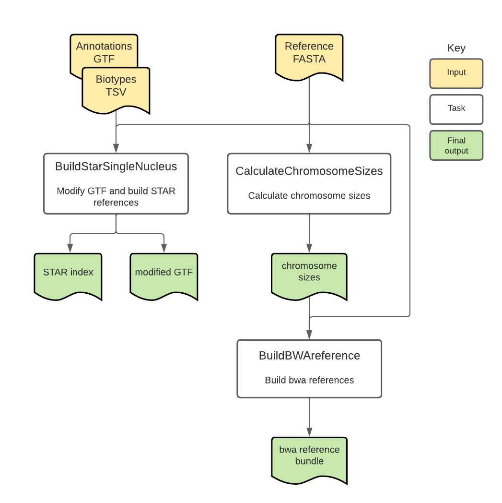

# BuildIndices Overview

| Pipeline Version | Date Updated | Documentation Author | Questions or Feedback |
| :----: | :---: | :----: | :--------------: |
| [BuildIndices_v4.0.0](https://github.com/broadinstitute/warp/releases) | January, 2025 | WARP Pipelines | Please [file an issue in WARP](https://github.com/broadinstitute/warp/issues). |




## Introduction to the BuildIndices workflow

The [BuildIndices workflow](https://github.com/broadinstitute/warp/blob/master/pipelines/wdl/build_indices/BuildIndices.wdl) is an open-source, cloud-optimized pipeline developed in collaboration with the [BRAIN Initiative Cell Census Network](https://biccn.org/) (BICCN) and the BRAIN Initiative Cell Atlas Network (BICAN). 

Overall, the workflow filters GTF files for selected gene biotypes, calculates chromosome sizes, and builds reference bundles with required files for [STAR](https://github.com/alexdobin/STAR) and [bwa-mem2](https://github.com/bwa-mem2/bwa-mem2) aligners.

## Quickstart table
The following table provides a quick glance at the BuildIndices pipeline features:

| Pipeline features | Description | Source |
| --- | --- | --- |
| Overall workflow | Reference bundle creation for STAR and bwa-mem2 aligners | Code available on [GitHub](https://github.com/broadinstitute/warp/blob/master/pipelines/wdl/build_indices/BuildIndices.wdl) |
| Workflow language | WDL 1.0 | [openWDL](https://github.com/openwdl/wdl) |
| Genomic Reference Sequence | GRCh38 human genome primary sequence, M32 (GRCm39) mouse genome primary sequence, and release 103 (GCF_003339765.1) macaque genome primary sequence  | GENCODE [human reference files](https://www.gencodegenes.org/human/release_43.html), GENCODE [mouse reference files](https://www.gencodegenes.org/mouse/release_M32.html), and NCBI [macaque reference files](https://www.ncbi.nlm.nih.gov/datasets/genome/GCF_003339765.1/) |
| Gene annotation reference (GTF) | Reference containing gene annotations | GENCODE [human GTF](https://ftp.ebi.ac.uk/pub/databases/gencode/Gencode_human/release_43/gencode.v43.annotation.gtf.gz), GENCODE [mouse GTF](https://ftp.ebi.ac.uk/pub/databases/gencode/Gencode_mouse/release_M32/gencode.vM32.primary_assembly.annotation.gtf.gz), and NCBI [macaque GTF](https://www.ncbi.nlm.nih.gov/datasets/genome/GCF_003339765.1/) |
| Reference builders | STAR, bwa-mem2 | [Dobin et al. 2013](https://pubmed.ncbi.nlm.nih.gov/23104886/), [Vasimuddin et al. 2019](https://ieeexplore.ieee.org/document/8820962) |
| Data input file format | File format in which reference files are provided | FASTA, GTF, TSV |
| Data output file format | File formats in which BuildIndices output is provided | GTF, TAR, TXT |

## Set-up

### BuildIndices installation

To download the latest BuildIndices release, see the release tags prefixed with "BuildIndices" on the WARP [releases page](https://github.com/broadinstitute/warp/releases). All BuildIndices pipeline releases are documented in the [BuildIndices changelog](https://github.com/broadinstitute/warp/blob/master/pipelines/wdl/build_indices/BuildIndices.changelog.md). 

To search releases of this and other pipelines, use the WARP command-line tool [Wreleaser](https://github.com/broadinstitute/warp/tree/master/wreleaser).

If you’re running a BuildIndices workflow version prior to the latest release, the accompanying documentation for that release may be downloaded with the source code on the WARP [releases page](https://github.com/broadinstitute/warp/releases) (see the folder `website/docs/Pipelines/BuildIndices_Pipeline`).

The BuildIndices pipeline can be deployed using [Cromwell](https://cromwell.readthedocs.io/en/stable/), a GA4GH-compliant, flexible workflow management system that supports multiple computing platforms. The workflow can also be run in [Terra](https://app.terra.bio), a cloud-based analysis platform.

### Inputs

The BuildIndices workflow inputs are specified in JSON configuration files. Configuration files for [macaque](https://github.com/broadinstitute/warp/blob/master/pipelines/wdl/build_indices/Macaque.json) and [mouse](https://github.com/broadinstitute/warp/blob/master/pipelines/wdl/build_indices/Mouse.json) references can be found in the WARP repository.

#### Input descriptions
The table below describes the input variables for the BuildIndices workflow. 

:::tip
Marmoset scripts expect a custom-modified input Marmoset GTF file and FASTA file. These inputs and accompanying README are located in a [public Google Drive](https://drive.google.com/drive/folders/15JcUhwOqkJwTVS8BOlA0yIdjh4RwJOdz) maintained by Mike Debardine from the BICAN consortium.
:::

| Parameter name | Description | Type |
| --- | --- | --- |
| genome_source | Describes the source of the reference genome listed in the GTF file; used to name output files; can be set to “NCBI” or “GENCODE”. | String |
| gtf_annotation_version | Version or release of the reference genome listed in the GTF file; used to name STAR output files; ex.”M32”, “103”. | String |
| genome_build | Assembly accession (NCBI) or version (GENCODE) of the reference genome listed in the GTF file; used to name output files; ex. “GRCm39”, “GCF_003339765.1”.  | String |
| organism | Organism of the reference genome; used to name the output files; can be set to “Macaque”, “Mouse”, “Human”, or any other organism matching the reference genome. | String | 
| annotations_gtf | GTF file containing gene annotations; used to build the STAR reference files. | File |
| genome_fa | Genome FASTA file used for building indices. | File |
| biotypes | TSV file containing gene biotypes attributes to include in the modified GTF file; the first column contains the biotype and the second column contains “Y” to include or “N” to exclude the biotype; [GENCODE biotypes](https://www.gencodegenes.org/pages/biotypes.html) are used for GENCODE references and RefSeq biotypes are used for NCBI references. | File |
| run_add_introns | Boolean to indicate whether to create reference files that include intronic regions; default is false. | Boolean |

## BuildIndices tasks and tools

Overall, the BuildIndices workflow:
1. Checks inputs, modifies reference files, and creates STAR index.
2. Calculates chromosome sizes.
3. Builds reference bundle for bwa-mem2.

The tasks and tools used in the BuildIndices workflow are detailed in the table below. 

To see specific tool parameters, select the [workflow WDL link](https://github.com/broadinstitute/warp/blob/master/pipelines/wdl/build_indices/BuildIndices.wdl); then find the task and view the `command {}` section of the task in the WDL script. To view or use the exact tool software, see the task's Docker image which is specified in the task WDL `# runtime values` section as `docker: `.

| Task name | Tool | Software | Description | 
| --- | --- | --- | --- | 
| BuildStarSingleNucleus | [modify_gtf.py](https://github.com/broadinstitute/warp-tools/blob/develop/3rd-party-tools/build-indices/modify_gtf.py), STAR | [warp-tools](https://github.com/broadinstitute/warp-tools/tree/develop), [STAR](https://github.com/alexdobin/STAR) | Checks that the input GTF file contains input genome source, genome build version, and annotation version with correct build source information, modifies files for the STAR aligner, and creates STAR index file. If "Marmoset" is selected as organism, a [Marmoset-specific custom script](https://github.com/broadinstitute/warp-tools/blob/develop/3rd-party-tools/build-indices/modify_gtf_marmoset.py) is run to modify the GTF |
| CalculateChromosomeSizes | faidx | [Samtools](http://www.htslib.org/) | Reads the genome FASTA file to create a FASTA index file that contains the genome chromosome sizes. |
| BuildBWAreference | index | [bwa-mem2](https://github.com/bwa-mem2/bwa-mem2) | Builds the reference bundle for the bwa aligner. |
| SNSS2AddIntronsToGTF | [add-introns-to-gtf.py](https://github.com/broadinstitute/warp-tools/blob/develop/3rd-party-tools/build-indices/add-introns-to-gtf.py), STAR |  [warp-tools](https://github.com/broadinstitute/warp-tools/tree/develop), [STAR](https://github.com/alexdobin/STAR) |  Adds intron annotations to a GTF, regenerates a STAR genome index with the updated annotation and reference FASTA, and packages the index into a tar archive for downstream use.

#### 1. Check inputs, modify reference files, and create STAR index file

**Check inputs**

The BuildStarSingleNucleus task reads the input GTF file and verifies that the `genome_source`, `genome_build`, and `gtf_annotation_version` listed in the file match the input values provided to the pipeline.

**Modify reference files and create STAR index**

The BuildStarSingleNucleus task uses a custom python script, [`modify_gtf.py`](https://github.com/broadinstitute/warp-tools/blob/develop/3rd-party-tools/build-indices/modify_gtf.py) or [`modify_get_marmoset`](https://github.com/broadinstitute/warp-tools/blob/develop/3rd-party-tools/build-indices/modify_gtf_marmoset.py), and a list of biotypes ([example](https://github.com/broadinstitute/warp-tools/blob/develop/3rd-party-tools/build-indices/Biotypes.tsv)) to filter the input GTF file for only the biotypes indicated in the list with the value “Y” in the second column. The defaults in the custom code produce reference outputs that are similar to those built with 10x Genomics reference scripts.

The task uses the filtered GTF file and STAR `--runMode genomeGenerate` to generate the index file for the STAR aligner. Outputs of the task include the modified GTF and compressed STAR index files.

#### 2. Calculates chromosome sizes

The CalculateChromosomeSizes task uses Samtools to create and output a FASTA index file that contains the genome chromosome sizes, which can be used in downstream tools like SnapATAC2. 

#### 3. Builds reference bundle for bwa-mem2

The BuildBWAreference task uses the chromosome sizes file and bwa-mem2 to prepare the genome FASTA file for alignment and builds, compresses, and outputs the reference bundle for the bwa-mem2 aligner.

## Outputs

The following table lists the output variables and files produced by the pipeline.

| Output name | Filename, if applicable | Output format and description |
| ------ | ------ | ------ |
| snSS2_star_index | `modified_star2.7.10a-<organism>-<genome_source>-build-<genome_build>-<gtf_annotation_version>.tar` | TAR file containing a species-specific reference genome and GTF file for [STAR](https://github.com/alexdobin/STAR) alignment. |
| pipeline_version_out | `BuildIndices_v<pipeline_version>` | String describing the version of the BuildIndices pipeline used. |
| snSS2_annotation_gtf_modified | `modified_v<gtf_annotation_version>.annotation.gtf` | GTF file containing gene annotations filtered for selected biotypes. |
| reference_bundle | `bwa-mem2-2.2.1-<organism>-<genome_source>-build-<genome_build>.tar` | TAR file containing the reference index files for [BWA-mem](https://github.com/lh3/bwa) alignment. |
| chromosome_sizes | `chrom.sizes` | Text file containing chromosome sizes for the genome build. |
| snSS2_annotation_gtf_with_introns | `<modified_annotation_gtf>_with_introns.gtf` | Optional GTF file containing gene annotations filtered for selected biotypes, with intronic regions included. |
| star_index_with_introns | `<modified_annotation_gtf>_intron.tar` | Optional TAR file containing a species-specific reference genome and GTF file containing intronic regions for [STAR](https://github.com/alexdobin/STAR) alignment. |


## Versioning and testing

All BuildIndices pipeline releases are documented in the [BuildIndices changelog](https://github.com/broadinstitute/warp/blob/master/pipelines/wdl/build_indices/BuildIndices.changelog.md) and tested manually using [reference JSON files](https://github.com/broadinstitute/warp/tree/master/pipelines/wdl/build_indices).

## Citing the BuildIndices Pipeline

If you use the BuildIndices Pipeline in your research, please consider citing our preprint:

Degatano, K., Awdeh, A., Cox III, R.S., Dingman, W., Grant, G., Khajouei, F., Kiernan, E., Konwar, K., Mathews, K.L., Palis, K., et al. Warp Analysis Research Pipelines: Cloud-optimized workflows for biological data processing and reproducible analysis. Bioinformatics 2025; btaf494. https://doi.org/10.1093/bioinformatics/btaf494

## Consortia support
This pipeline is supported by the [BRAIN Initiative](https://braininitiative.nih.gov/) (BICCN and BICAN) and SCORCH. 

If your organization also uses this pipeline, we would like to list you! Please reach out to us by [filing an issue in WARP](https://github.com/broadinstitute/warp/issues).

## Example references
Example references are available in the Broad Public Reference bucket, a Google bucket that hosts reference files at no charge to the end-user.

### Human
| File Type               | File Location |
|-------------------------|--------------|
| Genomics Reference     | GRCh38, primary assembly (PRI) |
| Gene annotation (PRI)  | GENCODE Release 43 GRCh38.p13 |
| Reference README       | `gs://gcp-public-data--broad-references/hg38/v0/star/v2_7_10a/v43_README.txt` |
| STAR Index TAR         | `gs://gcp-public-data--broad-references/hg38/v0/star/v2_7_10a/modified_star2.7.10a-Human-GENCODE-build-GRCh38-43.tar` |
| STAR Annotation GTF    | `gs://gcp-public-data--broad-references/hg38/v0/star/v2_7_10a/modified_v43.annotation.gtf` |
| BWA-MEM2 Index TAR     | `gs://gcp-public-data--broad-references/hg38/v0/bwa/v2_2_1/bwa-mem2-2.2.1-Human-GENCODE-build-GRCh38.tar` |
| Chromosome Sizes       | `gs://gcp-public-data--broad-references/hg38/v0/bwa/v2_2_1/chrom.sizes` |


### Mouse

| File Type               | File Location |
|-------------------------|--------------|
| Genomics Reference     | GRCm39, primary assembly (PRI) |
| Gene annotation (PRI)  | GENCODE Release 32 |
| Reference README       | `gs://gcp-public-data--broad-references/GRCm39/star/v2_7_10a/M32_README.txt` |
| STAR Index TAR         | `gs://gcp-public-data--broad-references/GRCm39/star/v2_7_10a/modified_star2.7.10a-Mouse-GENCODE-build-GRCm39-M32.tar` |
| STAR Annotation GTF    | `gs://gcp-public-data--broad-references/GRCm39/star/v2_7_10a/modified_vM32.annotation.gtf` |
| BWA-MEM2 Index TAR     | `gs://gcp-public-data--broad-references/GRCm39/bwa/v2_2_1/bwa-mem2-2.2.1-Mouse-GENCODE-build-GRCm39.tar` |
| Chromosome Sizes       | `gs://gcp-public-data--broad-references/GRCm39/bwa/v2_2_1/chrom.sizes` |

### Macaque
Inputs for the Macaque reference below were modified using a custom tool to handle nuclear mitochondrial inserts, [numty-dumpty](https://github.com/nkschaefer/numty-dumpty). See the README for the [STAR index](https://storage.cloud.google.com/gcp-public-data--broad-references/M.mulatta/Mmul_10/star/v2_7_10a/numty_dumpty/README_STAR.txt) and the [bwa-mem2 index]
(https://storage.cloud.google.com/gcp-public-data--broad-references/M.mulatta/Mmul_10/bwa/v2_2_1/numty_dumpty/README_BWA.txt).

| File Type           | File Location |
|---------------------|--------------|
| Genomics Reference     | mmul10 |
| Gene annotation  | RefSeq annotation version 103 |
| STAR Index TAR     | `gs://gcp-public-data--broad-references/M.mulatta/Mmul_10/star/v2_7_10a/10x_filtered/modified_star2.7.10a-Macaque-NCBI-build-GCF_003339765.1-103.tar` |
| BWA Index TAR      | `gs://gcp-public-data--broad-references/M.mulatta/Mmul_10/bwa/v2_2_1/bwa-mem2-2.2.1-Macaque-NCBI-build-GCF_003339765.1.tar` |
| GTF Annotation     | `gs://gcp-public-data--broad-references/M.mulatta/Mmul_10/star/v2_7_10a/10x_filtered/mt_v103_modified.annotation.gtf` |
| Chromosome Sizes   | `gs://gcp-public-data--broad-references/M.mulatta/Mmul_10/bwa/v2_2_1/chrom.sizes` |

This macaque reference works with the Optimus, Multiome, and Paired-tag workflows. However, mitochondrial genes are not demarcated with an "mt-" tag. A separate text file with MT genes is required. An example is the list below:

```
ND1
ND2
COX1
COX2
ATP8
ATP6
COX3
ND3
ND4L
ND4
ND5
ND6
CYTB
```

An example file with this list is located in a public Google bucket here: gs://warp-testing-public/references/BuildIndices_outs/Macaque_MT_genes.txt

### Marmoset
Marmoset scripts expect a custom-modified input Marmoset GTF file. These inputs and accompanying README are located in a [public Google Drive](https://drive.google.com/drive/folders/15JcUhwOqkJwTVS8BOlA0yIdjh4RwJOdz) maintained by Mike Debardine from the BICAN consortium.


| File Type           | File Location |
|---------------------|--------------|
| Genomics Reference     | mCalJa1.2.pat.X (GenBank Accession GCA_011100555.2 and RefSeq Accession GCF_011100555.1) |
| Gene annotation  | Custom (see note above table) |
| Chromosome Sizes   | `gs://gcp-public-data--broad-references/mCalJa1/mCalJa1.2.pat.X/chrom.sizes` |
| GTF Annotation     | `gs://gcp-public-data--broad-references/mCalJa1/mCalJa1.2.pat.X/modified_vGCF_011100555.1-RS_2023_03.annotation.gtf` |
| BWA-MEM2 Index TAR | `gs://gcp-public-data--broad-references/mCalJa1/mCalJa1.2.pat.X/bwa-mem2-2.2.1-Marmoset-RefSeq-build-mCalJa1.2.pat.X.tar` |
| STAR Index TAR     | `gs://gcp-public-data--broad-references/mCalJa1/mCalJa1.2.pat.X/modified_star2.7.10a-Marmoset-RefSeq-build-mCalJa1.2.pat.X-GCF_011100555.1-RS_2023_03.tar` |

### Armadillo
| File Type           | File Location |
|---------------------|--------------|
| Genomic Reference  | mDasNov1.hap2 (NCBI) |
| Gene Annotation    | RefSeq GCF_030445035.1-RS_2023_07 |
| BWA-MEM2 Index TAR | `gs://gcp-public-data--broad-references/D.novemcinctus/mDasNov1.hap2/cleanome/bwa/v2_2_1/bwa-mem2-2.2.1-Armadillo-NCBI-build-mDasNov1.hap2.tar` |
| Chromosome Sizes   | `gs://gcp-public-data--broad-references/D.novemcinctus/mDasNov1.hap2/cleanome/bwa/v2_2_1/chrom.sizes` |
| STAR Index TAR     | `gs://gcp-public-data--broad-references/D.novemcinctus/mDasNov1.hap2/cleanome/star/v2_7_10a/modified_star2.7.10a-Armadillo-NCBI-build-mDasNov1.hap2-2.2.tar` |
| GTF Annotation     | `gs://gcp-public-data--broad-references/D.novemcinctus/mDasNov1.hap2/cleanome/star/v2_7_10a/modified_v2.2.annotation.gtf` |

### Opposum

| File Type           | File Location |
|---------------------|--------------|
| Genomic Reference  | mMonDom1.pri (NCBI) |
| Gene Annotation    | RefSeq GCF_027887165.1-RS_2023_05 (RefSeq link) |
| BWA-MEM2 Index TAR | `gs://gcp-public-data--broad-references/M.domestica/mMonDom1.pri/cleanome/bwa/v2_2_1/bwa-mem2-2.2.1-Opossum-NCBI-build-mMonDom1.pri.tar` |
| Chromosome Sizes   | `gs://gcp-public-data--broad-references/M.domestica/mMonDom1.pri/cleanome/bwa/v2_2_1/chrom.sizes` |
| STAR Index TAR     | `gs://gcp-public-data--broad-references/M.domestica/mMonDom1.pri/cleanome/star/v2_7_10a/modified_star2.7.10a-Opossum-NCBI-build-mMonDom1.pri-2.2.tar` |
| GTF Annotation     | `gs://gcp-public-data--broad-references/M.domestica/mMonDom1.pri/cleanome/star/v2_7_10a/modified_v2.2.annotation.gtf` |

### Rat

| File Type           | File Location |
|---------------------|--------------|
| Genomic Reference  | mRatBN7.2 (NCBI) |
| Gene Annotation    | RefSeq GCF_015227675.2-RS_2023_06 |
| BWA-MEM2 Index TAR | `gs://gcp-public-data--broad-references/R.norvegicus/mRatBN7.2/cleanome/bwa/v2_2_1/bwa-mem2-2.2.1-Rat-NCBI-build-mRatBN7.2.tar` |
| Chromosome Sizes   | `gs://gcp-public-data--broad-references/R.norvegicus/mRatBN7.2/cleanome/bwa/v2_2_1/chrom.sizes` |
| STAR Index TAR     | `gs://gcp-public-data--broad-references/R.norvegicus/mRatBN7.2/cleanome/star/v2_7_10a/modified_star2.7.10a-Rat-NCBI-build-mRatBN7.2-2.2.tar` |
| GTF Annotation     | `gs://gcp-public-data--broad-references/R.norvegicus/mRatBN7.2/cleanome/star/v2_7_10a/modified_v2.2.annotation.gtf` |

### Pig
| File Type           | File Location |
|---------------------|--------------|
| Genomic Reference  | Sscrofa11.1 (NCBI) |
| Gene Annotation    | NCBI Annotation Release 106 (RefSeq GCF_000003025.6_Sscrofa11.1) |
| BWA-MEM2 Index TAR | `gs://gcp-public-data--broad-references/S.scrofa/Sscrofa11.1/cleanome/bwa/v2_2_1/bwa-mem2-2.2.1-Pig-NCBI-build-Sscrofa11.1.tar` |
| Chromosome Sizes   | `gs://gcp-public-data--broad-references/S.scrofa/Sscrofa11.1/cleanome/bwa/v2_2_1/chrom.sizes` |
| STAR Index TAR     | `gs://gcp-public-data--broad-references/S.scrofa/Sscrofa11.1/cleanome/star/v2_7_10a/modified_star2.7.10a-Pig-NCBI-build-Sscrofa11.1-2.2.tar` |
| GTF Annotation     | `gs://gcp-public-data--broad-references/S.scrofa/Sscrofa11.1/cleanome/star/v2_7_10a/modified_v2.2.annotation.gtf` |

### Owl Monkey
| File Type           | File Location |
|---------------------|--------------|
| Genomic Reference  | 86718_ANA_hifiasm-v0.15.2.pri (NCBI) |
| Gene Annotation    | RefSeq GCF_030222135.1 |
| BWA-MEM2 Index TAR | `gs://gcp-public-data--broad-references/A.nancymaae/86718_ANA_hifiasm-v0.15.2.pri/cleanome/bwa/v2_2_1/bwa-mem2-2.2.1-Owl_monkey-NCBI-build-86718_ANA_hifiasm-v0.15.2.pri.tar` |
| Chromosome Sizes   | `gs://gcp-public-data--broad-references/A.nancymaae/86718_ANA_hifiasm-v0.15.2.pri/cleanome/bwa/v2_2_1/chrom.sizes` |
| STAR Index TAR     | `gs://gcp-public-data--broad-references/A.nancymaae/86718_ANA_hifiasm-v0.15.2.pri/cleanome/star/v2_7_10a/star2.7.10a-Owl_monkey-NCBI-build-86718_ANA_hifiasm-v0.15.2.pri-GCF_030222135.1.tar` |
| GTF Annotation     | `gs://gcp-public-data--broad-references/A.nancymaae/86718_ANA_hifiasm-v0.15.2.pri/cleanome/star/v2_7_10a/vGCF_030222135.1.annotation.gtf` |
| MT Genes List      | `gs://gcp-public-data--broad-references/A.nancymaae/86718_ANA_hifiasm-v0.15.2.pri/cleanome/owl_monkey_mt_genes_list.txt` |

### Lemur
| File Type           | File Location |
|---------------------|--------------|
| Genomic Reference  | Mmur_3.0 (NCBI) |
| Gene Annotation    | RefSeq GCF_000165445.2 |
| BWA-MEM2 Index TAR | `gs://gcp-public-data--broad-references/M.murinus/Mmur_3.0/cleanome/bwa/v2_2_1/bwa-mem2-2.2.1-Gray_mouse_lemur-NCBI-build-Mmur_3.0.tar` |
| Chromosome Sizes   | `gs://gcp-public-data--broad-references/M.murinus/Mmur_3.0/cleanome/bwa/v2_2_1/chrom.sizes` |
| STAR Index TAR     | `gs://gcp-public-data--broad-references/M.murinus/Mmur_3.0/cleanome/star/v2_7_10a/star2.7.10a-Gray_mouse_lemur-NCBI-build-Mmur_3.0-GCF_000165445.2.tar` |
| GTF Annotation     | `gs://gcp-public-data--broad-references/M.murinus/Mmur_3.0/cleanome/star/v2_7_10a/vGCF_000165445.2.annotation.gtf` |
| MT Genes List      | `gs://gcp-public-data--broad-references/M.murinus/Mmur_3.0/cleanome/lemur_mt_genes_list.txt` |

### Naked Mole Rat
| File Type           | File Location |
|---------------------|--------------|
| Genomic Reference  | HetGla_female_1.0 (NCBI) |
| Gene Annotation    | RefSeq GCF_000247695.1 |
| BWA-MEM2 Index TAR | `gs://gcp-public-data--broad-references/H.glaber/HetGla_female_1.0/cleanome/bwa/bwa-mem2-2.2.1-Naked_mole_rat-NCBI-build-HetGla_female_1.0.tar` |
| Chromosome Sizes   | `gs://gcp-public-data--broad-references/H.glaber/HetGla_female_1.0/cleanome/bwa/chrom.sizes` |
| STAR Index TAR     | `gs://gcp-public-data--broad-references/H.glaber/HetGla_female_1.0/cleanome/star/v2_7_10a/star2.7.10a-Naked_mole_rat-NCBI-build-HetGla_female_1.0-GCF_000247695.1.tar` |
| GTF Annotation     | `gs://gcp-public-data--broad-references/H.glaber/HetGla_female_1.0/cleanome/star/v2_7_10a/vGCF_000247695.1.annotation.gtf` |
| MT Genes List      | `gs://gcp-public-data--broad-references/H.glaber/HetGla_female_1.0/cleanome/naked_mole_rat_mt_genes_list.txt` |

### Chimp
| File Type           | File Location |
|---------------------|--------------|
| Genomic Reference  | NHGRI_mPanTro3-v2.0_pri (NCBI) |
| Gene Annotation    | RefSeq GCF_028858775.2 |
| BWA-MEM2 Index TAR | `gs://gcp-public-data--broad-references/P.troglodytes/NHGRI_mPanTro3-v2.0_pri/cleanome/bwa/v2_2_1/bwa-mem2-2.2.1-Chimp-NCBI-build-NHGRI_mPanTro3-v2.0_pri.tar` |
| Chromosome Sizes   | `gs://gcp-public-data--broad-references/P.troglodytes/NHGRI_mPanTro3-v2.0_pri/cleanome/bwa/v2_2_1/chrom.sizes` |
| STAR Index TAR     | `gs://gcp-public-data--broad-references/P.troglodytes/NHGRI_mPanTro3-v2.0_pri/cleanome/star/v2_7_10a/star2.7.10a-Chimp-NCBI-build-NHGRI_mPanTro3-v2.0_pri-GCF_028858775.2.tar` |
| GTF Annotation     | `gs://gcp-public-data--broad-references/P.troglodytes/NHGRI_mPanTro3-v2.0_pri/cleanome/star/v2_7_10a/vGCF_028858775.2.annotation.gtf` |
| MT Genes List      | `gs://gcp-public-data--broad-references/P.troglodytes/NHGRI_mPanTro3-v2.0_pri/cleanome/chimp_mt_genes_list.txt` |

### Ferret
| File Type           | File Location |
|---------------------|--------------|
| Genomic Reference  | ASM1176430v1.1 (NCBI) |
| Gene Annotation    | RefSeq GCF_011764305.1 |
| BWA-MEM2 Index TAR | `gs://gcp-public-data--broad-references/M.putorius_furo/ASM1176430v1.1/cleanome/bwa/v2_2_1/bwa-mem2-2.2.1-Ferret-NCBI-build-ASM1176430v1.1.tar` |
| Chromosome Sizes   | `gs://gcp-public-data--broad-references/M.putorius_furo/ASM1176430v1.1/cleanome/bwa/v2_2_1/chrom.sizes` |
| STAR Index TAR     | `gs://gcp-public-data--broad-references/M.putorius_furo/ASM1176430v1.1/cleanome/star/v2_7_10a/star2.7.10a-Ferret-NCBI-build-ASM1176430v1.1-GCF_011764305.1.tar` |
| GTF Annotation     | `gs://gcp-public-data--broad-references/M.putorius_furo/ASM1176430v1.1/cleanome/star/v2_7_10a/vGCF_011764305.1.annotation.gtf` |
| MT Genes List      | `gs://gcp-public-data--broad-references/M.putorius_furo/ASM1176430v1.1/cleanome/ferret_mt_genes_list.txt` |

### Treeshrew
| File Type           | File Location |
|---------------------|--------------|
| Genomic Reference  | TupChi_1.0 (NCBI) |
| Gene Annotation    | RefSeq GCF_000334495.1 |
| BWA-MEM2 Index TAR | `gs://gcp-public-data--broad-references/T.belangeri/TupChi_1.0/cleanome/bwa/v2_2_1/bwa-mem2-2.2.1-Treeshrew-NCBI-build-TupChi_1.0.tar` |
| Chromosome Sizes   | `gs://gcp-public-data--broad-references/T.belangeri/TupChi_1.0/cleanome/bwa/v2_2_1/chrom.sizes` |
| STAR Index TAR     | `gs://gcp-public-data--broad-references/T.belangeri/TupChi_1.0/cleanome/star/v2_7_10a/star2.7.10a-Treeshrew-NCBI-build-TupChi_1.0-GCF_000334495.1.tar` |
| GTF Annotation     | `gs://gcp-public-data--broad-references/T.belangeri/TupChi_1.0/cleanome/star/v2_7_10a/vGCF_000334495.1.annotation.gtf` |
| MT Genes List      | NA |

### Viral references

| Species | Species reference | Species annotation | Viral reference | Viral annotation | 
|----|-----|----|--------------------------|--------------------------|
| Human | Human-GENCODE-build-GRCh38-43 | Gencode release 43 GRCh38 | Modified HXB2 K03455.1 <br /> `gs://fc-36d6b972-99f2-4ca2-a076-9c4c0e7567e1/viral-references/hiv.fa` | `gs://fc-36d6b972-99f2-4ca2-a076-9c4c0e7567e1/viral-references/HIV.gtf` |
| Mouse | mm39/genecode.vM32 | Gencode release M32 GRCm39 | Modified https://www.ncbi.nlm.nih.gov/nuccore/MG470653.1 (excluding 3’LTR) <br /> `gs://fc-36d6b972-99f2-4ca2-a076-9c4c0e7567e1/viral-references/EcoHIV.fa` |`gs://fc-36d6b972-99f2-4ca2-a076-9c4c0e7567e1/viral-references/EcoHIV.gtf`|
| Macaque | mmul10 | Refseq annotation v 103 | NCBI GenBank, accession number PP236443 <br /> `gs://fc-36d6b972-99f2-4ca2-a076-9c4c0e7567e1/viral-references/siv.fa` | ` gs://fc-36d6b972-99f2-4ca2-a076-9c4c0e7567e1/viral-references/SIV.gtf` |
| Rat | mRatBN7.2 | RefSeq GCF_015227675.2-RS_2023_06 | AF324493.2 <br /> `gs://fc-36d6b972-99f2-4ca2-a076-9c4c0e7567e1/viral-references/RAT-HIVTransgene.fa` | `gs://fc-36d6b972-99f2-4ca2-a076-9c4c0e7567e1/viral-references/RAT-HIVFullTranscript.gtf` |

### Human + HIV
| File Type               | File Location |
|-------------------------|--------------|
| Genomics Reference     | GRCh38 + Modified HXB2 K03455.1 |
| Gene annotation        | GENCODE Release 43 GRCh38.p13 + HIV annotation |
| Human Reference        | `gs://gcp-public-data--broad-references/scorch/hg38/modified_star2.7.10a-Human-GENCODE-build-GRCh38-43.tar` |
| Human Annotation GTF   | `gs://gcp-public-data--broad-references/scorch/hg38/modified_v43.annotation.gtf` |
| BWA-MEM2 Index TAR     | `gs://gcp-public-data--broad-references/scorch/hg38/bwa-mem2-2.2.1-Human-GENCODE-build-GRCh38.tar` |
| Chromosome Sizes       | `gs://gcp-public-data--broad-references/scorch/hg38/chrom.sizes` |

## Feedback

Please help us make our tools better by [filing an issue in WARP](https://github.com/broadinstitute/warp/issues) for pipeline-related suggestions or questions.

