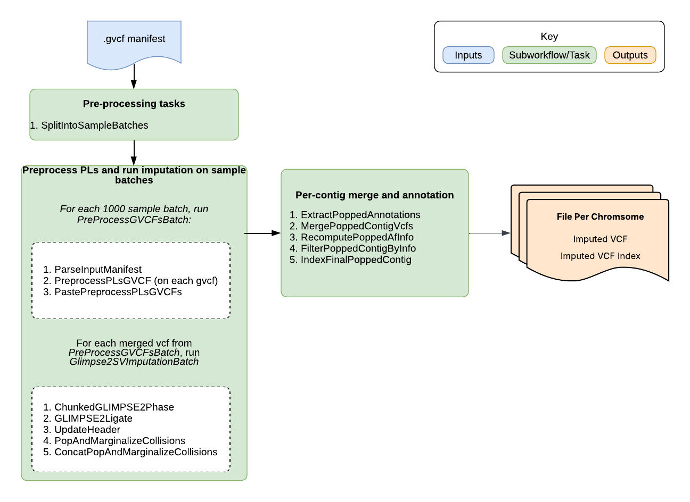

# GLIMPSE2 SV Imputation Overview

|                                                                          Pipeline Version                                                                           | Date Updated  |        Documentation Author        |                             Questions or Feedback                              |
|:-------------------------------------------------------------------------------------------------------------------------------------------------------------------:|:-------------:|:----------------------------------:|:------------------------------------------------------------------------------:|
| See [changelog](https://github.com/broadinstitute/warp/blob/develop/pipelines/wdl/glimpse/sv_imputation/Glimpse2SVImputation.changelog.md) for version information. | See changelog | Terra Scientific Pipeline Services | Please [file an issue in WARP](https://github.com/broadinstitute/warp/issues). |

## Introduction to the GLIMPSE2 SV Imputation pipeline

The GLIMPSE2 SV Imputation pipeline imputes structural variants, SNPs, and INDELs from a manifest of input GVCF paths (or from GVCF/index arrays that are converted to a manifest). It uses GLIMPSE2-based phasing, panel-informed bubble processing, and cohort-aware merge/re-annotation to produce final per-contig imputed VCF outputs.

## GLIMPSE2 SV Imputation Summary

The `Glimpse2SVImputation` workflow is a WDL-based pipeline for structural variant imputation using [GLIMPSE2](https://odelaneau.github.io/GLIMPSE/).
This top-level workflow acts as a gateway that scales to large cohorts by splitting samples into batches, running preprocess + batch imputation subworkflows per batch, then merging per-batch results back into cohort-level per-contig VCFs.

The workflow processes requested chromosomes independently, extracts/reformats bubble likelihoods, phases and ligates imputed chunks, pops/marginalizes collisions, merges batch sample columns, recomputes AF/INFO across all samples, optionally filters by INFO threshold, and indexes final outputs.

### Pipeline Features

| Pipeline features       | Description                                                                                                    | Source                                                              |
|-------------------------|----------------------------------------------------------------------------------------------------------------|---------------------------------------------------------------------|
| Assay type              | Structural variant imputation using GLIMPSE2                                                                   | [GLIMPSE2](https://odelaneau.github.io/GLIMPSE/)                    |
| Overall workflow        | Manifest normalization, preprocessing, chunked phase/ligate, pop/marginalize, merge, and AF/INFO re-annotation | Defined in `Glimpse2SVImputation.wdl` + imported subworkflows/tasks |
| Workflow language       | WDL 1.0                                                                                                        | [openWDL](https://github.com/openwdl/wdl)                           |
| Sub-workflows           | Gateway workflow + `PreprocessPLsGVCF` + `Glimpse2SVImputationBatch`                                           | Imported from sibling WDLs in `sv_imputation/`                      |
| Genomic processing      | Contig-by-contig processing with nested shard/region scatters                                                  | Workflow scatter logic                                              |
| Cohort scalability      | Input manifest splitting via `sample_batch_size`, then batch-level contig merge                                | Gateway orchestration                                               |
| Algorithms              | GLIMPSE2 phase/ligate + custom paste/concat + cohort AF/INFO recomputation                                     | Task commands in batch/task WDLs                                    |
| Data input file format  | GVCF/GVCF index manifest (or input arrays converted to manifest)                                               | Workflow input block                                                |
| Data output file format | Per-contig imputed VCFs with index files                                                                       | Workflow outputs                                                    |
| Containers              | GLIMPSE2, GATK, bcftools/samtools, Python, custom SV tooling containers                                        | Runtime blocks                                                      |
| Resource optimization   | Parallelization by sample batch, chromosome, chunk, and pop region                                             | Workflow architecture                                               |

### Inputs

This gateway workflow expects manifest- or array-based GVCF inputs plus SV panel/chunk resources.

| Input                                                   | Description                                                                                                                |
|---------------------------------------------------------|----------------------------------------------------------------------------------------------------------------------------|
| `input_gvcfs` / `input_gvcf_idxs`                       | Optional arrays of GVCF and matching index paths. If both arrays and `gvcf_manifest` are provided, arrays take precedence. |
| `gvcf_manifest`                                         | Optional two-column manifest (`gvcf_path`, `gvcf_index_path`) used when arrays are not provided.                           |
| `sample_batch_size`                                     | Number of samples per batch for gateway-level scaling (default: `1000`).                                                   |
| `output_basename`                                       | Basename used for intermediate and final outputs.                                                                          |
| `preprocess_panel_bubble_split_sites_only_vcf` / `_idx` | Panel site resource used during preprocessing.                                                                             |
| `extract_bubble_likelihoods_extra_args`                 | Optional overrides for preprocessing extraction behavior.                                                                  |
| `paste_regions`                                         | Regions passed to hierarchical merge in preprocessing.                                                                     |
| `chromosomes`                                           | Chromosomes/contigs to process.                                                                                            |
| `genetic_maps_tsv`                                      | TSV map from contig name to GLIMPSE2 genetic map file.                                                                     |
| `ref_dict`                                              | Reference dictionary used in header updates.                                                                               |
| `chunked_panel_json`                                    | JSON describing chunk bins and regions by chromosome.                                                                      |
| `extra_phase_args`                                      | Arguments passed to `GLIMPSE2_phase`.                                                                                      |
| `glimpse_phase_cpu_override`                            | Optional CPU override for chunked phase tasks (defaults internally to `4`).                                                |
| `pop_glimpse2_panel_resources_json`                     | JSON with panel resources needed for pop/marginalize processing.                                                           |
| `info_filter_for_inclusion`                             | Optional INFO threshold for variant inclusion (default: `0.0`, meaning no filter).                                         |
| `pipeline_header_line`                                  | Optional additional header line to add to output VCF headers.                                                              |

### Workflow Tasks

The top-level workflow orchestrates batching, per-batch preprocessing/imputation, and contig-level merge/finalization.

| Task / Call                                                | Purpose                                                    | Input Dependencies                                      | Key Function                                            |
|------------------------------------------------------------|------------------------------------------------------------|---------------------------------------------------------|---------------------------------------------------------|
| `ConvertInputArraysToManifest`                             | Convert input GVCF/index arrays into a manifest            | `input_gvcfs`, `input_gvcf_idxs`                        | Supports large submissions via manifest abstraction     |
| `SplitIntoSampleBatches`                                   | Split manifest into sample-level batches                   | Derived manifest + `sample_batch_size`                  | Enables gateway-level cohort scaling                    |
| `PreProcessGVCFsBatch` (`PreprocessPLsGVCF`)               | Preprocess one batch of GVCFs into merged preprocessed BCF | Batch manifest + preprocessing resources                | Produces one preprocessed BCF/index per batch           |
| `RunBatch` (`Glimpse2SVImputationBatch`)                   | Run per-batch chunked SV phase/ligate/pop processing       | Preprocessed BCF + chromosome/map/chunk/panel resources | Produces per-batch per-contig popped posterior BCFs     |
| `ExtractPoppedAnnotations`                                 | Extract AF/INFO annotations from each batch contig VCF     | Batch popped VCFs + indexes                             | Captures per-batch annotations for cohort recomputation |
| `MergePoppedContigVcfs` (`MergeSampleChunksVcfsWithPaste`) | Merge sample columns across batches for each contig        | Arrays of per-batch contig VCFs                         | Creates full-cohort contig VCF                          |
| `RecomputePoppedAfInfo`                                    | Recompute AF/INFO across merged cohort and re-annotate     | Merged contig VCF + annotations + sample counts         | Restores cohort-correct AF/INFO values                  |
| `FilterPoppedContigByInfo`                                 | Optionally filter low-confidence variants by INFO          | Re-annotated contig VCF + threshold                     | Removes variants below threshold                        |
| `IndexFinalPoppedContig`                                   | Finalize VCF/index outputs                                 | Filtered or unfiltered contig VCF                       | Emits `imputed_vcf` and `imputed_vcf_index` per contig  |

### Outputs

Upon successful completion, the workflow emits final per-contig imputed outputs and matching indexes.

| Output | Description |
|--------|-------------|
| `imputed_vcf` | Final per-contig imputed VCF files |
| `imputed_vcf_index` | Index files for final per-contig imputed VCF files |

## PreprocessPLsGVCF summary

The `PreprocessPLsGVCF` workflow preprocesses each input GVCF in a batch and hierarchically merges all preprocessed outputs into a single batch-level BCF for downstream GLIMPSE2 phasing.

### PreprocessPLsGVCF internal processing

| Step                                                            | Purpose                                                           |
|-----------------------------------------------------------------|-------------------------------------------------------------------|
| `ParseInputManifest` (`ParseVcfManifestIntoArrays`)             | Parse manifest into parallel arrays of GVCF paths and index paths |
| `PreprocessPLsGVCF` scatter (`PreprocessPLs` task)              | Run per-sample `extract-bubble-PLs` to generate preprocessed BCFs |
| `PastePreprocessPLsGVCFs` (`MultilevelHierarchicallyMergeVcfs`) | Hierarchically merge preprocessed BCFs across configured regions  |

### PreprocessPLsGVCF outputs

| Output                     | Description                                |
|----------------------------|--------------------------------------------|
| `preprocessed_pls_bcf`     | Batch-level merged preprocessed BCF        |
| `preprocessed_pls_bcf_idx` | Index for `preprocessed_pls_bcf`           |
| `num_samples`              | Number of samples represented in the batch |

## Glimpse2SVImputationBatch summary

The `Glimpse2SVImputationBatch` workflow is the per-batch subworkflow used by `Glimpse2SVImputation`. It takes one preprocessed batch BCF and runs chromosome-level chunked phasing, ligation, header normalization, and pop/marginalize post-processing.

### Batch internal processing

| Step                                               | Purpose                                                                  |
|----------------------------------------------------|--------------------------------------------------------------------------|
| `ChunkedGLIMPSE2Phase`                             | Run `GLIMPSE2_phase` over each chunk for each chromosome                 |
| `GLIMPSE2Ligate`                                   | Ligate chunk-level phased outputs into one chromosome-level BCF          |
| `UpdateHeader`                                     | Rebuild/update headers with dictionary and optional pipeline line        |
| `PopAndMarginalizeCollisions`                      | Apply pop/marginalize processing over one or more regions per chromosome |
| `ConcatPopAndMarginalizeCollisions` (`ConcatBcfs`) | Concatenate regional popped BCFs into one popped BCF per chromosome      |

### Batch outputs

| Output                               | Description                                                |
|--------------------------------------|------------------------------------------------------------|
| `glimpse2_bubble_posteriors_vcf`     | Per-chromosome post-ligation BCFs with updated headers     |
| `glimpse2_bubble_posteriors_vcf_idx` | Indexes for bubble posterior outputs                       |
| `glimpse2_popped_posteriors_vcf`     | Final per-chromosome popped BCFs for upstream cohort merge |
| `glimpse2_popped_posteriors_vcf_idx` | Indexes for popped posterior outputs                       |

## MultilevelHierarchicallyPasteVcfsStreaming summary

The `MultilevelHierarchicallyMergeVcfs` workflow provides scalable multi-level merging for squared-off single-sample VCF/BCF inputs. It performs region-first hierarchical batching, optional streaming/localization, and final region concatenation.

### MultilevelHierarchicallyMergeVcfs internal processing

| Step                       | Purpose                                                              |
|----------------------------|----------------------------------------------------------------------|
| `CreateBatches` (L0/L1/L2) | Split input files into hierarchical batch fofns                      |
| `MergeVcfs` (L0/L1/L2)     | Merge each batch within each region with optional streaming timeouts |
| `FinalRegionMerge`         | Collapse remaining per-region intermediate files when needed         |
| `ConcatBcfs`               | Concatenate finalized region outputs into one merged BCF             |

### MultilevelHierarchicallyMergeVcfs outputs

| Output           | Description                                           |
|------------------|-------------------------------------------------------|
| `merged_bcf`     | Final merged BCF across all input samples and regions |
| `merged_bcf_idx` | Index for `merged_bcf`                                |

## Glimpse2SVImputationQuotaConsumed summary

The `QuotaConsumed` workflow computes submitted sample count for service quota accounting from `gvcf_manifest`.

### QuotaConsumed internal processing

| Step                     | Purpose                                                        |
|--------------------------|----------------------------------------------------------------|
| `CountGvcfsFromManifest` | Count GVCF entries in the manifest and report `quota_consumed` |

### QuotaConsumed outputs

| Output           | Description                                                |
|------------------|------------------------------------------------------------|
| `quota_consumed` | Number of submitted GVCF entries counted from the manifest |

## Glimpse2SVImputationQC summary

The `InputQC` workflow validates manifest-level and GVCF-level readiness before SV imputation.

### InputQC checks

- required manifest columns are present: `gvcf_path`, `gvcf_index_path`
- manifest has at least one row and no empty required values
- GVCF paths are unique
- GVCF and index extensions are valid (`.vcf.gz`/`.gvcf.gz` and `.tbi`)
- GVCF and index basenames are matched
- paths use valid `gs://` format and are accessible
- GVCF file size is below the configured threshold (default `10 GB`)
- GVCF headers are compatible with the expected reference dictionary
- each GVCF contains exactly one sample
- sample IDs are unique across all provided GVCFs
- PL and GT FORMAT IDs are present in each GVCF header

### InputQC outputs

| Output        | Description                                           |
|---------------|-------------------------------------------------------|
| `passes_qc`   | Overall QC pass/fail status                           |
| `qc_messages` | Aggregated QC failure messages (empty when QC passes) |

## Important notes

- Runtime parameters are optimized for Broad's Google Cloud Platform implementation.

## Contact us

Help us make our tools better by [filing an issue in WARP](https://github.com/broadinstitute/warp/issues); we welcome pipeline-related suggestions or questions.

