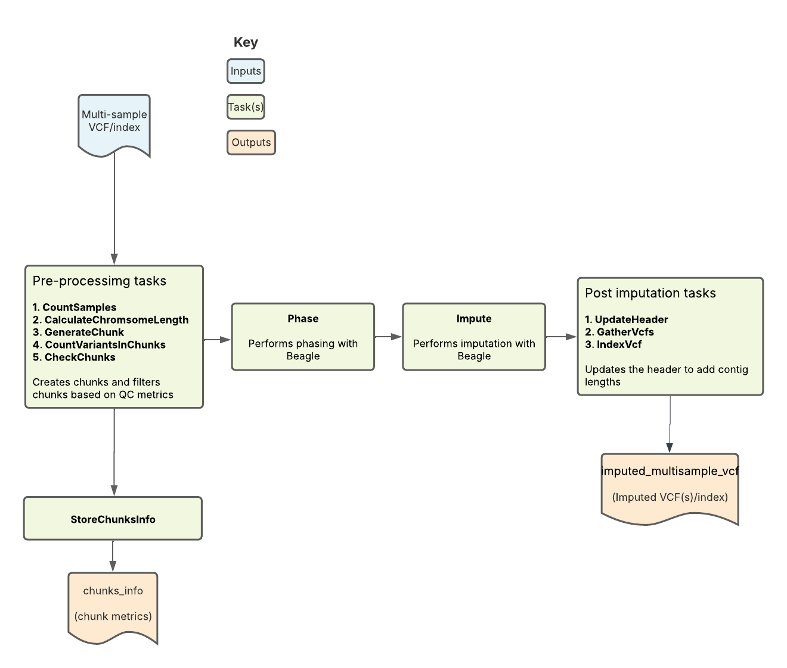

 
# Imputation Overview
 
|                                                  Pipeline Version                                                  | Date Updated |        Documentation Author        |                             Questions or Feedback                              |
|:------------------------------------------------------------------------------------------------------------------:|:------------:|:----------------------------------:|:------------------------------------------------------------------------------:|
| [ImputationBeagle_v2.0.0](https://github.com/broadinstitute/warp/releases?q=ImputationBeagle_v2.0.0&expanded=true) | August, 2025 | Terra Scientific Pipeline Services | Please [file an issue in WARP](https://github.com/broadinstitute/warp/issues). |
 
## Introduction to the Array Imputation pipeline
The Array Imputation pipeline imputes missing genotypes from either a multi-sample VCF or an array of single-sample VCFs using a large genomic reference panel. It uses [Beagle](https://faculty.washington.edu/browning/beagle/beagle.html) as the imputation tool. Overall, the pipeline filters, phases, and performs imputation on a multi-sample VCF. It outputs the imputed VCF along with key imputation metrics.
 

## Set-up
 
### Workflow installation and requirements

The [Array Imputation workflow](https://github.com/broadinstitute/warp/blob/develop/pipelines/wdl/arrays/imputation_beagle/ImputationBeagle.wdl) is written in the Workflow Description Language (WDL) and can be deployed using a WDL-compatible execution engine like [Cromwell](https://github.com/broadinstitute/cromwell), a GA4GH compliant, flexible workflow management system that supports multiple computing platforms.
To identify the latest workflow version and release notes, please see the Imputation workflow [changelog](https://github.com/broadinstitute/warp/blob/develop/pipelines/wdl/arrays/imputation_beagle/ImputationBeagle.changelog.md).
The latest release of the workflow, example data, and dependencies are available from the WARP releases page. To discover and search releases, use the WARP command-line tool [Wreleaser](https://github.com/broadinstitute/warp/tree/develop/wreleaser).

Using the Array Imputation pipeline
This pipeline is used by the [All of Us + AnVIL Imputation Service](http://allofus-anvil-imputation.terra.bio). If you choose to use this service, you can impute your samples against the 515,000+ genomes in the All of Us + AnVIL reference panel, which can provide greater accuracy at more sites.

:::tip Try the Imputation pipeline in Terra
You can alternatively run the pipeline with your own panel, using this [WDL](https://github.com/broadinstitute/warp/blob/develop/pipelines/wdl/arrays/imputation_beagle/ImputationBeagle.wdl).
:::
 
### Input descriptions
The table below describes each of the Array Imputation pipeline inputs. The workflow requires a  multi-sample VCF. These samples must be from the same species and genotyping chip.

For examples of how to specify each input in a configuration file, as well as cloud locations for different example input files, see the [example input configuration file (JSON)](https://github.com/broadinstitute/warp/blob/develop/pipelines/wdl/arrays/imputation_beagle/test_inputs/Plumbing/NA12878_x10_hg38_arrays.json).

 
| Input name                  | Description                                                                                              | Type             |
|-----------------------------|----------------------------------------------------------------------------------------------------------|------------------|
| ChunkLength                 | Size of chunks; default set to 25 MB.                                                                    | Int              |                                                                                                      
| chunkOverlaps               | Padding adding to the beginning and end of each chunk to reduce edge effects; default set 5 MB.          | Int              |                                                                                                     
| sample_chunk_size           | Number of samples to chunk by when processing (default: 1,000)                                           | Int              |                                                                                                      
| multi_sample_vcf            | Merged VCF containing multiple samples; can also use an array of individual VCFs.                        | File             |                                                                                                     
| ref_dict                    | Reference dictionary.                                                                                    | File             |                                                                                                     
| contigs                     | Array of allowed contigs/chromosomes to process                                                          | Array of strings |                                                                                         
| reference_panel_path_prefix | Path to the cloud storage containing the reference panel files for all contigs.                          | String           |                                                                                                   
| genetics_maps_path          | Path to the cloud storage containing the genetic map files for all contigs.                              | File             |
| output_callset_name         | Output callset name.                                                                                     | String           |
| bcf_suffix                  | File extension used for the BED in the reference panel.                                                  | String           |
| bref3_suffix                | File extension used for the BREF3 in the reference panel.                                                | String           |
| error_count_override        | Override for error check on chunk qc (set to 0 for workflow to continue no matter how many errors exist) | Int              |
| min_dr2_for_inclusion       | Min value of DR2 to include in final output (default: 0.0)                                               |

 
## Workflow tasks and tools

The [Array Imputation workflow](https://github.com/broadinstitute/warp/blob/develop/pipelines/wdl/arrays/imputation_beagle/ImputationBeagle.wdl) imports a series of tasks from the ImputationTasks WDL and ImputationBeagleTasks WDL, which are hosted in the Broad [tasks library](https://github.com/broadinstitute/warp/tree/develop/tasks/wdl). The table below describes each workflow task, including the task name, tools, relevant software and non-default parameters. 

| Task name (alias) in WDL             | Tool                                                      | Software                           | Description                                                                                                                                                                                                                                                                                                                       |
|--------------------------------------|-----------------------------------------------------------|------------------------------------|-----------------------------------------------------------------------------------------------------------------------------------------------------------------------------------------------------------------------------------------------------------------------------------------------------------------------------------|
| CountSamples                         | query                                                     | bcftools                           | Uses the merged input VCF file to count the number of samples and output a TXT file containing the count.                                                                                                                                                                                                                         |
| CreateVcfIndex                       | index                                                     | bcftools                           | Creates index of input multisample vcf                                                                                                                                                                                                                                                                                            |
| CalculateContigsToProcess            | Determine which contigs will be processed by the workflow | multi_sample_vcf, contigs          | Extracts contigs from input VCF and filters by allowed contigs                                                                                                                                                                                                                                                                    |
| CalculateChromsomeLength             | grep                                                      | bash                               | Reads chromosome lengths from the reference dictionary and uses these to generate chunk intervals for the GenerateChunk task.                                                                                                                                                                                                     |
| GenerateChunk                        | SelectVariants                                            | GATK                               | Performs site filtering by selecting SNPs only and excluding InDels, removing duplicate sites from the VCF, selecting biallelic variants, excluding symbolic/mixed variants, and removing sites with a maximum fraction of samples with no-call genotypes greater than 0.1. Also subsets to only a specified chunk of the genome. |
| CountVariantsInChunks                | CountVariants, intersect                                  | GATK, bedtools                     | Counts variants in the filtered VCF file; Returns the number of chunks in the array and in the reference file.                                                                                                                                                                                                                    |
| CheckChunks                          | convert                                                   | bcftools                           | Confirms that there are no chunks where less than 3 sites or less than 50% of the sites in the array are also in the reference panel; if valid, creates a new VCF output.                                                                                                                                                         |
| StoreChunksInfo                      |                                                           | R                                  | Gathers all results from CheckChunks                                                                                                                                                                                                                                                                                              |
| ErrorWithMessageIfErrorCountNotZero  |                                                           | bash                               | Fails workflow if any chunks fail qc check.  Can be overridden with error_count_override input                                                                                                                                                                                                                                    |
| SelectSamplesWithCut                 | cut                                                       | bash                               | Chunks vcf by sample_chunk_size if more than sample_chunk_size samples exist in input vcf                                                                                                                                                                                                                                         |
| Phase                                |                                                           | Beagle                             | Performs phasing on the filtered, validated VCF                                                                                                                                                                                                                                                                                   |
| Impute                               |                                                           | Beagle                             | Performs imputation on the prephased VCF;                                                                                                                                                                                                                                                                                         |
| LocalizeAndSubsetVcfToRegion         | SelectVariants                                            | GATK                               | Remove padding from imputed vcf                                                                                                                                                                                                                                                                                                   |
| QuerySampleChunkedVcfForReannotation | query                                                     | bcftools                           | Query DS, AP1, AP2 from sample chunked VCFs to be used when merging samples together                                                                                                                                                                                                                                              |
| RemoveAPAnnotations                  | annotate                                                  | bcftools                           | Remove AP1, AP2 annotations to reduce file size now that they’re no longer needed                                                                                                                                                                                                                                                 |
| RecalculateDR2AndAFChunked           |                                                           | python                             | Used query output to summarize DS, AP1, AP2 values                                                                                                                                                                                                                                                                                |
| MergeSampleChunksVcfsWithPaste       | Paste, view                                               | Bash, bcftools                     | Merge sample chunked VCFs                                                                                                                                                                                                                                                                                                         |
| IndexMergedSampleChunksVcfs          | index                                                     | bcftools                           | Creates index for sample chunk merged VCF                                                                                                                                                                                                                                                                                         |
| AggregateChunkedDR2AndAF             |                                                           | python                             | Take summarized DS, AP1, AP2 data and calculate AF and DR2                                                                                                                                                                                                                                                                        |
| ReannotateDR2AndAF                   | annotate                                                  | bcftools                           | Reannotate DR2 and AF for sample chunk merged vcf                                                                                                                                                                                                                                                                                 |
| FilterVcfByDR2                       | Filter variants by DR2 threshold                          | imputed VCF, min_dr2_for_inclusion | Removes variants below provided min_dr2_for_inclusion value                                                                                                                                                                                                                                                                       |
| UpdateHeader                         | UpdateVCFSequenceDictionary                               | GATK                               | Updates the header of the imputed VCF; adds contig lengths                                                                                                                                                                                                                                                                        |
| GatherVcfsNoIndex                    | GatherVCFs                                                | GATK                               | Gathers the array of imputed VCFs and merges them into one VCF output.                                                                                                                                                                                                                                                            |
| CreateIndexForGatheredVcf            | index                                                     | bcftools                           | Creates index for final output vcf                                                                                                                                                                                                                                                                                                |

## Workflow outputs

The table below summarizes the workflow outputs. If running the workflow on Cromwell, these outputs are found in the task execution directory.
 
| Output name                   | Description                                                                                                            | Type  |
|-------------------------------|------------------------------------------------------------------------------------------------------------------------|-------|
| imputed_multisample_vcf       | VCF from the CreateIndexForGatheredVcf task; contains imputed variants as well as missing variants from the input VCF. | VCF   |
| imputed_multisample_vcf_index | Index file for VCF from the CreateIndexForGatheredVcf task.                                                            | Index |
| chunks_info                   | TSV from StoreChunksInfo task; contains the chunk intervals as well as the number of variants in the array.            | TSV   |

 
## Important notes
 
- Runtime parameters are optimized for Broad's Google Cloud Platform implementation.

## Citing the Imputation Pipeline

If you use the Imputation Pipeline in your research, please consider citing our preprint:

Degatano, K., Awdeh, A., Cox III, R.S., Dingman, W., Grant, G., Khajouei, F., Kiernan, E., Konwar, K., Mathews, K.L., Palis, K., et al. Warp Analysis Research Pipelines: Cloud-optimized workflows for biological data processing and reproducible analysis. Bioinformatics 2025; btaf494. https://doi.org/10.1093/bioinformatics/btaf494
 
## Contact us

Help us make our tools better by [filing an issue in WARP](https://github.com/broadinstitute/warp/issues); we welcome pipeline-related suggestions or questions.
 
## Licensing
 
Copyright Broad Institute, 2020 | BSD-3
 
The workflow script is released under the **WDL open source code license (BSD-3)** (full license text at https://github.com/broadinstitute/warp/blob/master/LICENSE). However, please note that the programs it calls may be subject to different licenses. Users are responsible for checking that they are authorized to run all programs before running this script.
 
- [GATK](https://github.com/broadinstitute/gatk/blob/master/LICENSE.TXT)
- [Picard](https://github.com/broadinstitute/picard/blob/master/LICENSE.txt)
- [Beagle](https://faculty.washington.edu/browning/beagle/beagle.html)
- [bcftools](https://github.com/samtools/bcftools/blob/develop/LICENSE)
- [vcftools](http://vcftools.sourceforge.net/license.html)
 
 

