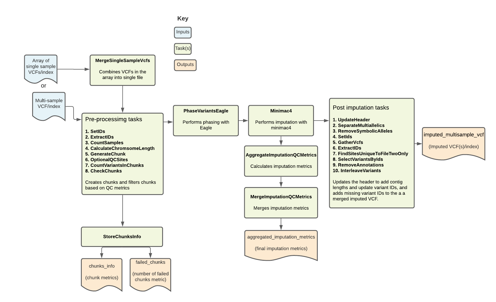

 
# Imputation Overview
 
| Pipeline Version | Date Updated | Documentation Author | Questions or Feedback |
| :----: | :---: | :----: | :--------------: |
| [Imputation_v1.1.12](https://github.com/broadinstitute/warp/releases?q=Imputation_v1.0.0&expanded=true) | February, 2024 | Elizabeth Kiernan | Please [file an issue in WARP](https://github.com/broadinstitute/warp/issues). |
 
## Introduction to the Imputation pipeline
The Imputation pipeline imputes missing genotypes from either a multi-sample VCF or an array of single sample VCFs using a large genomic reference panel. It is based on the [Michigan Imputation Server pipeline](https://imputationserver.readthedocs.io/en/latest/pipeline/). Overall, the pipeline filters, phases, and performs imputation on a multi-sample VCF. It outputs the imputed VCF along with key imputation metrics.
 

## Set-up
 
### Workflow installation and requirements
 
The [Imputation workflow](https://github.com/broadinstitute/warp/blob/develop/pipelines/wdl/arrays/imputation/Imputation.wdl) is written in the Workflow Description Language (WDL) and can be deployed using a WDL-compatible execution engine like  [Cromwell](https://github.com/broadinstitute/cromwell), a GA4GH compliant, flexible workflow management system that supports multiple computing platforms.
 
To identify the latest workflow version and release notes, please see the Imputation workflow [changelog](https://github.com/broadinstitute/warp/blob/develop/pipelines/wdl/arrays/imputation/Imputation.changelog.md). 
 
The latest release of the workflow, example data, and dependencies are available from the WARP releases page. To discover and search releases, use the WARP command-line tool [Wreleaser](https://github.com/broadinstitute/warp/tree/develop/wreleaser).

:::tip Try the Imputation pipeline in Terra
You can run the pipeline in the [Imputation workspace](https://app.terra.bio/#workspaces/warp-pipelines/Imputation) on [Terra](https://app.terra.bio), a cloud-optimized scalable bioinformatics platform. The workspace contains a preconfigured workflow, example inputs, instructions, and cost-estimates. 
:::
 
### Input descriptions
The table below describes each of the Imputation pipeline inputs. The workflow requires **either** a multi-sample VCF or an array of single sample VCFs. These samples must be from the same species and genotyping chip.

**You must have two or more samples to run the pipeline.** 

However, the pipeline is cost-optimized for between 100 and 1,000 samples. After 1,000 samples, the cost per sample no longer decreases (see the [Price estimates](#price-estimates) section). 

For examples of how to specify each input in a configuration file, as well as cloud locations for different example input files, see the [example input configuration file (JSON)](https://github.com/broadinstitute/warp/blob/develop/pipelines/wdl/arrays/imputation/example_inputs.json).

 
| Input name | Description | Type |
| --- | --- | --- |
| ChunkLength | Size of chunks; default set to 25 MB. | Int |
| chunkOverlaps | Padding adding to the beginning and end of each chunk to reduce edge effects; default set 5 MB. |  Int |
| multi_sample_vcf | Merged VCF containing multiple samples; can also use an array of individual VCFs.  | File |
| multi_sample_vcf_index | Merged index for the merged VCF; can also use an array of index files if using an array of VCFs. | Index |
| single_sample_vcfs | Array of VCFs, one for each sample; can be used in lieu of a merged VCF containing all samples. | Array of files |
| single_sample_vcf_indices | Array of indices, one for each sample; can be used in lieu of a merged index for a multi-sample VCF. | Array of index files |
| perform_extra_qc_steps | Boolean to indicate if additional QC steps should be performed before imputing; when true, sites with call rates below 95% or low Hardy Weinberg Equilibrium (HWE) p-value are removed before imputation. Default is set to false. | Boolean | 
| optional_qc_max_missing | Optional float used for the additional QC steps that sets a max threshold for the maximum rate of missing data allowed for sites; default set to 0.05. | Float | 
| optional_qc_hwe | Optional HWE p-value when performing additional QC steps; default set to 0.000001. | Float |
| ref_dict | Reference dictionary. | File |
| contigs | Array of strings defining which contigs (chromsomes) should be used for the reference panel. | Array of strings |
| reference_panel_path | Path to the cloud storage containing the reference panel files for all contigs. | String
| genetics_maps_eagle | Genetic map file for phasing.| File |
| output_callset_name | Output callset name. | String |
| split_output_to_single_sample | Boolean to split out the final combined VCF to individual sample VCFs; set to false by default. | Boolean | 
| merge_ssvcf_mem_mb | Optional integer specifying memory allocation for MergeSingleSampleVcfs (in MB); default is 3000. | Int | 
| frac_well_imputed_threshold | Threshold for the fraction of well-imputed sites; default set to 0.9. | Float | 
| chunks_fail_threshold | Maximum threshold for the number of chunks allowed to fail; default set to 1. | Float | 
| vcf_suffix | File extension used for the VCF in the reference panel. | String |
| vcf_index_suffix | File extension used for the VCF index in the reference panel. | String |
| bcf_suffix | File extension used for the BCF in the reference panel. | String |
| bcf_index_suffix | File extension used for the BCF index in the reference panel. | String |
| m3vcf_suffix | File extension used for the M3VCF in the reference panel. | String |
 
### Imputation reference panel
 
The Imputation workflow's reference panel files are hosted in a [public Google Bucket](https://console.cloud.google.com/storage/browser/gcp-public-data--broad-references/hg19/v0/1000G_reference_panel;tab=objects?prefix=&forceOnObjectsSortingFiltering=false). For the cloud-path (URI) to the files, see the [example input configuration](https://github.com/broadinstitute/warp/blob/develop/pipelines/wdl/arrays/imputation/example_inputs.json).

#### Generation of the modified 1000 Genomes reference
Initial tests of the Imputation workflow followed by assessments of polygenic risk score revealed that disease risk scores were lower when computed from imputed array data as opposed to whole-genome sequencing data. This was found to be due to incorrectly genotyped sites in the 1000G reference panel. As a result, the 1000G reference files were modified for the Imputation pipeline as described in the [references overview](./references_overview.md). You can view the original, unmodified 1000G VCFs [here](https://ftp.1000genomes.ebi.ac.uk/vol1/ftp/release/20130502/).

:::tip X-chromosome not imputed
Currently, the pipeline does not perform imputation on the X-chromosome and no reference panels are needed for the X-chromosome. Any sites identified on the X-chromosome after array analysis are merged back into the VCF after the imputation steps. 
:::

 
## Workflow tasks and tools
 
The [Imputation workflow](https://github.com/broadinstitute/warp/blob/develop/pipelines/wdl/arrays/imputation/Imputation.wdl) imports a series of tasks from the ImputationTasks WDL, which is hosted in the Broad [tasks library](https://github.com/broadinstitute/warp/tree/develop/tasks/broad). The table below describes each workflow task, including the task name, tools, relevant software and non-default parameters. 
 
| Task name (alias) in WDL | Tool | Software | Description |
| --- | --- | --- | --- |
| MergeSingleSampleVcfs | merge |  [bcftools](http://samtools.github.io/bcftools/bcftools.html) | If an array of single sample VCFs are pipeline input, the task merges them into a single VCF.  |
| SetIDs (SetIdsVcfToImpute) | annotate | [bcftools](http://samtools.github.io/bcftools/bcftools.html), bash | Adds variant IDs to the combined input VCF to create a new VCF. Sorts the alleles for a given variant ID so that REF:ALT is lexicographically consistent across IDs. |
| ExtractIDs (ExtractIdsVcfToImpute) | query | [bcftools](http://samtools.github.io/bcftools/bcftools.html) | Extracts the variant IDs from the SortIDs output VCF to a new “.ids” file so that any missing variants can be added back to the final VCF after imputation. |
| CountSamples | query | [bcftools](http://samtools.github.io/bcftools/bcftools.html) | Uses the merged input VCF file to count the number of samples and output a TXT file containing the count. |
| CalculateChromsomeLength | grep | bash | Reads chromosome lengths from the reference dictionary and uses these to generate chunk intervals for the GenerateChunk task. | 
| GenerateChunk | SelectVariants  | [GATK](https://gatk.broadinstitute.org/hc/en-us) | Performs site filtering by selecting SNPs only and excluding InDels, removing duplicate sites from the VCF, selecting biallelic variants, excluding symbolic/mixed variants, and removing sites with a maximum fraction of samples with no-call genotypes greater than 0.1. Also subsets to only a specified chunk of the genome.|
| OptionalQCSites | --- | [vcftools](http://vcftools.sourceforge.net/), [bcftools](http://samtools.github.io/bcftools/bcftools.html) | If the boolean extra_qc_steps is true, performs additional QC steps; excludes sites with more than 95% missing data and assesses sites for Hardy Weinberg Equilibrium, excluding any site with a p-value less than 0.000001.| 
| CountVariantsInChunks | CountVariants | [GATK](https://gatk.broadinstitute.org/hc/en-us) | Counts variants in the filtered VCF file; Returns the number of chunks in the array and in the reference file.  | 
| CheckChunks | convert, index  | [bcftools](http://samtools.github.io/bcftools/bcftools.html) | Confirms that there are no chunks where less than 3 sites or less than 50% of the sites in the array are also in the reference panel; if valid, creates a new VCF output. |
| PhaseVariantsEagle | eagle | [Eagle2](https://alkesgroup.broadinstitute.org/Eagle/Eagle_manual.html) | Performs phasing on the filtered, validated VCF using the phased reference panel; allows for REF/ALT swaps |
| Minimac4 | Minimac4 | [minimac4](https://genome.sph.umich.edu/wiki/Minimac4_Documentation), [bcftools](http://samtools.github.io/bcftools/bcftools.html) | Performs imputation on the prephased VCF; parameterized to include variants that were genotyped but NOT in the reference panel and to specify a minRatio of 0.00001. |
| AggregateImputationQCMetrics | --- | R | Uses an R script to take calculate metrics from minimac4 output info file, including total sites, total sites with variants, and sites with an [R2 metric](https://genome.sph.umich.edu/wiki/Minimac3_Info_File) of 0.3 (total_sites_r2_gt_0.3); adds the metrics to a new TSV output. |
| UpdateHeader | UpdateVCFSequenceDictionary | [GATK](https://gatk.broadinstitute.org/hc/en-us) | Updates the header of the imputed VCF; adds contig lengths |
| SeparateMultiallelics | norm | [bcftools](http://samtools.github.io/bcftools/bcftools.html) | Splits multiallelic sites in the imputed VCF into biallelic records. |
| RemoveSymbolicAlleles | SelectVariants | [GATK](https://gatk.broadinstitute.org/hc/en-us) | Removes SYMBOLIC alleles from the output VCF of the SeparateMultiallelics. |
| SetIds | annotate, index | [bcftools](http://samtools.github.io/bcftools/bcftools.html) | Sorts the alleles in the variant ID from the RemoveSymbolicAllele output VCF so that REF:ALT is lexicographically consistent across IDs. |
| GatherVcfs | GatherVCFs | [GATK](https://gatk.broadinstitute.org/hc/en-us) | Gathers the array of imputed VCFs and merges them into one VCF output. |
| ExtractIDs | query | [bcftools](http://samtools.github.io/bcftools/bcftools.html) | Extracts the variant IDs from the imputed VCF. | 
| FindSitesUniqueToFileTwoOnly | --- | Ubuntu | Uses the IDs extracted from imputed VCF and those extracted from original VCF to identify missing variant sites from the original VCF; outputs the IDs to a file. |
| SelectVariantsByIds | SelectVariants | [GATK](https://gatk.broadinstitute.org/hc/en-us) | Selects from the original input VCF any sites which were not included in the imputed VCF. |
| RemoveAnnotations | annotate | [bcftools](http://samtools.github.io/bcftools/bcftools.html) | Removes the FORMAT and INFO annotations from the new VCF generated by the SelectVariantsbyIds task that contains the missing variants.  |
| InterleaveVariants | MergeVCFs | [GATK](https://gatk.broadinstitute.org/hc/en-us) | Combines the missing variants from the original VCF and the imputed variants into a new VCF. | 
| MergeImputationQCMetrics | --- | R | Uses an R script to calculate the fraction of well-imputed sites and outputs them to a TXT file; the fraction of "well-imputed" sites is based on the minimac reported R2 metric, with R2>0.3 being "well-imputed." Since homomorphic sites lead to an R2 value of 0, we report the fraction of sites with any variation which are well-imputed in addition to the fraction of total sites. |
| StoreChunksInfo | --- | R | Uses an R script to record the coordinates of each imputation chunk, number of sites in the original array, and number of sites in the original array which are also in the reference panel, for each imputation chunk. |
| SplitMultiSampleVcf | split | [bcftools](http://samtools.github.io/bcftools/bcftools.html) | If boolean is set to true, will split the interleave variants VCF into single sample VCFs. | 
 
## Workflow outputs

The table below summarizes the workflow outputs. If running the workflow on Cromwell, these outputs are found in the task execution directory.
 
| Output name | Description | Type |
| --- | --- | --- |
| imputed_single_sample_vcfs | Array of imputed single sample VCFs from the SplitMultiSampleVcf task. | Array |
| imputed_single_sample_vcf_indices | Array of indices for the imputed VCFs from the SplitMultiSampleVcf task | Array |
| imputed_multisample_vcf | VCF from the InterleaveVariants task; contains imputed variants as well as missing variants from the input VCF. | VCF |
| imputed_multisample_vcf_index | Index file for VCF from the InterleaveVariants task. | Index |
| aggregated_imputation_metrics | Aggregated QC metrics from the MergeImputationQcMetrics task; reports the fraction of sites well-imputed and outputs to TXT file; fraction of "well-imputed" is based on the minimac reported R2 metric, with R2>0.3 being "well-imputed." Since homomorphic sites lead to an R2 value of 0, we report the fraction of sites with any variation which are well-imputed in addition to the fraction of total sites. | TXT |
| chunks_info | TSV from StoreChunksInfo task; contains the chunk intervals as well as the number of variants in the array.  | TSV |
| failed_chunks | File with the failed chunks from the StoreChunksInfo task. | File |
| n_failed_chunks | File with the number of failed chunks from the StoreChunksInfo task. | File |
 
## Important notes
 
- Runtime parameters are optimized for Broad's Google Cloud Platform implementation.

## Price estimates
The pipeline is cost-optimized for between 100 and 1,000 samples, where the cost per sample continues to decrease until 1,000 samples are run. Cost estimates per sample are provided below:

| Cohort size ( # samples) | Cost per sample ($) |
| --- | --- | 
| 1 | 8 |
| 10 | 0.8 | 
| 100 | 0.11 | 
| 1000 | 0.024 |
| 13.5 K | 0.025 |

## Citing the Imputation Pipeline

If you use the Imputation Pipeline in your research, please consider citing our preprint:

Degatano, K., Awdeh, A., Cox III, R.S., Dingman, W., Grant, G., Khajouei, F., Kiernan, E., Konwar, K., Mathews, K.L., Palis, K., et al. Warp Analysis Research Pipelines: Cloud-optimized workflows for biological data processing and reproducible analysis. Bioinformatics 2025; btaf494. https://doi.org/10.1093/bioinformatics/btaf494
 
## Contact us

Help us make our tools better by [filing an issue in WARP](https://github.com/broadinstitute/warp/issues); we welcome pipeline-related suggestions or questions.
 
## Licensing
 
Copyright Broad Institute, 2020 | BSD-3
 
The workflow script is released under the **WDL open source code license (BSD-3)** (full license text at https://github.com/broadinstitute/warp/blob/master/LICENSE). However, please note that the programs it calls may be subject to different licenses. Users are responsible for checking that they are authorized to run all programs before running this script.
 
- [GATK](https://github.com/broadinstitute/gatk/blob/master/LICENSE.TXT)
- [Picard](https://github.com/broadinstitute/picard/blob/master/LICENSE.txt)
- [Eagle2](https://alkesgroup.broadinstitute.org/Eagle/#x1-340007)
- [minimac4](https://github.com/statgen/Minimac4/blob/master/LICENSE)
- [bcftools](https://github.com/samtools/bcftools/blob/develop/LICENSE)
-[vcftools](http://vcftools.sourceforge.net/license.html)
 
 

