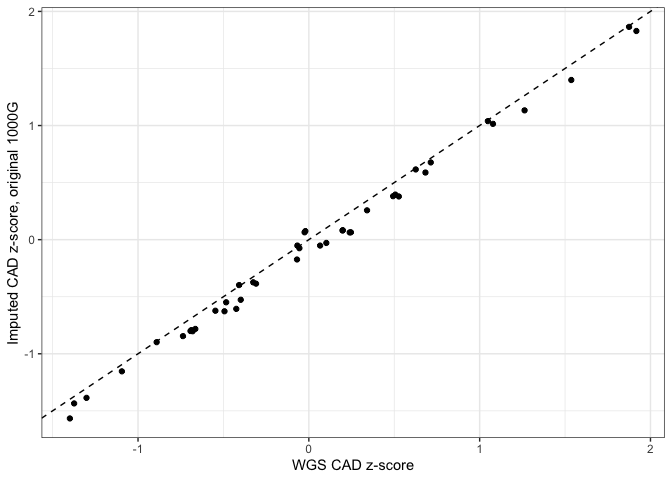
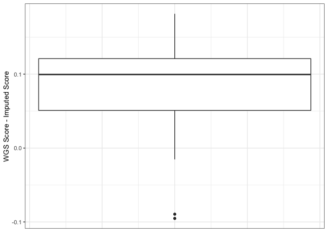
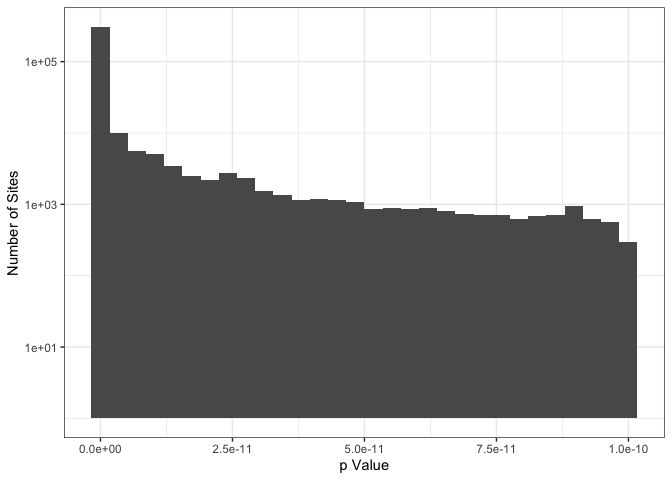
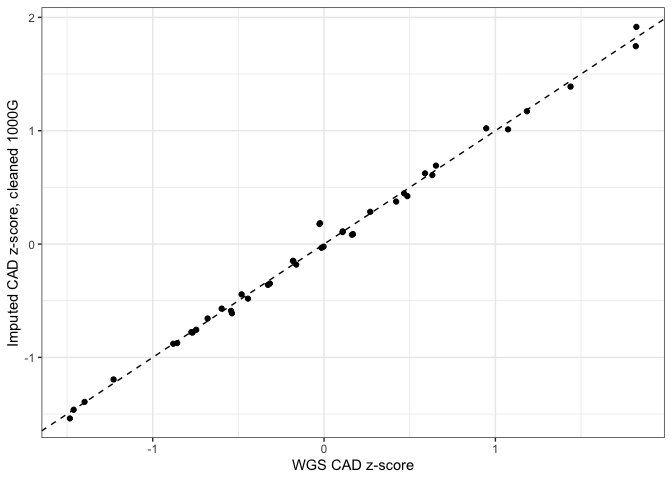
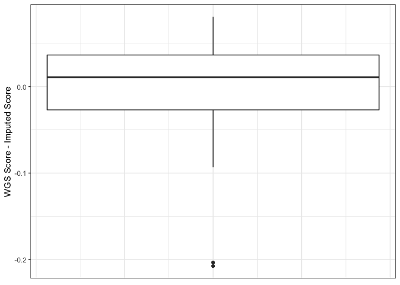
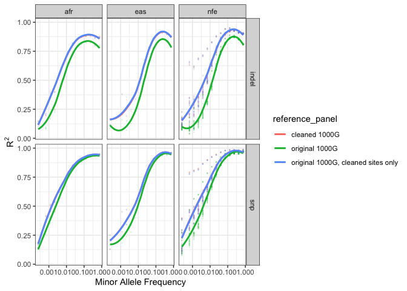

# Creating the Imputation Pipeline's Modified 1000 Genomes Reference

## Background
Initial tests of the Imputation workflow followed by assessments of polygenic risk score (PRS) revealed that risk scores for coronary artery disease (CAD) were lower when computed from imputed array data as opposed to whole-genome sequencing data (see figures below).

The systematic difference was due to a single site (10:104952499) which had a relatively high effect weight in the CAD weights file used for the PRS analysis. When using [gnomAD V2](https://gnomad.broadinstitute.org/) for comparison, the site appears to be incorrectly genotyped in the 1000G reference. Whereas the site's allele frequency is 0.72 in 1000G, it is only 0.086 in gnomAD V2. 

This finding suggests that some 1000G sites may be systematically incorrectly genotyped. As a result, the 1000G reference files were modified for the Imputation pipeline as described below. You can view the original, unmodified 1000G VCFs [here](https://ftp.1000genomes.ebi.ac.uk/vol1/ftp/release/20130502/). 

## Reference modification 
To remove putative incorrect sites from the 1000G reference panel, allele frequencies were compared between it and gnomAD V2. First, the [BuildAFComparisonTable workflow](https://github.com/broadinstitute/warp/tree/develop/scripts/BuildAFComparisonTable.wdl) was used to create a table of the allele frequencies for both reference panels. Then, the [FilterAFComparisonTable workflow](https://github.com/broadinstitute/warp/tree/develop/scripts/FilterAFComparisonTable.wdl) was applied to compare the observed number of alleles in 1000G to the expected number of alleles set by gnomAD V2 using a two-sided binomial p-value. 

Since gnomAD reports non-Finnish European allele frequencies while 1000G reports European allele frequencies, p-values were calculated both including and excluding European samples. If both p-values were less than 1e-10, then the site was flagged as problematic. After identifying the putative problematic sites, the [RemoveBadSitesById workflow](https://github.com/broadinstitute/warp/tree/develop/scripts/RemoveBadSitesById.wdl) was used to remove them, generating a cleaned 1000G reference panel. 

This cleaning removes 359,369, or about 0.8% of sites from 1000G reference. In the histogram below, only sites that were were flagged as incorrect are shown. The vast majority of flagged sites have p-values that are much lower than the threshold.

As can be seen below, using this "cleaned" 1000G removes the systematic difference between imputed and WGS scores.

The comparison below shows that the improvement is due only to the removal of sites that were poorly imputed with the original 1000G reference, the remaining sites are not being imputed at a higher quality than they were with the original 1000G reference. 

A public copy of the cleaned reference can be found at gs://broad-gotc-test-storage/imputation/1000G_reference_panel/ as shown in the Imputation workflow's [example configuration file](https://github.com/broadinstitute/warp/blob/master/pipelines/wdl/arrays/imputation/example_inputs.json) (JSON).

## Acknowledgments and Questions
This technical report was contributed by the Methods Team of the Broad Data Sciences Platform. 

For questions or additional information about the Imputation pipeline's reference generation, email [Chris Kachullis](mailto:ckachuli@broadinstitute.org).