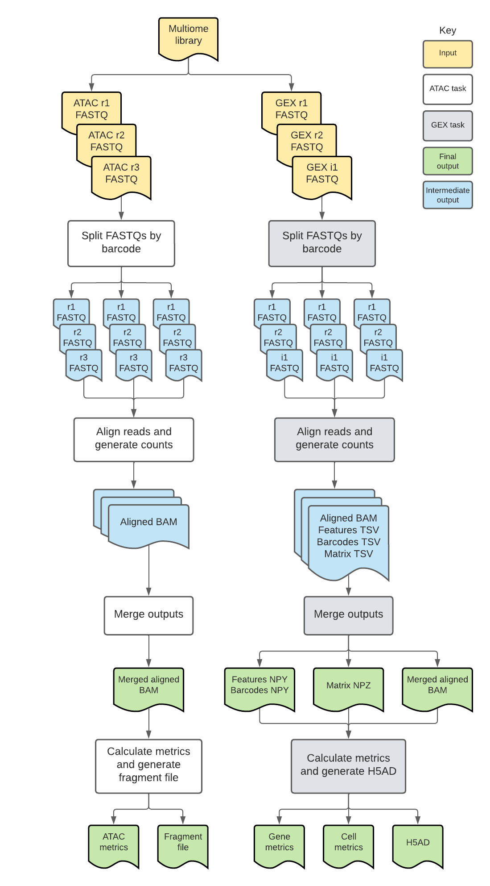

# Multiome Overview

| Pipeline Version | Date Updated | Documentation Author | Questions or Feedback |
| :----: | :---: | :----: | :--------------: |
| [Multiome v5.11.0](https://github.com/broadinstitute/warp/releases) | February, 2025 | WARP Pipelines | Please [file an issue in WARP](https://github.com/broadinstitute/warp/issues).  |

## Introduction to the Multiome workflow

Multiome is an open-source, cloud-optimized pipeline developed in collaboration with members of the [BRAIN Initiative](https://braininitiative.nih.gov/) (BICCN and [BICAN](https://brainblog.nih.gov/brain-blog/brain-issues-suite-funding-opportunities-advance-brain-cell-atlases-through-centers) Sequencing Working Group) and [SCORCH](https://nida.nih.gov/about-nida/organization/divisions/division-neuroscience-behavior-dnb/basic-research-hiv-substance-use-disorder/scorch-program) (see [Acknowledgements](#acknowledgements) below). It supports the processing of 10x 3' single-cell and single-nucleus gene expression (GEX) and chromatin accessibility (ATAC) data generated with the [10x Genomics Multiome assay](https://www.10xgenomics.com/products/single-cell-multiome-atac-plus-gene-expression).

The workflow is a wrapper WDL script that calls two subworkflows: the [Optimus workflow](../Optimus_Pipeline/README) for single-cell GEX data and the [ATAC workflow](../ATAC/README) for single-cell ATAC data. 

The GEX component corrects cell barcodes (CBs) and Unique Molecular Identifiers (UMIs), aligns reads to the genome, calculates per-barcode and per-gene quality metrics, and produces a raw cell-by-gene count matrix. It also produces [library-level metrics](../Optimus_Pipeline/Library-metrics.md) calculated from STARsolo aligner metrics. 

The ATAC component corrects CBs, aligns reads to the genome, calculates [per-barcode quality metrics](../ATAC/count-matrix-overview.md), [library-level metrics](../ATAC/library-metrics.md) and produces a fragment file.

The wrapper WDL is available in the WARP repository (see the [code here](https://github.com/broadinstitute/warp/blob/develop/pipelines/skylab/multiome/Multiome.wdl)).

## Quickstart table
The following table provides a quick glance at the Multiome pipeline features:

| Pipeline features | Description | Source |
|--- | --- | --- |
| Assay type | 10x single cell or single nucleus gene expression (GEX) and ATAC | [10x Genomics](https://www.10xgenomics.com) |
| Overall workflow  | Barcode correction, read alignment, gene and fragment quantification |
| Workflow language | WDL 1.0 | [openWDL](https://github.com/openwdl/wdl) |
| Genomic Reference Sequence | GRCh38 human genome primary sequence | GENCODE [human reference files](https://www.gencodegenes.org/human/release_43.html)|
| Gene annotation reference (GTF) | Reference containing gene annotations | GENCODE [human GTF](https://ftp.ebi.ac.uk/pub/databases/gencode/Gencode_human/release_43/gencode.v43.annotation.gtf.gz) |
| Aligners | STARsolo (GEX), BWA-mem2 (ATAC) | [Kaminow et al. 2021](https://www.biorxiv.org/content/10.1101/2021.05.05.442755v1), [Vasimuddin et al. 2019](https://ieeexplore.ieee.org/document/8820962) |
| Transcript and fragment quantification | STARsolo (GEX), SnapATAC2 (ATAC) | [Kaminow et al. 2021](https://www.biorxiv.org/content/10.1101/2021.05.05.442755v1), [SnapATAC2](https://kzhang.org/SnapATAC2/) |
| Data input file format | File format in which sequencing data is provided | [FASTQ](https://academic.oup.com/nar/article/38/6/1767/3112533) |
| Data output file format | File formats in which Multiome output is provided | [BAM](http://samtools.github.io/hts-specs/) and [h5ad](https://anndata.readthedocs.io/en/latest/) |
| Library-level metrics | Library-level metrics produced by the Optimus and ATAC workflows | [Optimus ibrary-level metrics](../Optimus_Pipeline/Library-metrics.md) and [ATAC library-level metrics](../ATAC/library-metrics.md)| 

## Set-up

### Multiome installation

To download the latest Multiome release, see the release tags prefixed with "Multiome" on the WARP [releases page](https://github.com/broadinstitute/warp/releases). All Multiome pipeline releases are documented in the [Multiome changelog](https://github.com/broadinstitute/warp/blob/develop/pipelines/skylab/multiome/Multiome.changelog.md). 

To discover and search releases, use the WARP command-line tool [Wreleaser](https://github.com/broadinstitute/warp/tree/master/wreleaser).

If you’re running a Multiome workflow version prior to the latest release, the accompanying documentation for that release may be downloaded with the source code on the WARP [releases page](https://github.com/broadinstitute/warp/releases) (see the source code folder).

Multiome can be deployed using [Cromwell](https://cromwell.readthedocs.io/en/stable/), a GA4GH-compliant, flexible workflow management system that supports multiple computing platforms. The workflow can also be run in [Terra](https://app.terra.bio), a cloud-based analysis platform. The [Multiome public workspace](https://app.terra.bio/#workspaces/warp-pipelines/Multiome) on Terra contains the Multiome workflow, workflow configuration, required reference data and other inputs, and example testing data.

## Inputs

| Input name | Description | Type |
| --- | --- | --- |
| input_id | Unique identifier describing the biological sample or replicate that corresponds with the FASTQ files; can be a human-readable name or UUID. | String |
| cloud_provider | String describing the cloud provider that should be used to run the workflow; value should be "gcp" or "azure". | String |
| gex_nhash_id | Optional identifier for the library aliquot; when specified, the gene expression workflow will echo the ID in the gene expression output h5ads (in the adata.uns section) and in the library-level metrics CSV. |
| atac_nhash_id | Optional identifier for the library aliquot; when specified, the workflow will echo the ID in the ATAC output h5ads (in the adata.uns section) and in the library-level metrics CSV. 
| expected_cells | Number of cells loaded for library preparation; default is set to 3000. | Integer |
| annotations_gtf | GTF file containing gene annotations used for GEX cell metric calculation and ATAC fragment metrics; must match the GTF used to build the STAR aligner. | File |
| gex_r1_fastq | Array of read 1 FASTQ files representing a single GEX 10x library. | Array[File] |
| gex_r2_fastq | Array of read 2 FASTQ files representing a single GEX 10x library.| Array[File] |
| gex_i1_fastq | Optional array of index FASTQ files representing a single GEX 10x library; multiplexed samples are not currently supported, but the file may be passed to the pipeline. | Array[File] |
| tar_star_reference | TAR file containing a species-specific reference genome and GTF for Optimus (GEX) pipeline. | File | 
| mt_genes | Optional file for the Optimus (GEX) pipeline containing mitochondrial gene names used for metric calculation; default assumes 'mt' prefix in GTF (case insensitive). | File |
| counting_mode | Optional string that determines whether the Optimus (GEX) pipeline should be run in single-cell mode (sc_rna) or single-nucleus mode (sn_rna); default is "sn_rna". | String |
| tenx_chemistry_version | Optional integer for the Optimus (GEX) pipeline specifying the 10x version chemistry the data was generated with; validated by examination of the first read 1 FASTQ file read structure; default is "3". | Integer |
| emptydrops_lower | Optional threshold for UMIs for the Optimus (GEX) pipeline that empty drops tool should consider for determining cell; data below threshold is not removed; default is "100". | Integer |
| force_no_check | Optional boolean for the Optimus (GEX) pipeline indicating if the pipeline should perform checks; default is "false". | Boolean |
| ignore_r1_read_length | Optional boolean for the Optimus (GEX) pipeline indicating if the pipeline should ignore barcode chemistry check; if "true", the workflow will not ensure the `10x_chemistry_version` input matches the chemistry in the read 1 FASTQ; default is "false". | Boolean |
| star_strand_mode | Optional string for the Optimus (GEX) pipeline for performing STARsolo alignment on forward stranded, reverse stranded, or unstranded data; default is "Forward". | String |
| count_exons | Optional boolean for the Optimus (GEX) pipeline indicating if the workflow should calculate exon counts **when in single-nucleus (sn_rna) mode**; if "true" in sc_rna mode, the workflow will return an error; default is "false".  | Boolean |
| soloMultiMappers | Optional string describing whether or not the Optimus (GEX) pipeline should run STARsolo with the `--soloMultiMappers` flag. | String |
| atac_r1_fastq | Array of read 1 paired-end FASTQ files representing a single 10x multiome ATAC library. | Array[File] |
| atac_r2_fastq | Array of barcodes FASTQ files representing a single 10x multiome ATAC library. | Array[File] |
| atac_r3_fastq | Array of read 2 paired-end FASTQ files representing a single 10x multiome ATAC library. | Array[File] |
| tar_bwa_reference | TAR file containing the reference index files for BWA-mem alignment for the ATAC pipeline.  | File | 
| chrom_sizes | File containing the genome chromosome sizes; used to calculate ATAC fragment file metrics. | File |
| adapter_seq_read1 | Optional string describing the adapter sequence for ATAC read 1 paired-end reads to be used during adapter trimming with Cutadapt; default is "GTCTCGTGGGCTCGGAGATGTGTATAAGAGACAG". | String |
| adapter_seq_read3 | Optional string describing the adapter sequence for ATAC read 2 paired-end reads to be used during adapter trimming with Cutadapt; default is "TCGTCGGCAGCGTCAGATGTGTATAAGAGACAG". | String |
| run_cellbender | Optional boolean used to determine if the Optimus (GEX) pipeline should run CellBender on the output gene expression h5ad file, `h5ad_output_file_gex`; default is "false".  | Boolean |
| run_peak_calling | Optional boolean used to determine if the ATAC pipeline should run Peak Calling; default is `false`. When set to true, the pipeline takes the ATAC h5ad produced by the JoinBarcodes task and performs peak calling to produce a cell by bin matrix and a cell by peak matrix. | Boolean |
| vm_size | String defining the Azure virtual machine family for the workflow (default: "Standard_M128s"). | String |

#### Sample inputs for analyses in a Terra Workspace

The Multiome pipeline is currently available on the cloud-based platform Terra. After registering, you can access the [Multiome public workspace](https://app.terra.bio/#workspaces/warp-pipelines/Multiome) which is preloaded with instructions and sample data. Please view the [Support Center](https://support.terra.bio/hc/en-us) for more information on using the Terra platform.

## Tasks

The Multiome workflow calls two WARP subworkflows, one external subworkflow (optional), and an additional task, which are described briefly in the table below. For more details on each subworkflow and task, see the documentation and WDL scripts linked in the table.

| Subworkflow | Software | Description | 
| ----------- | -------- | ----------- |
| ATAC ([WDL](https://github.com/broadinstitute/warp/blob/develop/pipelines/skylab/atac/atac.wdl) and [documentation](../ATAC/README)) | fastqprocess, bwa-mem, SnapATAC2 | Workflow used to analyze 10x single-cell ATAC data. |
| Optimus ([WDL](https://github.com/broadinstitute/warp/blob/develop/pipelines/skylab/optimus/Optimus.wdl) and [documentation](../Optimus_Pipeline/README)) | fastqprocess, STARsolo, Emptydrops | Workflow used to analyze 10x single-cell GEX data. |
| JoinMultiomeBarcodes as JoinBarcodes ([WDL](https://github.com/broadinstitute/warp/blob/develop/tasks/skylab/H5adUtils.wdl)) | Python3 | Task that adds an extra column to the Optimus metrics `h5ad.obs` property that lists the respective ATAC barcodes for each gene expression barcode. It also adds an extra column to the ATAC metrics `h5ad.obs` property to link ATAC barcodes to gene expression barcodes. | 
| CellBender.run_cellbender_remove_background_gpu as CellBender ([WDL](https://raw.githubusercontent.com/broadinstitute/CellBender/v0.3.0/wdl/cellbender_remove_background.wdl))| CellBender | Optional task that runs the `cellbender_remove_background.wdl` WDL script directly from the [CellBender GitHub repository](https://github.com/broadinstitute/CellBender/tree/master), depending on whether the input `run_cellbender` is "true" or "false". |

## Outputs

| Output variable name | Filename, if applicable | Output format and description |
|--- | --- | --- | 
| multiome_pipeline_version_out | N.A. | String describing the version of the Multiome pipeline used. |
| bam_aligned_output_atac | `<input_id>_atac.bam` | BAM file containing aligned reads from ATAC workflow. |
| fragment_file_atac | `<input_id>_atac.fragments.sorted.tsv.gz` | Sorted and bgzipped TSV file containing fragment start and stop coordinates per barcode. The columns are "Chromosome", "Start", "Stop", "ATAC Barcode", "Number of reads", and "GEX Barcode". | 
| fragment_file_index |  `<input_id>_atac.fragments.sorted.tsv.gz.csi` | Tabix CSI index file for the fragment file. |
| snap_metrics_atac | `<input_id>_atac.metrics.h5ad` | h5ad (Anndata) file containing per-barcode metrics from SnapATAC2. Also contains the equivalent gene expression barcode for each ATAC barcode in the `gex_barcodes` column of the `h5ad.obs` property. See the [ATAC Count Matrix Overview](../ATAC/count-matrix-overview.md) for more details. |
| atac_library_metrics | `<input_id>_atac_<nhash_id>_library_metrics.csv` | CSV with library-level metrics produced by SnapATAC2. See the ATAC [Library Level Metrics Overview](../ATAC/library-metrics.md) for more details. |
| genomic_reference_version_gex | `<reference_version>.txt` | File containing the Genome build, source and GTF annotation version. |
| bam_gex | `<input_id>_gex.bam` | BAM file containing aligned reads from Optimus workflow. |
| matrix_gex | `<input_id>_gex_sparse_counts.npz` | NPZ file containing raw gene by cell counts. |
| matrix_row_index_gex | `<input_id>_gex_sparse_counts_row_index.npy` | NPY file containing the row indices. |
| matrix_col_index_gex | `<input_id>_gex_sparse_counts_col_index.npy` | NPY file containing the column indices. |
| cell_metrics_gex | `<input_id>_gex.cell_metrics.csv.gz` | CSV file containing the per-cell (barcode) metrics. |
| gene_metrics_gex | `<input_id>_gex.gene_metrics.csv.gz` | CSV file containing the per-gene metrics. |
| cell_calls_gex | `<input_id>_gex.emptyDrops` | TSV file containing the EmptyDrops results when the Optimus workflow is run in sc_rna mode. |
| h5ad_output_file_gex | `<input_id>_gex.h5ad` | h5ad (Anndata) file containing the raw cell-by-gene count matrix, gene metrics, cell metrics, and global attributes. Also contains equivalent ATAC barcode for each gene expression barcode in the `atac_barcodes` column of the `h5ad.obs` property. See the [Optimus Count Matrix Overview](../Optimus_Pipeline/Loom_schema.md) for more details. |
| multimappers_EM_matrix | `UniqueAndMult-EM.mtx` | Optional output produced when `soloMultiMappers` is "EM"; see STARsolo [documentation](https://github.com/alexdobin/STAR/blob/master/docs/STARsolo.md#multi-gene-reads) for more information.|
| multimappers_Uniform_matrix | `UniqueAndMult-Uniform.mtx` | Optional output produced when `soloMultiMappers` is "Uniform"; see STARsolo [documentation](https://github.com/alexdobin/STAR/blob/master/docs/STARsolo.md#multi-gene-reads) for more information.|
| multimappers_Rescue_matrix | `UniqueAndMult-Rescue.mtx` | Optional output produced when `soloMultiMappers` is "Rescue"; see STARsolo [documentation](https://github.com/alexdobin/STAR/blob/master/docs/STARsolo.md#multi-gene-reads) for more information. |
| multimappers_PropUnique_matrix | `UniqueAndMult-PropUnique.mtx` | Optional output produced when `soloMultiMappers` is "PropUnique"; see STARsolo [documentation](https://github.com/alexdobin/STAR/blob/master/docs/STARsolo.md#multi-gene-reads) for more information.|
| gex_aligner_metrics | `<input_id>_gex.star_metrics.tar` | Text file containing per barcode metrics (`CellReads.stats`) produced by the GEX pipeline STARsolo aligner. |
| library_metrics | `<input_id>_gex_<gex_nhash_id>_library_metrics.csv` | Optional CSV file containing all library-level metrics calculated with STARsolo for gene expression data. |
| mtx_files | `<input_id>_gex.mtx_files.tar` | TAR file with STARsolo matrix market files (barcodes.tsv, features.tsv, and matrix.mtx) | TAR |
| cell_barcodes_csv | `<cell_csv>` | Optional output produced when `run_cellbender` is "true"; see CellBender [documentation](https://cellbender.readthedocs.io/en/latest/usage/index.html) and [GitHub repository](https://github.com/broadinstitute/CellBender/tree/master) for more information.|
| checkpoint_file | `<ckpt_file>` | Optional output produced when `run_cellbender` is "true"; see CellBender [documentation](https://cellbender.readthedocs.io/en/latest/usage/index.html) and [GitHub repository](https://github.com/broadinstitute/CellBender/tree/master) for more information. |
| h5_array | `<h5_array>` | Optional output produced when `run_cellbender` is "true"; see CellBender [documentation](https://cellbender.readthedocs.io/en/latest/usage/index.html) and [GitHub repository](https://github.com/broadinstitute/CellBender/tree/master) for more information. |
| html_report_array | `<report_array>` | Optional output produced when `run_cellbender` is "true"; see CellBender [documentation](https://cellbender.readthedocs.io/en/latest/usage/index.html) and [GitHub repository](https://github.com/broadinstitute/CellBender/tree/master) for more information. |
| log | `<log>` | Optional output produced when `run_cellbender` is "true"; see CellBender [documentation](https://cellbender.readthedocs.io/en/latest/usage/index.html) and [GitHub repository](https://github.com/broadinstitute/CellBender/tree/master) for more information. |
| metrics_csv_array | `<metrics_array>` | Optional output produced when `run_cellbender` is "true"; see CellBender [documentation](https://cellbender.readthedocs.io/en/latest/usage/index.html) and [GitHub repository](https://github.com/broadinstitute/CellBender/tree/master) for more information. |
| output_directory | `<output_dir>` | Optional output produced when `run_cellbender` is "true"; see CellBender [documentation](https://cellbender.readthedocs.io/en/latest/usage/index.html) and [GitHub repository](https://github.com/broadinstitute/CellBender/tree/master) for more information. |
| summary_pdf | `<pdf>` | Optional output produced when `run_cellbender` is "true"; see CellBender [documentation](https://cellbender.readthedocs.io/en/latest/usage/index.html) and [GitHub repository](https://github.com/broadinstitute/CellBender/tree/master) for more information. |
| cellbybin_h5ad_file | h5ad | Cell by bin matrix produced by SnapATAC2 peak calling. This matrix contains (unmerged) peaks in the MACS3 unstructured metadata (adata.uns['MACS3']). The matrix consists of insertion counts per 500 bp genomic bin and cell barcode. |
| cellbypeak_h5ad_file | h5ad | Cell by peak matrix produced by SnapATAC2 peak calling. This matrix contains insertion counts per (merged) peak coordinates and per cell barcode. | 

## Versioning and testing

All Multiome pipeline releases are documented in the [Multiome changelog](https://github.com/broadinstitute/warp/blob/develop/pipelines/skylab/multiome/Multiome.changelog.md) and tested using [plumbing and scientific test data](https://github.com/broadinstitute/warp/tree/master/pipelines/skylab/multiome/test_inputs). To learn more about WARP pipeline testing, see [Testing Pipelines](https://broadinstitute.github.io/warp/docs/About_WARP/TestingPipelines).

## Citing the Multiome Pipeline

If you use the Multiome Pipeline in your research, please identify the pipeline in your methods section using the [Multiome SciCrunch resource identifier](https://scicrunch.org/resources/data/record/nlx_144509-1/SCR_024217/resolver?q=SCR_024217&l=SCR_024217&i=rrid:scr_024217).

* Ex: *Multiome Pipeline (RRID:SCR_024217)*

When citing WARP, please use the following:

Degatano, Kylee, Aseel Awdeh, Robert Sidney Cox III, Wes Dingman, George Grant, Farzaneh Khajouei, Elizabeth Kiernan, et al. 2025. "Warp Analysis Research Pipelines: Cloud-Optimized Workflows for Biological Data Processing and Reproducible Analysis." _Bioinformatics (Oxford, England)_, September, https://doi.org/10.1093/bioinformatics/btaf494 .

## Consortia support
This pipeline is supported by the [BRAIN Initiative](https://braininitiative.nih.gov/) (BICCN and BICAN). 

If your organization also uses this pipeline, we would like to list you! Please reach out to us by [filing an issue in WARP](https://github.com/broadinstitute/warp/issues).

## Acknowledgements

We are immensely grateful to the members of the BRAIN Initiative (BICAN Sequencing Working Group) and SCORCH for their invaluable and exceptional contributions to this pipeline. Our heartfelt appreciation goes to Alex Dobin, Aparna Bhaduri, Alec Wysoker, Anish Chakka, Brian Herb, Daofeng Li, Fenna Krienen, Guo-Long Zuo, Jeff Goldy, Kai Zhang, Khalid Shakir, Bo Li, Mariano Gabitto, Michael DeBerardine, Mengyi Song, Melissa Goldman, Nelson Johansen, James Nemesh, and Theresa Hodges for their unwavering dedication and remarkable efforts. 

## Feedback

Please help us make our tools better by [filing an issue in WARP](https://github.com/broadinstitute/warp/issues); we welcome pipeline-related suggestions or questions.