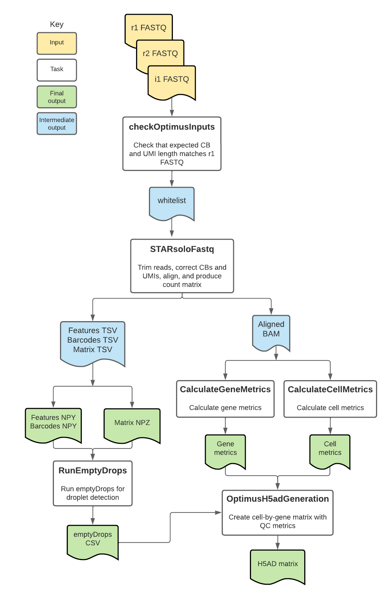

# Optimus Overview

| Pipeline Version | Date Updated | Documentation Author | Questions or Feedback |
| :----: | :---: | :----: | :--------------: |
| [optimus_v8.0.0](https://github.com/broadinstitute/warp/releases?q=optimus&expanded=true) | February, 2025 | WARP Pipelines | Please [file an issue in WARP](https://github.com/broadinstitute/warp/issues) |

## Introduction to the Optimus workflow

Optimus is an open-source, cloud-optimized pipeline developed by the Data Coordination Platform (DCP) of the [Human Cell Atlas (HCA) Project](https://data.humancellatlas.org/) as well as the [BRAIN Initiative Cell Census Network](https://biccn.org/) (BICCN; see [Acknowledgements](#acknowledgements) below). It supports the processing of any 3' single-cell and single-nucleus count data generated with the [10x Genomics v2 or v3 assay](https://www.10xgenomics.com/solutions/single-cell/).

It is an alignment and transcriptome quantification pipeline that corrects cell barcodes (CBs), aligns reads to the genome, corrects Unique Molecular Identifiers (UMIs), generates a count matrix in a UMI-aware manner, calculates summary metrics for genes and cells, detects empty droplets, returns read outputs in BAM format, and returns cell gene counts in numpy matrix and h5ad file formats.

In addition to providing [cell-level](./Loom_schema.md) and [library-level](./Library-metrics.md) metrics, Optimus takes special care to **keep all reads in the output BAM that may be useful to the downstream user**, such as unaligned reads or reads with uncorrectable barcodes. This design provides flexibility to the downstream user and allows for alternative filtering or leveraging the data for novel methodological development.

Optimus has been validated for analyzing both human and mouse single-cell or single-nucleus datasets. Learn more in the [validation section](#validation-against-cell-ranger).

:::tip Want to use the Optimus pipeline for your publication?
Check out the [Optimus Publication Methods](./optimus.methods.md) to get started!
:::

## Quickstart table
The following table provides a quick glance at the Optimus pipeline features:

| Pipeline features | Description | Source |
|--- | --- | --- |
| Assay type | 10x single cell or single nucleus expression (v2 and v3) | [10x Genomics](https://www.10xgenomics.com)
| Overall workflow  | Quality control module and transcriptome quantification module | Code available from [GitHub](https://github.com/broadinstitute/warp/blob/master/pipelines/skylab/optimus/Optimus.wdl) |
| Workflow language | WDL 1.0 | [openWDL](https://github.com/openwdl/wdl) |
| Genomic Reference Sequence | GRCh38.p13 (v43) human genome primary sequence and GRCm39 (M32) mouse genome primary sequence | GENCODE [human reference files](https://www.gencodegenes.org/human/release_43.html) and [mouse reference files](https://www.gencodegenes.org/mouse/release_M32.html)
| Transcriptomic reference annotation | V43 GENCODE human transcriptome and M32 mouse transcriptome | GENCODE [human GTF](https://ftp.ebi.ac.uk/pub/databases/gencode/Gencode_human/release_43/gencode.v43.annotation.gtf.gz) and [mouse GTF](https://ftp.ebi.ac.uk/pub/databases/gencode/Gencode_mouse/release_M32/gencode.vM32.annotation.gtf.gz) |
| Aligner and transcript quantification | STARsolo | [Dobin, et al.,2021](https://www.biorxiv.org/content/10.1101/2021.05.05.442755v1) |
| Data input file format | File format in which sequencing data is provided | [FASTQ](https://academic.oup.com/nar/article/38/6/1767/3112533) |
| Data output file format | File formats in which Optimus output is provided | 
[BAM](http://samtools.github.io/hts-specs/), Python numpy arrays (internal), h5ad |
| Library-level metrics | Library-level metrics produced by the Optimus workflow | [Library-level metrics](https://github.com/broadinstitute/warp/blob/develop/website/docs/Pipelines/Optimus_Pipeline/Library-metrics.md) | 

## Set-up

### Optimus installation

To download the latest Optimus release, see the release tags prefixed with "Optimus" on the WARP [releases page](https://github.com/broadinstitute/warp/releases). All Optimus pipeline releases are documented in the [Optimus changelog](https://github.com/broadinstitute/warp/blob/master/pipelines/skylab/optimus/Optimus.changelog.md). 

To discover and search releases, use the WARP command-line tool [Wreleaser](https://github.com/broadinstitute/warp/tree/master/wreleaser).

If you’re running an Optimus workflow version prior to the latest release, the accompanying documentation for that release may be downloaded with the source code on the WARP [releases page](https://github.com/broadinstitute/warp/releases) (see the source code folder `website/docs/Pipelines/Optimus_Pipeline`).

Optimus can be deployed using [Cromwell](https://cromwell.readthedocs.io/en/stable/), a GA4GH-compliant, flexible workflow management system that supports multiple computing platforms. The workflow can also be run in [Terra](https://app.terra.bio), a cloud-based analysis platform. The Terra [Optimus Featured Workspace](https://app.terra.bio/#workspaces/featured-workspaces-hca/HCA_Optimus_Pipeline) contains the Optimus workflow, workflow configurations, required reference data and other inputs, and example testing data.

### Inputs

Optimus pipeline inputs are detailed in JSON format configuration files. There are five downsampled example configuration files available for running the pipeline:

*  [human_v2_example](https://github.com/broadinstitute/warp/blob/master/pipelines/skylab/optimus/example_inputs/human_v2_example.json): An example human 10x v2 single-cell dataset
*  [human_v3_example](https://github.com/broadinstitute/warp/blob/master/pipelines/skylab/optimus/example_inputs/human_v3_example.json): An example human 10x v3 single-cell dataset
*  [mouse_v2_example](https://github.com/broadinstitute/warp/blob/master/pipelines/skylab/optimus/example_inputs/mouse_v2_example.json): An example mouse 10x v2 single-cell dataset
*  [mouse_v2_snRNA_example](https://github.com/broadinstitute/warp/blob/master/pipelines/skylab/optimus/example_inputs/mouse_v2_snRNA_example.json): An example mouse v2 single-nucleus dataset

Additionally, there are multiple full-size example datasets available in the Optimus [`example_inputs`](https://github.com/broadinstitute/warp/tree/master/pipelines/skylab/optimus/example_inputs) folder. Unlike the example configuration files above, the full-size configuration files may not reflect updated Optimus parameters. However, you can still access the FASTQ files for each dataset at the Google bucket locations listed in the dataset configuration files.

#### Sample data input

Each 10x v2 and v3 3’ sequencing experiment generates triplets of FASTQ files for any given sample. Optimus takes the FASTQs listed below as input.

1. Forward reads (`r1_fastq`) containing the unique molecular identifier (UMI) and CB sequences
2. Reverse reads (`r2_fastq`) containing the alignable genomic information from the mRNA transcript
3. Optional index FASTQ (`i1_fastq`) containing the sample barcodes, when provided by the sequencing facility

:::tip Optimus is currently a single sample pipeline

However, it can take in multiple sets of FASTQs for a sample that has been split over multiple lanes of sequencing. For an example configuration file with multiple lanes, please see the [mouse_v2_example.json](https://github.com/broadinstitute/warp/blob/master/pipelines/skylab/optimus/example_inputs/mouse_v2_example.json). Additionally, Optimus does not support demultiplexing even though it accepts index FASTQ files.
:::

#### Additional reference inputs

The example configuration files also contain metadata for the reference files, described in the table below.

| Parameter name | Description | Optional attributes (when applicable) |
| --- | --- | --- |
| cloud_provider | String describing the cloud provider that should be used to run the workflow; value should be "gcp" or "azure". | String |
| whitelist |  List of known CBs; the workflow automatically selects the [10x Genomics](https://www.10xgenomics.com/) whitelist that corresponds to the v2 or v3 chemistry based on the input `tenx_chemistry_version`. A custom whitelist can also be provided if the input data was generated with a chemistry different from 10x Genomics v2 or v3. To use a custom whitelist, set the input `ignore_r1_read_length` to "true". | N/A |
| read_struct | String describing the structure of reads; the workflow automatically selects the [10x Genomics](https://www.10xgenomics.com/) read structure that corresponds to the v2 or v3 chemistry based on the input `tenx_chemistry_version`. A custom read structure can also be provided if the input data was generated with a chemistry different from 10x Genomics v2 or v3. To use a custom read structure, set the input `force_no_check` to "true". | N/A |
| tar_star_reference | TAR file containing a species-specific reference genome and GTF; it is generated using the [BuildIndices workflow](https://github.com/broadinstitute/warp/tree/master/pipelines/skylab/build_indices/BuildIndices.wdl). | N/A |
| input_id | Unique identifier describing the biological sample or replicate that corresponds with the FASTQ files; can be a human-readable name or UUID. | N/A |
| gex_nhash_id | Optional string to identify the library aliquot; will be echoed in the output h5ad file in the adata.uns and the library-level metrics CSV; default is null (`""`) | N/A |
| input_name | Optional string that can be used to further identify the original biological sample. | N/A |
| input_id_metadata_field | Optional string describing, when applicable, the metadata field containing the input_id. | N/A |
| input_name_metadata_field | Optional string describing, when applicable, the metadata field containing the input_name. | N/A |
| annotations_gtf | GTF containing gene annotations used for gene tagging (must match GTF in STAR reference). | N/A |
| tenx_chemistry_version | Integer that specifies if data was generated with 10x v2 or v3 chemistry. Optimus validates this chemistry by examining the UMIs and CBs in the first read 1 FASTQ file. If the chemistry does not match, the pipeline will fail. You can remove the check by setting "ignore_r1_read_length = true" in the input JSON. | 2 or 3 |
| mt_genes | Optional file containing mitochondrial gene names for a specific species. This is used for calculating gene metrics. | N/A |
| soloMultiMappers | Optional string describing whether or not the Optimus (GEX) pipeline should run STARsolo with the `--soloMultiMappers` flag; default is "Uniform". | N/A |
| counting_mode | String describing whether data is single-cell or single-nucleus. Single-cell mode counts reads aligned to the gene transcript, whereas single-nucleus counts whole transcript to account for nuclear pre-mRNA. | "sc_rna" or "sn_rna" |
| output_bam_basename | String used as a basename for output BAM file; the default is set to the string used for the `input_id` parameter. | N/A |
| star_strand_mode | Optional string for running the workflow on forward stranded, reverse stranded, or unstranded data; default is "Forward". | "Forward" (default), "Reverse", and "Unstranded" |
| ignore_r1_read_length | Boolean that overrides a check on the 10x chemistry. Default is set to false. If true, the workflow will not ensure that the 10x_chemistry_version input matches the chemistry in the read 1 FASTQ. | "true" or "false" (default) | 
| emptydrops_lower | UMI threshold for emptyDrops detection; default is 100. | N/A |
| count_exons | Boolean indicating if the workflow should calculate exon counts **when in single-nucleus (sn_rna) mode**. If true, this option will output an additional layer for the h5ad file. By default, it is set to "false". If the parameter is true and used with sc_rnamode, the workflow will return an error. | "true" or "false" (default) |
| gex_expected_cells | Optional integer input for the expected number of cells, which is used calculate library-level metrics. The default is set to 3,000. | N/A |
| run_cellbender | Optional boolean used to determine if the Optimus (GEX) pipeline should run CellBender on the output gene expression h5ad file, `h5ad_output_file_gex`; default is "false".  | Boolean |

#### Pseudogene handling
The example Optimus reference files are downloaded directly from GENCODE (see Quickstart table) and are not modified to remove pseudogenes. This is in contrast to the [references created for Cell Ranger](https://support.10xgenomics.com/single-cell-multiome-atac-gex/software/release-notes/references#header) which remove pseudogenes and small RNAs.

In the case of multi-mapped pseudogenes, Optimus and Cell Ranger will produce different results. Optimus does not count multi-mapped reads in the final count matrix, whereas Cell Ranger will keep potential multi-mapped reads because it does not identify the pseudogene reads.

#### Sample inputs for analyses in a Terra Workspace

The Optimus pipeline is currently available on the cloud-based platform Terra. After registering, you can access the [Optimus featured workspace](https://app.terra.bio/#workspaces/featured-workspaces-hca/HCA_Optimus_Pipeline). The workspace is preloaded with instructions and sample data. Please view the [Support Center](https://support.terra.bio/hc/en-us) for more information on using the Terra platform.

## Optimus tasks and tools

The [Optimus workflow](https://github.com/broadinstitute/warp/blob/master/pipelines/skylab/optimus/Optimus.wdl) imports individual "tasks," also written in  WDL script, from the WARP [tasks folder](https://github.com/broadinstitute/warp/blob/master/tasks/skylab). 

Overall, the Optimus workflow:
1. Checks inputs.
1. Corrects CBs, aligns reads, corrects UMIs, and counts genes with STAR.
1. Calculates gene metrics.
1. Calculates cell metrics.
1. Runs emptyDrops.
1. Merges gene counts, metrics, and emptyDrops data into a h5ad-formatted matrix.

The tools each Optimus task employs are detailed in the table below. 

To see specific tool parameters, select the task WDL link in the table; then view the `command {}` section of the task in the WDL script. To view or use the exact tool software, see the task's Docker image which is specified in the task WDL `# runtime values` section as `String docker =`.

| Task name and WDL link | Tool | Software | Description | 
| --- | --- | --- | ------------------------------------ | 
| [OptimusInputChecks.checkOptimusInput](https://github.com/broadinstitute/warp/blob/master/tasks/skylab/CheckInputs.wdl) | Custom script | Bash | Validates the tenx_chemistry_version and counting_mode inputs. For the tenx_chemistry_version, the script verifies that the length of the CBs and UMIs in the first read1 FASTQ file matches the length expected by 10x Genomics v2 and v3 chemistry. It then selects and outputs the appropriate whitelist to use for analysis in the rest of the workflow. | 
| [StarAlign.STARsoloFastq (alias = STARsoloFastq)](https://github.com/broadinstitute/warp/blob/master/tasks/skylab/StarAlign.wdl) | STAR | [Star](https://github.com/alexdobin/STAR) | Uses the FASTQ files to perform CB correction, adaptor trimming, alignment, gene annotation, UMI correction, and gene counting. Creates a compressed raw NPY or NPZ file containing the STARsolo output features (NPY), barcodes (NPZ) and counts (NPZ) |
| [Metrics.CalculateGeneMetrics (alias = GeneMetrics)](https://github.com/broadinstitute/warp/blob/master/tasks/skylab/Metrics.wdl) | TagSort | [warp-tools](https://github.com/broadinstitute/warp-tools) | Sorts the BAM file by gene using the cell barcode (CB), molecule barcode (UB) and gene ID (GX) tags and computes gene metrics. | 
| [Metrics.CalculateCellMetrics (alias = CellMetrics)](https://github.com/broadinstitute/warp/blob/master/tasks/skylab/Metrics.wdl) | TagSort | [warp-tools](https://github.com/broadinstitute/warp-tools) | Sorts the BAM file by cell using the cell barcode (CB), molecule barcode (UB) and gene ID (GX) tags and computes cell metrics. |
| [RunEmptyDrops.RunEmptyDrops](https://github.com/broadinstitute/warp/blob/master/tasks/skylab/RunEmptyDrops.wdl) | npz2rds.sh, emptyDropsWrapper.R, emptyDrops | [DropletUtils](https://bioconductor.org/packages/release/bioc/html/DropletUtils.html) | Runs custom scripts to convert the NPY and NPZ files to RDS and then uses emptyDrops to identify empty lipid droplets. This step only runs when `counting_mode` = "sc_rna". This task is nondeterministic.|
|  [H5adUtils.OptimusH5adGeneration](https://github.com/broadinstitute/warp/blob/master/tasks/skylab/H5adUtils.wdl) | create_h5ad_optimus.py | Python3 | Merges the gene counts, cell metrics, gene metrics, and emptyDrops data into a h5ad formatted cell-by-gene matrix. The h5ad contains exon counts when using sc_rna mode, and whole-gene counts when running in sn_rna mode. It optionally contains an additional layer for exon counts when running sn_rna mode with `exon_counts` set to true. This task is nondeterministic.|
| CellBender.run_cellbender_remove_background_gpu as CellBender ([WDL](https://raw.githubusercontent.com/broadinstitute/CellBender/v0.3.0/wdl/cellbender_remove_background.wdl))| CellBender | Optional task that runs the `cellbender_remove_background.wdl` WDL script directly from the [CellBender GitHub repository](https://github.com/broadinstitute/CellBender/tree/master), depending on whether the input `run_cellbender` is "true" or "false". |

More information about the different tags used to flag the data can be found in the [Bam_tags documentation](./Bam_tags.md).

#### 1. Checks inputs
The [checkOptimusInput](https://github.com/broadinstitute/warp/blob/master/tasks/skylab/CheckInputs.wdl) task validates the `tenx_chemistry_version` and `counting_mode` inputs to ensure that the attributes are selected. For the `tenx_chemistry_version`, the script verifies that the length of the CBs and UMIs in the first read1 FASTQ file matches the length expected by 10x Genomics v2 and v3 chemistry. It then selects and outputs the appropriate whitelist to use for analysis in the rest of the workflow. For the `counting_mode` input, the task verifies that the input is set to either the string "sc_rna" or "sn_rna". If these checks fail, the workflow will fail. 

#### 2. Correct CBs, trims reads, align, annotate genes, correct UMIs, and count genes
The [STARsoloFastq task](https://github.com/broadinstitute/warp/blob/master/tasks/skylab/StarAlign.wdl) uses the FASTQ files to perform CB correction, alignment, gene annotation, and counting. 

**CB correction**

Although the function of the CBs is to identify unique cells, barcode errors can arise during sequencing, such as the incorporation of the barcode into contaminating DNA or sequencing and PCR errors. This makes it difficult to distinguish unique cells from barcode artifacts. The STARsoloFastq task uses the STAR aligner to evaluate barcode errors by comparing the R1 FASTQ sequences against a 10x chemistry-specific whitelist of known barcode sequences. 

Corrected barcodes are those that come within one edit distance ([Hamming  distance](https://www.ncbi.nlm.nih.gov/pmc/articles/PMC5410656/)) of matching the whitelist of barcode sequences. This is specified in the STAR parameter  `--soloCBmatchWLtype 1MM_multi_Nbase_pseudocounts`, which allows multiple matches in the whitelist with 1 mismatched base and uses posterior probability calculation to choose one of the matches. Additionally, it adds pseudocounts of 1 to all whitelist barcodes and allows multi-matching of CBs with N-bases to the whitelist.

Correct barcodes are assigned a “CB” tag in the BAM. Uncorrectable barcodes (with more than one error) are preserved and given a “CR” (Cell barcode Raw) tag. CB quality scores are also preserved in the file under the “CY” tag. 

**Read trimming**

Read trimming removes Illumina adapter sequences. This is set to match the read trimming performed by CellRanger4 and is specified using the parameter `--clipAdapterType CellRanger4` and  `--outFilterScoreMin 30`.

**Alignment**

STAR maps barcoded reads to the genome primary assembly reference (see the Quickstart table above for version information). The example references for Optimus were generated using the [BuildIndices workflow](https://github.com/broadinstitute/warp/tree/master/pipelines/skylab/build_indices/BuildIndices.wdl). The strandedness for alignment is specified in STAR with the `--soloStrand` parameter, which is set to unstranded by default. 

**Gene annotation**

Prior to gene counting, STARsolo adds gene annotations which will vary depending on the counting_mode ("sc_rna" or "sn_rna") specified in the Optimus workflow. With `sc_rna`, STARsolo runs with the “Gene” COUNTING_MODE, which is specific to exons.  With the `sn_rna` mode, STARsolo runs the “GeneFull_Ex50pAS” COUNTING_MODE and has the additional option to run the "Gene" mode when the input parameter `count_exons` is set to "true". 

Genes that overlap an alignment are stored with the GX BAM tag; for sc_rna mode, this will include the gene that corresponds to an exon or UTR, whereas for sn_rna mode, this will include the gene corresponding to an exon, UTR, and intron.

All tags are detailed in the pipeline's [BAM_tag documentation](./Bam_tags.md).

**UMI correction and gene counting**

UMIs are designed to distinguish unique transcripts present in the cell at lysis from those arising from PCR amplification of these same transcripts. But, like CBs, UMIs can also be incorrectly sequenced or amplified. 

By specifying the `--soloUMIdedup 1MM_Directional_UMItools`, STARsolo applies a network-based, "directional" correction method ([Smith, et al., 2017](https://www.ncbi.nlm.nih.gov/pmc/articles/PMC5340976/)) to account for such errors. Additionally, the UMI correction task requires the length of the UMI, which differs between v2 and v3 chemistry; v2 is 10 bp whereas v3 is 12 bp. The task will add a 'UB' tag for UMI-corrected barcodes. 

Deduplicated UMIs are counted towards their assigned gene/cells, producing a raw count matrix.

**STARsolo outputs**

The task’s output includes a coordinate-sorted BAM file containing the CB-corrected reads and SAM attributes UB UR UY CR CB CY NH GX GN. Additionally, after counting, the task outputs three intermediate TSV files (features, barcodes, and matrix) used for downstream empty droplet detection and h5ad matrix generation. The task also outputs a compressed raw NPY or NPZ file containing the STARsolo output features (NPY), barcodes (NPZ) and counts (NPZ).

#### 3. Calculate gene metrics

The [CalculateGeneMetrics](https://github.com/broadinstitute/warp/blob/master/tasks/skylab/Metrics.wdl) task uses [warp-tools](https://github.com/broadinstitute/warp-tools) to calculate summary metrics that help assess the quality of the data output each time this pipeline is run. These metrics are included in the output h5ad matrix. A detailed list of these metrics is found in the [Optimus Count Matrix Overview](./Loom_schema.md).

#### 4. Calculate cell metrics

The [CalculateCellMetrics](https://github.com/broadinstitute/warp/blob/master/tasks/skylab/Metrics.wdl) task uses [warp-tools](https://github.com/broadinstitute/warp-tools) to calculate summary metrics that help assess the per-cell quality of the data output each time this pipeline is run. These metrics are included in the output h5ad matrix. A detailed list of these metrics is found in the [Optimus Count Matrix Overview](./Loom_schema.md).

#### 5. Run emptyDrops

Empty droplets are lipid droplets that did not encapsulate a cell during 10x sequencing, but instead acquired cell-free RNA (secreted RNA or RNA released during cell lysis) from the solution in which the cells resided ([Lun, et al., 2018](https://www.ncbi.nlm.nih.gov/pubmed/?term=30902100). This ambient RNA can serve as a substrate for reverse transcription, leading to a small number of background reads. The Optimus pipeline calls the [RunEmptyDrops](https://github.com/broadinstitute/warp/blob/master/tasks/skylab/RunEmptyDrops.wdl) task which uses the [DropletUtils](http://bioconductor.org/packages/release/bioc/html/DropletUtils.html) R package to flag CBs that represent empty droplets rather than cells. A cell will be flagged if it contains fewer than 100 molecules.
emptyDrops metrics for single-cell data (not single-nucleus; see note below) are stored in the columns of the output h5ad matrix.  Read full details for all the metrics in the [Optimus Matrix Overview](./Loom_schema.md).

EmptyDrops relies on a visual knee point inflection (described in [Lun et al. (2019)](https://genomebiology.biomedcentral.com/articles/10.1186/s13059-019-1662-y)) to differentiate ambient-like cells from empty droplets. **If the single-cell data (counting mode set to `sc_rna`) does not produce a knee point inflection when running emptyDrops, the h5ad columns for emptyDrops data will contain "NA"s.**

:::warning RunEmptyDrops output not included for single-nucleus data
Often snRNAseq data does not produce a visual knee point inflection when running emptyDrops and the tool can not accurately distinguish ambient-like cells from empty droplets. For this reason, emptyDrops is not used if Optimus counting_mode is set to `sn_rna`, and the output h5ad matrix will not contain emptyDrops metrics.
:::

#### 6.  Matrix construction

The [OptimusH5adGeneration](https://github.com/broadinstitute/warp/blob/master/tasks/skylab/H5adUtils.wdl) task uses a custom python script to merge the converted STARsolo count matrix, the emptyDrops results, and the cell and gene metrics into an h5ad-formatted cell-by-gene matrix. **These counts are raw and unfiltered.**

Read full details for all the metrics in the [Optimus Count Matrix Overview](./Loom_schema.md).

The type of gene counts in the h5ad will vary depending on the Optimus workflow counting_mode. If running single-cell data (sc_rna mode), the counts will include only exonic gene counts. 

If running single-nucleus data (sn_rna mode), the counts in the main matrix will be whole transcript and, when `count_exons` is set to true, the counts in an additional layer will be exonic. Using the `count_exons` parameter will cause the h5ad matrix to have additional columns (cell barcodes) due to the difference in STARsolo counting mode.

You can determine which type of counts are in the h5ad by looking at the global attribute `expression_data_type`.

For sn_rna mode, you can also access whole transcript and exonic counts using AnnData alyers `layers()` method. For example, adata.layers[“exon_counts”]` will return the exonic counts from the output h5ad. 

#### 7. Optional: Run CellBender
This task runs when the `run_cellbender` input is set to true. CellBender is a tool for removing background UMIs and thereby helps to flag empty drops. Learn more in the [CellBender documentation](https://cellbender.readthedocs.io/en/latest/).

#### 8. Outputs

Output files of the pipeline include:

1. Cell x Gene unnormalized, but UMI-corrected, count matrices in h5ad format.
2. Unfiltered, sorted BAM file with barcode and downstream analysis [tags](./Bam_tags.md).
3. Cell metadata, including cell metrics.
4. Gene metadata, including gene metrics.

The following table lists the output files produced from the pipeline. For samples that have sequenced over multiple lanes, the pipeline will output one merged version of each listed file.

| Output Variable Name | Filename, if applicable | Output Type | Output Format |
| ------ |------ | ------ | ------ |
| pipeline_version_out | N/A | Version of the processing pipeline run on this data. | String |
| genomic_reference_version | reference_version.txt | Genomic reference version | TXT |
| bam | `<input_id>.bam` | Aligned BAM | BAM |
| matrix | `<input_id>_sparse_counts.npz` | Converted sparse matrix file from the Starsolo task. | NPZ |
| matrix_row_index | `<input_id>_sparse_counts_row_index.npy` | Index of cells in count matrix. | NPY |
| matrix_col_index | `<input_id>_sparse_counts_col_index.npy` | Index of genes in count matrix. | NPY |
| cell_metrics | `<input_id>.cell-metrics.csv.gz` | Matrix of metrics by cells. | Compressed CSV |
| gene_metrics | `<input_id>.gene-metrics.csv.gz` |  Matrix of metrics by genes. | Compressed CSV |
| aligner_metrics | `<input_id>.star_metrics.tar` | Tarred metrics files produced by the STARsolo aligner; contains align features, cell reads, summary, and UMI per cell metrics files. See the [STARsolo metrics](./starsolo-metrics.md) for more information about these files. | TXT |
| library_metrics | `<input_id>_<gex_nash_id>_library_metrics.csv` | Optional CSV file containing all library-level metrics calculated with STARsolo for gene expression data. See the [Library-level metrics](./Library-metrics.md) for how metrics are calculated. | CSV |
| multimappers_EM_matrix | `UniqueAndMult-EM.mtx` | Optional output produced when `soloMultiMappers` is "EM"; see STARsolo [documentation](https://github.com/alexdobin/STAR/blob/master/docs/STARsolo.md#multi-gene-reads) for more information. | MTX |
| multimappers_Uniform_matrix | `UniqueAndMult-Uniform.mtx` | Optional output produced when `soloMultiMappers` is "Uniform"; see STARsolo [documentation](https://github.com/alexdobin/STAR/blob/master/docs/STARsolo.md#multi-gene-reads) for more information. | MTX |
| multimappers_Rescue_matrix | `UniqueAndMult-Rescue.mtx` | Optional output produced when `soloMultiMappers` is "Rescue"; see STARsolo [documentation](https://github.com/alexdobin/STAR/blob/master/docs/STARsolo.md#multi-gene-reads) for more information. | MTX |
| multimappers_PropUnique_matrix | `UniqueAndMult-PropUnique.mtx` | Optional output produced when `soloMultiMappers` is "PropUnique"; see STARsolo [documentation](https://github.com/alexdobin/STAR/blob/master/docs/STARsolo.md#multi-gene-reads) for more information.| MTX |
| cell_calls | empty_drops_result.csv | emptyDrops results from the RunEmptyDrops task. | CSV |
| h5ad_output_file | `<input_id>.h5ad` | h5ad file with count data (exonic or whole transcript depending on the counting_mode) and metadata. | H5AD |
| mtx_files | `<input_id>.mtx_files.tar` | TAR file with STARsolo matrix market files (barcodes.tsv, features.tsv, and matrix.mtx) | TAR |
| cell_barcodes_csv | `<cell_csv>` | Optional output produced when `run_cellbender` is "true"; see CellBender [documentation](https://cellbender.readthedocs.io/en/latest/usage/index.html) and [GitHub repository](https://github.com/broadinstitute/CellBender/tree/master) for more information.|
| checkpoint_file | `<ckpt_file>` | Optional output produced when `run_cellbender` is "true"; see CellBender [documentation](https://cellbender.readthedocs.io/en/latest/usage/index.html) and [GitHub repository](https://github.com/broadinstitute/CellBender/tree/master) for more information. |
| h5_array | `<h5_array>` | Optional output produced when `run_cellbender` is "true"; see CellBender [documentation](https://cellbender.readthedocs.io/en/latest/usage/index.html) and [GitHub repository](https://github.com/broadinstitute/CellBender/tree/master) for more information. |
| html_report_array | `<report_array>` | Optional output produced when `run_cellbender` is "true"; see CellBender [documentation](https://cellbender.readthedocs.io/en/latest/usage/index.html) and [GitHub repository](https://github.com/broadinstitute/CellBender/tree/master) for more information. |
| log | `<log>` | Optional output produced when `run_cellbender` is "true"; see CellBender [documentation](https://cellbender.readthedocs.io/en/latest/usage/index.html) and [GitHub repository](https://github.com/broadinstitute/CellBender/tree/master) for more information. |
| metrics_csv_array | `<metrics_array>` | Optional output produced when `run_cellbender` is "true"; see CellBender [documentation](https://cellbender.readthedocs.io/en/latest/usage/index.html) and [GitHub repository](https://github.com/broadinstitute/CellBender/tree/master) for more information. |
| output_directory | `<output_dir>` | Optional output produced when `run_cellbender` is "true"; see CellBender [documentation](https://cellbender.readthedocs.io/en/latest/usage/index.html) and [GitHub repository](https://github.com/broadinstitute/CellBender/tree/master) for more information. |
| summary_pdf | `<pdf>` | Optional output produced when `run_cellbender` is "true"; see CellBender [documentation](https://cellbender.readthedocs.io/en/latest/usage/index.html) and [GitHub repository](https://github.com/broadinstitute/CellBender/tree/master) for more information. |

The h5ad matrix is the default output. This matrix contains the unnormalized (unfiltered), UMI-corrected count matrices, as well as the gene and cell metrics detailed in the [Optimus Count Matrix Overview](./Loom_schema.md).

#### Try the Optimus matrix with community tools
The matrix is compatible with multiple downstream community analysis tools, including [Seurat](https://satijalab.org/seurat/index.html), [Scanpy](https://scanpy.readthedocs.io/en/stable/), [Cumulus](https://cumulus.readthedocs.io/en/latest/index.html), and [Pegasus](https://pegasus.readthedocs.io/en/stable/#). To try a tutorial using the Optimus matrix with these tools, register for the open-source platform [Terra](https://app.terra.bio) and then navigate to the public [Intro-to-HCA-data-on-Terra workspace](https://app.terra.bio/#workspaces/featured-workspaces-hca/Intro-to-HCA-data-on-Terra). You can also view the accompanying [step-by-step guide](https://support.terra.bio/hc/en-us/articles/360060041772) without registration.

## Validation against Cell Ranger
Optimus has been validated for processing both human and mouse single-cell and single-nucleus data (see links to validation reports in the table below). For each validation, Optimus results are compared to those of Cell Ranger (see the [FAQ](#faqs) for more on Cell Ranger comparisons).

| Workflow configuration | Link to Report |
| --- | --- |
| Human 10x v2 single-cell | [Report](https://github.com/broadinstitute/warp/blob/master/pipelines/skylab/optimus/benchmarking/v1_Apr2019/optimus_report.rst)|
| Mouse 10x v2 single-cell | [Report](https://docs.google.com/document/d/1_3oO0ZQSrwEoe6D3GgKdSmAQ9qkzH_7wrE7x6_deL10/edit) |
| Human and mouse 10x v3 single-cell | [Report](https://docs.google.com/document/d/1-hwfXkqtL8MblgDWFzk-HsVRYiy4PS8ZhJqAGlHBWYE/edit#heading=h.4uokn64v1s5m)
|Human and Mouse 10x v2/v3 single-nucleus | [Report](https://docs.google.com/document/d/1rv2M7vfpOzIOsMnMfNyKB4HV18lQ9dnOGHK2tPikiH0/edit) |
| Optimus STARsolo (v5.0.0 and later) | [Report](https://docs.google.com/document/d/1B6Ux6HICD4ZL4Z0TG9LO-X43gOdF3sbq5qw_L2GA6fg/edit) |

## Versioning

All Optimus pipeline releases are documented in the [Optimus changelog](https://github.com/broadinstitute/warp/blob/master/pipelines/skylab/optimus/Optimus.changelog.md).

## Citing the Optimus Pipeline

If you use the Optimus Pipeline in your research, please identify the pipeline in your methods section using the [Optimus SciCrunch resource identifier](https://scicrunch.org/resources/data/record/nlx_144509-1/SCR_018908/resolver?q=SCR_018908&l=SCR_018908&i=rrid:scr_018908).

* Ex: *Optimus Pipeline (RRID:SCR_018908)*

Please cite our paper:

Degatano, Kylee, Aseel Awdeh, Robert Sidney Cox III, Wes Dingman, George Grant, Farzaneh Khajouei, Elizabeth Kiernan, et al. 2025. "Warp Analysis Research Pipelines: Cloud-Optimized Workflows for Biological Data Processing and Reproducible Analysis." _Bioinformatics (Oxford, England)_, September, https://doi.org/10.1093/bioinformatics/btaf494 .

## Consortia support
This pipeline is supported and used by the [Human Cell Atlas](https://www.humancellatlas.org/) (HCA) project and the [BRAIN Initiative Cell Census Network](https://biccn.org/) (BICCN). 

Each consortium may use slightly different reference files for data analysis or have different post-processing steps. Learn more by reading the [Consortia Processing](./consortia-processing.md) overview.

If your organization also uses this pipeline, we would like to list you! Please reach out to us by [filing an issue in WARP](https://github.com/broadinstitute/warp/issues).

## Feedback

Please help us make our tools better by [filing an issue in WARP](https://github.com/broadinstitute/warp/issues); we welcome pipeline-related suggestions or questions.

## Acknowledgements
We are immensely grateful to the members of the [Human Cell Atlas Data Coordination Platform](https://data.humancellatlas.org/),  BRAIN Initiative ([BICAN](https://brainblog.nih.gov/brain-blog/brain-issues-suite-funding-opportunities-advance-brain-cell-atlases-through-centers) Sequencing Working Group) and [SCORCH](https://nida.nih.gov/about-nida/organization/divisions/division-neuroscience-behavior-dnb/basic-research-hiv-substance-use-disorder/scorch-program) for their invaluable and exceptional contributions to this pipeline. Our heartfelt appreciation goes to Alex Dobin, Aparna Bhaduri, Alec Wysoker, Anish Chakka, Brian Herb, Daofeng Li, Fenna Krienen, Guo-Long Zuo, Jeff Goldy, Kai Zhang, Khalid Shakir, Bo Li, Mariano Gabitto, Michael DeBerardine, Mengyi Song, Melissa Goldman, Nelson Johansen, James Nemesh, and Theresa Hodges for their unwavering dedication and remarkable efforts. 

## FAQs

:::note Question Can I run Optimus in Terra?

Yes! We have a Terra workspace that is preconfigured with the latest Optimus workflow and is preloaded with human and mouse sample data. You can access the [workspace](https://app.terra.bio/#workspaces/featured-workspaces-hca/HCA_Optimus_Pipeline). You will need a Google account to set up Terra. Please see [Terra Support](https://support.terra.bio/hc/en-us) for documents on getting started.
:::

:::note Question Is the output count matrix filtered or normalized?

No, we do not filter. We keep as much data as possible so that the researcher can make their own filtering and normalization choices. We do, however, output some information that may be helpful for filtering, like UMI counts per cell and calls on whether or not a cell is empty from emptyDrops software. For the emptyDrops call, a cell will be flagged as possibly empty if it contains fewer than 100 molecules.
:::

:::note Question How does the workflow change when using the single-cell RNA-seq (counting_mode = 'sc_rna') vs. the single-nucleus (counting_mode = 'sn_rna') parameters?

The counting_mode parameter is used to specify the STARsolo COUNTING_MODE; when sn_rna is specified, STARsolo will tag gene exons, UTRs, AND introns with the GX tag.  Additionally, the Optimus uses the counting_mode to determine whether to run emptyDrops; no emptyDrops data is calculated for the sn_rna mode.
:::

:::note Question Where can I find example Optimus datasets and parameters to test the pipeline?

There are four example configuration JSON files available for you to test the pipeline- the [human_v2_example.json](https://github.com/broadinstitute/warp/blob/master/pipelines/skylab/optimus/example_inputs/human_v2_example.json), the [human_v3_example.json](https://github.com/broadinstitute/warp/blob/master/pipelines/skylab/optimus/example_inputs/human_v3_example.json), the [mouse_v2_snRNA_example.json](https://github.com/broadinstitute/warp/blob/master/pipelines/skylab/optimus/example_inputs/mouse_v2_snRNA_example.json), and the [mouse_v2_snRNA_example.json](https://github.com/broadinstitute/warp/blob/master/pipelines/skylab/optimus/example_inputs/mouse_v2_snRNA_example.json)(see the Inputs section). Each of these configuration files can be run in the Optimus Featured Workspace in Terra at https://app.terra.bio/#workspaces/featured-workspaces-hca/HCA_Optimus_Pipeline, but you should note that the workspace comes preloaded with the same data and configurations.

:::note Question What outputs are expected if my sample has been sequenced over multiple lanes?

The Optimus pipeline is a single sample pipeline, but it can accept multiple FASTQ files if a sample is sequenced across lanes. In this case, the pipeline will merge the results from each lane into single output files. There will only be one merged file for each output type (i.e one h5ad matrix, etc.). If you would like to view an example configuration file for a multi-lane dataset, please see the [mouse_v2_example.json](https://github.com/broadinstitute/warp/blob/master/pipelines/skylab/optimus/example_inputs/mouse_v2_example.json).  Additionally, you can view sample outputs in the Optimus featured workspace on [Terra](https://app.terra.bio/#workspaces/featured-workspaces-hca/HCA_Optimus_Pipeline).
:::

:::note Question How do I find which parameters and Docker images were used for the different tasks (i.e. STAR alignment, emptyDrops, etc.)

Parameters are listed in each task WDL. For a list of the tasks, see the table in the [Tasks and Tools Section](#optimus-tasks-and-tools). Select the link for the task of interest and then view the parameters in the task WDL "command {}" section. For the task Docker image, see task WDL "# runtime values" section; the Docker is listed as "String docker =  ". If you want to learn more about all the different parameters available for a software tool, please select the relevant link in the table's "Tool" column.
:::

:::note Question Does Optimus have any read length requirements?
For Read 1 sequences, the only minimum requirement is that reads are the combined lengths of the CB and UMIs (which will vary between 10x V1, V2, and V3 chemistry).

For Read 2 sequences, there is no read length requirement and read lengths will vary.
:::

:::note Question How does Optimus compare to Cell Ranger?

Cell Ranger is a commonly used set of analysis pipelines developed by [10x Genomics](https://support.10xgenomics.com/single-cell-gene-expression/software/pipelines/latest/what-is-cell-ranger). Optimus and Cell Ranger share many features and additionally, Optimus results are validated against Cell Ranger results (see our [human validation report](https://github.com/broadinstitute/warp/blob/master/pipelines/skylab/optimus/benchmarking/v1_Apr2019/optimus_report.rst)). 

*So why develop an independent pipeline for 10x data analyses?*

For three reasons:
1) Need for an open-source, cloud-optimized pipeline. When Optimus was developed, Cell Ranger software was not yet open source, nor was it optimized for the cloud. To date, the Cell Ranger open-source code is still not regularly updated with Cell Ranger releases. In consequence, using the latest Cell Ranger (which is not open source yet) limits our ability to harness the breadth of tools available in the scientific community.

2) Flexibility to process data similar, but not identical, to 10x. We wanted the ability to evolve our pipeline to process non-10x data types that might use similar features such as combinatorial indexing.

3) Addition of metrics. We wanted the pipeline to calculate key metrics that would be useful to the scientific community, such as emptyDrops calculations, mitochondrial read metrics, etc.

*Reference differences between Optimus and Cell Ranger*

Unlike Cell Ranger references, Optimus references are downloaded directly from GENCODE and not modified to remove pseudogenes and small RNAs. Learn more about Cell Ranger references on the [10x website](https://support.10xgenomics.com/single-cell-multiome-atac-gex/software/release-notes/references#header). 

In the case of multi-mapped pseudogenes, Optimus and Cell Ranger will produce different results. Optimus does not count multi-mapped reads in the final count matrix, whereas Cell Ranger will keep potential multi-mapped reads because it does not identify the pseudogene reads.
:::

:::note Question How does estimated cells differ between Cell Ranger and Optimus?

Overall, the estimated cells produced by Optimus and Cell Ranger should only slightly vary. However, if you are using Optimus in the Multiome pipeline and trying to compare estimated cells to Cell Ranger ARC, you might find that ARC calls fewer cells. This is because ARC sets a threshold that both the ATAC and gene expression cells must pass, whereas Optimus is only setting a threshold for the gene expression side of the pipeline.
:::

:::note Question What are [library-level metrics](https://github.com/broadinstitute/warp/blob/develop/website/docs/Pipelines/Optimus_Pipeline/Library-metrics.md) in the Optimus pipeline?

Library-level metrics provide a summary of the sequencing library's quality and performance across all cells, as opposed to per-cell metrics. These metrics offer insights into the overall efficiency, coverage, and quality of the sequencing data produced.
:::

:::note How are [library-level metrics](https://github.com/broadinstitute/warp/blob/develop/website/docs/Pipelines/Optimus_Pipeline/Library-metrics.md) calculated in Optimus?

Library-level metrics in Optimus are calculated using a combination of STARsolo metrics and custom metrics as defined in the library metrics table linked in the actual documentation for gene expression data. These metrics assess key aspects like total reads, sequencing depth, and overall complexity of the library, offering a higher-level view of the data's quality.
:::
