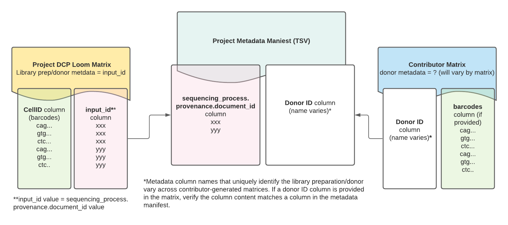

# Consortia Data Processing

## Human Cell Atlas Data Coordination Platform Matrix Processing
Optimus supports data processing for the Human Cell Atlas (HCA) Data Coordination Platform (DCP). Learn more about the DCP at the [HCA Data Portal](https://data.humancellatlas.org/)).

All DCP Projects processed with Optimus have matrices containing the standard metrics and counts detailed in the [Optimus Count Matrix Overview](./Loom_schema.md), but also have additional post-processing to combine project data and incorporate DCP-curated metadata.

:::warning
This section details matrices produced for the Human Cell Atlas (HCA) [Data Coordination Platform (DCP)2.0](https://data.humancellatlas.org/), which includes matrices processed with Optimus v4.1.7 and later. The DCP is currently reprocessing data generated with earlier Optimus versions and will deprecate previous matrices once reprocessing is complete.
:::

### DCP project matrix post-processing

DCP project matrices combine project data from individual library preparations that contain the same species, developmental age, and sequencing technology. 

Key differences between the standard Optimus Loom matrix described in the [Optimus Count Matrix Overview](./Loom_schema.md) and the DCP Project matrix include: 

* Combined project data in the DCP matrix
* Filtering: to reduce file size, DCP project matrices are in sparse format and minimally filtered so that **only cells with 100 molecules or more** are retained.
* DCP-curated metadata in the Loom global attributes: see table below.
* input_ids in the global attributes: all input_ids representing each library preparation in the matrix are added as a comma-separated string.


DCP project matrices contain DCP-curated metadata in the Loom global attributes which may be useful when exploring the data and linking it back to the Project metadata. 

Read more about each metadata field in the DCP [Metadata Dictionary](https://data.humancellatlas.org/metadata).

| Metadata Attribute Name in Count Matrix | Metadata Description |
| --- | --- |
| `donor_organism.genus_species` | species information; human or mouse |
| `library_preparation_protocol.library_construction_approach` | technology used for library preparation, i.e 10x or SS2 |
| `specimen_from_organism.organ` | organ |
| `project.project_core.project_name` | project name |
| `project.provenance.document_id` | project id |
| `input_id` | metadata values for  `sequencing_process.provenance.document_id`; unique ID to demarcate the library prep |
| `input_name` | metadata values for `sequencing_input.biomaterial_core.biomaterial_id`; unique ID for the biomaterial |
| `input_id_metadata_field` | string describing the DCP-curated metadata field used for input_id: `sequencing_process.provenance.document_id` |
| `input_name_metadata_field` | string describing the DCP-curated metadata field used for input_name: `sequencing_input.biomaterial_core.biomaterial_id` |

### Post-processing steps
To create the DCP project matrices, Loom outputs from individual 10x library preparations, each with their own `input_id`, are combined into a single Loom file.


### Making project matrix cell barcodes unique
Since DCP project matrices often contain combined data from multiple library preparations, the project matrix cell barcodes are modified so that they are unique for each library preparation, allowing the barcodes to be used by downstream community tools like Cumulus and Seurat.

In the standard Optimus matrix, cell barcodes are listed in both the Loom columns `CellID` and the `cell_names`.

For DCP projects, however, **the cell barcodes in the  `cell_names` column are modified** so that each cell barcode belonging to an individual library preparation is unique. This is done by adding a numerical suffix to the barcodes that corresponds to the `input_id` for the library preparation from which the cell barcodes came. 

The `input_ids` are listed in the matrix global attributes. The order of the input_ids serves as an index for the cell barcode suffix.


#### Example cell barcodes from a DCP project matrix

Let's use loompy to look at the global attribute `input_id` for a DCP project matrix (loom format):

```python
>>> ds.attrs.input_id
'166c1b1a-ad9c-4476-a4ec-8b52eb5032c7, 22b7da3d-a301-433e-99e1-e67266c1ee8b, 337a48c5-e363-45aa-886f-ccd4425edc2b, 40630e8b-c3a3-4813-b1e4-b156637c5cc3, 58d703d1-d366-42d0-af44-a3bb836838a5, 70c8d647-7984-4d03-912a-f2437aa1ba4f, 7c86cf30-4284-4a0d-817f-6047560c05c3, 8ef7aca4-be00-4c03-8576-1b2eff4ce7af, ae0cfa6e-e7cb-4a88-9f89-1c44abaa2291, cbd23025-b1bf-4e9e-a297-ddab4a217b76, df049da4-3d20-4da7-a1d7-7d6e8f7740ff, e17bf5ea-788b-4756-a008-a07aec091e10'
>>> 
```
Notice the attribute's value is a string of comma- **and space-** separated UUIDs.

Each of these UUIDs represents one library preparation. This matrix contains data from 12 library preparations total. 

Now let's look at the `cell_names` column attribute which contains the unique cell barcodes:

```python
>>> ds.ca.cell_names
array(['GGACAAGAGTGCGTGA-0', 'GATCGATCACCAGGTC-0', 'AGCGGTCAGGGCTTGA-0',
       ..., 'GTACGTAAGCTATGCT-11', 'CAGAATCTCTGAGTGT-11',
       'AACACGTAGTGTTTGC-11'], dtype=object)
>>> 
```

The suffix appended to the barcodes in the `cell_names` column is the index for the `input_id` UUID to which the cell barcodes belong. 

For example, cell barcodes with a "-0" suffix belong to the library preparation represented by the first UUID, `166c1b1a-ad9c-4476-a4ec-8b52eb5032c7`, whereas cell barcodes with a "-11" suffix represent the 10th UUID, `cbd23025-b1bf-4e9e-a297-ddab4a217b76`.


### Mapping DCP project matrix data to the metadata manifest

While the project matrices contain some project metadata (listed in the table above), there is additionally useful metadata in the project's metadata manifest, a TSV file containing all of a project's metadata, including donor and disease state information.

In addition to the global attribute `input_id`, each project matrix has an `input_id` column that can be useful for mapping matrix data back to the DCP metadata manifest. 

The values listed in the `input_id` column match the library preparation UUID in the metadata manifest column `sequencing_process.provenance.document_id`. 


Read more about the metadata manifest in the DCP [Exploring Projects guide](https://data.humancellatlas.org/guides).

:::tip Explore HCA Project matrices in Terra
HCA matrices produced with Optimus are compatible with multiple downstream community analysis tools. For a tutorial on using the Optimus matrix with [Seurat](https://satijalab.org/seurat/index.html), [Scanpy](https://scanpy.readthedocs.io/en/stable/), [Cumulus](https://cumulus.readthedocs.io/en/latest/index.html), or [Pegasus](https://pegasus.readthedocs.io/en/stable/#), see the public [Intro-to-HCA-data-on-Terra workspace](https://app.terra.bio/#workspaces/featured-workspaces-hca/Intro-to-HCA-data-on-Terra) (login required) and its accompanying [step-by-step guide](https://support.terra.bio/hc/en-us/articles/360060041772).
:::

### Mapping DCP project matrix data to the contributor matrices

Contributor matrices contain data analyzed and provided by the original project contributors. While they vary in format and content from project to project, they often include cell type annotations and additional metadata such as donor information and cell barcodes. 

*If the contributor matrix contains donor metadata that matches a field in the project metadata manifest*, the matrix can be linked to the DCP-generated project matrix in a two-step process.

- First, map the DCP matrix to the metadata manifest using the Loom's `input_id` **column**; this column contains the same library preparation/donor IDs as the project metadata manifest's `sequencing_process.provenance.document_id` column. 

- Second, map the contributor matrix to the metadata manifest using the contributor matrix column that matches the metadata manifest. 

Contributor matrices might contain a column for cell barcodes for each library/preparation donor. These barcodes should match the non-unique barcodes listed in the DCP project matrix, with the exception of cells that might have been filtered out of the Loom matrix due to low UMIs. The Loom's non-unique barcodes are listed in the `CellID` column. 




For example code showing how to link a contributor matrix to a DCP project matrix, see the [Matrix_matching Jupyter Notebook](./Matrix_matching.ipynb).

If you have any questions related to the contributor matrix and content, reach out to the individual project contributors listed on the Project page.

## Brain Initiative Cell Census Network Processing
The Optimus pipeline supports data processing for the [BRAIN Initiative Cell Census Network (BICCN)](https://biccn.org/). An overview of the BICCN pipeline resources is available on the BICCN's [Pipelines page](https://biccn.org/tools/biccn-pipelines).

### Optimus reference files for BICCN data processing
The BICCN 2.0 Whole Mouse Brain Working Group uses the Ensembl GRCm38 reference for alignment and a modified GTF for gene annotation (see table below). All Optimus pipeline reference inputs were created with the [BuildIndices workflow](https://github.com/broadinstitute/warp/tree/master/pipelines/wdl/build_indices).

BICCN processes single-nucleus data, which is enriched in pre-mRNAs containing introns. To account for this, the BuildIndices workflow uses the `BuildStarSingleNucleus` task to add intron annotations to the GTF with a custom [python script](https://github.com/broadinstitute/warp-tools/blob/develop/3rd-party-tools/build-indices/add-introns-to-gtf.py). The GTF contains all annotations for any `gene_id` that has at least one transcript. This reduces the number of genes in the GTF to \~32,000. 

All reference files are available in a public Google bucket (see table below) and are accompanied by a README that details reference provenance (gs://gcp-public-data--broad-references/mm10/v0/README_mm10_singlecell_gencode.txt). 

| Optimus reference input name | Google bucket URI | Reference source | Description |
| --- | --- | --- | --- |
| `annotations_gtf` | gs://gcp-public-data--broad-references/mm10/v0/single_nucleus/modified_gencode.vM23.primary_assembly.annotation.gtf | https://ftp.ebi.ac.uk/pub/databases/gencode/Gencode_mouse/release_M23/gencode.vM23.annotation.gtf.gzf | Modified GENCODE GTF including intron annotations that can be used for intron counting with featureCounts. |
| `ref_genome_fasta` | gs://gcp-public-data--broad-references/mm10/v0/single_nucleus/modified_mm10.primary_assembly.genome.fa | https://ftp.ebi.ac.uk/pub/databases/gencode/Gencode_mouse/release_M23/GRCm38.p6.genome.fa.gz | FASTA filed used to create the STAR reference files. |
| `tar_star_reference` | gs://gcp-public-data--broad-references/mm10/v0/single_nucleus/star/modified_star_2.7.9a_primary_gencode_mouse_vM23.tar | NA — built with the BuildIndices workflow. | Reference files used for alignment with STAR. |
| `whitelist` | gs://broad-gotc-test-storage/Optimus/truth/plumbing/master/inputs/737K-august-2016.txt (for v2 chemistry) and gs://broad-gotc-test-storage/Optimus/truth/plumbing/master/inputs/3M-february-2018.txt (for v3 chemisty) | See [10x barcode descriptions](https://kb.10xgenomics.com/hc/en-us/articles/115004506263-What-is-a-barcode-whitelist). | List of barcode sequences included in 10x library preparations. Each barcode demarcates an individual cell. |


