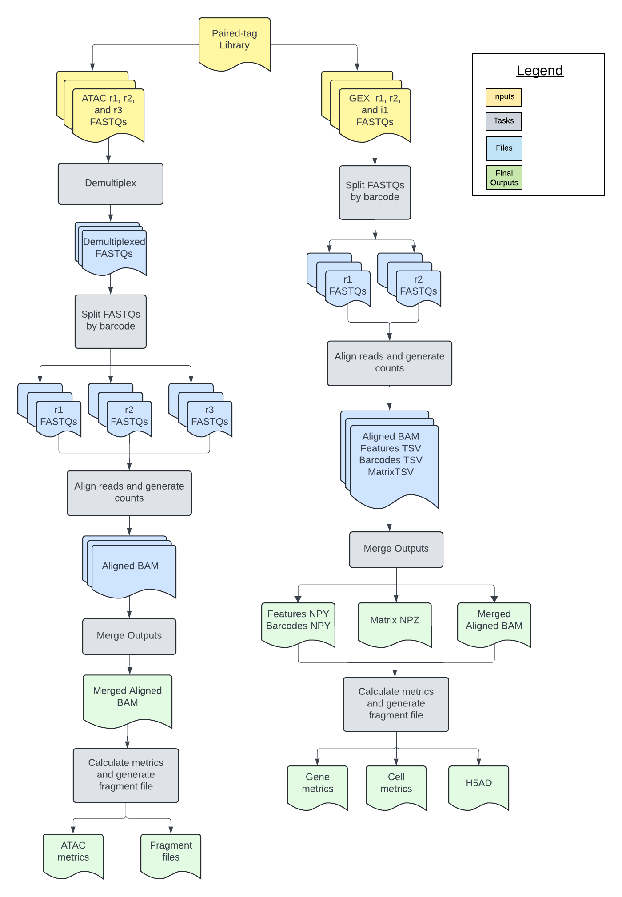

# Paired-Tag Overview

|                          Pipeline Version                           | Date Updated | Documentation Author | Questions or Feedback |
|:---:| :---: | :---: | :---: |
| [PairedTag_v1.10.0](https://github.com/broadinstitute/warp/releases) | January, 2025 | WARP Pipelines | Please [file an issue in WARP](https://github.com/broadinstitute/warp/issues). |

## Introduction to the Paired-Tag workflow

The [Paired-Tag workflow](https://github.com/broadinstitute/warp/blob/develop/pipelines/wdl/paired_tag/PairedTag.wdl) is an open-source, cloud-optimized pipeline developed in collaboration with the [BRAIN Initiative Cell Census Network](https://biccn.org/) (BICCN) and the BRAIN Initiative Cell Atlas Network (BICAN). It supports the processing of 3' single-nucleus histone modification data (generated with the [paired-tag protocol](https://www.nature.com/articles/s41594-023-01060-1)]) and 10x gene expression (GEX) data generated with the [10x Chromium Multiome assay](https://www.10xgenomics.com/products/single-cell-multiome-atac-plus-gene-expression).

The workflow is a wrapper WDL script that calls two subworkflows: the Optimus workflow for single-nucleus GEX data and the ATAC workflow for single-nucleus histone modification data.

The [Optimus workflow](../Optimus_Pipeline/README) (GEX) corrects cell barcodes (CBs) and Unique Molecular Identifiers (UMIs), aligns reads to the genome, calculates per-barcode and per-gene quality metrics, and produces a raw cell-by-gene count matrix.

The [ATAC workflow](../ATAC/README) (histone modification) performs demultiplexing for samples that have a preindex barcode, corrects CBs, aligns reads to the genome, calculates per-barcode quality metrics, and produces a fragment file.

The [wrapper WDL](https://github.com/broadinstitute/warp/blob/develop/pipelines/wdl/paired_tag/PairedTag.wdl) is available in the [WARP repository](https://github.com/broadinstitute/warp).

## Quickstart table
The following table provides a quick glance at the Paired-Tag pipeline features:

| Pipeline features | Description | Source |
| --- | --- | --- |
| Assay type | Droplet Paired-Tag (parallel analysis of individual cells for RNA expression and DNA from targeted tagmentation by sequencing) | [Xie et al. 2023](https://www.nature.com/articles/s41594-023-01060-1) |
| Overall workflow | Barcode correction, read alignment, gene and fragment quantification | Code available on [GitHub](https://github.com/broadinstitute/warp/blob/develop/pipelines/wdl/paired_tag/PairedTag.wdl) |
| Workflow language | WDL 1.0 | [openWDL](https://github.com/openwdl/wdl) |
| Genomic Reference Sequence | GRCh38 human genome primary sequence | GENCODE [human reference files](https://www.gencodegenes.org/human/release_43.html) |
| Gene annotation reference (GTF) | Reference containing gene annotations | [GENCODE human GTF](https://ftp.ebi.ac.uk/pub/databases/gencode/Gencode_human/release_43/gencode.v43.annotation.gtf.gz) |
| Aligners | STARsolo (GEX), BWA-mem2 (ATAC) | [Kaminow et al. 2021](https://www.biorxiv.org/content/10.1101/2021.05.05.442755v1), [Vasimuddin et al. 2019](https://ieeexplore.ieee.org/document/8820962) |
| Transcript and fragment quantification | STARsolo (GEX), SnapATAC2 (ATAC) | [Kaminow et al. 2021](https://www.biorxiv.org/content/10.1101/2021.05.05.442755v1), [SnapATAC2](https://kzhang.org/SnapATAC2/) |
| Data input file format | File format in which sequencing data is provided | [FASTQ](https://academic.oup.com/nar/article/38/6/1767/3112533) |
| Data output file format | File formats in which Multiome output is provided | [BAM](http://samtools.github.io/hts-specs/) and [h5ad](https://anndata.readthedocs.io/en/latest/) |

## Set-up

### Paired-Tag installation

To download the latest Paired-Tag release, see the release tags prefixed with "PairedTag" on the WARP [releases page](https://github.com/broadinstitute/warp/releases). All Paired-Tag pipeline releases are documented in the [Paired-Tag changelog](https://github.com/broadinstitute/warp/blob/develop/pipelines/wdl/paired_tag/PairedTag.changelog.md). 

To search releases of this and other pipelines, use the WARP command-line tool [Wreleaser](https://github.com/broadinstitute/warp/tree/master/wreleaser).

If you’re running a Paired-Tag workflow version prior to the latest release, the accompanying documentation for that release may be downloaded with the source code on the WARP [releases page](https://github.com/broadinstitute/warp/releases) (see the folder `website/docs/Pipelines/PairedTag_Pipeline`).

The Paired-Tag pipeline can be deployed using [Cromwell](https://cromwell.readthedocs.io/en/stable/), a GA4GH-compliant, flexible workflow management system that supports multiple computing platforms. The workflow can also be run in [Terra](https://app.terra.bio), a cloud-based analysis platform.

### Inputs

The Paired-Tag workflow inputs are specified in JSON configuration files. Example configuration files can be found in the [`test_inputs`](https://github.com/broadinstitute/warp/tree/develop/pipelines/wdl/paired_tag/test_inputs) folder in the WARP repository.

#### Input descriptions

| Parameter name | Description | Type |
| --- | --- | --- |
| input_id | Unique identifier describing the biological sample or replicate that corresponds with the FASTQ files; can be a human-readable name or UUID. | String |
| gex_nhash_id | Optional identifier that can be used to demarcate the gene expression library aliquot or sample. |
| atac_nhash_id |  Optional identifier that can be used to demarcate the ATAC library aliquot or sample. |
| counting_mode | Optional string that determines whether the Optimus (GEX) pipeline should be run in single-cell mode (sc_rna) or single-nucleus mode (sn_rna); default is "sn_rna". | String |
| gex_r1_fastq | Array of read 1 FASTQ files representing a single GEX 10x library. | Array[File] |
| gex_r2_fastq | Array of read 2 FASTQ files representing a single GEX 10x library.| Array[File] |
| gex_i1_fastq | Optional array of index FASTQ files representing a single GEX 10x library; multiplexed samples are not currently supported, but the file may be passed to the pipeline. | Array[File] |
| tar_star_reference | TAR file containing a species-specific reference genome and GTF for Optimus (GEX) pipeline. | File | 
| annotations_gtf | GTF file containing gene annotations used for GEX cell metric calculation and ATAC fragment metrics; must match the GTF used to build the STAR aligner. | File |
| mt_genes | Optional file for the Optimus (GEX) pipeline containing mitochondrial gene names used for metric calculation; default assumes 'mt' prefix in GTF (case insensitive). | File |
| tenx_chemistry_version | Optional integer for the Optimus (GEX) pipeline specifying the 10x version chemistry the data was generated with; validated by examination of the first read 1 FASTQ file read structure; default is "3". | Integer |
| emptydrops_lower | **Not used for single-nucleus data.** Optional threshold for UMIs for the Optimus (GEX) pipeline that empty drops tool should consider for determining cell; data below threshold is not removed; default is "100". | Integer |
| force_no_check | Optional boolean for the Optimus (GEX) pipeline indicating if the pipeline should perform checks; default is "false". | Boolean |
| ignore_r1_read_length | Optional boolean for the Optimus (GEX) pipeline indicating if the pipeline should ignore barcode chemistry check; if "true", the workflow will not ensure the `10x_chemistry_version` input matches the chemistry in the read 1 FASTQ; default is "false". | Boolean |
| star_strand_mode | Optional string for the Optimus (GEX) pipeline for performing STARsolo alignment on forward stranded, reverse stranded, or unstranded data; default is "Forward". | String |
| count_exons | Optional boolean for the Optimus (GEX) pipeline indicating if the workflow should calculate exon counts **when in single-nucleus (sn_rna) mode**; if "true" in sc_rna mode, the workflow will return an error; default is "false". | Boolean |
| gex_whitelist | Optional file containing the list of valid barcodes for 10x multiome GEX data; default is "gs://gcp-public-data--broad-references/RNA/resources/arc-v1/737K-arc-v1_gex.txt". | File |
| soloMultiMappers | Optional string describing whether or not the Optimus (GEX) pipeline should run STARsolo with the `--soloMultiMappers` flag; default is "EM". | String |
| atac_r1_fastq | Array of read 1 paired-end FASTQ files representing a single paired-tag DNA library. | Array[File] |
| atac_r2_fastq | Array of barcodes FASTQ files representing a single paired-tag DNA library. | Array[File] |
| atac_r3_fastq | Array of read 2 paired-end FASTQ files representing a single paired-tag DNA library. | Array[File] |
| tar_bwa_reference | TAR file containing the reference index files for BWA-mem alignment for the ATAC pipeline. | File | 
| chrom_sizes | File containing the genome chromosome sizes; used to calculate ATAC fragment file metrics. | File |
| adapter_seq_read1 | Optional string describing the adapter sequence for ATAC read 1 paired-end reads to be used during adapter trimming with Cutadapt; default is "GTCTCGTGGGCTCGGAGATGTGTATAAGAGACAG". | String |
| adapter_seq_read3 | Optional string describing the adapter sequence for ATAC read 2 paired-end reads to be used during adapter trimming with Cutadapt; default is "TCGTCGGCAGCGTCAGATGTGTATAAGAGACAG". | String |
| atac_whitelist | Optional file containing the list of valid barcodes for 10x multiome ATAC adata; default is "gs://gcp-public-data--broad-references/RNA/resources/arc-v1/737K-arc-v1_atac.txt". | File |
| preindex | Optional boolean for the ATAC workflow; if “true”, the pipeline will run the ATAC workflow with a preindexing task necessary for processing of droplet-based Paired-Tag data where sample barcodes from read2 are combined with cell barcodes into the BB tag of the output BAM file; if “false”, the pipeline will run the ATAC workflow without preindexing and cell barcodes are stored in the CB tag of the output BAM file; default is “true”. | Boolean |

## Paired-Tag tasks and tools

The Paired-Tag workflow calls two WARP subworkflows and an additional task which are described briefly in the table below. For more details on each subworkflow and task, see the documentation and WDL scripts linked in the table.

| Subworkflow/Task | Software | Description | 
| --- | --- | --- |
| Optimus ([WDL](https://github.com/broadinstitute/warp/blob/develop/pipelines/wdl/optimus/Optimus.wdl) and [documentation](../Optimus_Pipeline/README)) | fastqprocess, STARsolo, Emptydrops | Workflow used to analyze 10x single-cell GEX data. |
| PairedTagDemultiplex as demultiplex ([WDL](https://github.com/broadinstitute/warp/blob/develop/tasks/wdl/PairedTagUtils.wdl)) | UPStools | Task used to check the length of the read2 FASTQ (should be either 27 or 24 bp). If `preindex` is set to true, the task will perform demultiplexing of the 3-bp sample barcode from the read2 ATAC fastq files and stores it in the readname. It will then perform barcode orientation checking. The ATAC workflow will then add a combined 3 bp sample barcode and cellular barcode to the BB tag of the BAM. If `preindex` is false and then length is 27 bp, the task will perform trimming and subsequent barcode orientation checking. |
| ATAC ([WDL](https://github.com/broadinstitute/warp/blob/develop/pipelines/wdl/atac/atac.wdl) and [documentation](../ATAC/README)) | fastqprocess, bwa-mem, SnapATAC2 | Workflow used to analyze single-nucleus paired-tag DNA (histone modifications) data. |
| ParseBarcodes as ParseBarcodes ([WDL](https://github.com/broadinstitute/warp/blob/develop/tasks/wdl/PairedTagUtils.wdl)) | python3 | Task used to parse and split the cell barcodes and sample barcodes from the combined index in the h5ad and fragment files when `preindex` is set to true. |

## Outputs

| Output variable name | Filename, if applicable | Output format and description |
|--- | --- | --- | 
| pairedtag_pipeline_version_out | N/A | String describing the version of the Paired-Tag pipeline used. |
| bam_aligned_output_atac | `<input_id>_atac.bam` or if `preindex` = true, `<input_id>_atac.bam.BB.bam`  | BAM file containing aligned reads from ATAC workflow; contains sample and cell barcodes stored in the BB tag if `preindex` is “true”. |
| fragment_file_atac | `<input_id>_atac.fragments.sorted.tsv.gz` | Bgzipped TSV file containing fragment start and stop coordinates per barcode. The columns are "Chromosome", "Start", "Stop", "Barcode", and "Number of reads". When `preindex` = true, the file has additional columns include "Sample Barcode", "Cell Barcode", and "Duplicates" (which indicates if a cell barcode matches more than one sample barcode). |
| snap_metrics_atac | `<input_id>_atac.metrics.h5ad` | h5ad (Anndata) file containing per-barcode metrics from SnapATAC2. See the [ATAC Count Matrix Overview](../ATAC/count-matrix-overview.md) for more details. If the preindex option is used, the h5ad.obs will contain 3 extra columns: preindex (the sample barcode), CB (cell barcodes), and duplicates (indicates with a 1 if the cell barcode matches more than preindex, otherwise it is 0).|
| genomic_reference_version_gex | `<reference_version>.txt` | File containing the Genome build, source and GTF annotation version. |
| bam_gex | `<input_id>_gex.bam` | BAM file containing aligned reads from Optimus workflow. |
| matrix_gex | `<input_id>_gex_sparse_counts.npz` | NPZ file containing raw gene by cell counts. |
| matrix_row_index_gex | `<input_id>_gex_sparse_counts_row_index.npy` | NPY file containing the row indices. |
| matrix_col_index_gex | `<input_id>_gex_sparse_counts_col_index.npy` | NPY file containing the column indices. |
| cell_metrics_gex | `<input_id>_gex.cell_metrics.csv.gz` | CSV file containing the per-cell (barcode) metrics. |
| gene_metrics_gex | `<input_id>_gex.gene_metrics.csv.gz` | CSV file containing the per-gene metrics. |
| cell_calls_gex | `<input_id>_gex.emptyDrops` | TSV file containing the EmptyDrops results when the Optimus workflow is run in sc_rna mode. |
| h5ad_output_file_gex | `<input_id>_gex.h5ad` | h5ad (Anndata) file containing the raw cell-by-gene count matrix, gene metrics, cell metrics, and global attributes. See the [Optimus Count Matrix Overview](../Optimus_Pipeline/Loom_schema.md) for more details. |
| library_metrics | `<input_id>_gex_<gex_nhash_id>_library_metrics.csv` | Optional CSV file containing all library-level metrics calculated with STARsolo for gene expression data. |
| atac_library_final | `<input_id>_atac_<atac_nhash_id>_library_metrics` | CSV file containing all the library-level metrics calucalted by SnapATAC2. |
| cloud_provider  | N/A | String describing the cloud provider that should be used to run the workflow; value should be "gcp" or "azure". |
| multimappers_EM_matrix | `UniqueAndMult-EM.mtx` | Optional output produced when `soloMultiMappers` is "EM" (default); see STARsolo [documentation](https://github.com/alexdobin/STAR/blob/master/docs/STARsolo.md#multi-gene-reads) for more information.|
| multimappers_Uniform_matrix | `UniqueAndMult-Uniform.mtx` | Optional output produced when `soloMultiMappers` is "Uniform"; see STARsolo [documentation](https://github.com/alexdobin/STAR/blob/master/docs/STARsolo.md#multi-gene-reads) for more information.|
| multimappers_Rescue_matrix | `UniqueAndMult-Rescue.mtx` | Optional output produced when `soloMultiMappers` is "Rescue"; see STARsolo [documentation](https://github.com/alexdobin/STAR/blob/master/docs/STARsolo.md#multi-gene-reads) for more information. |
| multimappers_PropUnique_matrix | `UniqueAndMult-PropUnique.mtx` | Optional output produced when `soloMultiMappers` is "PropUnique"; see STARsolo [documentation](https://github.com/alexdobin/STAR/blob/master/docs/STARsolo.md#multi-gene-reads) for more information.|

## Versioning and testing

All Paired-Tag pipeline releases are documented in the [Paired-Tag changelog](https://github.com/broadinstitute/warp/blob/develop/pipelines/wdl/paired_tag/PairedTag.wdl) and tested using [plumbing and scientific test data](https://github.com/broadinstitute/warp/tree/develop/pipelines/wdl/paired_tag/test_inputs). To learn more about WARP pipeline testing, see [Testing Pipelines](https://broadinstitute.github.io/warp/docs/About_WARP/TestingPipelines). Note that paired-tag tests are still in development.

## Citing the Paired-Tag Pipeline

If you use the Paired-Tag Pipeline in your research, please identify the pipeline in your methods section using the [Paired-Tag SciCrunch resource identifier](https://scicrunch.org/resources/data/record/nlx_144509-1/SCR_025042/resolver?q=paired_tag&l=paired_tag&i=rrid:scr_025042).

* Ex: *Paired-Tag Pipeline (RRID:SCR_025041)*

Please also consider citing our preprint:

Degatano, K., Awdeh, A., Cox III, R.S., Dingman, W., Grant, G., Khajouei, F., Kiernan, E., Konwar, K., Mathews, K.L., Palis, K., et al. Warp Analysis Research Pipelines: Cloud-optimized workflows for biological data processing and reproducible analysis. Bioinformatics 2025; btaf494. https://doi.org/10.1093/bioinformatics/btaf494

## Consortia support
This pipeline is supported by the [BRAIN Initiative](https://braininitiative.nih.gov/) (BICCN and BICAN). 

If your organization also uses this pipeline, we would like to list you! Please reach out to us by [filing an issue in WARP](https://github.com/broadinstitute/warp/issues).

## Acknowledgements
We are immensely grateful to the members of the BRAIN Initiative (BICAN Sequencing Working Group) and SCORCH for their invaluable and exceptional contributions to this pipeline. Our heartfelt appreciation goes to Dr. Bing Ren's lab, Yang Xie, and Lei Chang for their unwavering dedication and remarkable efforts.

## Feedback

Please help us make our tools better by [filing an issue in WARP](https://github.com/broadinstitute/warp/issues); we welcome pipeline-related suggestions or questions.