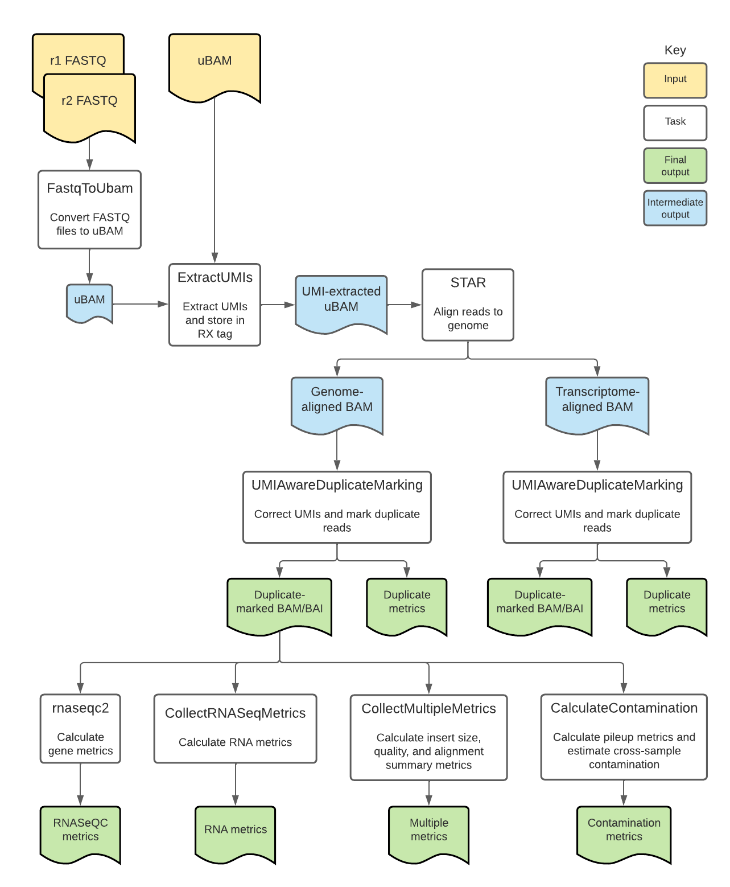

# RNA with UMIs Overview

| Pipeline Version | Date Updated | Documentation Authors | Questions or Feedback |
| :----: | :---: | :----: | :--------------: |
| [RNAWithUMIsPipeline_v1.0.16](https://github.com/broadinstitute/warp/releases?q=RNAwithUMIs&expanded=true) | February, 2024 | Elizabeth Kiernan & Kaylee Mathews | Please [file an issue in WARP](https://github.com/broadinstitute/warp/issues). |



## Introduction to the RNA with UMIs workflow

The [RNA with UMIs pipeline](https://github.com/broadinstitute/warp/blob/master/pipelines/broad/rna_seq/RNAWithUMIsPipeline.wdl) is an open-source, cloud-optimized workflow for processing total RNA isolated with the Transcriptome Capture (TCap) method. TCap is a technique that hybridizes exome baits to cDNA library preparations to better facilitate RNA-sequencing in low-input or poor quality (degraded) samples. These libraries may additionally be prepared with Unique Molecular Identifiers (UMIs), which can help distinguish biological signal from noise resulting from PCR amplification.

Overall, the workflow performs UMI correction, aligns reads to the genome, quantifies gene counts, and calculates quality metrics. The workflow produces genome- and transcriptome-aligned BAMs with indices and quality metrics files. 

While this workflow was created to be used with TCap RNA-seq data, it can be used to process any bulk RNA-seq data. 

<!--- add comment about validation of the pipeline --->

:::tip Want to use the RNA with UMIs pipeline for your publication?
Check out the [RNA with UMIs Methods](./rna-with-umis.methods.md) section to get started!
:::

## Quickstart table

The following table provides a quick glance at the RNA with UMIs pipeline features:

| Pipeline features | Description | Source | 
| --- | --- | --- |
| Assay type | TCap (or any bulk) RNA-seq data | [Cieslik et al. 2015](https://genome.cshlp.org/content/25/9/1372) |
| Overall workflow | Read alignment and transcriptome quantification | Code available from [GitHub](https://github.com/broadinstitute/warp/blob/master/pipelines/broad/rna_seq/RNAWithUMIsPipeline.wdl) |
| Workflow language | WDL 1.0 | [openWDL](https://github.com/openwdl/wdl) |
| Genomic reference sequence | GRCh38 (hg38) and GRCh37 (hg19) human genome primary sequence | Genome Reference Consortium [GRCh38](https://www.ncbi.nlm.nih.gov/assembly/GCF_000001405.39) and [GRCh37](https://www.ncbi.nlm.nih.gov/assembly/GCF_000001405.25/) |
| Gene annotations | GENCODE v34 (hg38) and v19 (hg19) gene annotations | GENCODE [v34](https://www.gencodegenes.org/human/release_34.html) and [v19](https://www.gencodegenes.org/human/release_19.html) | 
| Aligner | STAR | [STAR](https://github.com/alexdobin/STAR) |
| Transcript quantification and metric calculation | RNA-SeQC, Picard, and GATK | [RNA-SeQC](https://github.com/getzlab/rnaseqc), [Picard](https://broadinstitute.github.io/picard/), and [GATK](https://gatk.broadinstitute.org/hc/en-us) |
| Data input file format | File format in which sequencing data is provided | [BAM](http://samtools.github.io/hts-specs/) or [FASTQ](https://academic.oup.com/nar/article/38/6/1767/3112533) |
| Data output file formats | File formats in which RNA with UMIs outputs are provided | [BAM](http://samtools.github.io/hts-specs/); GCT (counts); TXT, TSV, and PDF (metrics) |

## Set-up

### Installation

To download the latest release of the RNA with UMIs pipeline, see the release tags prefixed with "RNAwithUMIs" on the WARP [releases page](https://github.com/broadinstitute/warp/releases). All releases of the RNA with UMIs pipeline are documented in the [RNA with UMIs changelog](https://github.com/broadinstitute/warp/blob/master/pipelines/broad/rna_seq/RNAWithUMIsPipeline.changelog.md). 

To search releases of this and other pipelines, use the WARP command-line tool [Wreleaser](https://github.com/broadinstitute/warp/tree/master/wreleaser).

If you’re running an RNA with UMIs workflow version prior to the latest release, the accompanying documentation for that release may be downloaded with the source code on the WARP [releases page](https://github.com/broadinstitute/warp/releases) (see the source code folder `website/docs/Pipelines/RNA_with_UMIs_Pipeline`).

The RNA with UMIs pipeline can be deployed using [Cromwell](https://cromwell.readthedocs.io/en/stable/), a GA4GH compliant, flexible workflow management system that supports multiple computing platforms. The workflow can also be run in [Terra](https://app.terra.bio), a cloud-based analysis platform. 

<!--- link to public workspace will go here --->

### Inputs

The RNA with UMIs workflow inputs are specified in JSON configuration files. Example configuration files can be found in the [test_inputs](https://github.com/broadinstitute/warp/tree/master/pipelines/broad/rna_seq/test_inputs) folder in the WARP repository.

#### Input descriptions

The workflow takes in either a set of paired-end FASTQ files or a read group unmapped BAM that has gone through base calling. 

| Input variable name | Description | Type |
| --- | --- | --- |
| bam | Read group-specific unmapped BAM file; alternatively, paired-end FASTQ files (`r1_fastq` and `r2_fastq`) may be used. | File |
| r1_fastq | Read 1 FASTQ file; alternatively, the unmapped bam file (`bam`) may be used as input. | File |
| r2_fastq | Read 2 FASTQ file; alternatively, the unmapped bam file (`bam`) may be used as input. | File |
| read1Structure | String describing how the bases in a sequencing run should be allocated into logical reads for read 1 by fgbio's [ExtractUmisFromBam](http://fulcrumgenomics.github.io/fgbio/tools/latest/ExtractUmisFromBam.html) tool; for more information about read structures, see the [fgbio documentation](https://github.com/fulcrumgenomics/fgbio/wiki/Read-Structures).  | String |
| read2Structure | String describing how the bases in a sequencing run should be allocated into logical reads for read 2 by fgbio's [ExtractUmisFromBam](http://fulcrumgenomics.github.io/fgbio/tools/latest/ExtractUmisFromBam.html) tool; for more information about read structures, see the [fgbio documentation](https://github.com/fulcrumgenomics/fgbio/wiki/Read-Structures).  | String |
| output_basename | String used as a prefix in workflow output files. | String |
| platform | String used to describe the sequencing platform. | String |
| library_name | String used to describe the library. | String |
| platform_unit | String used to describe the platform unit. | String |
| read_group_name | String used to describe the read group name. | String |
| sequencing_center | String used to describe the sequencing center; default is set to "BI". |  String |
| starIndex | TAR file containing genome indices used for the [STAR aligner](https://github.com/alexdobin/STAR). | File | 
| gtf | Gene annotation file (GTF) used for the [RNA-SeQC](https://github.com/getzlab/rnaseqc) tool. | File | 
| ref | FASTA file used for metric collection with [Picard](https://broadinstitute.github.io/picard/) tools. | File |
| refIndex | FASTA index file used for metric collection with [Picard](https://broadinstitute.github.io/picard/) tools. | File |
| refDict | Dictionary file used for metric collection with [Picard](https://broadinstitute.github.io/picard/) tools. | File |
| refFlat | refFlat file used for metric collection with [Picard](https://broadinstitute.github.io/picard/) tools. | File |
| ribosomalIntervals | Intervals file used for RNA metric collection with [Picard](https://broadinstitute.github.io/picard/) tools. | File |
| exonBedFile | Bed file used for fragment size calculations with the [RNA-SeQC](https://github.com/getzlab/rnaseqc) tool; contains non-overlapping exons.  | File |
| population_vcf | VCF file used for contamination estimation by GATK's [GetPileupSummaries](https://gatk.broadinstitute.org/hc/en-us/articles/4418051471643-GetPileupSummaries) and [CalculateContamination](https://gatk.broadinstitute.org/hc/en-us/articles/4418054253211-CalculateContamination) tools; contains common SNP sites from population-wide studies. | File |
| population_vcf_index | Population VCF index file used for contamination estimation by GATK's [GetPileupSummaries](https://gatk.broadinstitute.org/hc/en-us/articles/4418051471643-GetPileupSummaries) and [CalculateContamination](https://gatk.broadinstitute.org/hc/en-us/articles/4418054253211-CalculateContamination) tools. | File |

### References

The pipeline supports both hg19 and hg38 references. The reference set consists of:
1. .fasta, .fai, and .dict files
1. STAR index
1. GTF file (RNASeQC)
1. ribosomal interval list and refFlat file (Picard)

#### FASTA, index, and dictionary files

When running the workflow with the hg38 reference, we recommend using a version without HLA, ALT, and decoy contigs. These non-primary assembly contigs lead to reduced sensitivity unless the mapper is ALT-aware (e.g., bwa-mem). STAR is not ALT-aware, so these contigs should be removed.

In contrast, the hg19 reference does not have nearly as many contigs as the hg38 reference, so the workflow can be run using the standard hg19 reference stored in Broad's [public reference bucket](https://console.cloud.google.com/storage/browser/_details/gcp-public-data--broad-references/hg19/v0/Homo_sapiens_assembly19.fasta).

#### GTF file

Genome annotation files (GTFs) contain information about genes, such as the start and end coordinates of each exon, the name of the gene, and the type of the transcript (e.g., protein-coding, antisense). The workflow uses the GENCODE v34 GTF for hg38 and v19 for hg19.

#### Ribosomal interval list and refFlat file

The workflow ribosomal interval list and the refFlat file are used by Picard metrics calculation tools. The workflow uses a custom ribosomal interval list based on the public hg38 ribosomal interval list, which has been modified to include mitochondrial rRNA coding genes. 

#### Additional reference resources

For more information about ALT contigs, HLA, decoys, and ALT-aware mapping, see the following resources:

* [Heng Li's blog](https://lh3.github.io/2017/11/13/which-human-reference-genome-to-use) where he argues for removing ALT contigs to improve sensitivity (for both DNA and RNA). 
* [GATK blog post](https://gatk.broadinstitute.org/hc/en-us/articles/360041155232-Reference-Genome-Components) describing the components of a reference genome. 
* [Illumina DRAGEN documentation](https://support.illumina.com/content/dam/illumina-support/help/Illumina_DRAGEN_Bio_IT_Platform_v3_7_1000000141465/Content/SW/Informatics/Dragen/GPipelineAltMap_fDG.htm) describing ALT-aware mapping. 

## RNA with UMIs tasks and tools

The [RNA with UMIs workflow](https://github.com/broadinstitute/warp/blob/master/pipelines/broad/rna_seq/RNAWithUMIsPipeline.wdl) imports two additional WDL scripts. The [UMIAwareDuplicateMarking.wdl](https://github.com/broadinstitute/warp/blob/master/tasks/broad/UMIAwareDuplicateMarking.wdl) script is a nested workflow used to mark duplicate sequencing reads, while the [RNAWithUMIsTasks.wdl](https://github.com/broadinstitute/warp/blob/master/tasks/broad/RNAWithUMIsTasks.wdl) script contains individual "tasks" called by the workflow.

Overall, the RNA with UMIs workflow:
1. Converts FASTQs to unmapped BAMs. 
1. Extracts UMIs. 
1. Converts unmapped BAMs to FASTQs and filters reads.
1. Trims adapters and poly(A) tails.
1. Converts FASTQs to unmapped BAMs. 
1. Aligns reads. 
1. Marks duplicate reads and sorts BAMs.
1. Quantifies gene counts. 
1. Calculates RNA and genomic metrics.

The tools each task employs in the RNA with UMIs workflow are detailed in the table below. 

To see specific tool parameters, select the task WDL link in the table; then find the task and view the `command {}` section of the task in the WDL script. To view or use the exact tool software, see the task's Docker image which is specified in the task WDL `input {}` section as `String docker =`.

| Task name and WDL link | Tool | Software | Description | 
| --- | --- | --- | --- | 
| [tasks.FastqToUbam](https://github.com/broadinstitute/warp/blob/master/tasks/broad/RNAWithUMIsTasks.wdl) | FastqToSam | [Picard](https://broadinstitute.github.io/picard/) | Converts the paired-end FASTQ files to unmapped BAM. | 
| [tasks.ExtractUMIs](https://github.com/broadinstitute/warp/blob/master/tasks/broad/RNAWithUMIsTasks.wdl) | ExtractUmisFromBam | [fgbio](http://fulcrumgenomics.github.io/fgbio/) | Extracts UMIs from the unmapped BAM and stores them in the RX tag of output BAM. | 
| [tasks.SamToFastq](https://github.com/broadinstitute/warp/blob/develop/tasks/broad/RNAWithUMIsTasks.wdl) | FastqToSam | [Picard](https://broadinstitute.github.io/picard/) | Converts the BAM file to paired-end FASTQ files for adapter clipping and removes reads that fail platform/vendor quality checks performed by the sequencing platform. | 
| [tasks.Fastp](https://github.com/broadinstitute/warp/blob/develop/tasks/broad/RNAWithUMIsTasks.wdl) | fastp | [fastp](https://github.com/OpenGene/fastp) | Trims adapters and polyA tails from reads. |
| [tasks.FastqToUbam (alias = FastqToUbamAfterClipping)](https://github.com/broadinstitute/warp/blob/master/tasks/broad/RNAWithUMIsTasks.wdl) | FastqToSam | [Picard](https://broadinstitute.github.io/picard/) | Converts the trimmed paired-end FASTQ files to unmapped BAM. |
| [tasks.FastQC](https://github.com/broadinstitute/warp/blob/develop/tasks/broad/RNAWithUMIsTasks.wdl) | FastQC | [FastQC](https://github.com/s-andrews/FastQC) | Collects overall quality control metrics before alignment and generates an HTML-formatted report. |
| [tasks.STAR](https://github.com/broadinstitute/warp/blob/master/tasks/broad/RNAWithUMIsTasks.wdl) | STAR | [STAR](https://github.com/alexdobin/STAR) | Aligns reads to the genome (using the StarIndex file) and outputs aligned reads to BAM. The task additionally converts the resulting BAM file to transcriptome coordinates, producing a transcriptome-aligned BAM. Parameters are listed below. |
| [tasks.CopyReadGroupsToHeader](https://github.com/broadinstitute/warp/blob/master/tasks/broad/RNAWithUMIsTasks.wdl) | view, reheader | [Samtools](http://www.htslib.org/) | Copies the read group information from the genome-aligned BAM to the transcriptome-aligned BAM. |
| [UmiMD.UMIAwareDuplicateMarking](https://github.com/broadinstitute/warp/blob/master/tasks/broad/UMIAwareDuplicateMarking.wdl) | SortSam, MarkDuplicates, group | [Picard](https://broadinstitute.github.io/picard/), [GATK](https://gatk.broadinstitute.org/hc/en-us), [UMI-tools](https://umi-tools.readthedocs.io/en/latest/index.html) | Marks duplicates on the genome-aligned BAM and tags reads with error-corrected UMIs. | 
| [UmiMD.UMIAwareDuplicateMarking (alias = UMIAwareDuplicateMarkingTranscriptome)](https://github.com/broadinstitute/warp/blob/master/tasks/broad/UMIAwareDuplicateMarking.wdl) | SortSam, MarkDuplicates, group | [Picard](https://broadinstitute.github.io/picard/), [GATK](https://gatk.broadinstitute.org/hc/en-us), [UMI-tools](https://umi-tools.readthedocs.io/en/latest/index.html) | Marks duplicates on the transcriptome-aligned BAM and tags reads with error-corrected UMIs. |
| [tasks.PostprocessTranscriptomeForRSEM](https://github.com/broadinstitute/warp/blob/develop/tasks/broad/RNAWithUMIsTasks.wdl) | PostProcessReadsForRSEM | [GATK](https://gatk.broadinstitute.org/hc/en-us) | Sorts reads for RSEM compatibility. |
| [tasks.GetSampleName](https://github.com/broadinstitute/warp/blob/master/tasks/broad/RNAWithUMIsTasks.wdl) | GetSampleName | [GATK](https://gatk.broadinstitute.org/hc/en-us) | Writes the sample name from the unmapped BAM header into a separate text file. |
| [tasks.rnaseqc2](https://github.com/broadinstitute/warp/blob/master/tasks/broad/RNAWithUMIsTasks.wdl) | rnaseqc | [RNA-SeQC](https://github.com/getzlab/rnaseqc) | Uses the genome-aligned, duplicate-marked BAM file to calculate TPMs, gene counts, exon counts, fragment sizes, and additional metrics, each of which is outputted to an individual file. |
| [tasks.CollectRNASeqMetrics](https://github.com/broadinstitute/warp/blob/master/tasks/broad/RNAWithUMIsTasks.wdl) | CollectRNASeqMetrics | [Picard](https://broadinstitute.github.io/picard/) | Calculates RNA metrics; strand specificity is set to SECOND_READ_TRANSCRIPTION_STRAND. |
| [tasks.CollectMultipleMetrics](https://github.com/broadinstitute/warp/blob/master/tasks/broad/RNAWithUMIsTasks.wdl) | CollectMultipleMetrics | [Picard](https://broadinstitute.github.io/picard/) | Collects multiple classes of metrics; runs tools CollectInsertSizeMetrics and CollectAlignmentSummaryMetrics. |
| [tasks.CalculateContamination](https://github.com/broadinstitute/warp/blob/master/tasks/broad/RNAWithUMIsTasks.wdl) | GetPileupSummaries, Calculate Contamination | [GATK](https://gatk.broadinstitute.org/hc/en-us) | Uses the population VCF and index files to calculate pileup metrics and estimate cross-sample contamination. |

#### 1. Convert FASTQ to uBAM

If paired-end FASTQ files are used as inputs for the pipeline, the first task in the pipeline converts those FASTQ files into an unmapped BAM file using Picard's [FastqToSam](https://gatk.broadinstitute.org/hc/en-us/articles/360036510672).

This task is skipped if a read group unmapped BAM file is used as input for the pipeline. 

#### 2. UMI extraction

Unique molecular identifiers (UMIs) are DNA tags (bases) that identify each DNA molecule before PCR amplification. They enable us to detect whether two reads that align to the same position in the reference are sequences of the same DNA molecule (have the same UMIs; PCR duplicates) or are two separate copies of DNA that happen to have the same sequence (have different UMIs; biological or natural duplicates).

For example, the Illumina sequencers used by the Broad Genomics Platform read 151 bp per read, of which 5 bp are reserved for the UMIs.

The first step of the RNA with UMIs workflow is to use the fgbio's [ExtractUMIsFromBam](http://fulcrumgenomics.github.io/fgbio/tools/latest/ExtractUmisFromBam.html) to remove UMI bases from the reads and store them in the RX read tag. 

The resulting RX tag may contain information like "ACT-GCT." The "ACT" is the 3 bp for read 1 and the "GCT" is the 3 bp for read 2. Even though we reserve 5 bases in a read, we only use 3 bases for UMI; the other two bases are reserved for cell barcode, which the workflow doesn't use.

#### 3. Convert uBAM to FASTQs and filter reads

The [tasks.SamToFastq](https://github.com/broadinstitute/warp/blob/develop/tasks/broad/RNAWithUMIsTasks.wdl) task uses Picard's [FastqToSam](https://gatk.broadinstitute.org/hc/en-us/articles/360036510672) to convert the unmapped BAM to paired-end FASTQ files that can then be used for adapter clipping. This step also removes reads that fail to pass platform/vendor quality checks performed by the sequencing platform and flagged with the corresponding [SAM flag value](https://broadinstitute.github.io/picard/explain-flags.html).

#### 4. Trim adapters and poly(A) tails

After converting the uBAM to FASTQs, the workflow uses [fastp](https://github.com/OpenGene/fastp) to trim sequencing adapters and poly(A) tails from the reads. This task requires an [adapter FASTA file](https://console.cloud.google.com/storage/browser/_details/gcp-public-data--broad-references/RNA/resources/Illumina_adapters.fasta;tab=live_object) containing the list of sequences to be trimmed and is publicly available in Broad's [public reference bucket](https://console.cloud.google.com/storage/browser/gcp-public-data--broad-references;tab=objects?prefix=&forceOnObjectsSortingFiltering=false).

The adapter FASTA file contains the sequences shown below.
```
>Illumina TruSeq Adapter Read 1
AGATCGGAAGAGCACACGTCTGAACTCCAGTCA
>Illumina TruSeq Adapter Read 2
AGATCGGAAGAGCGTCGTGTAGGGAAAGAGTGT
>polyA
AAAAAAAAAAAAAAAAAAAAAAAAAAAAAAAAAAAAAAAAAAAAAAA
```

#### 5. Convert FASTQs to uBAM

The [tasks.FastqToUbam (alias = FastqToUbamAfterClipping)](https://github.com/broadinstitute/warp/blob/master/tasks/broad/RNAWithUMIsTasks.wdl) task converts trimmed FASTQs to an unmapped BAM using Picard's [FastqToSam](https://gatk.broadinstitute.org/hc/en-us/articles/360036510672).

#### 6. Alignment with STAR

After UMI extraction, the workflow aligns the paired-end reads to the reference (hg38 or hg19) using the [STAR aligner](https://github.com/alexdobin/STAR), which is specifically designed for RNA-seq data and can align cDNA sequences with many "gaps" that correspond to introns. 

The task uses the following parameters:

| Parameter | Value | Notes |
| --- | --- | --- |
| outSAMunmapped | Within | Includes unmapped reads in the output file rather than dropping those reads to facilitate potential downstream analysis. | 
| outFilterMismatchNoverLmax | 0.1 | Sets the maximum allowable ratio of mismatches to read length. Reads with a ratio larger than the set value are filtered. For example, for paired-end reads with length 146, the reads are filtered if the number of mismatches is greater than 29 (146 \* 2 \* 0.1 = 29).|
| alignEndsProtrude | 20 ConcordantPair | Allows a maximum of 20 protruding bases at alignment ends and marks these alignments as concordant pairs to prevent reads from small cDNA fragments that were sequenced into adapters from being dropped. This parameter allows for the processing of data derived from low-quality or degraded tissue such as formalin-fixed paraffin-embedded (FFPE) samples. |

Additional parameters are used to match [ENCODE bulk RNA-seq data standards](https://www.encodeproject.org/data-standards/rna-seq/long-rnas/). To learn more about ENCODE options in STAR, see the [STAR manual](https://github.com/alexdobin/STAR/blob/master/doc/STARmanual.pdf).

After STAR alignment, the workflow outputs both a genome- and transcriptome-aligned BAM.

#### 7. Mark duplicates and sort BAMs

As described in Step 2 (UMI extraction), UMIs are DNA tags that allow us to distinguish between PCR duplicates (duplicate reads with the same UMI) and biological duplicates (duplicate reads with different UMIs).

In this step, the workflow sorts the aligned BAMs coordinates using Picard's [SortSam](https://gatk.broadinstitute.org/hc/en-us/articles/360036510732-SortSam-Picard-) tool and then groups the duplicates using UMI-tools' [group](https://umi-tools.readthedocs.io/en/latest/reference/group.html#) function. Once the duplicates are grouped by UMI, the PCR duplicates are marked using Picard's [MarkDuplicates](https://gatk.broadinstitute.org/hc/en-us/articles/360037052812-MarkDuplicates-Picard-). This step outputs new genome- and transcriptome-aligned BAM files with PCR duplicates tagged and a corresponding index file.

The transcriptome-aligned BAM is then sorted using GATK’s [PostProcessReadsForRSEM](https://gatk.broadinstitute.org/hc/en-us/articles/5358861221659-PostProcessReadsForRSEM-BETA-) for compatibility with [RSEM](https://github.com/deweylab/RSEM). While RSEM is not used in this workflow, it is an additional tool that can be used to quantify expression from RNA-seq data.

#### 8. Gene quantification

After duplicate reads have been tagged, the workflow uses [RNA-SeQC](https://github.com/getzlab/rnaseqc) to quantify the expression level of transcripts based on the number of reads that align to one or more exons of each gene (`rnaseqc2_gene_counts`). Exon-level expression is also quantified based on the number of reads that align to each exon (`rnaseqc2_exon_counts`). 

#### 9. Metric calculation

The pipeline uses [FastQC](https://github.com/s-andrews/FastQC),  [RNA-SeQC](https://github.com/getzlab/rnaseqc), Picard's [CollectRNASeqMetrics](https://gatk.broadinstitute.org/hc/en-us/articles/360037057492-CollectRnaSeqMetrics-Picard-) and [CollectMultipleMetrics](https://gatk.broadinstitute.org/hc/en-us/articles/360037594031-CollectMultipleMetrics-Picard-) tools, and GATK's [GetPileupSummaries](https://gatk.broadinstitute.org/hc/en-us/articles/4418051471643-GetPileupSummaries) and [CalculateContamination](https://gatk.broadinstitute.org/hc/en-us/articles/4418054253211-CalculateContamination) tools to calculate summary metrics that can be used to assess the quality of the data each time the pipeline is run. 

If you are a member of the Broad Institute's Genomics Platform using the [internal RNA with UMIs pipeline](https://github.com/broadinstitute/warp/blob/master/pipelines/broad/internal/rna_seq/BroadInternalRNAWithUMIs.wdl), there is an additional step that merges the individual metrics files to create the `MergeMetrics.unified_metrics` output file and prepare the data for use in the Terra Data Repository.

#### 10. Outputs

Workflow outputs are described in the table below. 
<!--- Link to metrics overview will go here --->

| Output variable name | Description | Type | 
| ------ | ------ | ------ |
| sample_name | Sample name extracted from the input unmapped BAM file header. | String
| transcriptome_bam | Duplicate-marked BAM file containing alignments from STAR translated into transcriptome coordinates and postprocessed for RSEM. | BAM |
| transcriptome_duplicate_metrics | File containing duplication metrics. | TXT | 
| output_bam | Duplicate-marked BAM file containing alignments from STAR translated into genome coordinates. | BAM |
| output_bam_index | Index file for the output_bam output. | BAM Index |
| duplicate_metrics | Duplicate metrics file containing the number of reads marked as duplicates. | TXT |
| rnaseqc2_gene_tpm | File containing TPMs. | GCT |
| rnaseqc2_gene_counts | File containing gene counts. | GCT |
| rnaseqc2_exon_counts | File containing exon counts. | GCT |
| rnaseqc2_fragment_size_histogram | File containing counts of observed fragment size. | TXT |
| rnaseqc2_metrics | File containing RNA-SeQC metrics including strand specificity, 3’/5’ bias, rRNA reads, and others. | TSV |
| picard_rna_metrics | Metrics file containing the output of Picard’s CollectRnaSeqMetrics tool. | TXT |
| picard_alignment_summary_metrics | Metrics file containing output of Picard’s CollectAlignmentSummaryMetrics tool. | TXT |
| picard_insert_size_metrics | Metrics file containing output of Picard’s CollectInsertSizeMetrics tool. | TXT |
| picard_insert_size_histogram | Histogram chart of insert size. | PDF |
| picard_base_distribution_by_cycle_metrics | Metrics file containing the output of Picard’s CollectBaseDistributionByCycle tool. | TXT |
| picard_base_distribution_by_cycle_pdf | Chart of nucleotide distribution per cycle. | PDF |
| picard_quality_by_cycle_metrics | Metrics file containing the output of Picard’s MeanQualityByCycle tool. | TXT |
| picard_quality_by_cycle_pdf | Chart of mean quality by cycle. | PDF |
| picard_quality_distribution_metrics | Metrics file containing the output of Picard’s QualityScoreDistribution tool. | TXT |
| picard_quality_distribution_pdf | Chart of quality score distribution. | PDF |
| contamination | Float representing the calculated cross-sample contamination. | Float |
| contamination_error | Float representing the error associated with the contamination calculation. | Float |
| fastqc_html_report | HTML report containing general quality control metrics generated by FastQC. | File |
| fastqc_percent_reads_with_adapter | Float representing the percent of reads with adapter sequences present following the adapter clipping task. | Float |

<!--- Validation will go here --->

## Versioning

All RNA with UMIs pipeline releases are documented in the [pipeline changelog](https://github.com/broadinstitute/warp/blob/master/pipelines/broad/rna_seq/RNAWithUMIsPipeline.changelog.md).

## Citing the RNA with UMIs Pipeline

If you use the RNA with UMIs Pipeline in your research, please cite our preprint:

Degatano, K.; Awdeh, A.; Dingman, W.; Grant, G.; Khajouei, F.; Kiernan, E.; Konwar, K.; Mathews, K.; Palis, K.; Petrillo, N.; Van der Auwera, G.; Wang, C.; Way, J.; Pipelines, W. WDL Analysis Research Pipelines: Cloud-Optimized Workflows for Biological Data Processing and Reproducible Analysis. Preprints 2024, 2024012131. https://doi.org/10.20944/preprints202401.2131.v1

When citing WARP, please use the following:

Degatano, Kylee, Aseel Awdeh, Robert Sidney Cox III, Wes Dingman, George Grant, Farzaneh Khajouei, Elizabeth Kiernan, et al. 2025. "Warp Analysis Research Pipelines: Cloud-Optimized Workflows for Biological Data Processing and Reproducible Analysis." _Bioinformatics (Oxford, England)_, September, https://doi.org/10.109