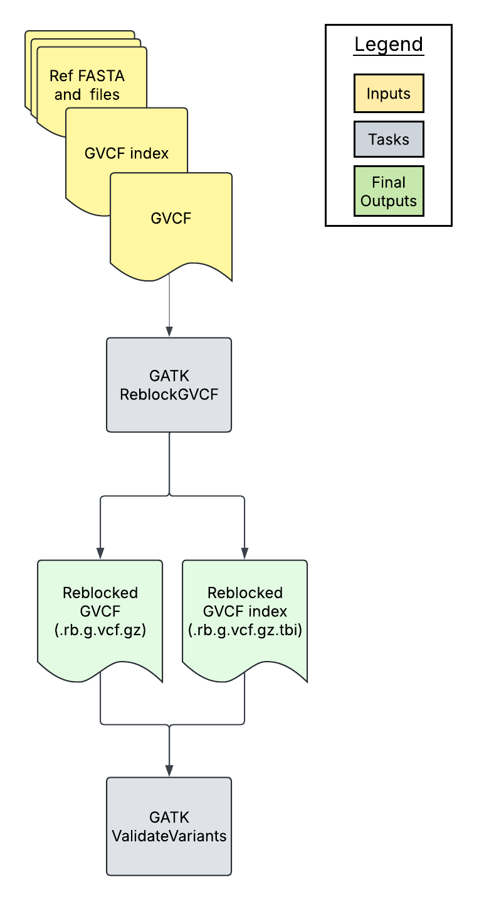

# ReblockGVCF Overview

| Pipeline Version | Date Updated | Documentation Author | Questions or Feedback |
| :----: | :---: | :----: | :--------------: |
| [ReblockGVCF_v2.4.4](https://github.com/broadinstitute/warp/releases) | August, 2026 | [WARP Pipelines](mailto:warp@broadinstitute.org) | Please [file an issue in WARP](https://github.com/broadinstitute/warp/issues). |

## Introduction to the ReblockGVCF workflow

The [ReblockGVCF workflow](https://github.com/broadinstitute/warp/blob/master/pipelines/wdl/dna_seq/germline/joint_genotyping/reblocking/ReblockGVCF.wdl) is an open-source, cloud-optimized pipeline that takes a single-sample GVCF file produced by GATK HaplotypeCaller (in GVCF mode) and "reblocks" it—condensing the reference (non-variant) blocks—to produce a smaller, analysis-ready GVCF and its index.

Reblocking merges adjacent reference-confidence blocks and drops unnecessary per-position annotations while preserving all variant-site information. This has two primary benefits:

* **It is a recommended precursor to joint calling.** Reblocked GVCFs make the [JointGenotyping pipeline](../JointGenotyping/README.md) run faster and at lower cost, because there is far less reference-block data to import into GenomicsDB and process. Reblocking is the expected input format for modern GATK joint genotyping.
* **It reduces storage costs on its own.** Because reblocking substantially shrinks each GVCF without losing variant information, it is also useful as a standalone step for reducing the long-term storage footprint of a GVCF callset—even when joint calling is not the immediate goal.

The pipeline uses GATK's [ReblockGVCF](https://gatk.broadinstitute.org/hc/en-us/articles/360037593171-ReblockGVCF) tool and then validates the reblocked output with GATK's ValidateVariants tool. It produces a reblocked GVCF (named with the `.rb.g.vcf.gz` suffix) and its `.tbi` index. If you are new to GVCF/VCF files, see the [VCF file type specification](https://samtools.github.io/hts-specs/VCFv4.2.pdf). To learn more about reblocking, see the [GATK reblocking article](https://gatk.broadinstitute.org/hc/en-us/articles/360037593171-ReblockGVCF) and the [WARP reblocking blog post](https://broadinstitute.github.io/warp/blog/Nov21_ReblockedGVCF).

The ReblockGVCF pipeline can be run on Google Cloud (GCP) or Amazon Web Services (AWS), selected using the `cloud_provider` input.

## Set-up

### ReblockGVCF installation and requirements

The ReblockGVCF workflow code can be downloaded by cloning the [WARP GitHub repository](https://github.com/broadinstitute/warp). For the latest release, see the release tags prefixed with "ReblockGVCF" on the WARP [releases page](https://github.com/broadinstitute/warp/releases). All ReblockGVCF pipeline releases are documented in the [ReblockGVCF changelog](https://github.com/broadinstitute/warp/blob/master/pipelines/wdl/dna_seq/germline/joint_genotyping/reblocking/ReblockGVCF.changelog.md).

To search releases of this and other pipelines, use the WARP command-line tool [Wreleaser](https://github.com/broadinstitute/warp/tree/master/wreleaser).

The pipeline can be deployed using [Cromwell](https://cromwell.readthedocs.io/en/stable/), a GA4GH-compliant, flexible workflow management system that supports multiple computing platforms. The workflow can also be run in [Terra](https://app.terra.bio), a cloud-based analysis platform.

### Inputs

The ReblockGVCF workflow requires a single-sample GVCF (and its index) along with the reference files against which the GVCF was called. It processes **one sample per invocation**; to reblock many samples, run (or scatter) the workflow once per GVCF.

#### Input descriptions

| Input variable name | Description | Type |
| --- | --- | --- |
| gvcf | Single-sample GVCF file produced by GATK HaplotypeCaller in GVCF mode. | File |
| gvcf_index | Index (`.tbi`) for the input GVCF. | File |
| ref_fasta | Reference genome FASTA file that the GVCF was called against (e.g., hg38). | File |
| ref_fasta_index | Index (`.fai`) for the reference FASTA. | File |
| ref_dict | Sequence dictionary (`.dict`) for the reference FASTA. | File |
| cloud_provider | Cloud provider used to select the GATK Docker image; must be `"gcp"` or `"aws"`. | String |
| calling_interval_list | *(Optional)* Interval list used when validating the reblocked GVCF. If not provided, the input GVCF is used to define validation intervals. | File |
| tree_score_cutoff | *(Optional)* Tree-score threshold below which genotypes are set to no-call (passed to GATK as `--tree-score-threshold-to-no-call`). | Float |
| annotations_to_keep_command | *(Optional)* GATK command-string specifying annotations to retain during reblocking. | String |
| annotations_to_remove_command | *(Optional)* GATK command-string specifying annotations to remove during reblocking. | String |
| move_filters_to_genotypes | *(Optional)* If `true`, adds site-level filters to the genotype (GATK `--add-site-filters-to-genotype`). Default: `false`. | Boolean |
| gvcf_file_extension | *(Optional)* File extension of the input GVCF, used to derive the output basename. Default: `.g.vcf.gz`. | String |

## ReblockGVCF tasks and tools

The [ReblockGVCF workflow](https://github.com/broadinstitute/warp/blob/master/pipelines/wdl/dna_seq/germline/joint_genotyping/reblocking/ReblockGVCF.wdl) imports individual "tasks," also written in WDL script, from the WARP [tasks folder](https://github.com/broadinstitute/warp/tree/master/tasks/wdl).

Overall, the ReblockGVCF workflow:

1. Validates that a supported `cloud_provider` was supplied.
1. Reblocks the input GVCF using GATK ReblockGVCF.
1. Validates the reblocked GVCF.

The tasks and tools used in the ReblockGVCF workflow are detailed in the table below.

To see specific tool parameters, select the task WDL link in the table; then find the task and view the `command {}` section of the task in the WDL script. To view or use the exact tool software, see the task's Docker image which is specified in the task WDL `# runtime values` section as `String docker =`.

| Task | Tool | Software | Description |
| --- | --- | --- | --- |
| [ErrorWithMessage](https://github.com/broadinstitute/warp/blob/develop/tasks/wdl/Utilities.wdl) | bash | bash | Confirms that `cloud_provider` is either `"gcp"` or `"aws"`; if not, the workflow fails with an informative error message. |
| [Reblock](https://github.com/broadinstitute/warp/blob/develop/tasks/wdl/GermlineVariantDiscovery.wdl) | ReblockGVCF | [GATK](https://gatk.broadinstitute.org/hc/en-us) | Reblocks the single-sample GVCF, merging reference-confidence blocks (with quality-approximation and floored GQ blocks) and applying any optional annotation-keep/remove, tree-score, and filter-to-genotype settings; outputs the reblocked GVCF and its index. |
| [ValidateVCF](https://github.com/broadinstitute/warp/blob/develop/tasks/wdl/Qc.wdl) | ValidateVariants | [GATK](https://gatk.broadinstitute.org/hc/en-us) | Validates the reblocked GVCF against the reference to confirm it is well-formed. |

## Outputs

The following table lists the output variables and files produced by the pipeline.

| Output name | Filename, if applicable | Output format and description |
| ------ | ------ | ------ |
| reblocked_gvcf | `<gvcf_basename>.rb.g.vcf.gz` | The reblocked single-sample GVCF file. |
| reblocked_gvcf_index | `<gvcf_basename>.rb.g.vcf.gz.tbi` | Index for the reblocked GVCF. |

The reblocked GVCF is the recommended input to the [JointGenotyping pipeline](../JointGenotyping/README.md) (list each sample's reblocked GVCF in the joint-genotyping sample map).

## Time and cost

Reblocking is a lightweight, single-sample operation, so per-sample runtime and cost are small relative to downstream joint calling. Runtime parameters are optimized for Broad's Google Cloud Platform implementation.

<!-- TODO: Replace with measured Terra benchmarks. -->

| Sample type | Time | Cost $ |
| --- | --- | --- |
| _Whole genome GVCF (example)_ | _TBD_ | _TBD_ |

For guidance on controlling cloud costs, see [this article](https://support.terra.bio/hc/en-us/articles/360029748111).

## Versioning and testing

All ReblockGVCF pipeline releases are documented in the [ReblockGVCF changelog](https://github.com/broadinstitute/warp/blob/master/pipelines/wdl/dna_seq/germline/joint_genotyping/reblocking/ReblockGVCF.changelog.md). To learn more about WARP pipeline testing, see [Testing Pipelines](https://broadinstitute.github.io/warp/docs/About_WARP/TestingPipelines).

## Citing the ReblockGVCF Pipeline

If you use the ReblockGVCF Pipeline in your research, please consider citing our preprint:

Degatano, K., Awdeh, A., Cox III, R.S., Dingman, W., Grant, G., Khajouei, F., Kiernan, E., Konwar, K., Mathews, K.L., Palis, K., et al. Warp Analysis Research Pipelines: Cloud-optimized workflows for biological data processing and reproducible analysis. Bioinformatics 2025; btaf494. https://doi.org/10.1093/bioinformatics/btaf494

## Feedback

Please help us make our tools better by [filing an issue in WARP](https://github.com/broadinstitute/warp/issues); we welcome pipeline-related suggestions or questions.
