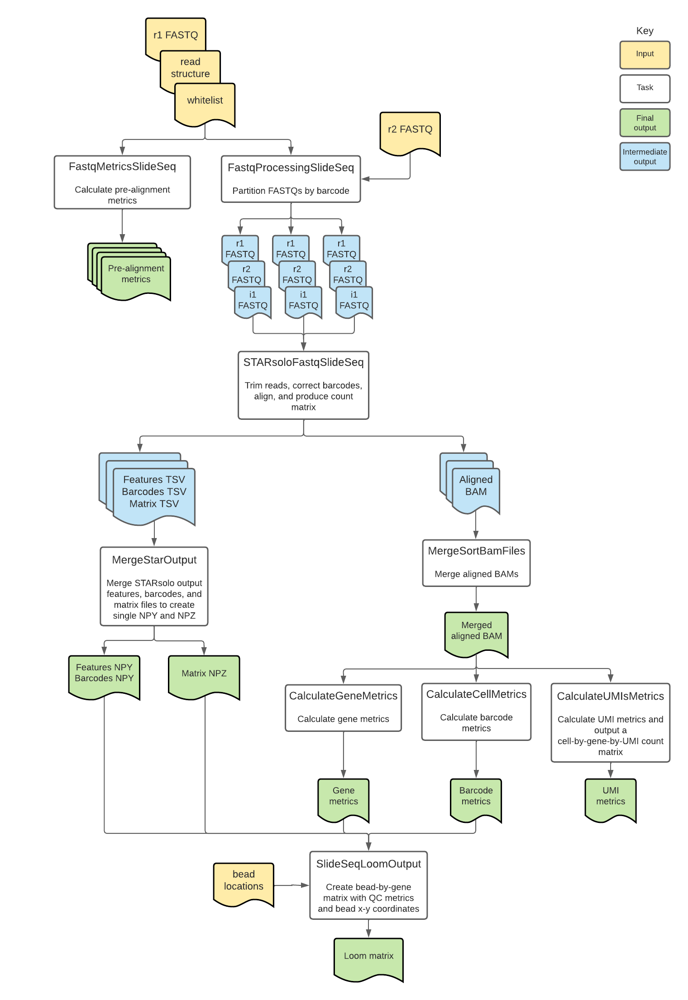

# SlideSeq Overview

| Pipeline Version | Date Updated | Documentation Author | Questions or Feedback |
| :----: | :---: | :----: | :--------------: |
| [SlideSeq v1.0.0](https://github.com/broadinstitute/warp/releases?q=slideseq&expanded=true) | October, 2022 | Elizabeth Kiernan & Kaylee Mathews | Please file GitHub issues in warp or contact [documentation authors](mailto:warp-pipelines-help@broadinstitute.org) |

## Introduction to the SlideSeq workflow

The [SlideSeq workflow](https://github.com/broadinstitute/warp/blob/master/pipelines/skylab/slide_seq/SlideSeq.wdl) is an open-source, cloud-optimized pipeline developed by the [BRAIN Initiative Cell Census Network](https://biccn.org/) (BICCN). It supports the processing of spatial transcriptomic data generated with the [Slide-seq assay](https://www.science.org/doi/10.1126/science.aaw1219).

Overall, the workflow corrects bead barcodes, aligns reads to the genome, generates a count matrix, calculates summary metrics for genes and beads, and returns read outputs in BAM format. Additionally, it returns bead and gene counts as well as bead coordinates in NumPy matrix and Loom file formats.

SlideSeq has been validated for analyzing mouse datasets generated with the Slide-seq assay. Learn more in the [validation section](#validation-against-on-prem-pipeline).

<!--- tip for methods section --->

## Quickstart table
The following table provides a quick glance at the SlideSeq pipeline features:

| Pipeline features | Description | Source |
| --- | --- | --- |
| Assay type | Slide-seq | [Rodriques et al. 2019](https://www.science.org/doi/10.1126/science.aaw1219)
| Overall workflow | Quality control and transcriptome quantification module | Code available from [GitHub](https://github.com/broadinstitute/warp/blob/master/pipelines/skylab/slide_seq/SlideSeq.wdl) |
| Workflow language | WDL 1.0 | [openWDL](https://github.com/openwdl/wdl) |
| Genomic Reference Sequence | M23 (GRCm38.p6) mouse genome primary sequence | GENCODE [mouse reference files](https://www.gencodegenes.org/mouse/release_M23.html) |
| Transcriptomic reference annotation | M23 mouse transcriptome built with the [BuildIndices workflow](https://github.com/broadinstitute/warp/blob/master/pipelines/skylab/build_indices/BuildIndices.wdl) | GENCODE [mouse GTF](https://ftp.ebi.ac.uk/pub/databases/gencode/Gencode_mouse/release_M23/gencode.vM23.annotation.gff3.gz); modified version available in Broad’s [public reference bucket](https://console.cloud.google.com/storage/browser/gcp-public-data--broad-references?pageState=(%22StorageObjectListTable%22:(%22f%22:%22%255B%255D%22))&prefix=&forceOnObjectsSortingFiltering=false) | 
| Aligner and transcript quantification | STARsolo | [Kaminow et al. 2021](https://www.biorxiv.org/content/10.1101/2021.05.05.442755v1) |
| Data input file format | File format in which sequencing data is provided | [FASTQ](https://academic.oup.com/nar/article/38/6/1767/3112533) |
| Data output file format | File formats in which SlideSeq output is provided | [BAM](http://samtools.github.io/hts-specs/), Python NumPy arrays, and Loom (generated with [Loompy)](http://loompy.org/) |

## Set-up

### SlideSeq installation

To download the latest SlideSeq release, see the release tags prefixed with "SlideSeq" on the WARP [releases page](https://github.com/broadinstitute/warp/releases). All SlideSeq pipeline releases are documented in the [SlideSeq changelog](https://github.com/broadinstitute/warp/blob/master/pipelines/skylab/slide_seq/SlideSeq.changelog.md). 

To search releases of this and other pipelines, use the WARP command-line tool [Wreleaser](https://github.com/broadinstitute/warp/tree/master/wreleaser).

If you’re running a SlideSeq workflow version prior to the latest release, the accompanying documentation for that release may be downloaded with the source code on the WARP [releases page](https://github.com/broadinstitute/warp/releases) (see the source code folder `website/docs/Pipelines/SlideSeq_Pipeline`.

The SlideSeq pipeline can be deployed using [Cromwell](https://cromwell.readthedocs.io/en/stable/), a GA4GH compliant, flexible workflow management system that supports multiple computing platforms. The workflow can also be run in [Terra](https://app.terra.bio), a cloud-based analysis platform. 

<!--- link to public workspace will go here --->

### Inputs

The SlideSeq workflow inputs are specified in JSON configuration files. Example configuration files can be found in the [test_inputs](https://github.com/broadinstitute/warp/tree/master/pipelines/skylab/slide_seq/test_inputs) folder in the WARP repository.

#### Input descriptions

| Parameter name | Description | Type |
| --- | --- | --- | 
|  r1_fastq | Array of Read 1 FASTQ files; forward reads containing bead barcodes and Unique Molecular Identifiers (UMIs). | Array[File] |
| r2_fastq | Array of Read 2 FASTQ files; reverse reads containing the cDNA fragment generated from captured mRNA. | Array[File] |
| i1_fastq | Optional array of i1 (index) FASTQ files; index reads used for demultiplexing of multiple samples on one flow cell. | Array[File] | 
| input_id | Name of sample matching this file; inserted into read group header. | String |
| read_structure | Description of the UMI (M) and Barcode (C) positions in the Read 1 FASTQ. | String |
| tar_star_reference | Cloud path to the TAR file containing a species-specific reference genome and GTF; generated using the [BuildIndices workflow](https://github.com/broadinstitute/warp/tree/develop/pipelines/skylab/build_indices/BuildIndices.wdl). | File | 
| annotations_gtf | Cloud path to the GTF containing gene annotations used for gene tagging (must match GTF in STAR reference). | File | 
| whitelist | TSV file containing bead barcodes and XY coordinates on a single line for each bead; determined by sequencing prior to mRNA transfer and library preparation. | File |
| output_bam_basename | Optional string used for the output BAM file basename; default is set to “input_id”. | String | 
| count_exons | Optional boolean indicating if the workflow should calculate exon counts; default is set to “false” and produces a Loom file with whole-gene counts; when set to “true” an additional layer of the Loom file is produced with exon counts. | Boolean |

#### Pseudogene handling

The example SlideSeq reference files are created using the [BuildIndices pipeline](https://github.com/broadinstitute/warp/blob/master/pipelines/skylab/build_indices/BuildIndices.wdl). The BuildIndices pipeline modifies a given GTF downloaded from GENCODE to only include biotypes that are listed in a tab separated file ([biotypes.tsv](https://github.com/broadinstitute/warp/blob/develop/dockers/skylab/snss2-build-indices/Biotypes.tsv)). The example references do not include the pseudogene biotype. Learn more about Ensembl biotypes in the [Ensembl overview](https://m.ensembl.org/info/genome/genebuild/biotypes.html).

<!--- #### Sample inputs for analyses in a Terra Workspace --->

## SlideSeq tasks and tools

The [SlideSeq workflow](https://github.com/broadinstitute/warp/blob/master/pipelines/skylab/slide_seq/SlideSeq.wdl) imports individual "tasks," also written in WDL script, from the WARP [tasks folder](https://github.com/broadinstitute/warp/tree/master/tasks/skylab). 

Overall, the SlideSeq workflow:
1. Calculates prealignment metrics.
1. Filters, trims and splits reads into < 30 GB FASTQs with sctools.
1. Corrects bead barcodes, aligns reads, and counts genes with STARsolo.
1. Calculates metrics.
1. Merges the Star outputs into NPY and NPZ arrays.
1. Merges gene counts, metrics, and bead locations into a Loom-formatted matrix.

The tools each SlideSeq task employs are detailed in the table below. 

To see specific tool parameters, select the task WDL link in the table; then find the task and view the `command {}` section of the task in the WDL script. To view or use the exact tool software, see the task's Docker image which is specified in the task WDL `# runtime values` section as `String docker =`.

| Task name and WDL link | Tool | Software | Description | 
| --- | --- | --- | --- | 
| [Metrics.FastqMetricsSlidSeq (alias = FastqMetrics)](https://github.com/broadinstitute/warp/blob/master/tasks/skylab/Metrics.wdl) | fastq_metrics | [sctools](https://github.com/HumanCellAtlas/sctools) | Calculates prealignment metrics from the input FASTQ files. Outputs metrics files including the bead barcode distribution, UMI distribution, number of reads per cell and number of UMIs per cell. |
| [FastqProcessing.FastqProcessingSlidSeq (alias = SplitFastq)](https://github.com/broadinstitute/warp/blob/master/tasks/skylab/FastqProcessing.wdl) | fastq_slideseq | [sctools](https://github.com/HumanCellAtlas/sctools) | Filters reads, trims bead barcodes in read 1 to remove spacer sequences, and partitions the input FASTQ files by bead barcode to create an array of FASTQ files that are each ~ 30 GB. The function keeps all reads belonging to the same bead barcode in the same partitioned FASTQ file.| 
| [StarAlign.STARsoloFastqSlideSeq (alias = STARsoloFastqSlideSeq)](https://github.com/broadinstitute/warp/blob/master/tasks/skylab/StarAlign.wdl) | STAR | [Star](https://github.com/alexdobin/STAR) | For each of the partitioned FASTQ files, performs bead barcode correction, poly(A) tail trimming from adapters, alignment, gene annotation, and gene counting. Produces a count matrix and BAM file for each partition.|
| [Merge.MergeSortBamFiles (alias= MergeBam)](https://github.com/broadinstitute/warp/blob/master/tasks/skylab/MergeSortBam.wdl) | MergeSamFiles | [Picard](https://broadinstitute.github.io/picard/) | Merges the array of BAM files into a single BAM and sorts in coordinate order. |
| [Metrics.CalculateGeneMetrics (alias = GeneMetrics)](https://github.com/broadinstitute/warp/blob/master/tasks/skylab/Metrics.wdl) | TagSort | [sctools](https://github.com/HumanCellAtlas/sctools) | Sorts the BAM file by gene using the bead barcode (CB), molecule barcode (UB), and gene ID (GX) tags and computes gene metrics. | 
| [Metrics.CalculateCellMetrics (alias = CellMetrics)](https://github.com/broadinstitute/warp/blob/master/tasks/skylab/Metrics.wdl) | TagSort | [sctools](https://github.com/HumanCellAtlas/sctools) | Sorts the BAM file by bead using the bead barcode (CB), molecule barcode (UB), and gene ID (GX) tags and computes bead metrics. |
| [StarAlign.MergeStarOutput (alias = MergeStarOutputs)](https://github.com/broadinstitute/warp/blob/master/tasks/skylab/StarAlign.wdl) | create-npz-output.py | [Python 3](https://www.python.org/) | Creates a compressed raw NPY or NPZ file containing the STARsolo output features (NPY), barcodes (NPZ) and counts (NPZ). When `count_exons` is true, the task is run as `MergeStarOutputsExons` and additional NPY and NPZ files are output containing exon counts. | 
| [LoomUtils.SlideSeqLoomOutput (alias = SlideseqLoomGeneration)](https://github.com/broadinstitute/warp/blob/master/tasks/skylab/LoomUtils.wdl) | create_loom_slide_seq.py | [Python 3](https://www.python.org/) | Merges the gene counts, bead metrics, and gene metrics data into a Loom formatted bead-by-gene matrix. By default, the Loom contains whole-gene counts. When `count_exons` is true, the task is run as `SlideseqLoomGenerationWithExons` and an additional layer is added to the Loom file containing exon counts. |

#### 1. Calculating prealignment metrics
The [FastqMetricsSlidSeq](https://github.com/broadinstitute/warp/blob/master/tasks/skylab/FastqProcessing.wdl) task calculates prealignment metrics used for assessing data quality from the input FASTQ files. These metrics include the bead barcode distribution,  UMI distribution, number of reads per cell and number of UMIs per cell. These metrics are included in the final outputs of the workflow. 

#### 2. Filtering reads, trimming barcodes, and splitting FASTQs with sctools

**Read filtering**

Although the function of the bead barcodes is to identify the spatial location of gene expression in the tissue, barcode errors can arise during sequencing that make it difficult to assign reads to the proper location. 

The [FastqProcessingSlidSeq](https://github.com/broadinstitute/warp/blob/master/tasks/skylab/FastqProcessing.wdl) task uses [sctools](https://github.com/HumanCellAtlas/sctools) to evaluate barcode errors by comparing the Read 1 FASTQ sequences against a whitelist of barcodes created by sequencing prior to the mRNA transfer and library preparation steps of the [Slide-Seq](https://www.science.org/doi/10.1126/science.aaw1219) protocol.

Barcodes that are more than two edit distance ([Hamming distance](https://www.ncbi.nlm.nih.gov/pmc/articles/PMC5410656/)) from any of the barcode sequences in the whitelist are filtered at this step and not included in the output. However, the barcodes are corrected by the [STARsoloFastqSlideSeq](https://github.com/broadinstitute/warp/blob/master/tasks/skylab/StarAlign.wdl) task.

**Barcode trimming**

The task uses sctools to trim spacer sequences from bead barcodes and UMIs for use by STARsolo, which requires continuous sample barcodes without spacer sequences between them. The input `read_structure` is used to parse the barcodes and remove any bases with tags other than C or M, which represent the bead barcode and UMI, respectively. For example, with a `read_structure` of 8C18X6C9M1X, bases represented by 18X and 1X are removed from the reads and the string of bases is rewritten with the structure 14C9M. Bases represented by tags other than X will also be removed during this step, so long as they are not C or M.

**FASTQ splitting**

For faster processing of large datasets, the task divides the input array of FASTQ files into multiple FASTQs, each containing reads from the same bead barcodes such that the FASTQ files are approximately 30 GB in size. 

#### 3. Correcting bead barcodes, trimming and aligning reads, and counting genes with STARsolo.

**Bead barcode correction**

The [STARsoloFastqSlideSeq](https://github.com/broadinstitute/warp/blob/master/tasks/skylab/StarAlign.wdl) task uses the STAR aligner to evaluate barcode errors by comparing the Read 1 FASTQ sequences against a whitelist of barcodes created by sequencing prior to the mRNA transfer and library preparation steps of the [Slide-seq](https://www.science.org/doi/10.1126/science.aaw1219) protocol.

Corrected barcodes are those that fall within two edit distance ([Hamming distance](https://www.ncbi.nlm.nih.gov/pmc/articles/PMC5410656/)) of one of the barcode sequences in the whitelist. Uncorrectable barcodes (with more than two mismatches) are filtered out by the [FastqProcessingSlidSeq](https://github.com/broadinstitute/warp/blob/master/tasks/skylab/FastqProcessing.wdl) task.

**Read trimming**

Poly(A) tails are trimmed from reads using the parameter `--clip3pAdapterSeq AAAAAA`.

**Alignment**

STAR maps barcoded reads to the genome primary assembly reference (see the [Quickstart table](https://broadinstitute.github.io/warp/docs/Pipelines/Slide-seq_Pipeline/README#quickstart-table) above for version information). The example references for Slide-seq were generated using the [BuildIndices pipeline](https://github.com/broadinstitute/warp/tree/master/pipelines/skylab/build_indices/BuildIndices.wdl).

**Gene annotation and counting**

Prior to gene counting, STARsolo adds gene annotations which will vary depending on the value of `count_exons`. By default, `count_exons` is “false” and STARsolo will run with the parameter `--soloFeatures GeneFull` to produce whole-gene counts. If `count_exons` is true, STARsolo will run with the parameter `--soloFeatures Gene GeneFull` to produce both whole-gene and exon counts.

The resulting BAM files are merged together into a single BAM using the [MergeSortBamFiles](https://github.com/broadinstitute/warp/blob/master/tasks/skylab/MergeSortBam.wdl) task.

**STARsolo outputs**

The task’s output includes a coordinate-sorted BAM file containing the bead barcode-corrected reads and SAM attributes UB UR UY CR CB CY NH GX GN. Additionally, after counting, the task outputs three intermediate TSV files (features, barcodes, and matrix) used for downstream Loom matrix generation.   

#### 4. Calculating metrics

The [CalculateGeneMetrics](https://github.com/broadinstitute/warp/blob/master/tasks/skylab/Metrics.wdl) task uses [sctools](https://github.com/HumanCellAtlas/sctools) to calculate summary metrics that help assess the quality of the data output each time this pipeline is run. 

The [CalculateCellMetrics](https://github.com/broadinstitute/warp/blob/master/tasks/skylab/Metrics.wdl) task uses [sctools](https://github.com/HumanCellAtlas/sctools) to calculate summary metrics that help assess the per-bead quality of the data output each time this pipeline is run. 

These metrics output from both tasks are included in the output Loom matrix.
<!--- comment about count matrix overview? --->

#### 5. Merging the Star outputs into NPY and NPZ arrays

The STARsolo output includes a features, barcodes, and matrix TSV for each of the partitioned FASTQ input files. The [MergeStarOutput task](https://github.com/broadinstitute/warp/blob/master/tasks/skylab/StarAlign.wdl) merges each respective TSV. It uses a custom python script to convert the merged matrix, features, and barcodes output from STARsolo into an NPY (features and barcodes)- and NPZ (the matrix)-formatted file.

#### 6. Merging counts and metrics data into Loom-formatted matrix

The [SlideSeqLoomOutput](https://github.com/broadinstitute/warp/blob/master/tasks/skylab/LoomUtils.wdl) task uses a custom python script to merge the converted STARsolo count matrix and the bead and gene metrics into a Loom-formatted bead-by-gene matrix. **These counts are raw and unfiltered.**

<!--- comment about loom matrix overview doc --->

**Spatial coordinates**

The x-y coordinates of the beads are stored as a column attribute (`cell_location`) in the output Loom file.

**Gene counts**

The type of gene counts in the Loom will vary depending on the value of the Slide-seq workflow input, `count_exons`. By default, `count_exons` is set to false and the output Loom will contain whole-gene counts. 

If the workflow is run with `count_exons` set to true, an additional layer will be created in the output Loom file containing exon counts. Using the `count_exons` parameter will cause the Loom matrix to have additional columns (bead barcodes) due to the difference in STARsolo counting mode.

You can determine which type of counts are in the Loom by looking at the global attribute `expression_data_type`.

After running the pipeline with `count_exons` set to true, you can access whole-gene and exonic counts using Loompy's `layers()` method. For example, `loompy.connect.layers[“”]` will return the whole-gene counts from the output Loom file. Similarly, `loompy.connect.layers[“exon_counts”]` will return the exonic counts from the output Loom. 

#### 6. Outputs

Output files of the pipeline include:

1. Bead x Gene unnormalized count matrices in Loom format.
2. Unfiltered, sorted BAM file with barcode and downstream analysis [tags](./Bam_tags.md).
3. Bead metadata, including bead metrics.
4. Gene metadata, including gene metrics.

The following table lists the output files produced from the pipeline. For samples that have sequenced over multiple lanes, the pipeline will output one merged version of each listed file.

| Output Name | Filename, if applicable | Output Type | Output Format |
| ------ | ------ | ------ | ------ |
| pipeline_version | N/A | Version of the processing pipeline run on this data. | String |
| bam | `<input_id>.bam` | Aligned BAM | BAM |
| matrix | --- | Converted sparse matrix file from the MergeStarOutputs task. | NPZ |
| matrix_row_index | sparse_counts_row_index.npy | Index of beads in count matrix. | NPY |
| matrix_col_index | sparse_counts_col_index.npy | Index of genes in count matrix. | NPY |
| cell_metrics | cell-metrics.csv.gz | Bead metrics | compressed csv | Matrix of metrics by beads. |
| gene_metrics | gene-metrics.csv.gz | Gene metrics | compressed csv | Matrix of metrics by genes. |
| loom_output_file | `<input_id>.loom` | Loom file containing count data and metadata. | Loom |
| barcode_distribution | --- | Metric file containing the distribution of reads per bead barcode that were calculated prior to alignment. | File |
| umi_distribution | --- | Metric file containing the distribution of reads per UMI that were calculated prior to alignment. | File |
| numReads_perCell | --- | Metric file containing the number of reads per barcode that were calculated prior to alignment. | File |
| numReads_perUMI | --- | Metric file containing the number of reads per UMI that were calculated prior to alignment. | File | 

The Loom matrix is the default output. See the [create_loom_slide_seq.py](https://github.com/broadinstitute/warp/blob/master/dockers/skylab/loom-output/create_loom_optimus.py) script for the detailed code. This matrix contains the unnormalized (unfiltered) count matrices. 

## Validation against on-prem pipeline

SlideSeq has been validated for processing mouse spatial transcriptomic data generated with the Slide-seq assay. SlideSeq results are compared to those of an on-prem pipeline using BCL input files and python scripts. See the [validation report](https://docs.google.com/document/d/1cmfG3Y4uGvfJUJZV9MZvgN5Yw6-bFajpS7lonMKxdso/edit?usp=sharing) for more information.

## Versioning

All SlideSeq pipeline releases are documented in the [SlideSeq changelog](ttps://github.com/broadinstitute/warp/blob/master/pipelines/skylab/slide_seq/SlideSeq.changelog.md).

<!--- ## Citing the SlideSeq Pipeline
Please identify the pipeline in your methods section using the Slide Pipeline's [SciCrunch resource identifier](LINK).
* Ex: *SlideSeq Pipeline (RRID:INSERT RRID)* --->

## Consortia Support
This pipeline is supported by the [BRAIN Initiative Cell Census Network](https://biccn.org/) (BICCN). 

If your organization also uses this pipeline, we would like to list you! Please reach out to us by contacting the [WARP Pipelines team](mailto:warp-pipelines-help@broadinstitute.org).

## Feedback

Please help us make our tools better by contacting the [WARP Pipelines Team](mailto:warp-pipelines-help@broadinstitute.org) for pipeline-related suggestions or questions.