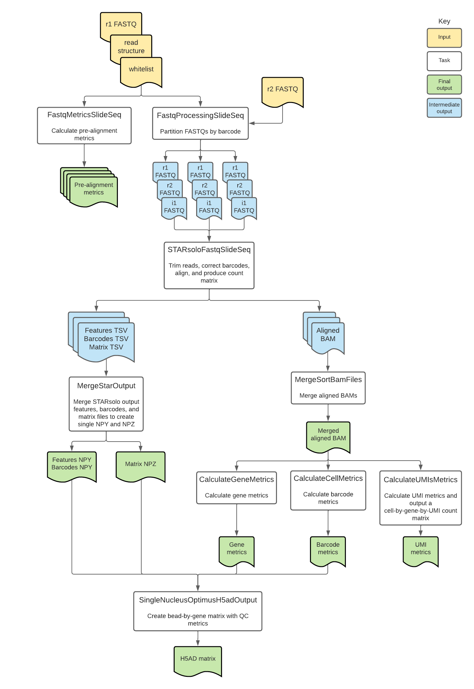

# Slide-seq Overview

| Pipeline Version | Date Updated | Documentation Author | Questions or Feedback |
| :----: | :---: | :----: | :--------------: |
| [SlideSeq v3.4.2](https://github.com/broadinstitute/warp/releases) | September, 2024 | Elizabeth Kiernan & Kaylee Mathews | Please [file an issue in WARP](https://github.com/broadinstitute/warp/issues). |

## Introduction to the Slide-seq workflow

The [Slide-seq workflow](https://github.com/broadinstitute/warp/blob/master/pipelines/wdl/slideseq/SlideSeq.wdl) is an open-source, cloud-optimized pipeline developed in collaboration with the [BRAIN Initiative Cell Census Network](https://biccn.org/) (BICCN) and the BRAIN Initiative Cell Atlas Network (BICAN). It supports the processing of spatial transcriptomic data generated with the [Slide-seq](https://www.science.org/doi/10.1126/science.aaw1219) (commercialized as [Curio Seeker](https://curiobioscience.com/seeker/)) assay.

Overall, the workflow corrects bead barcodes, aligns reads to the genome, generates a count matrix, calculates summary metrics for genes, barcodes, and UMIs, returns read outputs in BAM format, and returns counts in numpy matrix and h5ad file formats.

Slide-seq has been validated for analyzing mouse datasets generated with the Slide-seq assay. Learn more in the [validation section](#validation-against-on-prem-pipeline).

#### Where did the pipeline come from?

The Broad Pipelines Development team worked closely with members of the Evan Macosko Laboratory to adapt an on-premise pipeline into the cloud-based Slide-seq pipeline described here. Thank you to James Webber, Jonah Langlieb, Nina Sachdev, and the rest of the Evan Macosko Lab for their commitment to [FAIR Principles](https://www.nature.com/articles/sdata201618) and for helping create the cloud-based Slide-seq pipeline.

<!--- tip for methods section --->

## Quickstart table
The following table provides a quick glance at the Slide-seq pipeline features:

| Pipeline features | Description | Source |
| --- | --- | --- |
| Assay type | Slide-seq | [Rodriques et al. 2019](https://www.science.org/doi/10.1126/science.aaw1219)
| Overall workflow | Quality control and transcriptome quantification module | Code available from [GitHub](https://github.com/broadinstitute/warp/blob/master/pipelines/wdl/slideseq/SlideSeq.wdl) |
| Workflow language | WDL 1.0 | [openWDL](https://github.com/openwdl/wdl) |
| Genomic Reference Sequence | M23 (GRCm38.p6) mouse genome primary sequence | GENCODE [mouse reference files](https://www.gencodegenes.org/mouse/release_M23.html) |
| Transcriptomic reference annotation | M23 mouse transcriptome built with the [BuildIndices workflow](https://github.com/broadinstitute/warp/blob/master/pipelines/wdl/build_indices/BuildIndices.wdl) | GENCODE [mouse GTF](https://ftp.ebi.ac.uk/pub/databases/gencode/Gencode_mouse/release_M23/gencode.vM23.annotation.gff3.gz); [modified version](https://console.cloud.google.com/storage/browser/_details/gcp-public-data--broad-references/mm10/v0/single_nucleus/star/modified_star_2.7.9a_primary_gencode_mouse_vM23.tar;tab=live_object) available in Broad’s public reference bucket | 
| Aligner and transcript quantification | STARsolo | [Kaminow et al. 2021](https://www.biorxiv.org/content/10.1101/2021.05.05.442755v1) |
| Data input file format | File format in which sequencing data is provided | [FASTQ](https://academic.oup.com/nar/article/38/6/1767/3112533) |
| Data output file format | File formats in which Slide-seq output is provided | [BAM](http://samtools.github.io/hts-specs/), Python NumPy arrays, and h5ad |

## Set-up

### Slide-seq installation

To download the latest Slide-seq release, see the release tags prefixed with "SlideSeq" on the WARP [releases page](https://github.com/broadinstitute/warp/releases). All Slide-seq pipeline releases are documented in the [Slide-seq changelog](https://github.com/broadinstitute/warp/blob/master/pipelines/wdl/slideseq/SlideSeq.changelog.md). 

To search releases of this and other pipelines, use the WARP command-line tool [Wreleaser](https://github.com/broadinstitute/warp/tree/master/wreleaser).

If you’re running a Slide-seq workflow version prior to the latest release, the accompanying documentation for that release may be downloaded with the source code on the WARP [releases page](https://github.com/broadinstitute/warp/releases) (see the source code folder `website/docs/Pipelines/SlideSeq_Pipeline`).

The Slide-seq pipeline can be deployed using [Cromwell](https://cromwell.readthedocs.io/en/stable/), a GA4GH compliant, flexible workflow management system that supports multiple computing platforms. The workflow can also be run in [Terra](https://app.terra.bio), a cloud-based analysis platform. The [Slide-seq public workspace](https://app.terra.bio/#workspaces/warp-pipelines/Slide-seq) on Terra contains the Slide-seq workflow, workflow configuration, required reference data and other inputs, and example testing data.

### Inputs

The Slide-seq workflow inputs are specified in JSON configuration files. Example configuration files can be found in the [test_inputs](https://github.com/broadinstitute/warp/tree/master/pipelines/wdl/slideseq/test_inputs) folder in the WARP repository.

#### Input descriptions

| Parameter name | Description | Type |
| --- | --- | --- | 
|  r1_fastq | Array of Read 1 FASTQ files split across multiple sequencing lanes; forward reads containing bead barcodes and Unique Molecular Identifiers (UMIs); order of files must match the `r2_fastq` array. | Array[File] |
| r2_fastq | Array of Read 2 FASTQ files split across multiple sequencing lanes; reverse reads containing the cDNA fragment generated from captured mRNA; order of files must match the `r1_fastq` array. | Array[File] |
| i1_fastq | Optional array of i1 (index) FASTQ files; index reads used for demultiplexing of multiple samples on one flow cell. | Array[File] | 
| input_id | Unique identifier describing the biological sample or replicate that corresponds with the FASTQ files; inserted into read group header and used to name output files. | String |
| read_structure | Description of the UMI (M) and Barcode (C) positions in the Read 1 FASTQ; used to trim spacer sequences (X) for use by STARsolo; ex. "8C18X6C9M1X". | String |
| tar_star_reference | TAR file containing a species-specific reference genome and GTF; generated using the [BuildIndices workflow](https://github.com/broadinstitute/warp/tree/master/pipelines/wdl/build_indices/BuildIndices.wdl). | File | 
| annotations_gtf | GTF containing gene annotations used for gene tagging (must match GTF in STAR reference). | File | 
| output_bam_basename | Optional string used for the output BAM file basename. | String |
| count_exons | Optional boolean indicating if the workflow should calculate exon counts; default is set to “true” and produces an h5ad file containing both whole-gene counts and exon counts in an additional layer; when set to “false”, an h5ad file containing only whole-gene counts is produced. | Boolean |
| bead_locations | Whitelist TSV file containing bead barcodes and XY coordinates on a single line for each bead; determined by sequencing prior to mRNA transfer and library preparation. | File |
| cloud_provider | String describing the cloud provider that should be used to run the workflow; value should be "gcp" or "azure". | String |

#### Pseudogene handling

The example Slide-seq reference files are created using the [BuildIndices pipeline](https://github.com/broadinstitute/warp/blob/master/pipelines/wdl/build_indices/BuildIndices.wdl). The BuildIndices pipeline modifies a given GTF downloaded from GENCODE to only include biotypes that are listed in a tab separated file ([biotypes.tsv](https://github.com/broadinstitute/warp-tools/blob/develop/3rd-party-tools/build-indices/Biotypes.tsv)). The example references do not include the pseudogene biotype. Learn more about Ensembl biotypes in the [Ensembl overview](https://m.ensembl.org/info/genome/genebuild/biotypes.html).

#### Sample inputs for analyses in a Terra Workspace

The Slide-seq pipeline is currently available on the cloud-based platform Terra. After registering, you can access the [Slide-seq public workspace](https://app.terra.bio/#workspaces/warp-pipelines/Slide-seq) which is preloaded with instructions and sample data. Please view the [Support Center](https://support.terra.bio/hc/en-us) for more information on using the Terra platform.

## Slide-seq tasks and tools

The [Slide-seq workflow](https://github.com/broadinstitute/warp/blob/master/pipelines/wdl/slideseq/SlideSeq.wdl) imports individual "tasks," also written in WDL script, from the WARP [tasks folder](https://github.com/broadinstitute/warp/tree/develop/tasks/wdl). 

Overall, the Slide-seq workflow:
1. Calculates prealignment metrics.
1. Filters, trims, and splits reads into < 30 GB FASTQs.
1. Uses STARsolo to correct bead barcodes, align reads, and count genes.
1. Calculates metrics.
1. Merges the STAR outputs into NPY and NPZ arrays.
1. Merges gene counts and metrics into a h5ad-formatted matrix.

The tools each Slide-seq task employs are detailed in the table below. 

To see specific tool parameters, select the task WDL link in the table; then find the task and view the `command {}` section of the task in the WDL script. To view or use the exact tool software, see the task's Docker image which is specified in the task WDL `# runtime values` section as `String docker =`.

| Task name and WDL link                                                                                                                              | Tool | Software | Description | 
|-----------------------------------------------------------------------------------------------------------------------------------------------------| --- | --- | --- | 
| [Metrics.FastqMetricsSlideSeq (alias = FastqMetrics)](https://github.com/broadinstitute/warp/blob/master/tasks/wdl/Metrics.wdl)                 | fastq_metrics | [warp-tools](https://github.com/broadinstitute/warp-tools) | Calculates prealignment metrics from the input FASTQ files. Outputs metrics files including the bead barcode distribution, UMI distribution, number of reads per cell and number of UMIs per cell. |
| [FastqProcessing.FastqProcessingSlidSeq (alias = SplitFastq)](https://github.com/broadinstitute/warp/blob/master/tasks/wdl/FastqProcessing.wdl) | fastq_slideseq | [warp-tools](https://github.com/broadinstitute/warp-tools) | Filters reads, trims bead barcodes in read 1 to remove spacer sequences, and partitions the input FASTQ files by bead barcode to create an array of FASTQ files that are each ~ 30 GB. The function keeps all reads belonging to the same bead barcode in the same partitioned FASTQ file.| 
| [StarAlign.STARsoloFastqSlideSeq (alias = STARsoloFastqSlideSeq)](https://github.com/broadinstitute/warp/blob/master/tasks/wdl/StarAlign.wdl)   | STARsolo | [STAR](https://github.com/alexdobin/STAR) | For each of the partitioned FASTQ files, performs bead barcode correction, poly(A) tail trimming from adapters, alignment, gene annotation, and gene counting. Produces a count matrix and BAM file for each partition.|
| [Merge.MergeSortBamFiles (alias= MergeBam)](https://github.com/broadinstitute/warp/blob/master/tasks/wdl/MergeSortBam.wdl)                      | MergeSamFiles | [Picard](https://broadinstitute.github.io/picard/) | Merges the array of BAM files into a single BAM and sorts in coordinate order. |
| [Metrics.CalculateGeneMetrics (alias = GeneMetrics)](https://github.com/broadinstitute/warp/blob/master/tasks/wdl/Metrics.wdl)                  | TagSort | [warp-tools](https://github.com/broadinstitute/warp-tools) | Sorts the BAM file by gene using the bead barcode (CB), molecule barcode (UB), and gene ID (GX) tags and computes gene metrics. | 
| [Metrics.CalculateUMIsMetrics (alias = UMIsMetrics)](https://github.com/broadinstitute/warp/blob/master/tasks/wdl/Metrics.wdl)                  | TagSort | [warp-tools](https://github.com/broadinstitute/warp-tools) | Sorts the BAM file by gene using the bead barcode (CB), molecule barcode (UB), and gene ID (GX) tags and computes gene metrics. | 
| [Metrics.CalculateCellMetrics (alias = CellMetrics)](https://github.com/broadinstitute/warp/blob/master/tasks/wdl/Metrics.wdl)                  | TagSort | [warp-tools](https://github.com/broadinstitute/warp-tools) | Sorts the BAM file by bead barcode (CB), molecule barcode (UB), and gene ID (GX) tags and computes bead barcode metrics. |
| [StarAlign.MergeStarOutput (alias = MergeStarOutputsExons)](https://github.com/broadinstitute/warp/blob/master/tasks/wdl/StarAlign.wdl)              | create-npz-output.py | [Python 3](https://www.python.org/) | Creates a compressed raw NPY or NPZ file containing the STARsolo output features (NPY), barcodes (NPZ) and counts (NPZ). By default, `count_exons` is true and exon counts are included in output files. When `count_exons` is false, exon counts are excluded. | 
| [H5adUtils.SingleNucleusOptimusH5adOutput (alias = OptimusH5adGenerationWithExons)](https://github.com/broadinstitute/warp/blob/master/tasks/wdl/H5adUtils.wdl)     | create_h5ad_optimus.py | [Python 3](https://www.python.org/) | Merges the gene counts, bead barcode metrics, and gene metrics data into an h5ad formatted bead-by-gene matrix. By default, the h5ad file contains whole-gene counts with exon counts in an additional layer. When `count_exons` is false, the task is run as `SlideseqH5adGeneration` and exon counts are excluded. |

#### 1. Calculating prealignment metrics
The [FastqMetricsSlideSeq](https://github.com/broadinstitute/warp/blob/master/tasks/wdl/FastqProcessing.wdl) task calculates prealignment metrics used for assessing data quality from the input FASTQ files. These metrics include the bead barcode distribution,  UMI distribution, number of reads per cell and number of UMIs per cell. These metrics are included in the final outputs of the workflow. 

#### 2. Filtering reads, trimming barcodes, and splitting FASTQs

**Read filtering**

Although the function of the bead barcodes is to identify the spatial location of gene expression in the tissue, barcode errors can arise during sequencing that make it difficult to assign reads to the proper location. 

The [FastqProcessingSlidSeq](https://github.com/broadinstitute/warp/blob/master/tasks/wdl/FastqProcessing.wdl) task uses [warp-tools](https://github.com/broadinstitute/warp-tools) to evaluate barcode errors by comparing the Read 1 FASTQ sequences against a whitelist of barcodes created by sequencing prior to the mRNA transfer and library preparation steps of the [Slide-Seq](https://www.science.org/doi/10.1126/science.aaw1219) protocol.

Barcodes that are more than one edit distance ([Hamming distance](https://www.ncbi.nlm.nih.gov/pmc/articles/PMC5410656/)) from any of the barcode sequences in the whitelist are filtered at this step and not included in the output. The remaining barcodes are corrected by the [STARsoloFastqSlideSeq](https://github.com/broadinstitute/warp/blob/master/tasks/wdl/StarAlign.wdl) task.

**Barcode trimming**

The task uses warp-tools to trim spacer sequences from bead barcodes and UMIs for use by STARsolo, which requires continuous sample barcodes without spacer sequences between them. The input `read_structure` is used to parse the barcodes and remove any bases with tags other than C or M, which represent the bead barcode and UMI, respectively. For example, with a `read_structure` of 8C18X6C9M1X, bases represented by 18X and 1X are removed from the reads and the string of bases is rewritten with the structure 14C9M. Bases represented by tags other than X will also be removed during this step, so long as they are not C or M.

**FASTQ splitting**

For faster processing of large datasets, the task divides the input array of FASTQ files into multiple FASTQs, each containing reads from the same bead barcodes such that the FASTQ files are approximately 30 GB in size. 

#### 3. Correcting bead barcodes, trimming and aligning reads, and counting genes with STARsolo

**Bead barcode correction**

The [STARsoloFastqSlideSeq](https://github.com/broadinstitute/warp/blob/master/tasks/wdl/StarAlign.wdl) task uses the STAR aligner to evaluate barcode errors by comparing the Read 1 FASTQ sequences against a whitelist of barcodes created by sequencing prior to the mRNA transfer and library preparation steps of the [Slide-seq](https://www.science.org/doi/10.1126/science.aaw1219) protocol.

Corrected barcodes are those that fall within one edit distance ([Hamming distance](https://www.ncbi.nlm.nih.gov/pmc/articles/PMC5410656/)) of one of the barcode sequences in the whitelist. Note that prior to running STARsolo, uncorrectable barcodes (with more than one mismatch) are filtered out by the [FastqProcessingSlidSeq](https://github.com/broadinstitute/warp/blob/master/tasks/wdl/FastqProcessing.wdl) task.

**Read trimming**

Poly(A) tails are trimmed from reads using the STARsolo parameter `--clip3pAdapterSeq AAAAAA`.

**Alignment**

STAR maps barcoded reads to the genome primary assembly reference (see the [Quickstart table](#quickstart-table) above for version information). The example references for the Slide-seq workflow were generated using the [BuildIndices pipeline](https://github.com/broadinstitute/warp/tree/master/pipelines/wdl/build_indices/BuildIndices.wdl).

**Gene annotation and counting**

Prior to gene counting, STARsolo adds gene annotations which will vary depending on the value of `count_exons`. By default, `count_exons` is true and STARsolo will run with the parameter `--soloFeatures Gene GeneFull` to produce both whole-gene and exon counts. If `count_exons` is false, STARsolo will run with the parameter `--soloFeatures GeneFull` to produce whole-gene counts.

The resulting BAM files are merged together into a single BAM using the [MergeSortBamFiles](https://github.com/broadinstitute/warp/blob/master/tasks/wdl/MergeSortBam.wdl) task.

**STARsolo outputs**

The task’s output includes a coordinate-sorted BAM file containing the bead barcode-corrected reads and SAM attributes UB UR UY CR CB CY NH GX GN. Additionally, after counting, the task outputs three intermediate TSV files (features, barcodes, and matrix) used for downstream h5ad matrix generation.   

#### 4. Calculating metrics

The [CalculateGeneMetrics](https://github.com/broadinstitute/warp/blob/master/tasks/wdl/Metrics.wdl), [CalculateUMIsMetrics](https://github.com/broadinstitute/warp/blob/master/tasks/wdl/Metrics.wdl), and [CalculateCellMetrics](https://github.com/broadinstitute/warp/blob/master/tasks/wdl/Metrics.wdl) tasks use [warp-tools](https://github.com/broadinstitute/warp-tools) to calculate summary metrics that help assess the per-bead and per-UMI quality of the data output each time this pipeline is run. 

These metrics output from both tasks are included in the output h5ad matrix. A detailed list of these metrics is found in the [Slide-seq Count Matrix Overview](./count-matrix-overview.md).

#### 5. Merging the STAR outputs into NPY and NPZ arrays

The STARsolo output includes a features, barcodes, and matrix TSV for each of the partitioned FASTQ input files. The [MergeStarOutput task](https://github.com/broadinstitute/warp/blob/master/tasks/wdl/StarAlign.wdl) merges each respective TSV. It uses a custom python script to convert the merged matrix, features, and barcodes output from STARsolo into an NPY (features and barcodes)- and NPZ (the matrix)-formatted file.

#### 6. Merging counts and metrics data into h5ad-formatted matrix

The [SingleNucleusOptimusH5adOutput](https://github.com/broadinstitute/warp/blob/master/tasks/wdl/H5adUtils.wdl) task uses a custom python script to merge the converted STARsolo count matrix and the cell (bead) and gene metrics into an h5ad-formatted bead-by-gene matrix. **These counts are raw and unfiltered.**

Read full details for all the metrics in the [Slide-seq Count Matrix Overview](./count-matrix-overview.md).

**Gene counts**

The type of gene counts in the h5ad file will vary depending on the value of the Slide-seq workflow input, `count_exons`. By default, `count_exons` is set to true and the output h5ad file will contain whole-gene counts with exon counts in an additional layer.

If the workflow is run with `count_exons` set to false, the output h5ad file will contain whole-gene counts. Running the workflow in this configuration will cause the h5ad matrix to have fewer columns (bead barcodes) due to the difference in STARsolo counting mode.

You can determine which type of counts are in the h5ad by looking at the global attribute `expression_data_type`.

After running the pipeline with `count_exons` set to true, you can access whole-gene and exonic counts using the AnnData `layers()` function. For example, adata.layers[“exon_counts”]` will return the exonic counts from the output h5ad. 

#### 6. Outputs

Output files of the pipeline include:

1. Bead x Gene unnormalized count matrices in h5ad format.
2. Unfiltered, sorted BAM file with barcode and downstream analysis tags.
3. Bead metadata, including bead metrics.
4. Gene metadata, including gene metrics.

The following table lists the output files produced from the pipeline. For samples that have sequenced over multiple lanes, the pipeline will output one merged version of each listed file.

| Output Name | Filename, if applicable | Output Type | Output Format |
| ------ | ------ | ------ | ------ |
| pipeline_version_out | N/A | Version of the processing pipeline run on this data. | String |
| genomic_reference_version | `reference_version.txt` | File containing genomic reference source, build, and annotation versions. | TXT |
| bam | `<output_bam_basename>.bam` | Aligned BAM | BAM |
| matrix | `<input_id>_sparse_counts.npz` | Converted sparse matrix file from the MergeStarOutputs task. | NPZ |
| matrix_row_index | `<input_id>_sparse_counts_row_index.npy` | Index of beads in count matrix. | NPY |
| matrix_col_index | `<input_id>_sparse_counts_col_index.npy` | Index of genes in count matrix. | NPY |
| cell_metrics | `cell-metrics.csv.gz` | Cell metrics based on bead barcodes | Compressed CSV |
| gene_metrics | `gene-metrics.csv.gz` | Gene metrics | Compressed CSV |
| umi_metrics | `umi-metrics.csv.gz` | UMI metrics | Compressed CSV |
| fastq_barcode_distribution | `<input_id>.barcode_distribution_XC.txt` | Metric file containing the distribution of reads per bead barcode that were calculated prior to alignment. | TXT |
| fastq_umi_distribution | `<input_id>.barcode_distribution_XM.txt` | Metric file containing the distribution of reads per UMI that were calculated prior to alignment. | TXT |
| fastq_reads_per_cell | `<input_id>.numReads_perCell_XC.txt` | Metric file containing the number of reads per barcode that were calculated prior to alignment. | TXT |
| fastq_reads_per_umi | `<input_id>.numReads_perCell_XM.txt` | Metric file containing the number of reads per UMI that were calculated prior to alignment. | TXT |
| h5ad_output_file | `<input_id>.h5ad` | h5ad file containing count data and metadata. | H5AD | 

The h5ad matrix is the default output. This matrix contains the unnormalized (unfiltered) count matrices, as well as the gene and bead barcode metrics detailed in the [Slide-seq Count Matrix Overview](./count-matrix-overview.md).

## Validation against on-prem pipeline

Slide-seq has been validated for processing mouse spatial transcriptomic data generated with the Slide-seq assay. Slide-seq results are compared to those of an on-premise pipeline using BCL input files and python scripts. See the [validation report](https://docs.google.com/document/d/1cmfG3Y4uGvfJUJZV9MZvgN5Yw6-bFajpS7lonMKxdso/edit?usp=sharing) for more information.

## Versioning and testing

All Slide-seq pipeline releases are documented in the [Slide-seq changelog](https://github.com/broadinstitute/warp/blob/master/pipelines/wdl/slideseq/SlideSeq.changelog.md) and tested using [plumbing and scientific test data](https://github.com/broadinstitute/warp/blob/master/pipelines/wdl/slideseq/test_inputs/test_data_overview.md). To learn more about WARP pipeline testing, see [Testing Pipelines](https://broadinstitute.github.io/warp/docs/About_WARP/TestingPipelines).

## Citing the Slide-seq Pipeline

If you use the Slide-seq Pipeline in your research, please identify the pipeline in your methods section using the [Slide-seq SciCrunch resource identifier](https://scicrunch.org/resources/data/record/nlx_144509-1/SCR_023379/resolver?q=%22Slide-seq%22&l=%22Slide-seq%22&i=rrid:scr_023379).

* Ex: *Slide-seq Pipeline (RRID:SCR_023379)*

Please also consider citing our preprint:

Degatano, K., Awdeh, A., Cox III, R.S., Dingman, W., Grant, G., Khajouei, F., Kiernan, E., Konwar, K., Mathews, K.L., Palis, K., et al. Warp Analysis Research Pipelines: Cloud-optimized workflows for biological data processing and reproducible analysis. Bioinformatics 2025; btaf494. https://doi.org/10.1093/bioinformatics/btaf494

## Consortia support
This pipeline is supported by the [BRAIN Initiative Cell Census Network](https://biccn.org/) (BICCN) and BRAIN Initiative Cell Atlas Network (BICAN). 

If your organization also uses this pipeline, we would like to list you! Please reach out to us by [filing an issue in WARP](https://github.com/broadinstitute/warp/issues).

## Feedback

Please help us make our tools better by [filing an issue in WARP](https://github.com/broadinstitute/warp/issues); we welcome pipeline-related suggestions or questions.
