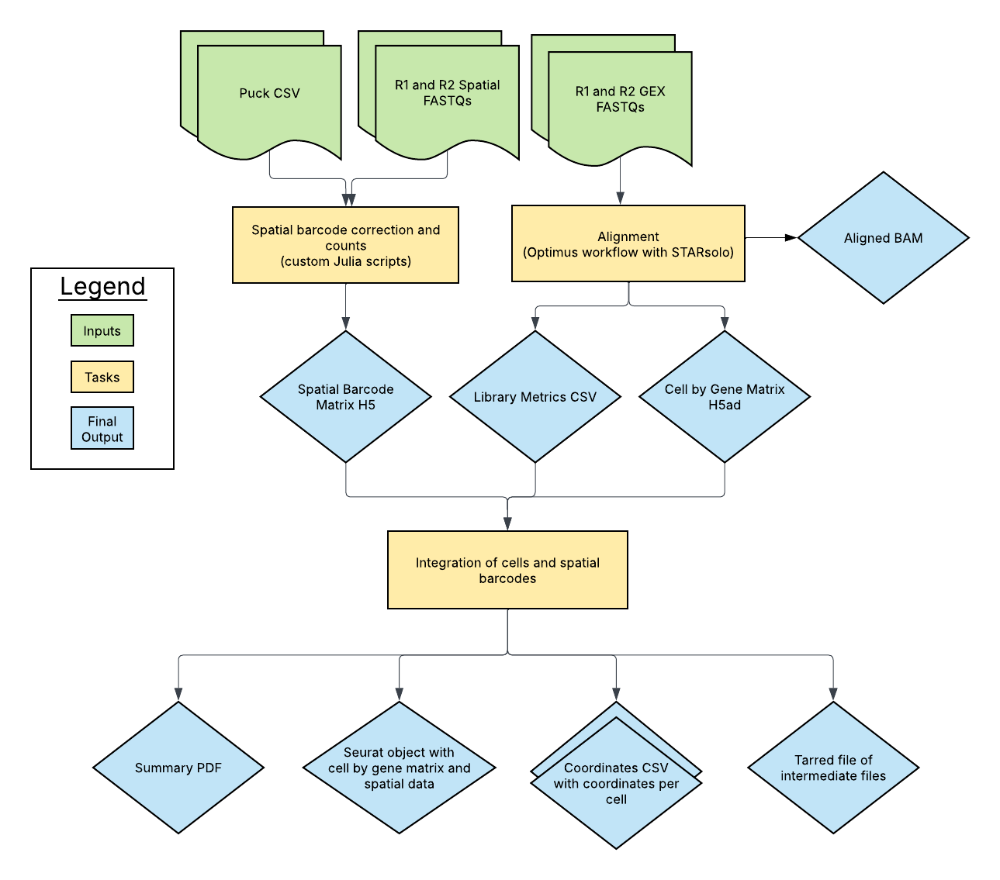

# Slide-tags Pipeline Overview

| Pipeline Version | Date Updated | Documentation Author | Questions or Feedback |
| :----: | :---: | :----: | :--------------: |
| v1.0.0 | March, 2025 | WARP Pipelines | Please [file an issue in WARP](https://github.com/broadinstitute/warp/issues) |

## Introduction to the Slide-tags Pipeline

The **Slide-tags Pipeline** is an open-source, cloud-optimized workflow for processing spatial transcriptomics data. It supports data derived from spatially barcoded sequencing technologies, including Slide-tags-based single-molecule profiling. The pipeline processes raw sequencing data into spatially resolved gene expression matrices, ensuring accurate alignment, spatial positioning, and quantification.

This workflow integrates multiple processing steps, including barcode extraction, spatial alignment, transcript counting, and output generation in formats compatible with community tools.

## Quickstart Table

| Pipeline Features | Description | Source |
|--- | --- | --- |
| Assay type | Spatial transcriptomics using Slide-tags | [Macosko Lab](https://macoskolab.com/) |
| Overall workflow  | Barcode extraction, spatial positioning, transcript quantification | Original code available from [GitHub](https://github.com/MacoskoLab/Macosko-Pipelines); WDL workflow available in WARP. |
| Workflow language | WDL | [openWDL](https://github.com/openwdl/wdl) |
| Data input file format | File format in which sequencing data is provided | [FASTQ](https://academic.oup.com/nar/article/38/6/1767/3112533) and [CSV](https://www.loc.gov/preservation/digital/formats/fdd/fdd000323.shtml)|
| Data output file format | Output formats for downstream analysis | [HDF5](https://www.hdfgroup.org/), [Seurat](https://satijalab.org/seurat/) and [CSV](https://www.loc.gov/preservation/digital/formats/fdd/fdd000323.shtml)|

## Set-up

### Installation

To download the latest Slide-tags release, see the release tags prefixed with "Slide-tags" on the WARP [releases page](https://github.com/broadinstitute/warp/releases). All Slide-tags pipeline releases are documented in the [Slide-tags changelog](https://github.com/broadinstitute/warp/blob/master/pipelines/skylab/slidetags/SlideTags.changelog.md).

The pipeline can be deployed using [Cromwell](https://cromwell.readthedocs.io/en/stable/), a GA4GH-compliant workflow manager. Additionally, it can be run in cloud-based analysis platforms such as [Terra](https://app.terra.bio).

### Inputs

The pipeline requires JSON-formatted configuration files detailing input parameters. Required inputs include:

- **Raw paired-end GEX FASTQ files** containing sequencing reads
- **Reference genome** and transcript annotation files
- **Spatial fastqs**
- **Spatial positioning reference**

| Input Variable          | Description                                      | Format           |
|-------------------------|--------------------------------------------------|------------------|
| id                      | Unique identifier for the analysis run          | String           |
| spatial_fastq          | Array of paths to spatial FASTQ files           | Array[String]    |
| pucks                  | Array of paths to puck files                     | Array[String]    |
| gex_r1_fastq           | Array of FASTQ files for R1 reads                | Array[File]      |
| gex_r2_fastq           | Array of FASTQ files for R2 reads                | Array[File]      |
| gex_i1_fastq           | Optional FASTQ files for I1 index reads          | Array[File]?     |
| tar_star_reference     | Reference genome in a TAR format for STAR align. | File             |
| annotations_gtf        | Gene annotation file in GTF format               | File             |
| gex_whitelist          | Whitelist file for cell barcodes                 | File             |
| cloud_provider         | Cloud provider for computing resources           | String           |
| input_id               | Unique input identifier                          | String           |
| expected_cells         | Expected number of cells in the dataset          | Int              |
| counting_mode          | Counting mode (e.g., snRNA)                      | String           |
| tenx_chemistry_version | Version of 10X chemistry used                    | Int              |
| emptydrops_lower       | Lower threshold for EmptyDrops filtering         | Int              |
| force_no_check        | Flag to disable sanity checks                     | Boolean          |
| ignore_r1_read_length | Ignore length check for R1 reads                 | Boolean          |
| star_strand_mode       | Strand mode setting for STAR alignment           | String           |
| count_exons            | Flag to enable exon counting                     | Boolean          |
| soloMultiMappers       | Optional setting for handling multi-mapped reads | String?          |
| gex_nhash_id           | Optional NHash identifier for gene expression     | String?          |
| mt_genes               | Optional file listing mitochondrial genes        | File?            |
| docker                 | Docker image used for the workflow               | String

Example input configurations can be found in the `test_inputs` folder of the GitHub repository.

## Slide-tags Pipeline Tasks and Tools

The workflow is composed of several key steps, implemented in separate WDL tasks:

| Task | Tool | Description |
| --- | --- | --- |
| [Optimus](https://github.com/broadinstitute/warp/blob/master/pipelines/skylab/optimus/Optimus.wdl) | STARsolo | Gene quantification subworkflow that aligns reads to a reference genome and produces a count matrix. Read more in the [Optimus Overview](../Optimus_Pipeline/README.md). | 
| spatial_count | [Custom Julia script](https://raw.githubusercontent.com/MacoskoLab/Macosko-Pipelines/d89176cf21e072fe8b5aad3a1454ad194fca7c9a/slide-tags/spatial-count.jl) developed by the Macosko lab | Extracts spatial barcodes, performs barcode sequencing error correction, maps reads to spatial barcodes and stores unique (cell, UMI, barcode) triplets in a count matrix, and calculates quality control metrics. Produces an h5 output. |
| positioning | Custom R scripts for developed by the Macosko lab; includes [positioning.R](https://raw.githubusercontent.com/MacoskoLab/Macosko-Pipelines/d89176cf21e072fe8b5aad3a1454ad194fca7c9a/slide-tags/positioning.R), [helpers.R](https://raw.githubusercontent.com/MacoskoLab/Macosko-Pipelines/d89176cf21e072fe8b5aad3a1454ad194fca7c9a/slide-tags/helpers.R), and [run-positioning.R](https://raw.githubusercontent.com/MacoskoLab/Macosko-Pipelines/d89176cf21e072fe8b5aad3a1454ad194fca7c9a/slide-tags/run-positioning.R) | Takes in the rna_paths (path to the filtered cell by gene count matrix, UMI counts, and the intronic metrics) to extract cell barcodes, calculates log-transformed UMI counts, and determines mitochondrial gene percentages. Performs data normalization, PCA, clustering, and UMAP embedding for visualization and produces quality metrics and graphs. Assigns cell barcodes to spatial barcode coordinates. |

Each of these tasks utilizes scripts from the [Macosko Lab Pipelines](https://github.com/MacoskoLab/Macosko-Pipelines) repository, modified for streamlined output handling. Dockers for running these scripts are maintained in the warp-tools repository under [slide-tags](https://github.com/broadinstitute/warp-tools/tree/develop/3rd-party-tools/slide-tags).

## Outputs

| Output Variable | File Name | Description | Format |
| ------ | --- | ------ | ------ |
| optimus_genomic_reference_version | `<reference_version>.txt` | File containing the Genome build, source and GTF annotation version. |
| optimus_bam | `<input_id>.bam` | BAM file containing aligned reads from Optimus workflow. |
| optimus_matrix | `<input_id>_gex_sparse_counts.npz` | NPZ file containing raw gene by cell counts. |
| optimus_matrix_row_index | `<input_id>_gex_sparse_counts_row_index.npy` | NPY file containing the row indices. |
| optimus_matrix_col_index | `<input_id>_gex_sparse_counts_col_index.npy` | NPY file containing the column indices. |
| optimus_cell_metrics | `<input_id>_gex.cell_metrics.csv.gz` | CSV file containing the per-cell (barcode) metrics. |
| optimus_gene_metrics | `<input_id>.gene_metrics.csv.gz` | CSV file containing the per-gene metrics. |
| optimus_cell_calls | `<input_id>.emptyDrops` | TSV file containing the EmptyDrops results when the Optimus workflow is run in sc_rna mode. |
| optimus_h5ad_output_file | `<input_id>.h5ad` | h5ad (Anndata) file containing the raw cell-by-gene count matrix, gene metrics, cell metrics, and global attributes. See the [Optimus Count Matrix Overview](../Optimus_Pipeline/Loom_schema.md) for more details. |
| optimus_multimappers_EM_matrix | `UniqueAndMult-EM.mtx` | Optional output produced when `soloMultiMappers` is "EM"; see STARsolo [documentation](https://github.com/alexdobin/STAR/blob/master/docs/STARsolo.md#multi-gene-reads) for more information.|
| optimus_multimappers_Uniform_matrix | `UniqueAndMult-Uniform.mtx` | Optional output produced when `soloMultiMappers` is "Uniform"; see STARsolo [documentation](https://github.com/alexdobin/STAR/blob/master/docs/STARsolo.md#multi-gene-reads) for more information.|
| optimus_multimappers_Rescue_matrix | `UniqueAndMult-Rescue.mtx` | Optional output produced when `soloMultiMappers` is "Rescue"; see STARsolo [documentation](https://github.com/alexdobin/STAR/blob/master/docs/STARsolo.md#multi-gene-reads) for more information. |
| optimus_multimappers_PropUnique_matrix | `UniqueAndMult-PropUnique.mtx` | Optional output produced when `soloMultiMappers` is "PropUnique"; see STARsolo [documentation](https://github.com/alexdobin/STAR/blob/master/docs/STARsolo.md#multi-gene-reads) for more information.|
| optimus_aligner_metrics | `<input_id>.star_metrics.tar` | Text file containing per barcode metrics (`CellReads.stats`) produced by the GEX pipeline STARsolo aligner. |
| optimus_library_metrics | `<input_id>_gex_<gex_nhash_id>_library_metrics.csv` | Optional CSV file containing all library-level metrics calculated with STARsolo for gene expression data. |
| optimus_mtx_files | `<input_id>_gex.mtx_files.tar` | TAR file with STARsolo matrix market files (barcodes.tsv, features.tsv, and matrix.mtx) | TAR |
| cb_cell_barcodes_csv | `<cell_csv>` | Optional output produced when `run_cellbender` is "true"; see CellBender [documentation](https://cellbender.readthedocs.io/en/latest/usage/index.html) and [GitHub repository](https://github.com/broadinstitute/CellBender/tree/master) for more information.|
| cb_checkpoint_file | `<ckpt_file>` | Optional output produced when `run_cellbender` is "true"; see CellBender [documentation](https://cellbender.readthedocs.io/en/latest/usage/index.html) and [GitHub repository](https://github.com/broadinstitute/CellBender/tree/master) for more information. |
| cb_h5_array | `<h5_array>` | Optional output produced when `run_cellbender` is "true"; see CellBender [documentation](https://cellbender.readthedocs.io/en/latest/usage/index.html) and [GitHub repository](https://github.com/broadinstitute/CellBender/tree/master) for more information. |
| cb_html_report_array | `<report_array>` | Optional output produced when `run_cellbender` is "true"; see CellBender [documentation](https://cellbender.readthedocs.io/en/latest/usage/index.html) and [GitHub repository](https://github.com/broadinstitute/CellBender/tree/master) for more information. |
| cb_log | `<log>` | Optional output produced when `run_cellbender` is "true"; see CellBender [documentation](https://cellbender.readthedocs.io/en/latest/usage/index.html) and [GitHub repository](https://github.com/broadinstitute/CellBender/tree/master) for more information. |
| cb_metrics_csv_array | `<metrics_array>` | Optional output produced when `run_cellbender` is "true"; see CellBender [documentation](https://cellbender.readthedocs.io/en/latest/usage/index.html) and [GitHub repository](https://github.com/broadinstitute/CellBender/tree/master) for more information. |
| cb_output_directory | `<output_dir>` | Optional output produced when `run_cellbender` is "true"; see CellBender [documentation](https://cellbender.readthedocs.io/en/latest/usage/index.html) and [GitHub repository](https://github.com/broadinstitute/CellBender/tree/master) for more information. |
| cb_summary_pdf | `<pdf>` | Optional output produced when `run_cellbender` is "true"; see CellBender [documentation](https://cellbender.readthedocs.io/en/latest/usage/index.html) and [GitHub repository](https://github.com/broadinstitute/CellBender/tree/master) for more information. |
| spatial_output_h5 | `<input_id>_SBcounts.h5` | h5 file containing cell by gene matrix and spatial barcode information. | h5 |
| spatial_output_log | `<input_id>_spatial-count.log` | Standard output of the spatial barcodes task. | text |
| positioning_seurat_qs | `<input_id>_seurat.qs` | Seurat object with processed spatial transcriptomics data. | Seurat |
| positioning_coords_csv | `<input_id>_coords.csv` | Spatial coordinates for detected barcodes. | csv |
| positioning_coords2_csv | `<input_id>_coords2.csv` | Alternate or refined spatial coordinates. | csv |
| positioning_summary_pdf | `<input_id>_summary.pdf` | QC summary report with plots and metrics. | pdf |
| positioning_intermediates | `<input_id>_intermediates.tar.gz` | Contains matrix, barcode whitelist, and spatial metadata  | TAR |
| positioning_log | `<input_id>_positioning.log` | Standard output of the positioning task. | text |

## Versioning

All releases of the pipeline are documented in the repository’s changelog.

## Citing the Slide-tags Pipeline

If you use the Slide-tags Pipeline in your research, please cite the original sources:

- **Macosko Lab Pipelines:** https://github.com/MacoskoLab/Macosko-Pipelines

Please also consider citing our preprint:

Degatano, K.; Awdeh, A.; Dingman, W.; Grant, G.; Khajouei, F.; Kiernan, E.; Konwar, K.; Mathews, K.; Palis, K.; Petrillo, N.; Van der Auwera, G.; Wang, C.; Way, J.; Pipelines, W. WDL Analysis Research Pipelines: Cloud-Optimized Workflows for Biological Data Processing and Reproducible Analysis. Preprints 2024, 2024012131. https://doi.org/10.20944/preprints202401.2131.v1

## Acknowledgements

We are immensely grateful Matthew Shabet and the Macosko Lab for development of these analsyes, for their generous time making these scripts FAIR, and for the many hours working with the WARP team to incoporate the scripts into WDL. 

## Feedback

Please help us make our tools better by [filing an issue in WARP](https://github.com/broadinstitute/warp/issues); we welcome pipeline-related suggestions or questions.

