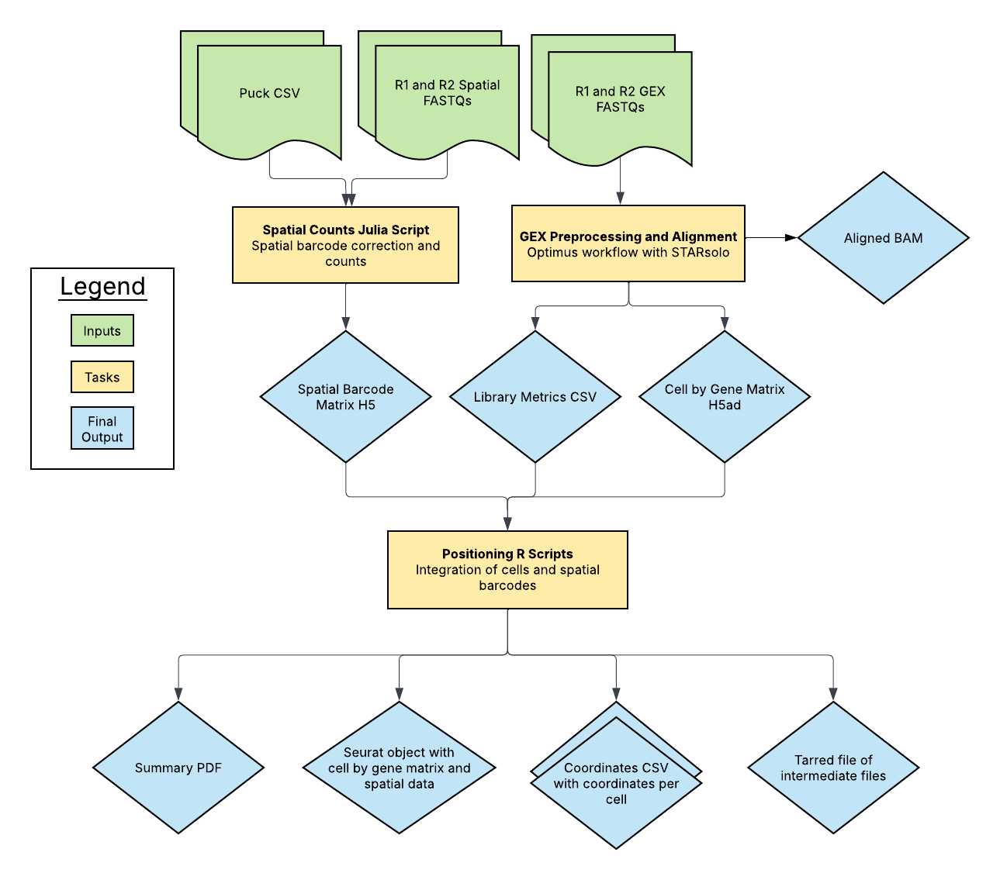

# Slide-tags Overview

| Pipeline Version | Date Updated | Documentation Author | Questions or Feedback |
| :----: | :---: | :----: | :--------------: |
| v1.0.0 | May, 2025 | WARP Pipelines | Please [file an issue in WARP](https://github.com/broadinstitute/warp/issues) |

## Introduction to the Slide-tags Pipeline

The **Slide-tags Pipeline** is an open-source, cloud-optimized workflow for processing spatial transcriptomics data. It supports data derived from spatially barcoded sequencing technologies, including Slide-tags-based single-molecule profiling. The pipeline processes raw sequencing data into spatially resolved gene expression matrices, ensuring accurate alignment, spatial positioning, and quantification.

This pipeline integrates multiple processing steps, including barcode extraction, spatial alignment, transcript counting, and output generation in formats compatible with community tools. The pipeline calls three subworkflows: the Optimus workflow for gene expression data, the SpatialCount workflow for spatial barcode processing, and the Positioning workflow for integrating both data types.

The Optimus workflow (GEX) corrects cell barcodes and Unique Molecular Identifiers (UMIs), aligns reads to the genome, calculates per-barcode and per-gene quality metrics, and produces a cell-by-gene count matrix.

The SpatialCount workflow processes spatial barcoding data from FASTQ files to generate spatial barcode counts that represent transcript locations within the tissue.

The Positioning workflow integrates the gene expression data with spatial information to generate coordinate files and visualizations, producing a Seurat object for downstream spatial analysis.

## Quickstart Table
| Pipeline Features | Description | Source |
|--- | --- | --- |
| Assay type | Spatial transcriptomics using Slide-tags | [Macosko Lab](https://macoskolab.com/) |
| Overall workflow  | Barcode extraction, spatial positioning, transcript quantification | Original code available from [GitHub](https://github.com/MacoskoLab/Macosko-Pipelines/tree/main/slide-tags); WDL workflow available in WARP. |
| Workflow language | WDL | [openWDL](https://github.com/openwdl/wdl) |
| Sub-workflows | Optimus (gene expression), SpatialCount (spatial barcoding), Positioning (integration) | Imported from separate WDL scripts |
| Genomic Reference Sequence | STAR reference genome provided as tar file | Referenced as input parameter |
| Gene annotation reference | GTF file containing gene annotations | Referenced as input parameter |
| Aligners | STARsolo | [STAR aligner](https://github.com/alexdobin/STAR) |
| Data input file format | File format in which sequencing data is provided | [FASTQ](https://academic.oup.com/nar/article/38/6/1767/3112533) and [CSV](https://www.loc.gov/preservation/digital/formats/fdd/fdd000323.shtml)|
| Data output file format | Output formats for downstream analysis | [HDF5](https://www.hdfgroup.org/), [Seurat](https://satijalab.org/seurat/) and [CSV](https://www.loc.gov/preservation/digital/formats/fdd/fdd000323.shtml)|

## Set-up

### Installation

To download the latest Slide-tags release, see the release tags prefixed with "Slide-tags" on the WARP [releases page](https://github.com/broadinstitute/warp/releases). All Slide-tags pipeline releases are documented in the [Slide-tags changelog](https://github.com/broadinstitute/warp/blob/master/pipelines/wdl/slidetags/SlideTags.changelog.md).

The pipeline can be deployed using [Cromwell](https://cromwell.readthedocs.io/en/stable/), a GA4GH-compliant workflow manager. Additionally, it can be run in cloud-based analysis platforms such as [Terra](https://app.terra.bio).

### Inputs

The pipeline requires JSON-formatted configuration files detailing input parameters. Required inputs include:

- **Raw paired-end GEX FASTQ files** containing sequencing GEX reads
- **Raw paired-end Spatial FASTQ files** containing spatial reads
- **Pucks files** contains spatial coordinates of bead centroids

***General input variables used by both the Optimus and spatial/positioning components of the pipeline.***

| Input Variables         | Description                                      | Format           |
|-------------------------|--------------------------------------------------|------------------|
| input_id               | Unique input identifier                          | String           |
| docker                 | Docker image used for the workflow               | String           |

***Input variables for the spatial and positioning components of the Slide-Tags pipeline can be found below.*** 

| Input Variables         | Description                                      | Format           |
|-------------------------|--------------------------------------------------|------------------|
| spatial_fastq          | Array of paths to spatial FASTQ files. Requires at least one complete R1 and R2 pair. Each filename must include _R1_ or _R2_ to distinguish read pairs. The full directory is scanned, matching R1 and R2 files; an error is raised if any pair is incomplete | Array[String]    |
| pucks                  | Array of paths to puck files                     | Array[String]    |

***Optimus input variables can be found below.***

| Input Variables | Description                                      | Format           |
|-------------------------|--------------------------------------------------|------------------|
| gex_r1_fastq           | Array of FASTQ files for R1 reads                | Array[File]      |
| gex_r2_fastq           | Array of FASTQ files for R2 reads                | Array[File]      |
| gex_i1_fastq           | Optional FASTQ files for I1 index reads          | Array[File]?     |
| tar_star_reference     | Reference genome in a TAR format for STAR align | File             |
| annotations_gtf        | Gene annotation file in GTF format               | File             |
| gex_whitelist          | Whitelist file for cell barcodes                 | File             |
| cloud_provider         | Cloud provider for computing resources           | String           |
| expected_cells         | Expected number of cells in the dataset          | Int              |
| counting_mode          | Counting mode (e.g., snRNA)                      | String           |
| tenx_chemistry_version | Version of 10X chemistry used                    | Int              |
| emptydrops_lower       | Lower threshold for EmptyDrops filtering         | Int              |
| force_no_check        | Flag to disable sanity checks                     | Boolean          |
| ignore_r1_read_length | Ignore length check for R1 reads                 | Boolean          |
| star_strand_mode       | Strand mode setting for STAR alignment           | String           |
| count_exons            | Flag to enable exon counting                     | Boolean          |
| soloMultiMappers       | Optional setting for handling multi-mapped reads | String?          |
| gex_nhash_id           | Optional NHash identifier for gene expression     | String?          |
| mt_genes               | Optional file listing mitochondrial genes        | File?            |

Example input configurations can be found in the `test_inputs` folder of the GitHub repository.

## Slide-tags Pipeline Tasks and Tools

The workflow is composed of several key steps, implemented in separate WDL tasks:

| Task | Tool | Description |
| --- | --- | --- |
| [Optimus](https://github.com/broadinstitute/warp/blob/master/pipelines/wdl/optimus/Optimus.wdl) | STARsolo | Gene quantification subworkflow that aligns reads to a reference genome and produces a count matrix. Read more in the [Optimus Overview](../Optimus_Pipeline/README.md). | 
| spatial_count | [Custom Julia script](https://raw.githubusercontent.com/MacoskoLab/Macosko-Pipelines/d89176cf21e072fe8b5aad3a1454ad194fca7c9a/slide-tags/spatial-count.jl) developed by the Macosko lab | Extracts spatial barcodes, performs barcode sequencing error correction, maps reads to spatial barcodes and stores unique (cell, UMI, barcode) triplets in a count matrix, and calculates quality control metrics. Produces an h5 output. |
| positioning | Custom R scripts for developed by the Macosko lab; includes [positioning.R](https://raw.githubusercontent.com/MacoskoLab/Macosko-Pipelines/d89176cf21e072fe8b5aad3a1454ad194fca7c9a/slide-tags/positioning.R), [helpers.R](https://raw.githubusercontent.com/MacoskoLab/Macosko-Pipelines/d89176cf21e072fe8b5aad3a1454ad194fca7c9a/slide-tags/helpers.R), and [run-positioning.R](https://raw.githubusercontent.com/MacoskoLab/Macosko-Pipelines/d89176cf21e072fe8b5aad3a1454ad194fca7c9a/slide-tags/run-positioning.R) | Takes in the rna_paths (path to the filtered cell by gene count matrix, UMI counts, and the intronic metrics) to extract cell barcodes, calculates log-transformed UMI counts, and determines mitochondrial gene percentages. Performs data normalization, PCA, clustering, and UMAP embedding for visualization and produces quality metrics and graphs. Assigns cell barcodes to spatial barcode coordinates. |

Each of these tasks utilizes scripts from the [Macosko Lab Pipelines](https://github.com/MacoskoLab/Macosko-Pipelines/tree/main/slide-tags) repository, modified for streamlined output handling. Dockers for running these scripts are maintained in the warp-tools repository under [slide-tags](https://github.com/broadinstitute/warp-tools/tree/develop/3rd-party-tools/slide-tags).

## Outputs

### Optimus outputs

| Output Variable | File Name | Description | Format |
| ---- | --- | ------ | -- |
| optimus_genomic_reference_version | `<reference_version>.txt` | File containing the Genome build, source and GTF annotation version. | TXT |
| optimus_bam | `<input_id>.bam` | BAM file containing aligned reads from Optimus workflow. | BAM |
| optimus_matrix | `<input_id>_gex_sparse_counts.npz` | NPZ file containing raw gene by cell counts. | NPZ |
| optimus_matrix_row_index | `<input_id>_gex_sparse_counts_row_index.npy` | NPY file containing the row indices. | NPY | 
| optimus_matrix_col_index | `<input_id>_gex_sparse_counts_col_index.npy` | NPY file containing the column indices. | NPY |
| optimus_cell_metrics | `<input_id>_gex.cell_metrics.csv.gz` | CSV file containing the per-cell (barcode) metrics. | Compressed CSV |
| optimus_gene_metrics | `<input_id>.gene_metrics.csv.gz` | CSV file containing the per-gene metrics. | 	Compressed CSV |
| optimus_cell_calls | `<input_id>.emptyDrops.csv` | TSV file containing the EmptyDrops results when the Optimus workflow is run in sc_rna mode. | CSV | 
| optimus_h5ad_output_file | `<input_id>.h5ad` | h5ad (Anndata) file containing the raw cell-by-gene count matrix, gene metrics, cell metrics, and global attributes. See the [Optimus Count Matrix Overview](../Optimus_Pipeline/Loom_schema.md) for more details. | H5AD |
| optimus_multimappers_EM_matrix | `UniqueAndMult-EM.mtx` | Optional output produced when `soloMultiMappers` is "EM"; see STARsolo [documentation](https://github.com/alexdobin/STAR/blob/master/docs/STARsolo.md#multi-gene-reads) for more information.| MTX |
| optimus_multimappers_Uniform_matrix | `UniqueAndMult-Uniform.mtx` | Optional output produced when `soloMultiMappers` is "Uniform"; see STARsolo [documentation](https://github.com/alexdobin/STAR/blob/master/docs/STARsolo.md#multi-gene-reads) for more information.| MTX |
| optimus_multimappers_Rescue_matrix | `UniqueAndMult-Rescue.mtx` | Optional output produced when `soloMultiMappers` is "Rescue"; see STARsolo [documentation](https://github.com/alexdobin/STAR/blob/master/docs/STARsolo.md#multi-gene-reads) for more information. | MTX |
| optimus_multimappers_PropUnique_matrix | `UniqueAndMult-PropUnique.mtx` | Optional output produced when `soloMultiMappers` is "PropUnique"; see STARsolo [documentation](https://github.com/alexdobin/STAR/blob/master/docs/STARsolo.md#multi-gene-reads) for more information.|
| optimus_aligner_metrics | `<input_id>.star_metrics.tar` | Text file containing per barcode metrics (`CellReads.stats`) produced by the GEX pipeline STARsolo aligner. | TAR |
| optimus_library_metrics | `<input_id>_gex_<gex_nhash_id>_library_metrics.csv` | Optional CSV file containing all library-level metrics calculated with STARsolo for gene expression data. | CSV |
| optimus_mtx_files | `<input_id>_gex.mtx_files.tar` | TAR file with STARsolo matrix market files (barcodes.tsv, features.tsv, and matrix.mtx) | TAR |
| cb_cell_barcodes_csv | `<cell_csv>` | Optional output produced when `run_cellbender` is "true"; see CellBender [documentation](https://cellbender.readthedocs.io/en/latest/usage/index.html) and [GitHub repository](https://github.com/broadinstitute/CellBender/tree/master) for more information.|
| cb_checkpoint_file | `<ckpt_file>` | Optional output produced when `run_cellbender` is "true"; see CellBender [documentation](https://cellbender.readthedocs.io/en/latest/usage/index.html) and [GitHub repository](https://github.com/broadinstitute/CellBender/tree/master) for more information. |
| cb_h5_array | `<h5_array>` | Optional output produced when `run_cellbender` is "true"; see CellBender [documentation](https://cellbender.readthedocs.io/en/latest/usage/index.html) and [GitHub repository](https://github.com/broadinstitute/CellBender/tree/master) for more information. |
| cb_html_report_array | `<report_array>` | Optional output produced when `run_cellbender` is "true"; see CellBender [documentation](https://cellbender.readthedocs.io/en/latest/usage/index.html) and [GitHub repository](https://github.com/broadinstitute/CellBender/tree/master) for more information. |
| cb_log | `<log>` | Optional output produced when `run_cellbender` is "true"; see CellBender [documentation](https://cellbender.readthedocs.io/en/latest/usage/index.html) and [GitHub repository](https://github.com/broadinstitute/CellBender/tree/master) for more information. |
| cb_metrics_csv_array | `<metrics_array>` | Optional output produced when `run_cellbender` is "true"; see CellBender [documentation](https://cellbender.readthedocs.io/en/latest/usage/index.html) and [GitHub repository](https://github.com/broadinstitute/CellBender/tree/master) for more information. |
| cb_output_directory | `<output_dir>` | Optional output produced when `run_cellbender` is "true"; see CellBender [documentation](https://cellbender.readthedocs.io/en/latest/usage/index.html) and [GitHub repository](https://github.com/broadinstitute/CellBender/tree/master) for more information. |
| cb_summary_pdf | `<pdf>` | Optional output produced when `run_cellbender` is "true"; see CellBender [documentation](https://cellbender.readthedocs.io/en/latest/usage/index.html) and [GitHub repository](https://github.com/broadinstitute/CellBender/tree/master) for more information. |

### Output variables for the spatial and positioning components of the Slide-Tags pipeline 

For more details regarding the output variables, please refer to the [README](https://github.com/MacoskoLab/Macosko-Pipelines/tree/main/slide-tags) in the Slide-Tags directoty in the Macosko Lab repository.

| Output Variable | File Name | Description | Format |
| ------ | --- | ------ | ------ |
| spatial_output_h5 | `<input_id>_SBcounts.h5` | h5 file containing cell by bead matrix and spatial barcode information. | H5 |
| spatial_output_log | `<input_id>_spatial-count.log` | Standard output of the spatial barcodes task. | TXT |
| positioning_seurat_qs | `<input_id>_seurat.qs` | Seurat object with processed spatial transcriptomics data. | SEURAT |
| positioning_coords_csv | `<input_id>_coords.csv` | Spatial coordinates for called cells. | CSV |
| positioning_coords2_csv | `<input_id>_coords2.csv` | Alternate or refined spatial coordinates. | CSV |
| positioning_summary_pdf | `<input_id>_summary.pdf` | QC summary report with plots and metrics. | PDF |
| positioning_intermediates | `<input_id>_intermediates.tar.gz` | Contains spatial barcodes matrix, cell barcode whitelist, and spatial metadata.  | TAR |
| positioning_log | `<input_id>_positioning.log` | Standard output of the positioning task. | TXT |

## Versioning

All releases of the pipeline are documented in the repository’s changelog.

## Citing the Slide-tags Pipeline

If you use the Slide-tags Pipeline in your research, please identify the pipeline in your methods section using the [Slide-tags SciCrunch resource identifier](https://scicrunch.org/resources/data/record/nlx_144509-1/SCR_027567/resolver?q=SCR_027567&l=SCR_027567&i=rrid:SCR_027567).
* Ex: *Slide-tags Pipeline (RRID:SCR_027567)*

Please also consider citing our preprint:

Degatano, K., Awdeh, A., Cox III, R.S., Dingman, W., Grant, G., Khajouei, F., Kiernan, E., Konwar, K., Mathews, K.L., Palis, K., et al. Warp Analysis Research Pipelines: Cloud-optimized workflows for biological data processing and reproducible analysis. Bioinformatics 2025; btaf494. https://doi.org/10.1093/bioinformatics/btaf494

## Acknowledgements

We are immensely grateful to Matthew Shabet and the Macosko Lab for the development of these analyses, for their generous time in making these scripts FAIR, and for the many hours spent working with the WARP team to incorporate the scripts into WDL.

## Feedback

Please help us make our tools better by [filing an issue in WARP](https://github.com/broadinstitute/warp/issues); we welcome pipeline-related suggestions or questions.

