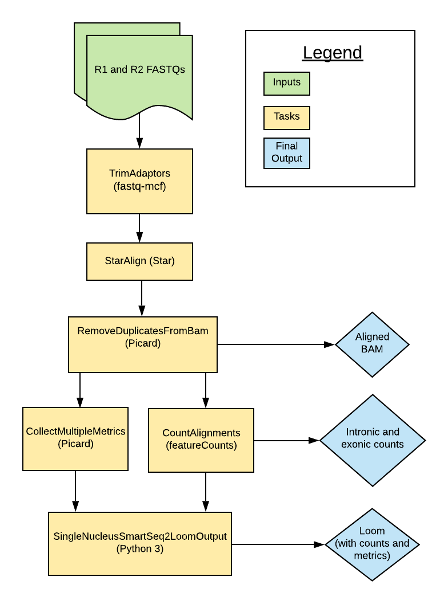

# Smart-seq2 Single Nucleus Multi-Sample Overview

| Pipeline Version | Date Updated | Documentation Author | Questions or Feedback |
| :----: | :---: | :----: | :--------------: |
| [MultiSampleSmartSeq2SingleNuclei_v1.2.14](https://github.com/broadinstitute/warp/releases) | November, 2022 | [Elizabeth Kiernan](mailto:ekiernan@broadinstitute.org) | Please file GitHub issues in WARP or contact [the WARP team](mailto:warp-pipelines-help@broadinstitute.org) |



## Introduction to the Smart-seq2 Single Nucleus Multi-Sample pipeline

The Smart-seq2 Single Nucleus Multi-Sample (Multi-snSS2) pipeline was developed in collaboration with the [BRAIN Initiative Cell Census Network](https://biccn.org/) (BICCN) to process single-nucleus RNAseq (snRNAseq) data generated by [Smart-seq2 assays](https://www.nature.com/articles/nmeth.2639). The pipeline's workflow is written in WDL, is freely available in the [WARP repository](https://github.com/broadinstitute/warp/blob/master/pipelines/skylab/smartseq2_single_nucleus_multisample/MultiSampleSmartSeq2SingleNucleus.wdl) on GitHub, and can be run by any compliant WDL runner (e.g. [Crowmell](https://github.com/broadinstitute/cromwell)). 

The pipeline is designed to process snRNA-seq data from multiple cells. Overall, the workflow trims paired-end FASTQ files, aligns reads to the genome using a modified GTF, [counts intronic and exonic reads](#6-creating-the-loom-cell-by-gene-matrix), and calculates quality control metrics.

The pipeline has been scientifically validated by the BRAIN Institute. Read more in the [validation section](#validation).


:::tip Try the Multi-snSS2 workflow in Terra
You can run the [Smart-seq2 Single Nucleus Multi-Sample workflow](https://github.com/broadinstitute/warp/blob/master/pipelines/skylab/smartseq2_single_nucleus_multisample/MultiSampleSmartSeq2SingleNucleus.wdl) in [Terra](https://app.terra.bio), a cloud-based analysis platform. The Terra [Smart-seq2 Single Nucleus Multi-Sample public workspace](https://app.terra.bio/#workspaces/warp-pipelines/Smart-seq2_Single_Nucleus_Muti-Sample) is preloaded with the Multi-snSS2 workflow, example testing data, and all the required reference data.
:::

## Quick start table

| Pipeline features | Description | Source |
|-------------------|---------------------------------------------------------------|-----------------------|
| Assay type | Smart-seq2 Single Nucleus | [Smart-seq2](https://www.nature.com/articles/nprot.2014.006)
| Overall workflow  | Quality control and transcriptome quantification. | Code available from the [WARP repository](https://github.com/broadinstitute/warp/tree/develop/pipelines/skylab/smartseq2_single_nucleus/SmartSeq2SingleNucleus.wdl) in GitHub |
| Workflow language | WDL | [openWDL](https://github.com/openwdl/wdl) |
| Genomic reference sequence (for validation)| GRCm38 mouse genome primary sequence. | GENCODE GRCm38 [mouse reference files](http://ftp.ebi.ac.uk/pub/databases/gencode/Gencode_mouse/release_M23/GRCm38.primary_assembly.genome.fa.gz) |
| Transcriptomic reference annotation (for validation) | Modified M23 GTF built with the  [BuildIndices workflow](https://github.com/broadinstitute/warp/tree/master/pipelines/skylab/build_indices/BuildIndices.wdl).| GENCODE [M23 GTF](https://www.gencodegenes.org/mouse/release_M23.html); modified version available [Broad references](gs://gcp-public-data--broad-references/mm10/v0/single_nucleus/modified_gencode.vM23.primary_assembly.annotation.gtf)|
| Aligner  | STAR | [STAR](https://github.com/alexdobin/STAR) |
| QC metrics | Picard | [Broad Institute](https://broadinstitute.github.io/picard/)   |
| Transcript quantification | featureCounts (utilities for counting reads to genomic features). | [featureCounts](http://subread.sourceforge.net/)
| Data input file format | File format in which sequencing data is provided. | [FASTQ](https://academic.oup.com/nar/article/38/6/1767/3112533) |
| Data output file formats | File formats in which Smart-seq2 output is provided. | [BAM](http://samtools.github.io/hts-specs/), Loom (counts and metrics; generated with [Loompy v.3.0.6)](http://loompy.org/), TSV (counts) |

## Set-Up

### Installation

To download the latest release of the Multi-snSS2 pipeline along with example data and dependencies, see the release tags prefixed with "MultiSampleSmartSeq2SingleNucleus" on the WARP [releases page](https://github.com/broadinstitute/warp/releases). All releases of the Multi-snSS2 pipeline are documented in the [Multi-snSS2 changelog](https://github.com/broadinstitute/warp/blob/master/pipelines/skylab/smartseq2_single_nucleus_multisample/MultiSampleSmartSeq2SingleNucleus.changelog.md).

To search releases of this and other pipelines, use the WARP command-line tool [Wreleaser](https://github.com/broadinstitute/warp/tree/master/wreleaser).

The workflow is deployed using [Cromwell](https://github.com/broadinstitute/cromwell), a GA4GH compliant, flexible workflow management system that supports multiple computing platforms.


### Inputs

There is an [example configuration (JSON) file](https://github.com/broadinstitute/warp/blob/master/pipelines/skylab/smartseq2_single_nucleus_multisample/mouse_example.json) available that you can use to test the Multi-snSS2 workflow. It points to publicly available reference files and sample paired-end FASTQs.

#### Sample data and reference inputs

The table below details the Multi-snSS2 inputs. The pipeline is designed to take in an array of paired-end reads in the form of two FASTQ files per cell. 

* The example mouse reference inputs are created using the [BuildIndices Pipeline](https://github.com/broadinstitute/warp/tree/master/pipelines/skylab/build_indices).
* The pipeline modifies a given GTF downloaded from GENCODE to only include biotypes that are listed in a tab separated file ([biotypes.tsv](https://github.com/broadinstitute/warp/blob/develop/dockers/skylab/build-indices/Biotypes.tsv)).
* The example references do not include the pseudogene biotype. Learn more about Ensembl biotypes in the [Ensembl overview](https://m.ensembl.org/info/genome/genebuild/biotypes.html).
* To enable intron counting, the workflow calls a [python script](https://github.com/broadinstitute/warp/blob/develop/dockers/skylab/build-indices/add-introns-to-gtf.py) to create a custom GTF with intron annotations. Introns are considered any part of a contig that is not exonic nor intergenic. 

| Input Name | Input Description | Input Format |
| --- | --- | --- |
| genome_ref_fasta | FASTA file used for metric collection by [Picard](https://broadinstitute.github.io/picard/). | File |
| tar_star_reference | TAR file containing genome indices used for the [STAR aligner](https://github.com/alexdobin/STAR). | File |
| annotations_gtf | Custom GTF file containing annotations for exon and intron tagging; must match `tar_star_reference`. | File |
| adapter_list | FASTA file containing adapter sequences used in the library preparation (i.e. Illumina adapters for Illumina sequencing). | File | 
| input_ids | Unique identifiers or names for each cell; can be a UUID or human-readable name. | Array of strings |
| input_names | Optional unique identifiers/names to further describe each cell. If `input_ids` is a UUID, the `input_names` could be used as a human-readable identifier. | Array of strings |
| fastq1_input_files | Cloud path to FASTQ files containing forward paired-end sequencing reads for each cell (sample); order must match the order in input_id. | Array of strings |
| fastq2_input_files | Cloud path to FASTQ files containing reverse paired-end sequencing reads for each cell (sample); order must match the order in input_id. | Array of strings |
| batch_id | Identifier for the batch of multiple samples. | String |
| batch_name | Optional string to describe the batch or biological sample. | String |
| project_id | Optional project identifier; usually a number. | Array of strings |
| project_name | Optional project identifier; usually a human-readable name. | Array of strings |
| library | Optional description of the sequencing method or approach. | Array of strings |
| organ | Optional description of the organ from which the cells were derived. | Array of strings |
| species | Optional description of the species from which the cells were derived. | Array of strings |
| input_name_metadata_field | Optional input describing, when applicable, the metadata field containing the `input_names`. | String |
| input_id_metadata_field | Optional string describing, when applicable, the metadata field containing the `input_ids`. | String |

## Multi-snSS2 tasks and tools

The [Multi-snSS2 workflow](https://github.com/broadinstitute/warp/blob/master/pipelines/skylab/smartseq2_single_nucleus_multisample/MultiSampleSmartSeq2SingleNucleus.wdl) imports individual "tasks" (written in WDL script) from the WARP [tasks folder](https://github.com/broadinstitute/warp/tree/master/tasks/skylab/).

Overall, the Multi-snSS2 workflow:
1. Trims adapters.
1. Aligns reads.
1. Removes duplicate reads.
1. Calculates metrics.
1. Quantifies gene counts.
1. Merges exon counts, intron counts, and metrics into a Loom-formatted matrix.

The tools each task employs in the Multi-snSS2 workflow are detailed in the table below. 

To see specific tool parameters, select the task WDL link in the table; then view the `command {}` section of the task WDL script. To view or use the exact tool software, see the task's Docker image which is specified in the task WDL `# runtime values` section as `String docker =`.

| Task name and WDL link | Tool | Software | Description |
| --- | --- | --- | --- |
| [CheckInputs.checkInputArrays](https://github.com/broadinstitute/warp/blob/master/tasks/skylab/CheckInputs.wdl) | --- | Bash | Checks the inputs and initiates the per cell processing.  | 
| [TrimAdapters.TrimAdapters](https://github.com/broadinstitute/warp/tree/master/tasks/skylab/TrimAdapters.wdl) | [fastq-mcf](https://github.com/ExpressionAnalysis/ea-utils/tree/master/clipper) | [ea-utils](https://github.com/ExpressionAnalysis/ea-utils) | Trims adapter sequences from the FASTQ inputs |
| [StarAlign.StarAlignFastqMultisample](https://github.com/broadinstitute/warp/tree/master/tasks/skylab/StarAlign.wdl) | STAR | [STAR](https://github.com/alexdobin/STAR) | Aligns reads to the genome. |
| [Picard.RemoveDuplicatesFromBam](https://github.com/broadinstitute/warp/tree/master/tasks/skylab/Picard.wdl) | MarkDuplicates, AddOrReplaceReadGroups | [Picard](https://broadinstitute.github.io/picard/) | Removes duplicate reads, producing a new BAM output; adds regroups to deduplicated BAM. |
| [Picard.CollectMultipleMetricsMultiSample](https://github.com/broadinstitute/warp/tree/master/tasks/skylab/Picard.wdl) | CollectMultipleMetrics | [Picard](https://broadinstitute.github.io/picard/) | Collects QC metrics on the deduplicated BAM files. |
| [CountAlignments.CountAlignments](https://github.com/broadinstitute/warp/tree/master/tasks/skylab/FeatureCounts.wdl) | FeatureCounts | [Subread](http://subread.sourceforge.net/), Python 3 | Uses a custom GTF with featureCounts and Python to mark introns, create a BAM that has alignments spanning intron-exon junctions removed, and counts exons using the custom BAM and by excluding intron tags. |
| [LoomUtils.SingleNucleusSmartSeq2LoomOutput](https://github.com/broadinstitute/warp/blob/master/tasks/skylab/LoomUtils.wdl) | Custom script: [ss2_loom_merge.py](https://github.com/broadinstitute/warp/blob/develop/dockers/skylab/pytools/tools/ss2_loom_merge.py) | Python 3 | Creates the matrix files (Loom format) for each sample. |
| [LoomUtils.AggregateSmartSeq2Loom](https://github.com/broadinstitute/warp/blob/master/tasks/skylab/LoomUtils.wdl) | Custom script: [ss2_loom_merge.py](https://github.com/broadinstitute/warp/blob/develop/dockers/skylab/pytools/tools/ss2_loom_merge.py) | Python 3 | Aggregates the matrix files (Loom format) for each sample to produce one final Loom output. |

#### 1. Trimming adapters
The TrimAdapters task uses the adapter list reference file to run the [fastq-mcf](https://github.com/ExpressionAnalysis/ea-utils/tree/master/clipper) tool. This tool identifies the adapters in the input FASTQ files and performs clipping by using a subsampling parameter of 200,000 reads. The task outputs the trimmed FASTQ files which are then used for alignment. 

#### 2. Aligning reads
The StarAlignFastq task runs the STAR aligner on the trimmed FASTQ files. The STAR quantMode parameter is set to GeneCounts, which counts the number of reads per gene while mapping. The task outputs a coordinate-sorted aligned BAM file. 

#### 3. Removing duplicate reads
The RemoveDuplicatesFromBam task removes multi-mapped reads, optical duplicates, and PCR duplicates from the aligned BAM. It then adds readgroup information and creates a new, coordinate-sorted aligned BAM output.

#### 4. Collecting metrics
The CollectMultipleMetrics task uses the Picard tool CollectMultipleMetrics to perform QC on the deduplicated BAM file. These metrics are copied to the final cell-by-gene matrix output (Loom file).

#### 5. Counting genes
The CountAlignments task uses the featureCounts package to count introns and exons. First, the featureCounts tool counts intronic alignments in the deduplicated BAM using a custom GTF with annotated introns. The tool flags intronic alignments if they overlap an annotated intron by a minimum of 3 bp. 

Next, following pipeline processes established by the BICCN Whole Mouse Brain Working Group, a custom Python script (“[remove-reads-on-junctions.py](https://github.com/broadinstitute/warp/tree/master/dockers/skylab/featureCounts/remove-reads-on-junctions.py)”) removes all alignments in the deduplicated BAM that cross only one intron-exon junction and produces an intermediate BAM file for exon counting. This removes a negligible amount of putative intronic alignments that did not meet the 3 bp intron overlap criteria. 

Lastly, featureCounts uses the intermediate BAM with junctions removed to count exons. The final outputs of this step include a cell-by-gene matrix of intronic counts, a cell-by-gene matrix of exonic counts, and summary metrics for the different count types.

#### 6. Creating the Loom cell by gene matrix
The LoomUtils task combines the Picard metrics (alignment_summary_metrics, deduplication metrics, and the G/C bias summary metrics) with the featureCount exon and intron counts to create a Loom formatted cell-by-gene count matrix. 

The cell-by-gene matrix can be examined using [Loompy software](https://linnarssonlab.org/loompy/index.html). Exonic counts are stored in the main Loom matrix which is unnamed by default. They are the default return value of the `loompy.connect()` command. Intronic counts are stored in the Loom as an additional layer which is named `intron_counts`.

You can also access exonic and intronic counts using Loompy's `layers()` method. For example, `loompy.connect.layers[“”]` will return the exonic counts from the output Loom file. Similarly, `loompy.connect.layers[“intron_counts”]` will return the intronic counts from the output Loom. 

Whole gene counts (which include both intronic and exonic counts) can be accessed by adding the intronic and exonic counts together. 

Below is example Loompy code for accessing the Loom's exonic, intronic, and whole gene counts.

```python
import loompy
ds = loompy.connect("/PATH/TO/File.loom")
count_exons = ds[:,:] #geneXcell table for the exonic read counts
count_introns = ds.layer["intron_counts"] #geneXcell table for the intronic read counts
gene_counts = count_exons + count_introns
```

To read more about the Loom file format and use of layers, see the [Loompy documentation](https://linnarssonlab.org/loompy/index.html).

#### 7. Outputs

The table below details the final outputs of the Multi-snSS2 workflow.  

| Output variable name | Description | Type |
| --- | --- | --- |
| loom_output | Cell-by-gene count matrix that includes the raw exon counts (in matrix), intron counts (in matrix layer), cell metrics (column attributes) and gene IDs (row attributes). | Loom |
| exon_intron_count_files | Array of TXT files (one per cell) that contain intronic and exonic counts. | Array [TXT]| 
| bam_files | Array of genome-aligned BAM files (one for each cell) generated with STAR.  | Array [BAM]|
| pipeline_version_out | Version of the processing pipeline run on this data. | String |

To facilitate downstream analysis, the output Loom file contains both gene names and gene IDs.

## Validation
The Multi-snSS2 pipeline was scientifically validated by the BRAIN Initiatives Cell Census Network (BICCN) 2.0 Whole Mouse Brain Working Group. 

## Versioning
All Multi-snSS2 release notes are documented in the [Multi-snSS2 changelog](https://github.com/broadinstitute/warp/blob/master/pipelines/skylab/smartseq2_single_nucleus_multisample/MultiSampleSmartSeq2SingleNucleus.changelog.md).

## Citing the Multi-snSS2 Pipeline
To cite the Multi-snSS2 pipeline, use the [SciCrunch resource identifier](https://scicrunch.org/scicrunch/Resources/record/nlx_144509-1/SCR_021312/resolver).
* Ex: *Smart-seq2 Single Nucleus Multi-Sample Pipeline (RRID:SCR_021312)*

To view an example of this citation as well as a publication-style methods section, see the Multi-snSS2 [Example Methods](./multi_snss2.methods.md). 

## Consortia Support
This pipeline is supported and used by the [BRAIN Initiative Cell Census Network](https://biccn.org/) (BICCN). 

Each consortia may use slightly different reference files for data analysis or have different post-processing steps. Learn more by reading the [Consortia Processing](./consortia-processing.md) overview.

If your organization also uses this pipeline, we would love to list you! Please reach out to us by contacting [the WARP team](mailto:warp-pipelines-help@broadinstitute.org).

## Feedback
Please help us make our tools better by contacting [the WARP team](mailto:warp-pipelines-help@broadinstitute.org) for pipeline-related suggestions or questions.
