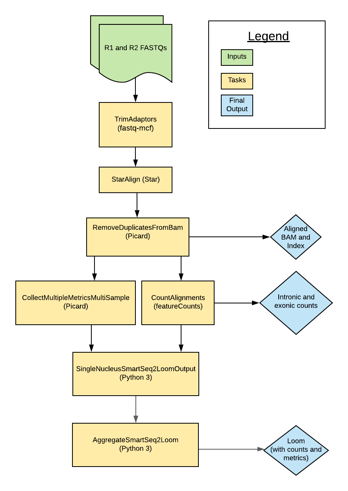

# Smart-seq2 Single Nucleus Multi-Sample Overview

| Pipeline Version | Date Updated | Documentation Author | Questions or Feedback |
| :----: | :---: | :----: | :--------------: |
| [MultiSampleSmartSeq2SingleNuclei_v1.2.0.](https://github.com/broadinstitute/warp/releases) | February, 2022 | [Elizabeth Kiernan](mailto:ekiernan@broadinstitute.org) | Please file GitHub issues in WARP or contact [Kylee Degatano](mailto:kdegatano@broadinstitute.org) |

## Introduction to the Smart-seq2 Single Nucleus Multi-Sample pipeline

The Smart-seq2 Single Nucleus Multi-Sample (Multi-snSS2) pipeline was developed in collaboration with the [BRAIN Initiative Cell Census Network](https://biccn.org/) (BICCN) to process single-nucleus RNAseq (snRNAseq) data generated by [Smart-seq2 assays](https://www.nature.com/articles/nmeth.2639). The pipeline's workflow is written in WDL, is freely available in the [WARP repository](https://github.com/broadinstitute/warp/blob/develop/pipelines/skylab/smartseq2_single_nucleus_multisample/MultiSampleSmartSeq2SingleNucleus.wdl) on GitHub, and can be run by any compliant WDL runner (e.g. [Crowmell](https://github.com/broadinstitute/cromwell)). 

The pipeline is designed to process snRNA-seq data from multiple cells. Overall, the workflow trims paired-end FASTQ files, aligns reads to the genome using a modified GTF, counts intronic and exonic reads, and calculates quality control metrics.

The pipeline has been scientifically validated by the BRAIN Institute. Read more in the [validation section](#validation).

:::tip Try the Multi-snSS2 workflow in Terra
You can run the [Smart-seq2 Single Nucleus Multi-Sample workflow](https://github.com/broadinstitute/warp/blob/master/pipelines/skylab/smartseq2_single_nucleus_multisample/MultiSampleSmartSeq2SingleNucleus.wdl) in [Terra](https://app.terra.bio), a cloud-based analysis platform. The Terra [Smart-seq2 Single Nucleus Multi-Sample public workspace](https://app.terra.bio/#workspaces/warp-pipelines/Smart-seq2_Single_Nucleus_Muti-Sample) is preloaded with the Multi-snSS2 workflow, example testing data, and all the required reference data.
:::

## Quick start table

| Pipeline features | Description | Source |
|-------------------|---------------------------------------------------------------|-----------------------|
| Assay type | Smart-seq2 Single Nucleus | [Smart-seq2](https://www.nature.com/articles/nprot.2014.006)
| Overall workflow  | Quality control and transcriptome quantification. | Code available from the [WARP repository](https://github.com/broadinstitute/warp/tree/develop/pipelines/skylab/smartseq2_single_nucleus/SmartSeq2SingleNucleus.wdl) in GitHub |
| Workflow language | WDL | [openWDL](https://github.com/openwdl/wdl) |
| Genomic reference sequence (for validation)| GRCm38 mouse genome primary sequence. | GENCODE GRCm38 [Mouse](http://ftp.ebi.ac.uk/pub/databases/gencode/Gencode_mouse/release_M23/GRCm38.primary_assembly.genome.fa.gz) |
| Transcriptomic reference annotation (for validation) | Modified [M23](https://www.gencodegenes.org/mouse/release_M23.html) GTF built with the  [BuildIndices workflow](https://github.com/broadinstitute/warp/tree/master/pipelines/skylab/build_indices/BuildIndices.wdl).| GENCODE |
| Aligner  | STAR (v.2.7.10a) | [STAR](https://github.com/alexdobin/STAR) |
| QC metrics | Picard (v.2.20.4) | [Broad Institute](https://broadinstitute.github.io/picard/)   |
| Transcript quantification | featureCounts (utilities for counting reads to genomic features). | [featureCounts(v2.0.2)](http://subread.sourceforge.net/)
| Data input file format | File format in which sequencing data is provided. | [FASTQ](https://academic.oup.com/nar/article/38/6/1767/3112533) |
| Data output file formats | File formats in which Smart-seq2 output is provided. | [BAM](http://samtools.github.io/hts-specs/), Loom (counts and metrics; generated with [Loompy v.3.0.6)](http://loompy.org/), TSV (counts) |

## Set-Up

### Multi-snSS2 installation and requirements

The latest release of the workflow, example data, and dependencies are available from the WARP [releases page](https://github.com/broadinstitute/warp/releases) (see release tags prefixed with SmartSeq2SingleNucleus). To discover and search releases, use the WARP command-line tool [Wreleaser](https://github.com/broadinstitute/warp/tree/develop/wreleaser).
. 

The workflow is deployed using [Cromwell](https://github.com/broadinstitute/cromwell), a GA4GH compliant, flexible workflow management system that supports multiple computing platforms.

### Inputs

There is an [example configuration (JSON) file](https://github.com/broadinstitute/warp/blob/develop/pipelines/skylab/smartseq2_single_nucleus_multisample/mouse_example.json) available that you can to test the Multi-snSS2 workflow. It points to publicly available reference files and sample paired-end FASTQs.

#### Sample data and reference inputs

The table below details the Multi-snSS2 inputs. The pipeline is designed to take in an array of paired-end reads in the form of two FASTQ files per cell. 

* Reference inputs are created using the [BuildIndices Pipeline](https://github.com/broadinstitute/warp/tree/master/pipelines/skylab/build_indices).
* The pipeline modifies a given GTF downloaded from GENCODE to only include biotypes that are listed in a tab separated file (biotypes.tsv).
* To enable intron counting, the workflow calls a [python script](https://github.com/broadinstitute/warp/blob/develop/dockers/skylab/snss2-build-indices/add-introns-to-gtf.py) to create a custom GTF with intron annotations. Introns are considered any part of a contig that is not exonic nor intergenic. 

| Input Name | Input Description | Input Format |
| --- | --- | --- |
| fastq1_input_files | Cloud path to FASTQ files containing forward paired-end sequencing reads for each cell (sample); order must match the order in input_id. | Array of strings |
| fastq2_input_files | Cloud path to FASTQ files containing reverse paired-end sequencing reads for each cell (sample); order must match the order in input_id. | Array of strings |
| input_ids | Unique identifiers or names for each cell; can be a UUID or human-readable name. | Array of strings |
| input_names | Optional unique identifiers/names to further describe each cell. If `input_ids` is a UUID, the `input_names` could be used as a human-readable identifier. | String |
| batch_id | Identifier for the batch of multiple samples. | String |
| batch_name | Optional string to describe the batch or biological sample. | String |
| input_name_metadata_field | Optional input describing, when applicable, the metadata field containing the `input_names`. | String |
| input_id_metadata_field | Optional string describing, when applicable, the metadata field containing the `input_ids`. | String |
| project_id | Optional project identifier; usually a number. | String |
| project_name | Optional project identifier; usually a human-readable name. | String |
| library | Optional description of the sequencing method or approach. | String |
| organ | Optional description of the organ from which the cells were derived. | String |
| species | Optional description of the species from which the cells were derived. | String |
| tar_star_reference | Genome references for STAR alignment. | TAR |
| annotations_gtf | Custom GTF file containing annotations for exon and intron tagging; must match the STAR reference. | GTF | 
| genome_ref_fasta | FASTA file used for STAR alignment. | FASTA | 
| adapter_list | File listing adapter sequences used in the library preparation (i.e. Illumina adapters for Illumina sequencing). | FASTA | 

## Running Multi-snSS2

The [Multi-snSS2 workflow ](https://github.com/broadinstitute/warp/tree/develop/pipelines/skylab/smartseq2_single_nucleus/SmartSeq2SingleNucleus.wdl) is in the [pipelines/smartseq2_single_nucleus folder](https://github.com/broadinstitute/warp/tree/snSS2_first_wdls/pipelines/skylab/smartseq2_single_nucleus) of the WARP repository and implements the workflow by importing individual tasks (written in WDL script) from the WARP [tasks folder](https://github.com/broadinstitute/warp/tree/master/tasks/skylab/).

### Multi-snSS2 workflow summary
| Task name and task’s WDL link | Description | Software | Tool |
| --- | --- | --- | --- |
| [CheckInputs.checkInputArrays](https://github.com/broadinstitute/warp/blob/develop/tasks/skylab/CheckInputs.wdl) | Checks the inputs and initiates the per cell processing. | Bash | NA | 
| [TrimAdapters.TrimAdapters](https://github.com/broadinstitute/warp/tree/develop/tasks/skylab/TrimAdapters.wdl) | Trims adapter sequences from the FASTQ inputs | [ea-utils](https://github.com/ExpressionAnalysis/ea-utils). | [fastq-mcf](https://github.com/ExpressionAnalysis/ea-utils/tree/master/clipper) |
| [StarAlign.StarAlignFastqMultisample](https://github.com/broadinstitute/warp/tree/develop/tasks/skylab/StarAlign.wdl) | Aligns reads to the genome. | STAR | STAR |
| [Picard.RemoveDuplicatesFromBam](https://github.com/broadinstitute/warp/tree/develop/tasks/skylab/Picard.wdl) | Removes duplicate reads, producing a new BAM output; adds regroups to deduplicated BAM. | Picard | MarkDuplicates, AddOrReplaceReadGroups |
| [Picard.CollectMultipleMetricsMultiSample](https://github.com/broadinstitute/warp/tree/develop/tasks/skylab/Picard.wdl) | Collects QC metrics on the deduplicated BAM files. | Picard | CollectMultipleMetrics |
| [CountAlignments.CountAlignments](https://github.com/broadinstitute/warp/tree/develop/tasks/skylab/FeatureCounts.wdl) | Uses a custom GTF with featureCounts and Python to mark introns, create a BAM that has alignments spanning intron-exon junctions removed, and counts exons using the custom BAM and by excluding intron tags. | [Subread](http://subread.sourceforge.net/) | [FeatureCounts](http://bioinf.wehi.edu.au/featureCounts/), Python 3 | 
| [LoomUtils.SingleNucleusSmartSeq2LoomOutput](https://github.com/broadinstitute/warp/blob/develop/tasks/skylab/LoomUtils.wdl) | Creates the matrix files (Loom format) for each sample. | Python 3 | Custom script: [ss2_loom_merge.py](https://github.com/broadinstitute/warp/blob/develop/dockers/skylab/loom-output/ss2_loom_merge.py) | 
| [LoomUtils.AggregateSmartSeq2Loom](https://github.com/broadinstitute/warp/blob/develop/tasks/skylab/LoomUtils.wdl) | Aggregates the matrix files (Loom format) for each sample to produce one final Loom output. | Python 3 | Custom script: [ss2_loom_merge.py](https://github.com/broadinstitute/warp/blob/develop/dockers/skylab/loom-output/ss2_loom_merge.py) | 

### Trimming adapters
The TrimAdapters task uses the adapter list reference file to run the [fastq-mcf](https://github.com/ExpressionAnalysis/ea-utils/tree/master/clipper) tool. This tool identifies the adapters in the input FASTQ files and performs clipping by using a subsampling parameter of 200,000 reads. The task outputs the trimmed FASTQ files which are then used for alignment. 

### Aligning reads
The StarAlignFastq task runs the STAR aligner on the trimmed FASTQ files. The STAR quantMode parameter is set to GeneCounts, which counts the number of reads per gene while mapping. The task outputs a coordinate-sorted aligned BAM file. 

### Removing duplicate reads 
The RemoveDuplicatesFromBam task removes multi-mapped reads, optical duplicates, and PCR duplicates from the aligned BAM. It then adds readgroup information and creates a new, coordinate-sorted aligned BAM output.

### Collecting metrics
The CollectMultipleMetrics task uses the Picard tool CollectMultipleMetrics to perform QC on the deduplicated BAM file. These metrics are copied to the final cell-by-gene matrix output (Loom file).

### Counting genes
The CountAlignments task uses the featureCounts package to count introns and exons. First, the featureCounts tool counts intronic alignments in the deduplicated BAM using a custom GTF with annotated introns. The tool flags intronic alignments if they overlap an annotated intron by a minimum of 3 bp. 

Next, following pipeline processes established by the BICCN Whole Mouse Brain Working Group, a custom Python script (“[remove-reads-on-junctions.py](https://github.com/broadinstitute/warp/tree/develop/dockers/skylab/featureCounts/remove-reads-on-junctions.py)”) removes all alignments in the deduplicated BAM that cross only one intron-exon junction and produces an intermediate BAM file for exon counting. This removes a negligible amount of putative intronic alignments that did not meet the 3 bp intron overlap criteria. 

Lastly, featureCounts uses the intermediate BAM with junctions removed to count exons. The final outputs of this step include a cell-by-gene matrix of intronic counts, a cell-by-gene matrix of exonic counts, and summary metrics for the different count types.

### Creating the cell-by-gene matrix (Loom)
The LoomUtils task combines the Picard metrics (alignment_summary_metrics, deduplication metrics, and the G/C bias summary metrics) with the featureCount exon and intron counts to create a Loom formatted cell-by-gene count matrix. 

Exonic counts are in the Loom matrix and intronic counts are added as a Loom layer. Read more about Loom file format in the [Loompy documentation](https://linnarssonlab.org/loompy/index.html).

### Outputs
The table below details the final outputs of the Multi-snSS2 workflow.  

| Output Name | Output Description | Output Format |
| --- | --- | --- |
| loom_output | Cell-by-gene count matrix that includes the raw exon counts (in matrix), intron counts (in matrix layer), cell metrics (column attributes) and gene IDs (row attributes). | Loom |
| bam_files | Array of genome-aligned BAM files (one for each cell) generated with Star.  | Array [BAM]|
| exon_intron_count_files | Array of TXT files (one per cell) that contain intronic and exonic counts. | Array [TXT]| 

## Validation
The Multi-snSS2 pipeline was scientifically validated by the BRAIN Initiatives Cell Census Network (BICCN) 2.0 Whole Mouse Brain Working Group. 

## Versioning
All Multi-snSS2 release notes are documented in the [Multi-snSS2 changelog](https://github.com/broadinstitute/warp/blob/develop/pipelines/skylab/smartseq2_single_nucleus_multisample/MultiSampleSmartSeq2SingleNucleus.changelog.md).

## Citing the Multi-snSS2 Pipeline
To cite the Multi-snSS2 pipeline, use the [SciCrunch resource identifier](https://scicrunch.org/scicrunch/Resources/record/nlx_144509-1/SCR_021312/resolver).
* Ex: *Smart-seq2 Single Nucleus Multi-Sample Pipeline (RRID:SCR_021312)*

To view an example of this citation as well as a publication-style methods section, see the Multi-snSS2 [Example Methods](./multi_snss2.methods.md) 

## Consortia Support 
This pipeline is supported and used by the [BRAIN Initiative Cell Census Network](https://biccn.org/) (BICCN). 

If your organization also uses this pipeline, we would love to list you! Please reach out to us by contacting [Kylee Degatano](mailto:kdegatano@broadinstitute.org).

## Have Suggestions?
Help us make our tools better by contacting [Kylee Degatano](mailto:kdegatano@broadinstitute.org) for pipeline-related suggestions or questions.

