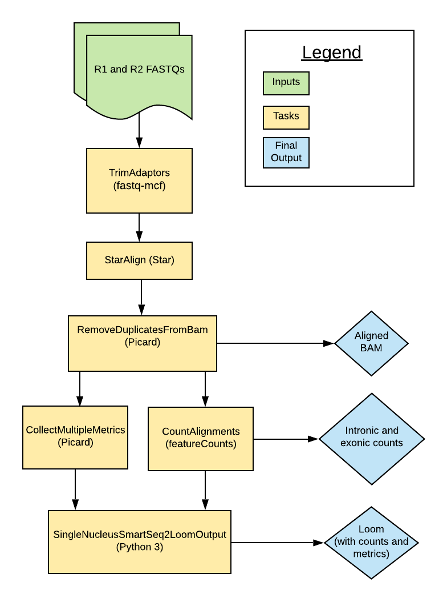

# Smart-seq2 Single Nucleus Overview

| Pipeline Version | Date Updated | Documentation Author | Questions or Feedback |
| :----: | :---: | :----: | :--------------: |
|  [SmartSeq2SingleNucleus_v1.0.0](https://github.com/broadinstitute/warp/releases)  | May, 2021 | [Elizabeth Kiernan](mailto:ekiernan@broadinstitute.org) | Please file GitHub issues in WARP or contact [Kylee Degatano](mailto:kdegatano@broadinstitute.org) |

## Introduction to the Smart-seq2 Single Nucleus Pipeline

The Smart-seq2 Single Nucleus (snSS2) pipeline was developed in collaboration with the [BRAIN Initiative Cell Census Network](https://biccn.org/) to process single-nucleus RNAseq (snRNAseq) data generated by [Smart-seq2 assays](https://www.nature.com/articles/nmeth.2639). The pipeline's workflow is written in WDL, is freely available in the [WARP repository](https://github.com/broadinstitute/warp/tree/develop/pipelines/skylab/smartseq2_single_nucleus/SmartSeq2SingleNucleus.wdl) on GitHub, and can be run by any compliant WDL runner (e.g. [Crowmell](https://github.com/broadinstitute/cromwell)). 

The pipeline is designed to process snRNA-seq data from an individual cell (to process multiple cells, see the [Smart-seq2_Multi Sample](https://github.com/broadinstitute/warp/tree/master/pipelines/skylab/smartseq2_multisample/MultiSampleSmartSeq2.wdl) pipeline).

Overall, the snSS2 workflow trims paired-end FASTQ files, aligns reads to the genome using a modified GTF, counts intronic and exonic reads, and calculates quality control metrics.

The pipeline has been scientifically validated by the BRAIN Institute. Read more in the [validation section](#validation).

## Quick Start Table

| Pipeline Features | Description | Source |
|-------------------|---------------------------------------------------------------|-----------------------|
| Assay Type | Smart-seq2 Single Nucleus | [Smart-seq2](https://www.nature.com/articles/nprot.2014.006)
| Overall Workflow  | Quality control and transcriptome quantification | Code available from the [WARP repository](https://github.com/broadinstitute/warp/tree/develop/pipelines/skylab/smartseq2_single_nucleus/SmartSeq2SingleNucleus.wdl) in GitHub|
| Workflow Language | WDL | [openWDL](https://github.com/openwdl/wdl) |
| Genomic Reference Sequence (for validation)| GRCm38 mouse genome primary sequence | GENCODE GRCm38 [Mouse](http://ftp.ebi.ac.uk/pub/databases/gencode/Gencode_mouse/release_M23/GRCm38.primary_assembly.genome.fa.gz) |
| Transcriptomic Reference Annotation (for validation) | Modified [M23](https://www.gencodegenes.org/mouse/release_M23.html) GTF built with the  [BuildIndices workflow](https://github.com/broadinstitute/warp/tree/master/pipelines/skylab/build_indices/BuildIndices.wdl)| GENCODE |
| Aligner  | STAR (v.2.7.8a) | [STAR](https://github.com/alexdobin/STAR) |
| QC Metrics | Picard (v.2.20.4) | [Broad Institute](https://broadinstitute.github.io/picard/)   |
| Transcript Quantification | featureCounts (utilities for counting reads to genomic features) | [featureCounts(v2.0.2)](http://subread.sourceforge.net/)
| Data Input File Format | File format in which sequencing data is provided | [FASTQ](https://academic.oup.com/nar/article/38/6/1767/3112533) |
| Data Output File Formats | File formats in which Smart-seq2 output is provided | [BAM](http://samtools.github.io/hts-specs/), Loom (generated with [Loompy v.3.0.6)](http://loompy.org/), TXT (QC metrics and counts) |

## Set-Up

### Smart-seq2 Installation and Requirements

The snSS2 workflow code can be downloaded by cloning the GitHub [WARP repository](https://github.com/broadinstitute/warp). For the latest release of snSS2, please see release tags prefixed with SmartSeq2SingleNucleus on the [WARP release page](https://github.com/broadinstitute/warp/releases).

The workflow is deployed using [Cromwell](https://github.com/broadinstitute/cromwell), a GA4GH compliant, flexible workflow management system that supports multiple computing platforms.

### Inputs

There is an [example configuration (JSON) file](https://github.com/broadinstitute/warp/tree/develop/pipelines/skylab/smartseq2_single_nucleus/mouse_paired_example.json) available that you can to test the snSS2 workflow. It points to publicly available reference files and sample paired-end FASTQs.

#### Sample Data Input

The pipeline is designed for paired-end reads in the form of two FASTQ files. It processes one sample (cell) at a time.

*  `fastq1`: forward reads for a sample with paired-end sequencing 
*  `fastq2`: reverse reads for a sample with paired-end sequencing 

#### Reference and Additional Inputs

The snSS2 workflow requires multiple references detailed in the table below. 
* Reference inputs are created using the [BuildIndices Pipeline](https://github.com/broadinstitute/warp/tree/master/pipelines/skylab/build_indices).
* The workflow uses a modified version of the 10x Genomic's code for building mouse ([GRCm38-2020-A](https://support.10xgenomics.com/single-cell-gene-expression/software/release-notes/build#mm10_2020A)) and human ([GRCh38-2020-A](https://support.10xgenomics.com/single-cell-gene-expression/software/release-notes/build#GRCh38_2020A)) reference packages. 
* To enable intron counting, the workflow calls a [shell script](https://github.com/broadinstitute/warp/blob/develop/dockers/skylab/snss2-build-indices/add-introns-to-gtf.py) to create a custom GTF with intron annotations. Introns are considered any part of a contig that is not exonic nor intergenic. 

| Reference name | Reference Description | Type |
| --- | --- | --- |
| tar_star_reference | Genome references for STAR alignment | TAR |
| annotations_gtf | Custom GTF file containing annotations for exon and intron tagging; must match the STAR reference | GTF | 
| genome_ref_fasta | FASTA file used for STAR alignment | FASTA | 
| stranded |  Library strand information; values are FR, RF, or NONE | String | 
| input_id | Unique identifier string for the cell; can be a UUID or human-readable ID | String |
| input_id_metadata_field | Optional value that can be used to identify any metadata fields specific to consortia (BRAIN Initiative, HCA, etc. ) that were used for the input_id | String |
| input_name | Optional unique identifier string for the cell; can be a human-readable alternative if a UUID is used for the input_id | String |
| input_name_metadata_field | Optional value that can be used to identify any metadata fields particular to consortia (e.g. Brain Initiative, HCA, etc. ) that were used for the input_name  | String |
| output_name | Unique name used for output files; can also be a cloud path | String |
| adapter_list | File listing adaptor sequences used in the library preparation (i.e. Illumina adaptors for Illumina sequencing) | File | 
| paired_end | Boolean description for if samples are paired-end | Boolean |

## Running Smart-seq2

The [snSS2 workflow ](https://github.com/broadinstitute/warp/tree/develop/pipelines/skylab/smartseq2_single_nucleus/SmartSeq2SingleNucleus.wdl) is in the [pipelines/smartseq2_single_nucleus folder](https://github.com/broadinstitute/warp/tree/snSS2_first_wdls/pipelines/skylab/smartseq2_single_nucleus) of the WARP repository and implements the workflow by importing individual tasks (written in WDL script) from the WARP [tasks folder](https://github.com/broadinstitute/warp/tree/master/tasks/skylab/).

### Smart-seq2 Single Nucleus Workflow Summary
| Task name and task’s WDL link | Description | Software | Tool |
| --- | --- | --- | --- |
| [TrimAdapters.TrimAdapters](https://github.com/broadinstitute/warp/tree/develop/tasks/skylab/TrimAdapters.wdl) | Trims adaptor sequences from the FASTQ inputs | [ea-utils](https://github.com/ExpressionAnalysis/ea-utils) | [fastq-mcf](https://github.com/ExpressionAnalysis/ea-utils/tree/master/clipper) |
| [StarAlignFastq.StarAlignFastqPairedEnd](https://github.com/broadinstitute/warp/tree/develop/tasks/skylab/StarAlign.wdl) | Aligns reads to the genome | STAR | STAR |
| [Picard.RemoveDuplicatesFromBam](https://github.com/broadinstitute/warp/tree/develop/tasks/skylab/Picard.wdl) | Removes duplicate reads, producing a new BAM output; adds regroups to deduplicated BAM | Picard | MarkDuplicates, AddOrReplaceReadGroups |
| [Picard.CollectMultipleMetrics](https://github.com/broadinstitute/warp/tree/develop/tasks/skylab/Picard.wdl) | Collects QC metrics on the deduplicated BAM file | Picard | CollectMultipleMetrics |
| [CountAlignments.CountAlignments](https://github.com/broadinstitute/warp/tree/develop/tasks/skylab/FeatureCounts.wdl) | Uses a custom GTF with featureCounts and Python to mark introns, create a BAM that has alignments spanning intron-exon junctions removed, and counts exons using the custom BAM and by excluding intron tags | [Subread](http://subread.sourceforge.net/) | [FeatureCounts](http://bioinf.wehi.edu.au/featureCounts/), Python 3 | 
| [LoomUtils.SingleNucleiSmartSeq2LoomOutput](https://github.com/broadinstitute/warp/tree/develop/tasks/skylab/LoomUtils.wdl) | Combines featureCounts and Picard metric outputs into a Loom formatted cell-by-gene matrix | Python 3 | [Custom script](https://github.com/broadinstitute/warp/tree/develop/dockers/skylab/loom-output/create_loom_snss2.py)

### Trimming Adaptors
The TrimAdaptors task uses the adaptor list reference file to run the [fastq-mcf](https://github.com/ExpressionAnalysis/ea-utils/tree/master/clipper) tool. This tool identifies the adaptors in the input FASTQ files and performs clipping by using a subsampling parameter of 200,000 reads. The task outputs the trimmed FASTQ files which are then used for alignment. 

### Aligning Reads
The StarAlignFastq task runs the STAR aligner on the trimmed FASTQ files. The STAR quantMode parameter is set to GeneCounts, which counts the number of reads per gene while mapping. The task outputs a coordinate-sorted aligned BAM file. 

### Removing Duplicate Reads 
The RemoveDuplicatesFromBam task removes multi-mapped reads, optical duplicates, and PCR duplicates from the aligned BAM. It then adds readgroup information and creates a new, coordinate-sorted aligned BAM output.

### Collecting Metrics
The CollectMultipleMetrics task uses the Picard tool CollectMultipleMetrics to perform QC on the deduplicated BAM file. These metrics are copied to the final cell-by-gene matrix output (Loom file).

### Counting Genes
The CountAlignments task uses the featureCounts package to count introns and exons. First, the featureCounts tool counts intronic alignments in the deduplicated BAM using a custom GTF with annotated introns. The tool flags intronic alignments if they overlap an annotated intron by a minimum of 3 bp. 

Next, following pipeline processes established by the BICCN Whole Mouse Brain Working Group, a custom Python script (“[remove-reads-on-junctions.py](https://github.com/broadinstitute/warp/tree/develop/dockers/skylab/featureCounts/remove-reads-on-junctions.py)”) removes all alignments in the deduplicated BAM that cross only one intron-exon junction and produces an intermediate BAM file for exon counting. This removes a negligible amount of putative intronic alignments that did not meet the 3 bp intron overlap criteria. 

Lastly, featureCounts uses the intermediate BAM with junctions removed to count exons. The final outputs of this step include a cell-by-gene matrix of intronic counts, a cell-by-gene matrix of exonic counts, and summary metrics for the different count types.

### Creating the Cell-by-Gene Matrix (Loom)
The LoomUtils task combines the Picard metrics (alignment_summary_metrics, deduplication metrics, and the G/C bias summary metrics) with the featureCount exon and intron counts to create a Loom formatted cell-by-gene count matrix. 

Exonic counts are in the Loom matrix and intronic counts are added as a Loom layer. Read more about Loom file format in the [Loompy documentation](https://linnarssonlab.org/loompy/index.html).

### Outputs
The table below details the final outputs of the snSS2 workflow.  

| Output Variable Name | Output Description | Output Format |
| --- | --- | --- |
| pipeline_version_out | Version of the processing pipeline run on this data | String |
| aligned_bam | | Aligned BAM | BAM |
| exon_intron_counts | Text file containing intron counts, intron FPKMs, exon counts, and exon FPKMs | TXT |
| loom_output_files | Cell-by-gene count matrix that includes the raw exon counts (in matrix), intron counts (in matrix layer), cell metrics (column attributes) and gene IDs (row attributes) | Loom |

## Validation
The snSS2 pipeline was scientifically validated by the BRAIN Initiatives Cell Census Network (BICCN) 2.0 Whole Mouse Brain Working Group. 

## Versioning
All Smart-seq2 Single Nucleus release notes are documented in the [Smartseq2 Single Nucleus changelog](https://github.com/broadinstitute/warp/tree/develop/pipelines/skylab/smartseq2_single_nucleus/SmartSeq2SingleNucleus.changelog.md).

## Have Suggestions?
Help us make our tools better by contacting [Kylee Degatano](mailto:kdegatano@broadinstitute.org) for pipeline-related suggestions or questions.

