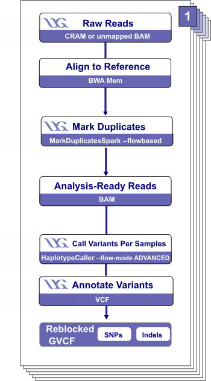

# Ultima Genomics Whole Genome Germline Overview

| Pipeline Version | Date Updated | Documentation Authors | Questions or Feedback |
| :----: | :---: | :----: | :--------------: |
| [UltimaGenomicsWholeGenomeGermline_v1.1.5](https://github.com/broadinstitute/warp/releases) | March, 2025 | Elizabeth Kiernan & Kaylee Mathews| Please [file an issue in WARP](https://github.com/broadinstitute/warp/issues). |

## Introduction to the UG_WGS workflow

The [Ultima Genomics Whole Genome Germline (UG_WGS) workflow](https://github.com/broadinstitute/warp/blob/develop/pipelines/wdl/dna_seq/germline/single_sample/ugwgs/UltimaGenomicsWholeGenomeGermline.wdl) is an open-source, cloud-optimized workflow for processing whole-genome germline sequencing data generated using the Ultima Genomics sequencing platform. 

### Background: Ultima Genomics sequencing

Ultima Genomics sequencing is a novel technology that produces single-read, flow-based data ([Almogy et al., 2022](https://www.biorxiv.org/content/10.1101/2022.05.29.493900v1)). The sequencing platform works by flowing one nucleotide at a time in order, iteratively. This is in contrast to traditional technologies that do all four nucleotides at once. This iterative approach ensures that only one dNTP is responsible for the signal and it does not require the blocking of dNTPs.  

### What does the workflow do?

The workflow requires either an aligned CRAM output of the sequencing platform or an unmapped BAM as input. Overall, it aligns reads to a reference genome, marks duplicate reads, calls variants, post-processes variants in the output VCF in preparation for joint calling, and calculates quality control metrics. The workflow outputs a (re)aligned CRAM, an annotated GVCF with index, and quality metrics. 

<!--- add a comment about validation of the pipeline --->

<!--- tip for methods section will go here --->

<!--- quickstart table will go here --->

## Set-up

### Installation

To download the latest release of the UG_WGS pipeline, see the release tags prefixed with "UG_WGS" on the WARP [releases page](https://github.com/broadinstitute/warp/releases). All releases of the UG_WGS pipeline are documented in the [UG_WGS changelog](https://github.com/broadinstitute/warp/blob/develop/pipelines/wdl/dna_seq/germline/single_sample/ugwgs/UltimaGenomicsWholeGenomeGermline.changelog.md). 

To search releases of this and other pipelines, use the WARP command-line tool [Wreleaser](https://github.com/broadinstitute/warp/tree/develop/wreleaser).

<!--- add a comment about running an old version of the workflow --->

The UG_WGS pipeline can be deployed using [Cromwell](https://cromwell.readthedocs.io/en/stable/), a GA4GH compliant, flexible workflow management system that supports multiple computing platforms. The workflow can also be run in [Terra](https://app.terra.bio), a cloud-based analysis platform. 

<!--- link to the public workspace will go here --->

### Inputs

The UG_WGS workflow inputs are specified in JSON configuration files. An example configuration file can be found in the [input_files](https://github.com/broadinstitute/warp/tree/develop/pipelines/wdl/dna_seq/germline/single_sample/ugwgs/input_files) folder in the WARP repository. 

Multiple workflow inputs are in the form of structs, which are defined in [UG_WGS structs WDL](https://github.com/broadinstitute/warp/blob/develop/structs/dna_seq/UltimaGenomicsWholeGenomeGermlineStructs.wdl). 

#### Input descriptions

The workflow takes in an aligned CRAM (output of the Ultima Genomics sequencing platform) or an unmapped BAM file for one sample and one read group. 

The workflow input variables are listed below. If an input variable is part of a struct, the struct name is listed in the `Struct` column.

| Input variable name | Struct | Description | Type |
| --- | --- | --- | --- |
| input_cram_list  | N/A | Array of CRAM files to be used as workflow input; must be specified if `input_bam_list` is not provided.  | Array [File] |
| input_bam_list  | N/A | Array of unmapped BAM files to be used as workflow input; must be specified if `input_cram_list` is not provided. | Array [File] |
| base_file_name | N/A | Base name for each of the output files. | String |
| contamination_sites_path | ContaminationSites | Path to contamination site files. | String |
| contamination_sites_vcf | ContaminationSites | Contamination site VCF. | File |
| contamination_sites_vcf_index | ContaminationSites | Index for contamination site VCF. | File |
| ref_fasta | References | Reference FASTA file used for alignment with BWA-MEM. | File |
| ref_fasta_index | References | Reference FASTA index file used for alignment with BWA-MEM. | File |
| ref_dict | References | Dictionary file used for alignment with BWA-MEM. | File |
| ref_alt |  AlignmentReferences |  Reference files used for alignment with BWA-MEM. | File |
| ref_amb | AlignmentReferences | Reference files used for alignment with BWA-MEM.  | File |
| ref_ann | AlignmentReferences | Reference files used for alignment with BWA-MEM.  | File |
| ref_bwt | AlignmentReferences | Reference files used for alignment with BWA-MEM.  | File |
| ref_pac | AlignmentReferences | Reference files used for alignment with BWA-MEM.  | File |
| ref_sa | AlignmentReferences | Reference files used for alignment with BWA-MEM.  | File |
| wgs_calling_interval_list | VariantCallingSettings | Interval list used for variant calling with HaplotypeCaller. | File |
| break_bands_at_multiples_of | VariantCallingSettings | Breaks reference bands up at genomic positions that are multiples of this number; used to reduce GVCF file size. | Int |
| haplotype_scatter_count | VariantCallingSettings | Scatter count used for variant calling. | Int | 
| make_haplotype_bam | N/A | Boolean indicating if HaplotypeCaller should output a bamout file; default is set to "false". | Boolean |
| rsq_threshold | NA | Threshold for a read quality metric that is produced by the sequencing platform; default set to 1.0 | Float | 
| annotation_intervals | VcfPostProcessing | Annotation intervals used for filtering and annotating the HaplotypeCaller output VCF. | Array[File] |
| filtering_model_no_gt | VcfPostProcessing | Optional filtering file defining the model for VCF postprocessing. | File |
| af_only_gnomad | VcfPostProcessing | VCF with gnomAD allele frequencies used for metric stratification in the AnnotateVCF_AF task. | File |
| af_only_gnomad_index | VcfPostProcessing | Index for the `af_only_gnomad` VCF. | File |
| filter_cg_insertions | VcfPostProcessing | Boolean that indicates whether to filter CG insertions in HaplotypeCaller output VCF.  | Boolean |
| filtering_blocklist_file | VcfPostProcessing | Optional file used to flag genomic locations that can’t be trusted while filtering the HaplotypeCaller output VCF. | File |
| training_blocklist_file | VcfPostProcessing | Optional interval file for training a model to postprocess the HaplotypeCaller output VCF to identify false positives.  | File |
| exome_weight | VcfPostProcessing | Optional interval for exome weight that is used to train a model to identify false positives in the HaplotypeCaller output VCF.  | Int |
| exome_weight_annotation | VcfPostProcessing | Optional string to annotate exome weights. | String |
| interval_list_override | VcfPostProcessing | Optional interval list to use for VCF postprocessing | File |
| runs_file | VcfPostProcessing | BED file of homopolymer runs that can be difficult to sequence. | File |
| filtering_model_with_gt_name_override | VcfPostProcessing | Optional string to describe the optional filtering model with gt. | String |
| max_duplication_in_reasonable_sample | VcfPostProcessing | Number indicating the maximum duplication expected in a sample. | Float |
| max_chimerism_in_reasonable_sample | VcfPostProcessing | Number indicating the maximum chimerism expected in a sample. | Float |
| ref_dbsnp | VcfPostProcessing | VCF with dbSNP annotations to be added to the HaplotypeCaller output VCF. | File |
| ref_dbsnp_index | VcfPostProcessing | Index for the dbSNP annotation VCF. | File |
| wgs_coverage_interval_list | VcfPostProcessing | Interval list for the CollectWgsMetrics tool. | File |
| remove_low_tree_score_sites_cutoff | VcfPostProcessing | Optional float indicating a cutoff for low tree scores | Float |
| annotations_to_keep_command_for_reblocking | VcfPostProcessing | Optional command (--annotations-to-keep) for the ReblockGVCF task indicating what types annotations to keep in the reblocked GVCF. | String |
| increase_disk_size | N/A | Interval used to increase disk size; set to 20 GB by default. |  Int | 
| increase_metrics_disk_size | N/A | Interval used to adjust disk size; set to 80 by default. | Int | 
| filtering_model_no_gt_name | N/A | String to describe the optional filtering model; default set to "rf_model_ignore_gt_incl_hpol_runs". | String |
| merge_bam_file | N/A | Boolean indicating if by-interval bamout files from HaplotypeCaller should be merged into a single BAM. | Boolean |
| reads_per_split | N/A | Number of reads by which to split the CRAM prior to alignment. | Int |
| pipeline_version | N/A | String that describes the pipeline version number. | String |

#### Reference files
Reference files, such as the hg38- and dbSNP-related files are located in a public Google bucket. See the [example input configuration file](https://github.com/broadinstitute/warp/blob/develop/pipelines/wdl/dna_seq/germline/single_sample/ugwgs/input_files/UltimaGenomicsWholeGenomeGermline.inputs.json) for cloud locations.

## UG_WGS tasks and tools

The [UG_WGS workflow](https://github.com/broadinstitute/warp/blob/develop/pipelines/wdl/dna_seq/germline/single_sample/ugwgs/UltimaGenomicsWholeGenomeGermline.wdl) imports additional WDL scripts that contain the different workflow tasks. When applicable, links to these additional WDL scripts (subtasks/subworkflows) are provided in the summary section below. 

* Workflow tasks use different software tools to manipulate the workflow input data. To see specific tool parameters, select the task WDL link in the table; then find the task and view the `command {}` section of the task in the WDL script. 

* To view or use the exact tool software, see the task's Docker image which is specified in the task WDL `input {}` section as `String docker =`. 

* Docker images for the UG_WGS workflow are not yet versioned and officially released, but they are publicly available to test the workflow. 

Overall, the UG_WGS workflow:
1. Aligns with BWA-MEM and marks duplicates.
1. Converts a merged BAM to CRAM and validates the CRAM.
1. Extracts the nucleotide flow order.
1. Calculates quality control metrics.
1. Performs variant calling with HaplotypeCaller.
1. Merges BAMs and converts the GVCF to VCF.
1. Performs VCF post-processing in preparation for joint calling.

:::tip Multiple tasks are imported from nested sub-workflows
When applicable, links to the sub-workflow WDLs and nested tasks WDLs are provided. 
:::

### 1. Align and mark duplicates
**Sub-workflow name and link:** [UltimaGenomicsWholeGenomeCramOnly](https://github.com/broadinstitute/warp/blob/develop/pipelines/wdl/dna_seq/somatic/single_sample/ugwgs/UltimaGenomicsWholeGenomeCramOnly.wdl)

  * **Nested task name and WDL link:**

  [UltimaGenomicsWholeGenomeGermlineAlignmentMarkDuplicates.AlignmentAndMarkDuplicates](https://github.com/broadinstitute/warp/blob/develop/tasks/wdl/UltimaGenomicsWholeGenomeGermlineAlignmentMarkDuplicates.wdl)

The table below details the subtasks called by the AlignmentAndMarkDuplicates task, which splits the CRAM or BAM into subfiles, converts them to uBAM format, converts the uBAM to FASTQ for alignment with BWA-MEM, and marks duplicate reads in the resulting BAM files. 

The Picard tool MarkDuplicatesSpark has been adapted to handle ambiguity in the aligned start of a read. This functionality is applied using the tool’s `--flowbased` parameter.

| Subtask name and WDL link | Tool | Software | Description | 
| --- | --- | --- | --- |
| [Tasks.SplitCram as SplitInputCram](https://github.com/broadinstitute/warp/blob/develop/tasks/wdl/UltimaGenomicsWholeGenomeGermlineTasks.wdl) | split | crammer | If CRAM is the workflow input, splits the CRAM and outputs a split CRAM. |
| [AlignmentTasks.SamSplitter as SplitInputBam](https://github.com/broadinstitute/warp/blob/develop/tasks/wdl/Alignment.wdl) | SplitSamByNumberOfReads | Picard | If BAM is workflow input, splits the BAM and outputs an array of BAMs. |
| [Tasks.ConvertCramOrBamToUBam as ConvertToUbam](https://github.com/broadinstitute/warp/blob/develop/tasks/wdl/UltimaGenomicsWholeGenomeGermlineTasks.wdl) | view, RevertSam | samtools, Picard | Converts the split CRAM or BAM file to uBAM. |
| [Tasks.SamToFastqAndBwaMemAndMba](https://github.com/broadinstitute/warp/blob/develop/tasks/wdl/UltimaGenomicsWholeGenomeGermlineTasks.wdl) | SamToFastq, bwa mem, MergeBamAlignment | Picard, bwa mem  | Converts each uBAM to FASTQ format, aligns with BWA-MEM, and merges the alignment in the resulting BAM with metadata from the uBAM. |
| [Tasks.MarkDuplicatesSpark](https://github.com/broadinstitute/warp/blob/develop/tasks/wdl/UltimaGenomicsWholeGenomeGermlineTasks.wdl) | MarkDuplicatesSpark | GATK | Flags duplicate reads in the array of aligned and merged BAMs to create a new output BAM and index. |

### 2. Convert BAM to CRAM and validate the CRAM

**Sub-workflow name and link:** [UltimaGenomicsWholeGenomeCramOnly](https://github.com/broadinstitute/warp/blob/develop/pipelines/wdl/dna_seq/somatic/single_sample/ugwgs/UltimaGenomicsWholeGenomeCramOnly.wdl)

The two tasks below are used to convert each duplicate-marked BAM to CRAM and validate the resulting files.

| TASK name and WDL link | Tool | Software | Description |
| --- | --- | --- | --- |
| [Utilities.ConvertToCram](https://github.com/broadinstitute/warp/blob/develop/tasks/wdl/Utilities.wdl) | view | samtools | Converts the duplicated-marked BAM to CRAM. |
| [QC.ValidateSamFile as ValidateCram](https://github.com/broadinstitute/warp/blob/develop/tasks/wdl/Qc.wdl) | ValidateSamFile | Picard | Validates the CRAM file. |

### 3. Extract nucleotide flow order

**Sub-workflow name and link:** [UltimaGenomicsWholeGenomeCramOnly](https://github.com/broadinstitute/warp/blob/develop/pipelines/wdl/dna_seq/somatic/single_sample/ugwgs/UltimaGenomicsWholeGenomeCramOnly.wdl)

The flow order is the order in which nucleotides are passed during sequencing. This information is captured in the header of the BAM and is extracted as a text file for downstream processing.

| TASK name and WDL link | Tool | Software | Description |
| --- | --- | --- | --- | 
| [Tasks.ExtractSampleNameFlowOrder](https://github.com/broadinstitute/warp/blob/develop/tasks/wdl/UltimaGenomicsWholeGenomeGermlineTasks.wdl) | GetSampleName | GATK | Extracts the flow order from the BAM header into a text file that is used in downstream VCF post-processing. |

### 4. Calculate quality control metrics

**Sub-workflow name and link:** [UltimaGenomicsWholeGenomeCramOnly](https://github.com/broadinstitute/warp/blob/develop/pipelines/wdl/dna_seq/somatic/single_sample/ugwgs/UltimaGenomicsWholeGenomeCramOnly.wdl)

 * **Nested task name and WDL link:**

 [UltimaGenomicsWholeGenomeGermlineQC.UltimaGenomicsWholeGenomeGermlineQC as CollectStatistics](https://github.com/broadinstitute/warp/blob/develop/tasks/wdl/UltimaGenomicsWholeGenomeGermlineQC.wdl)

The workflow uses a contamination estimation that has been adapted to use only the highest quality SNP sites based on flow cycles and local realignment. This is different from the [Whole Genome Germline Single Sample](https://broadinstitute.github.io/warp/docs/Pipelines/Whole_Genome_Germline_Single_Sample_Pipeline/README/) pipeline in that HaplotypeCaller performs local realignment and feeds that output to VerifyBAM ID, which cleans up the alignment.

| Subtask name and WDL link | Tool | Software | Description | 
| --- | --- | --- | --- | 
| [Tasks.HaplotypeCaller as HaplotypeCallerForContamination](https://github.com/broadinstitute/warp/blob/develop/tasks/wdl/UltimaGenomicsWholeGenomeGermlineTasks.wdl) | HaplotypeCaller | GATK | Runs HaplotypeCaller using an interval list of variants with high allele frequencies (`contamination_sites_vcf`). |
| [Tasks.CheckContamination](https://github.com/broadinstitute/warp/blob/develop/tasks/wdl/UltimaGenomicsWholeGenomeGermlineTasks.wdl) | VerifyBamID | VerifyBamID | Checks contamination in the HaplotypeCallerForContamination bamout file. |
| [Tasks.CollectDuplicateMetrics](https://github.com/broadinstitute/warp/blob/develop/tasks/wdl/UltimaGenomicsWholeGenomeGermlineTasks.wdl) | CollectDuplicateMetrics | Picard | Checks duplication metrics in the aggregated, duplicate-marked BAM file. | 
| [QC.CollectQualityYieldMetrics](https://github.com/broadinstitute/warp/blob/develop/tasks/wdl/Qc.wdl) | CollectQualityYieldMetrics | Picard | Calculates QC metrics on the duplicated-marked BAM. | 
| [Tasks.CollectWgsMetrics](https://github.com/broadinstitute/warp/blob/develop/tasks/wdl/UltimaGenomicsWholeGenomeGermlineTasks.wdl) | CollectWgsMetrics | Picard | Collects WGS metrics on the duplicate-marked BAM using stringent thresholds. |
| [Tasks.CollectRawWgsMetrics](https://github.com/broadinstitute/warp/blob/develop/tasks/wdl/UltimaGenomicsWholeGenomeGermlineTasks.wdl) | CollectRawWgsMetrics | Picard | Collects the raw WGS metrics on the duplicated-marked BAM with commonly used QC metrics. |
| [Tasks.CollectAggregationMetrics](https://github.com/broadinstitute/warp/blob/develop/tasks/wdl/UltimaGenomicsWholeGenomeGermlineTasks.wdl) | CollectMultipleMetrics | Picard | Performs QC on the aligned, duplicated-marked BAM.| 
| [QC.CheckPreValidation](https://github.com/broadinstitute/warp/blob/develop/tasks/wdl/Qc.wdl) | custom script | python3 | Checks chimerism and duplicate files for a given threshold using a custom python script. |

### 5. Variant call with HaplotypeCaller

The workflow implements initial variant calling with a version of HaplotypeCaller that handles flow-based data. This version replaces the classic Hidden Markov Model (HMM) with a flow-based likelihood model that more accurately accounts for sequencing errors present in the data.

| Task name and WDL link | Tool | Software | Description |
| --- | --- | --- | --- | 
| [Utilities.ScatterIntervalList](https://github.com/broadinstitute/warp/blob/develop/tasks/wdl/Utilities.wdl) | IntervalListTools | Picard | Splits the calling interval list into sub-intervals in order to perform variant calling on the sub-intervals. |
| [Tasks.HaplotypeCaller](https://github.com/broadinstitute/warp/blob/develop/tasks/wdl/UltimaGenomicsWholeGenomeGermlineTasks.wdl) | HaplotypeCaller | GATK | Performs initial variant calling on the aligned BAM file and outputs sub-interval GVCFs and a bamout file. |

### 6. Merge VCFs and BAMs and convert GVCF to VCF
The workflow performs multiple post-processing steps to prepare the VCF for downstream joint calling. The HaplotypeCaller GVCF outputs are merged into a single GVCF and then converted to VCF in preparation for this post-processing.

| Task name and WDL link | Tool | Software | Description | 
| --- | --- | --- | --- | 
| [VariantDiscoverTasks.MergeVCFs](https://github.com/broadinstitute/warp/blob/develop/tasks/wdl/GermlineVariantDiscovery.wdl) | MergeVcfs | Picard | Merges the array of GVCFs from HaplotypeCaller into one VCF and index. |
| [Tasks.MergeBams](https://github.com/broadinstitute/warp/blob/develop/tasks/wdl/UltimaGenomicsWholeGenomeGermlineTasks.wdl) | MergeSamFiles | Picard | Merges the HaplotypeCaller bamout files into a single BAM file. |
| [Tasks.ConvertGVCFtoVCF](https://github.com/broadinstitute/warp/blob/develop/tasks/wdl/UltimaGenomicsWholeGenomeGermlineTasks.wdl) | GenotypeGVCFs | GATK | Converts to GVCF to VCF format in preparation for post-processing. |

### 7. Perform VCF post-processing
The workflow performs post-processing steps to prepare the VCF for downstream joint calling. First, it annotates the merged HaplotypeCaller output VCF with dbSNP variants, then it trains a model, a random forest classifier ([Almogy et al., 2022](https://www.biorxiv.org/content/10.1101/2022.05.29.493900v1)), to distinguish between true positive variants and false positives. Next, the model is applied to filter variants in the VCF.

| Task name and WDL link | Tool | Software | Description | 
| --- | --- | --- | --- | 
| [Tasks.AnnotateVCF](https://github.com/broadinstitute/warp/blob/develop/tasks/wdl/UltimaGenomicsWholeGenomeGermlineTasks.wdl) | VariantAnnotator | GATK | Adds dbSNP annotations to the HaplotypeCaller output VCF and outputs a new VCF with index. |
| [Tasks.AddIntervalAnnotationsToVCF](https://github.com/broadinstitute/warp/blob/develop/tasks/wdl/UltimaGenomicsWholeGenomeGermlineTasks.wdl) | annotate | bcftools | Adds additional interval annotations to the VCF. |
| [Tasks.TrainModel](https://github.com/broadinstitute/warp/blob/develop/tasks/wdl/UltimaGenomicsWholeGenomeGermlineTasks.wdl) | Custom script (train_models_pipeline.py) | genomics.py3 | Trains a model that can be applied for variant filtering to distinguish true and false-positive variants. |
| [Tasks.AnnotateVCF_AF](https://github.com/broadinstitute/warp/blob/develop/tasks/wdl/UltimaGenomicsWholeGenomeGermlineTasks.wdl) | view, index | vcfanno, bcftools | Adds gnomAD allele frequencies to the VCF for downstream metric calculation. |
| [Tasks.FilterVCF](https://github.com/broadinstitute/warp/blob/develop/tasks/wdl/UltimaGenomicsWholeGenomeGermlineTasks.wdl) | filter_variants_pipeline.py | genomics.py3 | Applies a trained model to filter for high quality VCF variants. |
| [Tasks.MoveAnnotationsToGvcf](https://github.com/broadinstitute/warp/blob/develop/tasks/wdl/UltimaGenomicsWholeGenomeGermlineTasks.wdl) | annotate | bcftools | Move the annotations and the tree score from the filtered VCF to produces a final post-processed GVCF and index. |
| [ReblockGVCF.ReblockGVCF](https://github.com/broadinstitute/warp/blob/develop/pipelines/wdl/dna_seq/germline/joint_genotyping/reblocking/ReblockGVCF.wdl) | ReblockGVCF | GATK | Reblocks the annotated GVCF. For more information on why the WARP germline pipelines perform reblocking, see the [blog on reblocking](https://broadinstitute.github.io/warp/blog/Nov21_ReblockedGVCF). |

### 8. Outputs

Workflow outputs are described in the table below. 
<!--- Link to metrics overview will go here --->

| Output variable name | Description | Type | 
| --- | --- | --- |
| output_gvcf | Final annotated, reblocked GVCF.  | File |
| output_gvcf_index | Index file for the final annotated, reblocked GVCF. | File |
| output_vcf | Annotated VCF file. | File |
| output_vcf_index | Index file for the annotated VCF. | File |
| haplotype_bam | Optional merged, duplicated-marked BAM output. | File |
| haplotype_bam_index | Index for the optional merged, duplicate-marked BAM output. | File | 
| output_cram | Final duplicate-marked CRAM file. | File |
| output_cram_index | Index file for the final CRAM. | File |
| output_cram_md5 | MD5 sum for the final CRAM. | File |
| selfSM | Contamination estimate from VerifyBamID. | File |
| contamination |  Estimated contamination from the CheckContamination task.| Float |
| filtered_vcf | Filtered VCF file. | File |
| filtered_vcf_index | Index for the filtered VCF. | File |
| quality_yield_metrics | The quality metrics calculated for the unmapped BAM files. | File |
| wgs_metrics | Metrics from the CollectWgsMetrics tool. | File |
| raw_wgs_metrics | Metrics from the CollectRawWgsMetrics tool. | File |
| duplicate_metrics | Duplicate read metrics from the MarkDuplicates tool. | File |
| agg_alignment_summary_metrics | Alignment summary metrics for the aggregated, duplicate-marked BAM. | File |
| agg_alignment_summary_pdf | Optional PDF of the alignment summary metrics for the aggregated BAM. | File |
| agg_gc_bias_detail_metrics | GC bias detail metrics for the aggregated, duplicate-marked BAM. | File |
| agg_gc_bias_pdf | PDF of GC bias for the aggregated, duplicate-marked BAM. | File |
| agg_gc_bias_summary_metrics | Bait bias summary metrics for the aggregated, duplicate-marked BAM. | File |
| agg_quality_distribution_pdf | PDF of the quality distribution for the aggregated, duplicate-marked BAM. | File |
| agg_quality_distribution_metrics | Quality distribution metrics for the aggregated, duplicate-marked BAM. | File |
| duplication_rate | Duplication rate. | Float |
| chimerism_rate | Chimerism rate. | Float |
| is_outlier_data | Boolean that indicates if the duplication rate and chimerism rate are above a specified threshold. | Boolean |
| sample_name | Sample name from aligned BAM header. | String |
| flow_order | Flow order (FO) from the aligned BAM header. | String | 
| barcode | Barcode from the aligned BAM header. | String | 
| id | ID from the aligned BAM header. | String |

#### Using outputs for downstream joint calling
The outputs of the UG_WGS workflow are not yet compatible with the WARP [Ultimate Genomics Joint Genotyping workflow](https://github.com/broadinstitute/warp/blob/develop/pipelines/wdl/dna_seq/germline/joint_genotyping/UltimaGenomics/UltimaGenomicsJointGenotyping.wdl), but efforts to release the workflow are in-progress.  

<!--- Validation will go here --->

## Versioning

All UG_WGS pipeline releases are documented in the [pipeline changelog](https://github.com/broadinstitute/warp/blob/develop/pipelines/wdl/dna_seq/germline/single_sample/ugwgs/UltimaGenomicsWholeGenomeGermline.changelog.md).

## Citing the UG_WGS Pipeline

If you use the UG_WGS Pipeline in your research, please cite our preprint:

Degatano, K., Awdeh, A., Cox III, R.S., Dingman, W., Grant, G., Khajouei, F., Kiernan, E., Konwar, K., Mathews, K.L., Palis, K., et al. Warp Analysis Research Pipelines: Cloud-optimized workflows for biological data processing and reproducible analysis. Bioinformatics 2025; btaf494. https://doi.org/10.1093/bioinformatics/btaf494

## Feedback

Please help us make our tools better by [filing an issue in WARP](https://github.com/broadinstitute/warp/issues); we welcome pipeline-related suggestions or questions.

<!--- FAQs will go here --->

