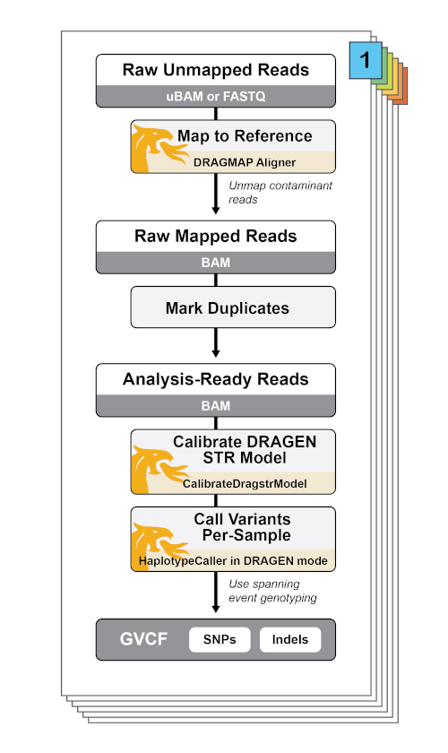

 
# Whole Genome Germline Single Sample Overview
 
| Pipeline Version | Date Updated | Documentation Author | Questions or Feedback |
| :----: | :---: | :----: | :--------------: |
| WholeGenomeGermlineSingleSample_v3.1.20 (see [releases page](https://github.com/broadinstitute/warp/releases)) | March, 2024 | Elizabeth Kiernan | Please [file an issue in WARP](https://github.com/broadinstitute/warp/issues). |
 
## Introduction to the Whole Genome Germline Single Sample Pipeline
The Whole Genome Germline Single Sample (WGS) pipeline implements data pre-processing and initial variant calling according to the GATK Best Practices for germline SNP and Indel discovery in human whole-genome sequencing data. It includes the DRAGEN-GATK mode, which makes the pipeline functionally equivalent to DRAGEN’s analysis pipeline (read more in this [DRAGEN-GATK blog](https://gatk.broadinstitute.org/hc/en-us/articles/360039984151)).


For a broad overview of the pipeline processes, read the GATK Best Practices documentation for [data pre-processing](https://gatk.broadinstitute.org/hc/en-us/articles/360035535912) and for [germline short variant discovery](https://gatk.broadinstitute.org/hc/en-us/articles/360035535932).
 
The pipeline adheres to the Functional Equivalence pipeline specification ([Regier et al., 2018](https://www.nature.com/articles/s41467-018-06159-4)), a standard set of pipeline parameters to promote data interoperability across a multitude of global research projects and consortia. Read the [specification](https://github.com/CCDG/Pipeline-Standardization/blob/master/PipelineStandard.md) for full details or learn more about functionally equivalent pipelines in [this GATK blog](https://github.com/broadinstitute/gatk-docs/blob/master/blog-2012-to-2019/2018-02-09-Batch_effects_begone:_Introducing_the_Functional_Equivalence_data_processing_pipeline_spec.md).
 
:::tip Want to try the WGS pipeline in Terra?
Two workspaces containing example data and instructions are available to test the WGS pipeline: 
1. a [DRAGEN-GATK-Germline-Whole-Genome-Pipeline workspace](https://app.terra.bio/#workspaces/warp-pipelines/DRAGEN-GATK-Whole-Genome-Germline-Pipeline) to showcase the DRAGEN-GATK pipeline mode
2. a [Whole-Genome-Analysis-Pipeline workspace](https://app.terra.bio/#workspaces/warp-pipelines/Whole-Genome-Analysis-Pipeline) to showcase the WGS pipeline with joint calling
:::
 
## Running the DRAGEN-GATK implementation of the WGS pipeline
Multiple WGS parameters are adjusted for the WGS workflow to run in the DRAGEN-GATK mode. 



#### Individual DRAGEN-GATK parameters
The WGS workflow can be customized to mix and match different DRAGEN-related parameters. In general, the following booleans may be modified to run in different DRAGEN-realted features: 

1. `use_bwa_mem`
    * When false, the workflow calls the DRAGEN DRAGMAP aligner instead of BWA mem.
2.  `run_dragen_mode_variant_calling`
    *  When true, the workflow creates a DRAGstr model with the GATK CalibrateDragstrModel tool and uses it for variant calling with HaplotypeCaller in --dragen-mode.
3. `perform_bqsr`
    * When false, turns off BQSR as it is not necessary for the DRAGEN pipeline; instead, base error correction is performed during variant calling. 
4. `dragen_mode_hard_filter`
    * When true, the parameter turns on VCF hard filtering.
 

#### Two DRAGEN modes for configuring the WGS pipeline
Although the DRAGEN parameters can be turned on and off as needed, there are two mutually exclusive input workflow modes that can automatically configure the DRAGEN-related inputs:
1. **dragen_functional_equivalence_mode**
2. **dragen_maximum_quality_mode**

The **dragen_functional_equivalence_mode** runs the pipeline so that it the outputs are functionally equivalent to those produced with the DRAGEN hardware. This mode will automatically set the following parameters:
1. `run_dragen_mode_variant_calling` is true.
2. `use_bwa_mem` is false.
3. `perform_bqsr` is false.
4. `use_spanning_event_genotyping` is false.
5. `dragen_mode_hard_filter` is true.

To learn more about how outputs are tested for functional equivalence, try the [Functional Equivalence workflow](https://app.terra.bio/#workspaces/broad-firecloud-dsde-methods/FunctionalEquivalence) in Terra.

The **dragen_maximum_quality_mode** runs the pipeline using the DRAGMAP aligner and DRAGEN variant calling, but with additional parameters that produce maximum quality results that are **not** functionally equivalent to the DRAGEN hardware. This mode will automatically set the following parameters:
1. `run_dragen_mode_variant_calling` is true.
1. `use_bwa_mem` is false.
1. `perform_bqsr` is false.
1. `use_spanning_event_genotyping` is true.
1. `dragen_mode_hard_filter` is true.


When the workflow applies the DRAGMAP aligner, it calls reference files specific to the aligner. These files are located in a [public Google bucket](gs://gcp-public-data--broad-references/hg38/v0/) and described in the [Input descriptions](#input-descriptions). See the [reference README](https://storage.googleapis.com/gcp-public-data--broad-references/hg38/v0/README_dragen_gatk_resources.txt) for details on recreating DRAGEN references.
 
## Set-up
 
### Workflow installation and requirements
 
The [WGS workflow](https://github.com/broadinstitute/warp/blob/master/pipelines/wdl/dna_seq/germline/single_sample/wgs/WholeGenomeGermlineSingleSample.wdl) is written in the Workflow Description Language [WDL](https://openwdl.org/) and can be downloaded by cloning the [warp repository](https://github.com/broadinstitute/warp/tree/master) in GitHub. 
The workflow can be deployed using [Cromwell](https://github.com/broadinstitute/cromwell), a GA4GH compliant, flexible workflow management system that supports multiple computing platforms. For the latest workflow version and release notes, see the WGS [changelog](https://github.com/broadinstitute/warp/blob/master/pipelines/wdl/dna_seq/germline/single_sample/wgs/WholeGenomeGermlineSingleSample.changelog.md).
 
The latest release of the workflow, example data, and dependencies are available from the WARP [releases page](https://github.com/broadinstitute/warp/releases). You can explore releases using the WARP command-line tool, [Wreleaser](https://github.com/broadinstitute/warp/tree/master/wreleaser).
 
### Input descriptions
The tables below describe each of the WGS pipeline inputs and reference files. 

Examples of how to specify each input can be found in the example [input configuration files (JSONs)](https://github.com/broadinstitute/warp/tree/master/pipelines/wdl/dna_seq/germline/single_sample/wgs/input_files). 
 
Multiple references are imported as part of a struct from the [DNASeqStruct WDL](https://github.com/broadinstitute/warp/blob/master/structs/dna_seq/DNASeqStructs.wdl), which is located in the WARP [structs library](https://github.com/broadinstitute/warp/tree/master/structs). For references that are part of a struct, the tables below list the relevant struct’s name. 
 
Overall, the workflow has the following input requirements:
* Human whole-genome paired-end sequencing data in unmapped BAM (uBAM) format
* One or more read groups, one per uBAM file, all belonging to a single sample (SM)
* Input uBAM files must additionally comply with the following requirements:
    * All filenames have the same suffix (we use ".unmapped.bam")
    * Files pass validation by ValidateSamFile
    * Reads are in query-sorted order
    * All reads have an RG tag
* Reference genome must be Hg38 with ALT contigs
 
#### Struct inputs
The following table describes the inputs imported from a struct. Although these are specified in the WGS workflow using the struct name, the actual inputs for each struct are specified in the [example configuration files](https://github.com/broadinstitute/warp/tree/master/pipelines/wdl/dna_seq/germline/single_sample/wgs/input_files). 


| Input name | Struct name (alias) | Input description | Input type |
| --- | --- | --- | --- |
| base_file_name | SampleAndUnmappedBams (sample_and_unmapped_bams) | String used for output files; can be set to a read group ID. | String |
| final_gvcf_base_name | SampleAndUnmappedBams (sample_and_unmapped_bams) | Base name for the output GVCF file; can be set to a read group ID. | String |
| flowcell_unmapped_bams | SampleAndUnmappedBams (sample_and_unmapped_bams) | Human whole-genome paired-end sequencing data in unmapped BAM (uBAM) format; each uBAM file contains one or more read groups all belonging to a single sample (SM). | Array of files | 
| sample_name | SampleAndUnmappedBams (sample_and_unmapped_bams) | A string to describe the sample; can be set to a read group ID. | String |
| unmapped_bam_suffix | SampleAndUnmappedBams (sample_and_unmapped_bams) | The suffice for the input uBAM file; must be consistent across files; (ex: “.unmapped.bam”). | String |
| contamination_sites_ud | DNASeqSingleSampleReferences (references) | Contamination site files for the CheckContamination task.  | File |
| contamination_sites_bed | DNASeqSingleSampleReferences (references) | Contamination site files for the CheckContamination task. | File |
| contamination_sites_mu | DNASeqSingleSampleReferences (references) | Contamination site files for the CheckContamination task. | File |
| calling_interval_list | DNASeqSingleSampleReferences (references) | Interval list used for variant calling. | File |
| reference_bin | DragmapReference (dragmap_reference) | Binary representation of the reference FASTA file used for the DRAGEN mode DRAGMAP aligner. | File |
| hash_table_cfg_bin | DragmapReference (dragmap_reference) | Binary representation of the configuration for the hash table used for the DRAGEN mode DRAGMAP aligner. | File |
| hash_table_cmp | DragmapReference (dragmap_reference) | Compressed representation of the hash table that is used for the DRAGEN mode DRAGMAP aligner. | File |
| haplotype_scatter_count | VariantCallingScatterSettings (scatter_settings) | Scatter count used for variant calling. | Int |
| break_bands_at_multiples_of | VariantCallingScatterSettings (scatter_settings) | Breaks reference bands up at genomic positions that are multiples of this number; used to reduce GVCF file size. | Int |
| preemptible_tries |  PapiSettings (papi_settings) | Number of times the workflow can be preempted. | Int | 
| agg_preemptible_tries |  PapiSettings (papi_settings) | Number of preemtible machine tries for the BamtoCram task. | Int |
 
#### Additional inputs
Additional inputs that are not contained in a struct are described in the table below. Similar to the struct inputs, these inputs are specified in the [example configuration files](https://github.com/broadinstitute/warp/tree/master/pipelines/wdl/dna_seq/germline/single_sample/wgs/input_files) or, when noted, are hardcoded into the WDL workflow.

* Optional inputs, like the fingerprint_genotypes_file, need to match your input samples. For example, the fingerprint file in the workflow's [test input configuration JSON](https://github.com/broadinstitute/warp/blob/master/pipelines/wdl/dna_seq/germline/single_sample/wgs/input_files/WholeGenomeGermlineSingleSample.inputs.plumbing.masked_reference.json) is set up to check fingerprints for the NA12878 Plumbing sample. The sample name in the VCF matches the name used for the `sample_name` input.


| Input name | Input description | Input type |
| --- | --- | --- |
| fingerprint_genotypes_file | Genotype VCF if optionally performing fingerprinting. For the CheckFingerprint task (below), the sample name specified in the sample_and_unmapped_bams variable must match the sample name in the fingerprint_genoptyes_file (VCF format). | File |
| fingerprint_genotypes_index | Optional index for the fingerprinting VCF. | File |
| wgs_coverage_interval_list | Interval list for the CollectWgsMetrics tool. | File |
| provide_bam_output | If set to true, provides the aligned BAM and index as workflow output; default set to false. | Boolean |
| use_gatk3_haplotype_caller | Uses the GATK3.5 HaplotypeCalller; default set to true. | Boolean |
| dragen_functional_equivalence_mode | Boolean used to run the WGS pipeline in a mode functionally equivalent to DRAGEN; set to false by default. This parameter is mutually exclusive with the `dragen_maxiumum_quality_mode` and will result in an error if both are set to true. | Boolean |
| dragen_maximum_quality_mode | Boolean used to run the pipeline in DRAGEN mode with modifications to produce maximum quality results; set to false by default. This parameter is mutually exclusive with the `dragen_functional_equivalence_mode` and will result in an error if both are set to true. | Boolean |
| run_dragen_mode_variant_calling | Boolean used to indicate that DRAGEN mode should be used for variant calling; default set to false but must be true to compose DRAGstr model and perform variant calling with HaplotypeCaller in dragen-mode. | Boolean |
| use_spanning_event_genotyping | Boolean used to call the HaplotypeCaller --disable-spanning-event-genotyping parameter; default set to true so that variant calling includes spanning events. Set to false to run the DRAGEN pipeline.  | Boolean |
| unmap_contaminant_reads | Boolean to indicate whether to identify extremely short alignments (with clipping on both sides) as cross-species contamination and unmap the reads; default set to true. This feature is not used in the pipeline mode functionally equivalent to DRAGEN. | Boolean |
| perform_bqsr | Boolean to turn on base recalibration with BQSR; default set to true, but not necessary when running the pipeline in DRAGEN mode. | Boolean |
| use_bwa_mem | Boolean indicating if workflow should use the BWA mem aligner; default set to true, but must be set to false to alternatively run the DRAGEN-GATK DRAGMAP aligner. | Boolean | 
| use_dragen_hard_filtering | Boolean that indicates if workflow should perform hard filtering using the GATK VariantFiltration tool with the --filter-name "DRAGENHardQUAL"; default set to false. | Boolean
|  read_length | Set to a max of 250 for collecting WGS metrics; hardcoded in the workflow WDL. | Int | 
| lod_threshold | LOD threshold for checking fingerprints; hardcoded to -20.0 in workflow WDL. | Float | 
| cross_check_fingerprints_by | Checks fingerprints by READGROUP; hardcoded in the workflow WDL. | String |
| recalibrated_bam_basename | Basename for the recalibrated BAM file; hardcoded to be the base_file_name in the sample_and_unmapped_bams struct + ".aligned.duplicates_marked.recalibrated" in the workflow WDL. | String |
| final_gvcf_base_name | Basename for the final GVCF file; harcoded in workflow WDL to be the final_gvcf_base_name from the sample_and_unmapped_bams struct, if applicable, or the base_file_name. | String | 
 
## Workflow tasks and tools
 
The WGS [workflow](https://github.com/broadinstitute/warp/blob/master/pipelines/wdl/dna_seq/germline/single_sample/wgs/WholeGenomeGermlineSingleSample.wdl) imports a series of tasks, coded in WDL scripts, from the [tasks library](https://github.com/broadinstitute/warp/tree/master/tasks/broad).
To learn more about the software tools implemented in these tasks, read the GATK support site’s [data pre-processing](https://gatk.broadinstitute.org/hc/en-us/articles/360035535912) and [germline short variant discovery](https://gatk.broadinstitute.org/hc/en-us/articles/360035535932) overviews.
 
:::tip Want to use the Whole Genome Germline Single Sample workflow in your publication?
Check out the workflow [Methods](./wgs.methods.md) to get started!
:::
The sections below outline each of the WGS workflow’s tasks and include tables detailing substasks, tools, and relevant software. 
 
### Quality control metric calculation and alignment of the unmapped BAM


**Workflow WDL task name and link:**
[UnmappedBamToAlignedBam.UnmappedBamToAlignedBam](https://github.com/broadinstitute/warp/blob/master/tasks/wdl/UnmappedBamToAlignedBam.wdl)
 
The table below details the subtasks called by the UnmappedBamToAlignedBam task, which calculates metrics on the unsorted, unaligned BAMs for each readgroup using Picard and then aligns reads using either BWA mem or the DRAGEN DRAGMAP aligner. It optionally corrects base calling errors with BQSR. It lastly merges individual recalibrated BAM files into an aggregated BAM.
 
| Subtask name (alias) and task WDL link | Tool | Software | Description |
| --- | --- | --- | --- |
| [QC.CollectQualityYieldMetrics (CollectQualityYieldMetrics)](https://github.com/broadinstitute/warp/blob/master/tasks/wdl/Qc.wdl) | CollectQualityYieldMetrics | Picard | Calculates QC metrics on the unaligned BAM. |
| [SplitRG.SplitLargeReadGroup (SplitRG)](https://github.com/broadinstitute/warp/blob/master/tasks/wdl/SplitLargeReadGroup.wdl) | --- | --- | If the BAM size is large, will split the BAMs; performs alignment using either BWA mem (`use_bwa_mem` = true) or the DRAGMAP aligner (`use_bwa_mem` = false). |
| [Alignment.SamToFastqAndBwaMemAndMba (SamToFastqAndBwaMemAndMba)](https://github.com/broadinstitute/warp/blob/master/tasks/wdl/Alignment.wdl) | SamToFastq; MergeBamAlignment | BWA mem, Picard | When `use_bwa_mem` = true, aligns using BWA mem; if `use_bwa_mem` = false, aligns with DRAGMAP aligner in the DragmapAlignment.SamToFastqAndDragmapAndMba task below. |
| [DragmapAlignment.SamToFastqAndDragmapAndMba (SamToFastqAndDragmapAndMba)](https://github.com/broadinstitute/warp/blob/master/tasks/wdl/DragmapAlignment.wdl) | dragen-os, MergeBamAlignment | Dragmap, Picard | When `use_bwa_mem` = false, aligns with the DRAGMAP aligner. |
| [QC.CollectUnsortedReadgroupBamQualityMetrics (CollectUnsortedReadgroupBamQualityMetrics)](https://github.com/broadinstitute/warp/blob/master/tasks/wdl/Qc.wdl) | CollectMultipleMetrics | Picard | Performs QC on the aligned BAMs with unsorted readgroups. | 
| [Processing.MarkDuplicates (MarkDuplicates)](https://github.com/broadinstitute/warp/blob/master/tasks/wdl/BamProcessing.wdl) | MarkDuplicates | Picard | Marks duplicate reads. |
| [Processing.SortSam](https://github.com/broadinstitute/warp/blob/master/tasks/wdl/BamProcessing.wdl) | SortSam | Picard | Sorts the aggregated BAM by coordinate sort order. |
| [QC.CrossCheckFingerprints (CrossCheckFingerprints)](https://github.com/broadinstitute/warp/blob/master/tasks/wdl/Qc.wdl) | CrosscheckFingerprints | Picard | Optionally checks fingerprints if haplotype database is provided. |
| [Utils.CreateSequenceGroupingTSV (CreateSequenceGroupingTSV)](https://github.com/broadinstitute/warp/blob/master/tasks/wdl/Utilities.wdl) | --- | python | Creates the sequencing groupings used for BQSR and PrintReads Scatter. |
| [Processing.CheckContamination](https://github.com/broadinstitute/warp/blob/master/tasks/wdl/BamProcessing.wdl) | VerifyBamID2 | --- | Checks cross-sample contamination prior to variant calling. |
| [Processing.BaseRecalibrator (BaseRecalibrator)](https://github.com/broadinstitute/warp/blob/master/tasks/wdl/BamProcessing.wdl) | BaseRecalibrator | GATK | If `perform_bqsr` is true, performs base recalibration by interval. When using the DRAGEN-GATK mode, `perform_bqsr` is optionally false as base calling errors are corrected in the DRAGEN variant calling step.|
| [Processing.GatherBqsrReports (GatherBqsrReports)](https://github.com/broadinstitute/warp/blob/master/tasks/wdl/BamProcessing.wdl) | GatherBQSRReports | GATK | Merges the BQSR reports resulting from by-interval calibration. |
| [Processing.ApplyBQSR (ApplyBQSR)](https://github.com/broadinstitute/warp/blob/master/tasks/wdl/BamProcessing.wdl) | ApplyBQSR | GATK | Applies the BQSR base recalibration model by interval. |
| [Processing.GatherSortedBamFiles (GatherBamFiles)](https://github.com/broadinstitute/warp/blob/master/tasks/wdl/BamProcessing.wdl) | GatherBamFiles | Picard | Merges the recalibrated BAM files. |
 
### Aggregate the aligned recalibrated BAM and calculate quality control metrics


**Workflow task name and link:**
[AggregatedBamQC.AggregatedBamQC](https://github.com/broadinstitute/warp/blob/master/tasks/wdl/AggregatedBamQC.wdl) 


The table below describes the subtasks of AggregatedBamQC.AggregatedBamQC task, which calculates quality control metrics on the aggregated recalibrated BAM file and checks for sample contamination.
 
| Subtask name (alias) and link | Tool | Software | Description |
| --- | --- | --- | --- |
| [QC.CollectReadgroupBamQualityMetrics (CollectReadgroupBamQualityMetrics)](https://github.com/broadinstitute/warp/blob/master/tasks/wdl/Qc.wdl) | CollectMultipleMetrics | Picard | Collects alignment summary and GC bias quality metrics on the recalibrated BAM. |
| [QC.CollectAggregationMetrics (CollectAggregationMetrics)](https://github.com/broadinstitute/warp/blob/master/tasks/wdl/Qc.wdl) | CollectMultipleMetrics | Picard | Collects quality metrics from the aggregated BAM. |
| [QC.CheckFingerprint (CheckFingerprint)](https://github.com/broadinstitute/warp/blob/master/tasks/wdl/Qc.wdl) | CheckFingerprint | Picard | Check that the fingerprint of the sample BAM matches the sample array. |
| [QC.CalculateReadGroupChecksum (CalculateReadGroupChecksum)](https://github.com/broadinstitute/warp/blob/master/tasks/wdl/Qc.wdl) | CalculateReadGroupChecksum | Picard | Generate a checksum per readgroup in the final BAM. |  
 
 
### Convert the aggregated recalibrated BAM to CRAM


**Workflow task name and link:**
[BamToCram.BamToCram](https://github.com/broadinstitute/warp/blob/master/tasks/wdl/BamToCram.wdl)
 
The table below describes the subtasks of BamToCram.BamToCram task which converts the recalibrated BAM to CRAM format and produces a validation report.


| Subtask name (alias) and link | Tool | Software | Description |
| --- | --- | --- | --- |
| [Utils.ConvertToCram (ConvertToCram)](https://github.com/broadinstitute/warp/blob/master/tasks/wdl/Utilities.wdl) | view, index | samtools | Converts the merged, recalibrated BAM to CRAM. |
| [QC.CheckPreValidation (CheckPreValidation)](https://github.com/broadinstitute/warp/blob/master/tasks/wdl/Qc.wdl) | --- | python | Checks if the data has massively high duplication or chimerism rates. |
| [QC.ValidateSamFile (ValidateCram)](https://github.com/broadinstitute/warp/blob/master/tasks/wdl/Qc.wdl) | ValidateSamFile | Picard | Validates the output CRAM file. |
 
### Collect WGS metrics using stringent thresholds


**Workflow task name and link:**
[QC.CollectWgsMetrics](https://github.com/broadinstitute/warp/blob/master/tasks/wdl/Qc.wdl)
 
The table below describes the QC.CollectWgsMetrics task which uses the Picard CollectWGSMetrics tool to calculate whole genome metrics using stringent thresholds.

| Subtask name (alias) and link | Tool | Software | Description |
| --- | --- | --- | --- |
| [CollectWgsMetrics](https://github.com/broadinstitute/warp/blob/master/tasks/wdl/Qc.wdl) | CollectWgsMetrics | Picard | Collects WGS metrics using stringent thresholds; tasks will break if the read lengths in the BAM are greater than 250, so the max `read_length` is set to 250 by default. |
 
### Collect raw WGS metrics using less stringent thresholds


**Workflow task name and link:**
[QC.CollectRawWgsMetrics](https://github.com/broadinstitute/warp/blob/master/tasks/wdl/Qc.wdl)
 
The table below describes the QC.CollectRawWgsMetrics task which uses the Picard CollecRawtWGSMetrics tool to calculate whole genome metrics using common thresholds.


| Subtask name (alias) and link | Tool | Software | Description |
| --- | --- | --- | --- |
| [QC.CollectRawWgsMetrics (CollectRawWgsMetrics)](https://github.com/broadinstitute/warp/blob/master/tasks/wdl/Qc.wdl) | CollectRawWgsMetrics | Picard | Collects the raw WGS metrics with commonly used QC metrics. |
 
### Call variants with HaplotypeCaller


**Workflow task name and link:**
[VariantCalling.VariantCalling (BamToGvcf)](https://github.com/broadinstitute/warp/blob/master/pipelines/wdl/dna_seq/germline/variant_calling/VariantCalling.wdl)
 
The table below describes the subtasks of the VariantCalling.VariantCalling (BamToGvcf) workflow, which uses the GATK HaplotypeCaller for SNP and Indel discovery. When the workflow runs in DRAGEN mode, it produces a Dragstr model that is used during variant calling, and it performs hard filtering.
 
| Subtask name (alias) and link | Tool | Software | Description |
| --- | --- | --- | --- |
| [Dragen.CalibrateDragstrModel (DragstrAutoCalibration)](https://github.com/broadinstitute/warp/blob/master/tasks/wdl/DragenTasks.wdl) | CalibrateDragstrModel | GATK | If `run_dragen_mode_variant_calling` is true, uses the reference FASTA file, the reference’s corresponding public STR (short tandem repeat) table file, and the recalibrated BAM to estimate the parameters for the DRAGEN STR model. The output parameter tables are used for the DRAGEN mode HaplotypeCaller. |
| [Utils.ScatterIntervalList (ScatterIntervalList)](https://github.com/broadinstitute/warp/blob/master/tasks/wdl/Utilities.wdl) | IntervalListTools | Picard, python | Breaks the interval list into subintervals for downstream variant calling. |
| [Calling.HaplotypeCaller_GATK35_GVCF (HaplotypeCallerGATK3)](https://github.com/broadinstitute/warp/blob/master/tasks/wdl/GermlineVariantDiscovery.wdl) | PrintReads, HaplotypeCaller | GATK4, GATK3.5 | If `use_gatk3_haplotype_caller` is true, will call GATK3 Haplotypecaller to call variants in GVCF mode, otherwise will use the HaplotypeCaller_GATK4_VCF task below. |
| [Calling.HaplotypeCaller_GATK4_VCF (HaplotypeCallerGATK4)](https://github.com/broadinstitute/warp/blob/master/tasks/wdl/GermlineVariantDiscovery.wdl) | HaplotypeCaller | GATK4 | If `use_gatk3_haplotype_caller` is false, will call GATK4 Haplotypecaller to call variants in GVCF mode. If `run_dragen_mode_variant_calling` is true, uses the --dragstr-params-path containing the DragSTR model and runs it with HaplotypeCaller in --dragen-mode. |
| [Calling.DragenHardFilterVcf (DragenHardFilterVcf)](https://github.com/broadinstitute/warp/blob/master/tasks/wdl/GermlineVariantDiscovery.wdl) | VariantFiltration | GATK | If `dragen_mode_hard_filter` is true, performs hard filtering that matches the filtering performed by the DRAGEN 3.4.12 pipeline. |
| [BamProcessing.SortSam (SortBamout)](https://github.com/broadinstitute/warp/blob/master/tasks/wdl/BamProcessing.wdl) | SortSam | Picard |If the option to make a BAM out file is selected ( `make_bamout` is true), sorts and gathers the BAM files into one file. |
| [MergeBamouts](https://github.com/broadinstitute/warp/blob/master/pipelines/wdl/dna_seq/germline/variant_calling/VariantCalling.wdl) | merge, index | samtools | If `make_bamout` is true, makes corrections to the merged BAM out file from Picard. | 
| [Calling.MergeVCFs (MergeVCFs)](https://github.com/broadinstitute/warp/blob/master/tasks/wdl/GermlineVariantDiscovery.wdl) | MergeVcfs | Picard | Combines by-interval (g)VCFs into a single sample (g)VCF file. |
| [QC.ValidateVCF (ValidateVCF)](https://github.com/broadinstitute/warp/blob/master/tasks/wdl/Qc.wdl) | ValidateVariants | GATK | Validates the (g)VCF from HaplotypeCaller with the -gvcf parameter. |
| [QC.CollectVariantCallingMetrics (CollectVariantCallingMetrics)](https://github.com/broadinstitute/warp/blob/master/tasks/wdl/Qc.wdl) | CollectVariantCallingMetrics | Picard | Performs quality control on the (g)VCF. |
 
## Workflow outputs

The table below describes the final workflow outputs. If running the workflow on Cromwell, these outputs are found in the respective task's execution directory.


| Output variable name | Description | Type |
| --- | --- | --- |
| quality_yield_metrics | The quality metrics calculated for the unmapped BAM files. | Array of files |
| unsorted_read_group_base_distribution_by_cycle_pdf | PDF of the base distribution for each unsorted, readgroup-specific BAM. | Array of files |
| unsorted_read_group_base_distribution_by_cycle_metrics | Metrics of the base distribution by cycle for each unsorted, readgroup-specific BAM. | Array of files | 
| unsorted_read_group_insert_size_histogram_pdf | Histograms of insert size for the unsorted, readgroup-specific BAMs.  | Array of files |
| unsorted_read_group_insert_size_metrics | Insert size metrics for the unsorted, readgroup-specific BAMs. | Array of files |
| unsorted_read_group_quality_by_cycle_pdf | Quality by cycle PDF for the unsorted, readgroup-specific BAMs. | Array of files |
| unsorted_read_group_quality_by_cycle_metrics | Quality by cycle metrics for the unsorted, readgroup-specific BAMs.  | Array of files |
| unsorted_read_group_quality_distribution_pdf | Quality distribution PDF for the unsorted, readgroup-specific BAMs.  | Array of files |
| unsorted_read_group_quality_distribution_metrics | Quality distribution metrics for the unsorted, readgroup-specific BAMs. | Array of files |
| read_group_alignment_summary_metrics | Alignment summary metrics for the aggregated BAM. | File |
| read_group_gc_bias_detail_metrics | GC bias detail metrics for the aggregated BAM. | File |
| read_group_gc_bias_pdf | PDF of the GC bias by readgroup for the aggregated BAM. | File |
| read_group_gc_bias_summary_metrics | GC bias summary metrics by readgroup for the aggregated BAM. | File |
| cross_check_fingerprints_metrics | Fingerprint metrics file if optional fingerprinting is performed. | File |
| selfSM | Contamination estimate from VerifyBamID2. | File |
| contamination | Estimated contamination from the CheckContamination task. | Float |
| calculate_read_group_checksum_md5 | MD5 checksum for aggregated BAM. | File |
| agg_alignment_summary_metrics | Alignment summary metrics for the aggregated BAM. | File |
| agg_bait_bias_detail_metrics | Bait bias detail metrics for the aggregated BAM. | File |
| agg_bait_bias_summary_metrics | Bait bias summary metrics for the aggregated BAM. | File |
| agg_gc_bias_detail_metric | GC bias detail metrics for the aggregated BAM. | File |
| agg_gc_bias_pdf | PDF of GC bias for the aggregated BAM. | File |
| agg_gc_bias_summary_metrics | GC bias summary metrics for the aggregated BAM. | File |
| agg_insert_size_histogram_pdf | Histogram of insert size for aggregated BAM. | File |
| agg_insert_size_metrics | Insert size metrics for the aggregated BAM. | File |
| agg_pre_adapter_detail_metrics | Details metrics for artifacts that occur prior to the addition of adaptors for the aggregated BAM. | File |
| agg_pre_adapter_summary_metrics | Summary metrics for artifacts that occur prior to the addition of adaptors for the aggregated BAM. | File |
| agg_quality_distribution_pdf | PDF of the quality distribution for the aggregated BAM. | File |
| agg_quality_distribution_metrics | Quality distribution metrics for the aggregated BAM. | File |
| agg_error_summary_metrics | Error summary metrics for the aggregated BAM. | File | 
| fingerprint_summary_metrics | Optional fingerprint summary metrics for the aggregated BAM. | File |
| fingerprint_detail_metrics | Optional fingerprint detail metrics for the aggregated BAM. | File |
| wgs_metrics | Metrics from the CollectWgsMetrics tool. | File |
| raw_wgs_metric | Metrics from the CollectRawWgsMetrics tool. | File |
| duplicate_metrics | Duplicate read metrics from the MarkDuplicates tool. | File |
| output_bqsr_reports | BQSR reports if BQSR tool is run. | File |
| gvcf_summary_metrics | (g)VCF summary metrics | File |
| gvcf_detail_metrics | (g)VCF detail metrics. | File |
| output_bam | Output aligned recalibrated BAM if the `provided_output_bam` is true. | File |
|  output_bam_index | Optional index for the aligned recalibrated BAM if the `provided_output_bam` is true. | File |
| output_cram | Aligned, recalibrated output CRAM. | File |
| output_cram_index | Index for the aligned recalibrated CRAM. | File |
| output_cram_md5 | MD5 checksum for the aligned recalibrated BAM. | File |
| validate_cram_file_report | Validated report for the CRAM created with the ValidateSam tool.  | File |
| output_vcf | Final [reblocked](https://gatk.broadinstitute.org/hc/en-us/articles/360037593171) GVCF with variant calls produced by HaplotypeCaller (read more in the [Reblocking](#reblocking) section below).| File |
| output_vcf_index | Index for the final GVCF. | File |
 
### Reblocking
Reblocking is a process that compresses a HaplotypeCaller GVCF by merging homRef blocks according to new genotype quality (GQ) bands and facilitates joint genotyping by removing alt alleles that do not appear in the called genotype. 

As of November 2021, reblocking is a default task in the WGS pipeline. To skip reblocking, add the following to the workflow's input configuration file (JSON):

```WDL
"WholeGenomeGermlineSingleSample.BamToGvcf.skip_reblocking": true
```

The [Reblocking task](https://github.com/broadinstitute/warp/blob/master/tasks/wdl/GermlineVariantDiscovery.wdl) uses the GATK ReblockGVCF tool with the arguments:

```WDL
-do-qual-approx -floor-blocks -GQB 20 -GQB 30 -GQB 40 
```
The following summarizes how reblocking affects the WGS GVCF and downstream tools compared to the GVCF produced with the default HaplotypeCaller GQ bands:

1. PLs are omitted for homozygous reference sites to save space– GQs are output for genotypes, PLs can be approximated as [0, GQ, 2\*GQ].

2. GQ resolution for homozygous reference genotypes is reduced (i.e. homRef GQs will be underconfident) which may affect analyses like de novo calling where well-calibrated reference genotype qualities are important.

3. Alleles that aren’t called in the sample genotype are dropped. Each variant should have no more than two non-symbolic alt alleles, with the majority having just one plus <NON_REF>.

4. New annotations enable merging data for filtering without using genotypes. For example:
    * RAW_GT_COUNT(S) for doing ExcessHet calculation from a sites-only file.
    * QUALapprox and/or AS_QUALapprox for doing QUAL approximation/filling. 
    * QUAL VCF field from a combined sites-only field.
    * VarDP and/or AS_VarDP used to calculate QualByDepth/QD annotation for VQSR.

5. The MIN_DP has been removed.

6. Reblocked GVCFs have the following cost/scale improvements:
    * A reduced storage footprint compared with HaplotypeCaller GVCF output.
    * Fewer VariantContexts (i.e. lines) per VCF which speeds up GenomicsDB/Hail import.
    * Fewer alternate alleles which reduce memory requirements for merging.

Additionally, the 4 GQ band schema has specific improvements compared with the 7-band schema:
1. It does not drop GQ0s; reblocked GVCFs should cover all the positions that the input GVCF covers.
2. It has no overlaps; the only overlapping positions should be two variants (i.e. deletions) on separate haplotypes.
3. No more no-calls; all genotypes should be called. Positions with no data will be homRef with GQ0.

Read more about the reblocked GVCFs in the [WARP Blog](https://broadinstitute.github.io/warp/blog/Nov21_ReblockedGVCF).

### Base quality scores
The final CRAM files have base quality scores binned according to the [Functional Equivalence specification](https://github.com/CCDG/Pipeline-Standardization/blob/master/PipelineStandard.md#base-quality-score-binning-scheme) ([Regier et al., 2018](https://www.nature.com/articles/s41467-018-06159-4)). This does not apply to the workflow's DRAGEN modes, which do not perform BQSR recalibration.

| Original Score | Score after BQSR recalibration |
| --- | --- |
| 1-6 | unchanged |
| 7-12 | 10 |
| 13-22 | 20 |
| 22-infinity | 30 |


## Important notes
 
- Runtime parameters are optimized for Broad's Google Cloud Platform implementation.
- When the pipeline runs in the **dragen_functional_equivalence_mode**, it produces functionally equivalent outputs to the DRAGEN pipeline.
- Additional information about the GATK tool parameters and the DRAGEN-GATK best practices pipeline can be found on the [GATK support site](https://gatk.broadinstitute.org/hc/en-us).

## Citing the WGS Pipeline

If you use the WGS Pipeline in your research, please cite our preprint:

Degatano, K., Awdeh, A., Cox III, R.S., Dingman, W., Grant, G., Khajouei, F., Kiernan, E., Konwar, K., Mathews, K.L., Palis, K., et al. Warp Analysis Research Pipelines: Cloud-optimized workflows for biological data processing and reproducible analysis. Bioinformatics 2025; btaf494. https://doi.org/10.1093/bioinformatics/btaf494


## Contact us
Please help us make our tools better by [filing an issue in WARP](https://github.com/broadinstitute/warp/issues); we welcome pipeline-related suggestions or questions.
 
## Licensing
 
Copyright Broad Institute, 2020 | BSD-3
 
The workflow script is released under the **WDL open source code license (BSD-3)** (full license text at https://github.com/broadinstitute/warp/blob/master/LICENSE). However, please note that the programs it calls may be subject to different licenses. Users are responsible for checking that they are authorized to run all programs before running this script.
