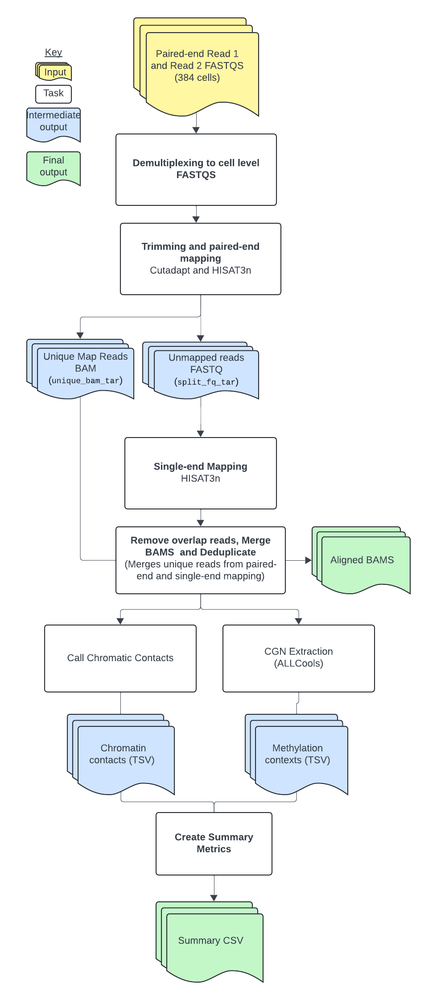

# Single Nucleus Methyl-Seq and Chromatin Capture (snm3C) Overview

| Pipeline Version | Date Updated | Documentation Authors | Questions or Feedback |
| :----: | :---: | :----: | :--------------: |
| [snm3C_v4.0.1](https://github.com/broadinstitute/warp/releases) | October, 2024 | Kaylee Mathews | Please [file an issue in WARP](https://github.com/broadinstitute/warp/issues). |

## Introduction to snm3C

The Single Nucleus Methly-Seq and Chromatin Capture (snm3C) workflow is an open-source, cloud-optimized computational workflow for processing single-nucleus methylome and chromatin contact (snm3C) sequencing data. The workflow is designed to demultiplex and align raw sequencing reads, call chromatin contacts, and generate summary metrics. 

The workflow is developed in collaboration with Hanqing Liu, Wei Tian, Wubin Ding, Huaming Chen, Chongyuan Luo, Jingtian Zhou, and the entire laboratory of Joseph Ecker. Please see the [Acknowledgments](#acknowledgements) section below.

For more information about the snm3C tools and analysis, please see the [YAP documentation](https://hq-1.gitbook.io/mc/) or the cemba_data GitHub repositories created by [Hanqing Liu](https://github.com/lhqing/cemba_data) and [Wubin Ding](https://github.com/DingWB/cemba_data).

## Quickstart table
The following table provides a quick glance at the Multiome pipeline features:

| Pipeline features | Description | Source |
|--- | --- | --- |
| Assay type | single-nucleus methylome and chromatin contact (snm3C) sequencing data | [Lee et al. 2019](https://www.ncbi.nlm.nih.gov/pmc/articles/PMC6765423/) |
| Overall workflow | Read alignment and chromatin contact calling |
| Workflow language | WDL 1.0 | [openWDL](https://github.com/openwdl/wdl) |
| Genomic Reference Sequence | GRCh38 human genome primary sequence | GENCODE [human reference files](https://www.gencodegenes.org/human/release_43.html)|
| Aligner | HISAT-3N | [Zhang at al. 2021](https://genome.cshlp.org/content/31/7/1290) |
| Data input file format | File format in which sequencing data is provided | [FASTQ](https://academic.oup.com/nar/article/38/6/1767/3112533) |
| Data output file format | File formats in which snm3C output is provided | CSV, [FASTQ](https://academic.oup.com/nar/article/38/6/1767/3112533), [BAM](http://samtools.github.io/hts-specs/), and [ALLC](https://lhqing.github.io/ALLCools/intro.html) |

## Set-up

### snm3C installation

To download the latest snm3C release, see the release tags prefixed with "snm3C" on the WARP [releases page](https://github.com/broadinstitute/warp/releases). All snm3C pipeline releases are documented in the [snm3C changelog](https://github.com/broadinstitute/warp/blob/develop/pipelines/wdl/snm3C/snm3C.changelog.md). 

To discover and search releases, use the WARP command-line tool [Wreleaser](https://github.com/broadinstitute/warp/tree/master/wreleaser).

If you’re running a version of the snm3C workflow prior to the latest release, the accompanying documentation for that release may be downloaded with the source code on the WARP [releases page](https://github.com/broadinstitute/warp/releases) (see the source code folder `website/docs/Pipelines/snm3C`).

The snm3C workflow can be deployed using [Cromwell](https://cromwell.readthedocs.io/en/stable/), a GA4GH-compliant, flexible workflow management system that supports multiple computing platforms. The workflow can also be run in [Terra](https://app.terra.bio), a cloud-based analysis platform. 

### Inputs

The snm3C workflow requires a JSON configuration file specifying the input files and parameters for the analysis. Example configuration files can be found in the snm3C [`test_inputs`](https://github.com/broadinstitute/warp/tree/develop/pipelines/wdl/snm3C/test_inputs) directory in the WARP repository.

#### Input descriptions

| Parameter | Description |
| ---| --- |
| fastq_input_read1 | Array of multiplexed FASTQ files for read 1. |
| fastq_input_read2 | Array of multiplexed FASTQ files for read 2. |
| random_primer_indexes | File containing random primer indexes. |
| plate_id | String specifying the plate ID. |
| tarred_index_files | File containing tarred index files for hisat-3 mapping. |
| genome_fa | File containing the reference genome in FASTA format. | 
| chromosome_sizes | File containing the genome chromosome sizes. |
| r1_adapter | Optional string describing the adapter sequence for read 1 paired-end reads to be used during adapter trimming with Cutadapt; default is "AGATCGGAAGAGCACACGTCTGAAC". |
| r2_adapter | Optional string describing the adapter sequence for read 2 paired-end reads to be used during adapter trimming with Cutadapt; default is  "AGATCGGAAGAGCGTCGTGTAGGGA". |
| r1_left_cut | Optional integer describing the number of bases to be trimmed from the beginning of read 1 with Cutadapt; default is 10. |
| r1_right_cut | Optional integer describing the number of bases to be trimmed from the end of read 1 with Cutadapt; default is 10. |
| r2_left_cut | Optional integer describing the number of bases to be trimmed from the beginning of read 2 with Cutadapt; default is 10. |
| r2_right_cut | Optional integer describing the number of bases to be trimmed from the end of read 2 with Cutadapt; default is 10. |
| min_read_length | Optional integer; if a read length is smaller than `min_read_length`, both paired-end reads will be discarded; default is 30.  |
| num_upstr_bases | Optional integer describing the number of bases upstream of the C base to include in ALLC file context column created using ALLCools; default is 0. |
| num_downstr_bases | Optional integer describing the number of bases downstream of the C base to include in ALLC file context column created using ALLCools; default is 2. |
| compress_level | Optional integer describing the compression level for the output ALLC file; default is 5. |

## snm3C tasks and tools
The workflow contains several tasks described below.

Overall, the snm3C workflow:

1. Demultiplexes reads.
2. Sorts, filters, trims, and aligns paired-end reads, and separates unmapped, uniquely aligned, and multi-aligned reads.
3. Aligns unmapped, single-end reads and removes overlapping reads.
4. Merges mapped reads, calls chromatin contacts, and creates ALLC files.
5. Creates summary output file.

The tools each snm3C task employs are detailed in the table below. 

To see specific tool parameters, select the [workflow WDL link](https://github.com/broadinstitute/warp/blob/develop/pipelines/wdl/snm3C/snm3C.wdl); then find the task and view the `command {}` section of the task in the WDL script. To view or use the exact tool software, see the task's Docker image which is specified in the task WDL `# runtime values` section as `docker: `. More details about these tools and parameters can be found in the [YAP documentation](https://hq-1.gitbook.io/mc/).

| Task name | Tool | Software | Description |
| --- | --- | --- | --- |
| Demultiplexing | Cutadapt | [Cutadapt](https://cutadapt.readthedocs.io/en/stable/) | Performs demultiplexing to cell-level FASTQ files based on random primer indices. |
| Hisat-paired-end | Cutadapt, HISAT-3N, [hisat3n_general.py](https://github.com/lhqing/cemba_data/blob/788e83cd66f3b556bdfacf3485bed9500d381f23/cemba_data/hisat3n/hisat3n_general.py), [hisat3n_m3c.py](https://github.com/lhqing/cemba_data/blob/bf6248239074d0423d45a67d83da99250a43e50c/cemba_data/hisat3n/hisat3n_m3c.py) | [Cutadapt](https://cutadapt.readthedocs.io/en/stable/), [HISAT-3N](https://daehwankimlab.github.io/hisat2/hisat-3n/), python3 | Sorts, filters, and trims reads using the `r1_adapter`, `r2_adapter`, `r1_left_cut`, `r1_right_cut`, `r2_left_cut`, and `r2_right_cut` input parameters; performs paired-end read alignment; imports 2 custom python3 scripts developed by Hanqing Liu and calls the `separate_unique_and_multi_align_reads()` and `split_hisat3n_unmapped_reads()` functions to separate unmapped, uniquely aligned, multi-aligned reads from HISAT-3N BAM file, then splits the unmapped reads FASTQ file by all possible enzyme cut sites and output new R1 and R2 FASTQ files; unmapped reads are stored in unmapped FASTQ files and uniquely and multi-aligned reads are stored in separate BAM files. |
| Hisat_single_end | HISAT-3N, [hisat3n_m3c.py](https://github.com/lhqing/cemba_data/blob/bf6248239074d0423d45a67d83da99250a43e50c/cemba_data/hisat3n/hisat3n_m3c.py) | [HISAT-3N](https://daehwankimlab.github.io/hisat2/hisat-3n/), python3 | Performs single-end alignment of unmapped reads to maximize read mapping, imports a custom python3 script developed by Hanqing Liu, and calls the `remove_overlap_read_parts()` function to remove overlapping reads from the split alignment BAM file produced during single-end alignment. |
| Merge_sort_analyze | merge, sort, MarkDuplicates, [hisat3n_m3c.py](https://github.com/lhqing/cemba_data/blob/bf6248239074d0423d45a67d83da99250a43e50c/cemba_data/hisat3n/hisat3n_m3c.py), bam-to-allc, extract-allc | [samtools](https://www.htslib.org/), [Picard](https://broadinstitute.github.io/picard/), python3, [ALLCools](https://lhqing.github.io/ALLCools/intro.html) | Merges and sorts all mapped reads from the paired-end and single-end alignments; creates a position-sorted BAM file and a name-sorted BAM file; removes duplicate reads from the position-sorted, merged BAM file; imports a custom python3 script developed by Hanqing Liu and calls the `call_chromatin_contacts()` function to call chromatin contacts from the name-sorted, merged BAM file; reads are considered chromatin contacts if they are greater than 2,500 base pairs apart; creates a first ALLC file with a list of methylation points and a second ALLC file containing methylation contexts. |
| Summary_PerCellOutput | Custom function | bash | Untar files needed at per cell level. |
| Summary | [summary.py](https://github.com/lhqing/cemba_data/blob/788e83cd66f3b556bdfacf3485bed9500d381f23/cemba_data/hisat3n/summary.py) | python3 | Imports a custom python3 script developed by Hanqing Liu and calls the `snm3c_summary()` function to generate a single, summary file for the pipeline in CSV format; contains trimming, mapping, deduplication, chromatin contact, and AllC site statistics. |

#### 1. Demultiplexes reads
In the first step of the pipeline (`Demultiplexing`), raw sequencing reads are demultiplexed by random primer index into cell-level FASTQ files using [Cutadapt](https://cutadapt.readthedocs.io/en/stable/). For more information on barcoding, see the [YAP documentation](https://hq-1.gitbook.io/mc/tech-background/barcoding#two-round-of-barcoding). 

#### 2. Sorts, filters, trims, and aligns paired-end reads, and separates unmapped, uniquely aligned, and multi-aligned reads

**Sorts, filters, and trims reads**
After demultiplexing, the pipeline uses [Cutadapt](https://cutadapt.readthedocs.io/en/stable/) to sort, filter, and trim reads in the `hisat-paired-end` task. The R1 and R2 adapter sequences are removed, along with the number of bases specified by the `r1_left_cut`, `r1_right_cut`, `r2_left_cut`, and `r2_right_cut` input parameters. Any reads shorter than the specified `min_read_length` are filtered out in this step.

**Aligns paired-end reads**
Next, the task uses [HISAT-3N](https://daehwankimlab.github.io/hisat2/hisat-3n/) to perform paired-end read alignment to a reference genome FASTA file (`genome_fa`) and outputs an aligned BAM file. Additionally, the task outputs a stats file and a text file containing the genomic reference version used.

**Separates unmapped, uniquely aligned, and multi-aligned reads**
After paired-end alignment, the task imports a custom python3 script ([hisat3n_general.py](https://github.com/lhqing/cemba_data/blob/788e83cd66f3b556bdfacf3485bed9500d381f23/cemba_data/hisat3n/hisat3n_general.py)) developed by Hanqing Liu. The task calls the script's `separate_unique_and_multi_align_reads()` function to separate unmapped, uniquely aligned, and multi-aligned reads from the HISAT-3N BAM file. Three new files are output from this step of the pipeline: 

1. A FASTQ file that contains the unmapped reads (`unmapped_fastq_tar`)
2. A BAM file that contains the uniquely aligned reads (`unique_bam_tar`)
3. A BAM file that contains the multi-aligned reads (`multi_bam_tar`)

After separating reads, the task imports a custom python3 script ([hisat3n_m3c.py](https://github.com/lhqing/cemba_data/blob/bf6248239074d0423d45a67d83da99250a43e50c/cemba_data/hisat3n/hisat3n_m3c.py)) developed by Hanqing Liu and calls the script's `split_hisat3n_unmapped_reads()` function. This splits the FASTQ file containing the unmapped reads by all possible enzyme cut sites and outputs new R1 and R2 files. 

#### 3. Aligns unmapped, single-end reads and removes overlapping reads
In the next step of the pipeline, the `Hisat_single_end ` task uses [HISAT-3N](https://daehwankimlab.github.io/hisat2/hisat-3n/) to perform single-end read alignment of the previously unmapped reads to maximize read mapping and outputs a single, aligned BAM file.

After the second alignment step, the task imports a custom python3 script ([hisat3n_m3c.py](https://github.com/lhqing/cemba_data/blob/bf6248239074d0423d45a67d83da99250a43e50c/cemba_data/hisat3n/hisat3n_m3c.py)) developed by Hanqing Liu. The task calls the script's `remove_overlap_read_parts()` function to remove overlapping reads from the BAM file produced during single-end alignment and output another BAM file.

#### 4. Merges mapped reads, calls chromatin contacts, and creates ALLC files

**Merged mapped reads**
The `Merge_sort_analyze` task uses [samtools](https://www.htslib.org/) to merge and sort all of the mapped reads from the paired-end and single-end alignments into a single BAM file. The BAM file is output as both a position-sorted and a name-sorted BAM file.

After merging, the task uses Picard's MarkDuplicates tool to remove duplicate reads from the position-sorted, merged BAM file and output a deduplicated BAM file.

**Calls chromatin contacts**
Next, the pipeline imports a custom python3 script ([hisat3n_m3c.py](https://github.com/lhqing/cemba_data/blob/bf6248239074d0423d45a67d83da99250a43e50c/cemba_data/hisat3n/hisat3n_m3c.py)) developed by Hanqing Liu. The task calls the script's `call_chromatin_contacts()` function to call chromatin contacts from the name-sorted, merged BAM file. If reads are greater than 2,500 base pairs apart, they are considered chromatin contacts. If reads are less than 2,500 base pairs apart, they are considered the same fragment. 

**Creates ALLC files**
After calling chromatin contacts, the task uses the [ALLCools](https://lhqing.github.io/ALLCools/intro.html) `bam-to-allc` function to create an ALLC file from the deduplicated BAM file that contains a list of methylation points. The `num_upstr_bases` and `num_downstr_bases` input parameters are used to define the number of bases upstream and downstream of the C base to include in the ALLC context column.

Next, the task uses the [ALLCools](https://lhqing.github.io/ALLCools/intro.html) `extract-allc` function to extract methylation contexts from the input ALLC file and output a second ALLC file that can be used to generate an [MCDS file](https://github.com/lhqing/allcools_doc/blob/master/tech-background/file-formats.md#mcds-file).

#### 6. Creates summary output file
In the last step of the pipeline, the `summary` task imports a custom python3 script ([summary.py](https://github.com/lhqing/cemba_data/blob/788e83cd66f3b556bdfacf3485bed9500d381f23/cemba_data/hisat3n/summary.py)) developed by Hanqing Liu. The task calls the script's `snm3c_summary()` function to generate a single, summary file for the pipeline in CSV format; contains trimming, mapping, deduplication, chromatin contact, and AllC site statistics. This is the main output of the pipeline.

## Outputs

The following table lists the output variables and files produced by the pipeline.

| Output name | Filename, if applicable | Output format and description |
| ------ | ------ | ------ |
| MappingSummary | `<plate_id>_MappingSummary.csv.gz` | Mapping summary file in CSV format. |
| name_sorted_bams | `<plate_id>.hisat3n_dna.all_reads.name_sort.tar.gz` | Array of tarred files containing name-sorted, merged BAM files. |
| unique_reads_cgn_extraction_allc | `<plate_id>.allc.tsv.tar.gz` | Array of tarred files containing list of methylation points. |
| unique_reads_cgn_extraction_tbi | `<plate_id>.allc.tbi.tar.gz` | Array of tarred files containing ALLC index files. |
| reference_version | `<plate_id>.reference_version.txt` | Array of tarred files containing the genomic reference version used. |
| all_reads_dedup_contacts | `<plate_id>.hisat3n_dna.all_reads.dedup_contacts.tar.gz` | Array of tarred TSV files containing deduplicated chromatin contacts. |
| all_reads_3C_contacts | `<plate_id>.hisat3n_dna.all_reads.3C.contact.tar.gz` | Array of tarred TSV files containing chromatin contacts in Hi-C format. |
| chromatin_contact_stats | `<plate_id>.chromatin_contact_stats.tar.gz` | Array of tarred files containing chromatin contact statistics. |
| unique_reads_cgn_extraction_allc_extract | `<plate_id>.extract-allc.tar.gz` | Array of tarred files containing CGN context-specific ALLC files that can be used to generate an [MCDS file](https://github.com/lhqing/allcools_doc/blob/master/tech-background/file-formats.md#mcds-file). |
| unique_reads_cgn_extraction_tbi_extract | `<plate_id>.extract-allc_tbi.tar.gz` | Array of tarred files containing ALLC index files. |

## Versioning

All snm3C pipeline releases are documented in the [pipeline changelog](https://github.com/broadinstitute/warp/blob/develop/pipelines/wdl/snm3C/snm3C.changelog.md).

## Citing the snm3C Pipeline

If you use the snm3C Pipeline in your research, please identify the pipeline in your methods section using the [snm3C SciCrunch resource identifier](https://scicrunch.org/resources/data/record/nlx_144509-1/SCR_025041/resolver?q=SCR_025041&l=SCR_025041&i=rrid:scr_025041).

* Ex: *snm3C Pipeline (RRID:SCR_025041)*

Please cite the following publications for the snm3C pipeline: 

Lee, DS., Luo, C., Zhou, J. et al. Simultaneous profiling of 3D genome structure and DNA methylation in single human cells. Nat Methods 16, 999–1006 (2019). https://doi.org/10.1038/s41592-019-0547-z

Liu, H., Zhou, J., Tian, W. et al. DNA methylation atlas of the mouse brain at single-cell resolution. Nature 598, 120–128 (2021). https://doi.org/10.1038/s41586-020-03182-8

Please cite the following preprint for the WARP repository and website:

Degatano, K., Awdeh, A., Cox III, R.S., Dingman, W., Grant, G., Khajouei, F., Kiernan, E., Konwar, K., Mathews, K.L., Palis, K., et al. Warp Analysis Research Pipelines: Cloud-optimized workflows for biological data processing and reproducible analysis. Bioinformatics 2025; btaf494. https://doi.org/10.1093/bioinformatics/btaf494

## Consortia support
This pipeline is supported by the [BRAIN Initiative](https://braininitiative.nih.gov/) (BICCN and BICAN). 

If your organization also uses this pipeline, we would like to list you! Please reach out to us by [filing an issue in WARP](https://github.com/broadinstitute/warp/issues).

## Acknowledgements
We are immensely grateful to the members of the BRAIN Initiative ([BICAN](https://brainblog.nih.gov/brain-blog/brain-issues-suite-funding-opportunities-advance-brain-cell-atlases-through-centers) Sequencing Working Group) and [SCORCH](https://nida.nih.gov/about-nida/organization/divisions/division-neuroscience-behavior-dnb/basic-research-hiv-substance-use-disorder/scorch-program) for their invaluable and exceptional contributions to this pipeline. Our heartfelt appreciation goes to our collaborators and the developers of these tools, Hanqing Liu, Wei Tian, Wubin Ding, Huaming Chen, Chongyuan Luo, Jingtian Zhou, and the entire laboratory of Joseph Ecker. 

## Feedback

For questions, suggestions, or feedback related to the snm3C pipeline, please [file an issue in WARP](https://github.com/broadinstitute/warp/issues). Your feedback is valuable for improving the pipeline and addressing any issues that may arise during its usage.
