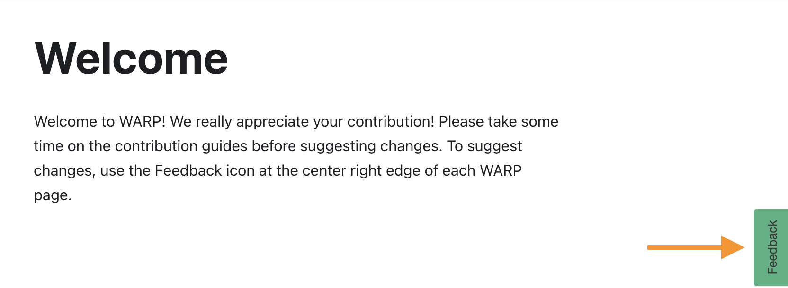

# Welcome

Welcome to WARP! We really appreciate your contribution! Please take some time to read the contribution guides before editing pages in GitHub. 

You can contribute to the code for WARP pipelines or to the WARP documentation. In this Contribution section, you will find guides relating to both types of updates. More guides will be added as we develop them.

You can also make suggestions relating to WARP pipelines by filing an issue in [GitHub](https://github.com/broadinstitute/warp) or by contacting [the WARP team](mailto:warp-pipelines-help@broadinstitute.org).

To leave feedback or suggest changes for WARP documentation, you can use the `Feedback` icon to the right of each WARP website page. After rating your experience, a text box will be available to request specific changes.

