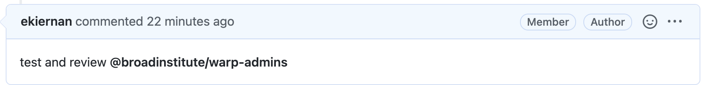

# Contributing to Existing Pipelines
We encourage the community to make contributions to our existing pipelines, such as updates to workflow code, Docker images and code, and accompanying documentation. 

Guidelines for contributing differ slightly depending on the size of the update and whether the contributor has WARP repository permissions. 

To get started, read the following [Contribution Guidelines](#contribution-guidelines) and the [Example Contribution](#example-contribution-process). 

If you have remaining questions about your contribution, reach out to the WARP team by [filing a new issue](https://github.com/broadinstitute/warp/issues/new).

:::tip What if I want to contribute a new pipeline?
Contribution guidelines for new pipelines are in development, but to contribute a new pipeline, reach out the WARP team first by [filing an issue](https://github.com/broadinstitute/warp/issues/new). Additionally, read our [Best Practices](https://broadinstitute.github.io/warp/docs/About_WARP/BestPractices) for pipeline development.
:::

### Contributor agreement
All user contributions will fall under a [BSD 3-Clause license](https://github.com/broadinstitute/warp/blob/master/LICENSE), will not be copyright, and will be open source.


## Contribution Guidelines
#### 1. Scope the work.
Contributions can range from tiny syntax changes to large task, workflow, or Docker code updates. Often changes to a single task WDL or Docker file can affect multiple  workflows that import those same task WDLs or Dockers. This is why it's important to scope updates before proceeding.

:::tip File an issue for large changes
If an update is large, or if you're unsure how a change affects multiple workflows, **[file an issue](https://github.com/broadinstitute/warp/issues/new) in WARP first**. 
:::

Filing an issue allows our team to provide valuable feedback before starting a large effort, and to appropriately prioritize the work for review. 

Additionally, there are multiple requirements for our [testing](https://broadinstitute.github.io/warp/docs/About_WARP/TestingPipelines) infrastructure. By filing an issue for large updates, we can work with you right away to flag any potential testing-related issues. 

#### 2. Read guidelines for versioning, changelog syntax, and WARP Documentation style.

Our testing infrastructure relies on specific [versioning](https://broadinstitute.github.io/warp/docs/About_WARP/VersionAndReleasePipelines) and [changelog syntax](https://broadinstitute.github.io/warp/docs/contribution/contribute_to_warp/changelog_style). Pipeline changes must be documented in the changelog with the appropriate syntax.

Similarly, if you plan to contribute to WARP Documentation, read the [WARP Documentation style guide](https://broadinstitute.github.io/warp/docs/contribution/contribute_to_warp_docs/doc_style) first, as it contains helpful formatting tips.

#### 3. Make a branch or fork off the WARP develop branch.

If you have WARP repository permissions, GitHub will allow you to make a branch off the WARP **develop** branch when you’re ready to contribute. For more information on how to make a branch, read the GitHub Docs [instructions for branching](https://docs.github.com/en/desktop/contributing-and-collaborating-using-github-desktop/making-changes-in-a-branch/managing-branches#creating-a-branch). 

If you **do not** have WARP permissions (i.e. you can’t make a branch off of the develop branch), make a fork of the WARP repository following the GitHub Docs [instructions for forking](https://docs.github.com/en/get-started/quickstart/fork-a-repo).


#### 4. Make your updates on your WARP branch or fork. 
As your work progresses, make commits to your WARP branch or fork. 

#### 5. Assess and make updates to accompanying pipeline files.

Updates to pipeline code, Dockers, or reference files might require coordinating additional updates both in WARP, such as modifying accompanying changelogs and pipeline overviews, or outside of WARP, such as uploading Dockers or reference files to public cloud repositories.  

* All changes that affect pipeline workflows must be recorded in the pipeline(s) changelog(s) using semantic versioning. An explanation of this can be found in the [changelog style guide](https://broadinstitute.github.io/warp/docs/contribution/contribute_to_warp/changelog_style). 

* When you update the changelog, the pipeline’s WDL workflow version number must also match the changelog entry to ensure the updates pass the WARP testing process (this is shown in the [Example Contribution](#example-contribution-process) section below).

* If you make any changes to files hosted in cloud repositories, like pipeline Docker images or reference files, coordinate with the WARP team during or before the review process to push the updated files to cloud storage. 

* Flag or make necessary updates to the accompanying pipeline documentation such as the pipeline [overviews in WARP Documentation](https://broadinstitute.github.io/warp/). 

    * If you’re updating WARP documentation, read the [documentation style guide](https://broadinstitute.github.io/warp/docs/contribution/contribute_to_warp_docs/doc_style) for helpful formatting tips.

#### 6. Make a Pull Request (PR) to the WARP **develop** branch. 

When updates are ready, make a PR using WARP's **develop** branch as a base. In the comments section of the PR, notify the WARP team to review the PR and start the necessary repository [tests](https://broadinstitute.github.io/warp/docs/About_WARP/TestingPipelines). You can do this by typing `test and review @broadinstitute/warp-admins`.

#### 7. Revise the PR as necessary for the [review process](#review-process). 

#### 8. Merge updates to the WARP **develop** branch. 

If you have permissions to merge to the WARP repository, you can merge the PR once it's approved. You’ll receive a reminder to perform a [“squash merge”](https://docs.github.com/en/github/collaborating-with-pull-requests/incorporating-changes-from-a-pull-request/about-pull-request-merges#squash-and-merge-your-pull-request-commits). Please delete individual commit names and make one summary name for all commits. 

If you don’t have WARP permissions, the WARP team will merge the PR for you when it’s ready.

## Review Process

### WARP review process and requirements
After contributing a PR, a WARP team member will start a series of [tests](https://broadinstitute.github.io/warp/docs/About_WARP/TestingPipelines), usually by making an “Ok to test” comment.

For each PR, WARP requires approval from a minimum of two reviewers, often an engineer, a scientific owner, and sometimes a clinical owner. All comments and requests for changes are made directly in the GitHub PR. 

Comments will be likely be made within **3 business days** of the PR submission. If no review is started by that time, tag @Kylee Degatano in the PR. 

If a PR is abandoned after starting the review process, the WARP team will either take ownership of it or close the PR.

### Troubleshooting WARP testing
All pipelines must pass syntax, scientific and Smart-tests, as described in the [testing overview](https://broadinstitute.github.io/warp/docs/About_WARP/TestingPipelines). The WARP team will help troubleshoot testing for new contributions. 

## Example Contribution Process

### Step-by-step instructions for a small update

#### Background
In this example use case, we'll make a simple change to the [Optimus Pipeline workflow](https://github.com/broadinstitute/warp/blob/develop/pipelines/skylab/optimus/Optimus.wdl), specifically an update to the metadata description for the pipeline's `input_id` parameter. 

This parameter description is currently listed in the pipeline's WDL workflow as: 

```WDL
 `input_id: "name of sample matching this file, inserted into read group header"
 ```

Our update will add clarification that this can string can be a UUID or a human-readable identifier. 

#### Before starting- what to consider
Any update to a workflow WDL, a task called by a  WDL, or a workflow’s accompanying Docker image or script will require an update to the workflow version number and the changelog for testing purposes. Since our example update will be added to the Optimus WDL, we should be aware that our change will require these changelog and version updates.

For this update, we’ll also assume that we don’t have permissions to the WARP repository, meaning that we'll need to make a fork of the repository.

#### 1. Scope the work.
This example is a very small PR, so we don’t need to file an issue first unless we want to confirm with the WARP team that our update is accurate before making the change.

#### 2. Read the guidelines for changelog updates.
Since we’re making an update to the workflow WDL and need to update the changelog, we need to read the [changelog style guide](https://broadinstitute.github.io/warp/docs/contribution/contribute_to_warp/changelog_style) and [versioning guide](https://broadinstitute.github.io/warp/docs/About_WARP/VersionAndReleasePipelines) to identify the new version number.

In this example case, the existing pipeline version is `4.2.5`. Since our change does not break the pipeline, affect inputs/outputs or cause scientific changes, the guides tell us that this is a patch. The new pipeline version will be `4.2.6`. 

#### 3. Make a fork of the WARP repository.
Since we don't have permissions to make a branch in WARP, we’ll need to make a fork instead. To do this, we navigate to [WARP](https://github.com/broadinstitute/warp) and click the fork icon in the GitHub UI.


#### 4. Make the updates on the fork.
Either locally or the in UI, we’ll edit the existing parameter description in the Optimus workflow and commit the changes to our fork.


#### 5. Assess and make any additional pipeline file changes.
Since our update requires a new version number and changelog entry, we need to update the WDL version and the accompanying changelog. The pipeline version number is indicated in the workflow WDL by the string variable `pipeline_version`. We'll make a patch and change this `4.2.6`.


We’ll also update the Optimus changelog according to the syntax guide to reflect the version change.


#### 6. Make a PR to the **develop** branch of WARP
To merge our updates to the WARP repository, we'll need to create a PR. Since we're making a PR from a fork, we can follow the instructions outlined in the GitHub Docs [guide for making a PR from a fork](https://docs.github.com/en/github/collaborating-with-pull-requests/proposing-changes-to-your-work-with-pull-requests/creating-a-pull-request-from-a-fork).   

When we create the PR, we need to specify a WARP branch to use as the base. All updates should be merged into the WARP **develop** branch, which we can specify in the UI when we open the PR.

 


After the PR is created, we can tag the WARP team by making a comment in the PR: `test and review @broadinstitute/warp-admins`.



The team will work then with us to kick off any necessary [tests](https://broadinstitute.github.io/warp/docs/About_WARP/TestingPipelines).
When the tests are successful, we'll see a green check left of the test name in the GitHub UI.


Even if the tests pass, merging will be blocked until the review is complete and at least two reviewers have approved the PR.


#### 7. Make revisions based on feedback.
If the WARP team has comments or requires changes, they'll note these directly in the PR. 

#### 8. Merge the PR.
Since we don't have permission for the repository, we don't need to take any action for this step. The WARP team will merge our changes when the PR is ready, reviewed, and all tests have passed.


## Still have questions?
Contact us by [filing an issue](https://github.com/broadinstitute/warp/issues/new) or email [Kylee Degatano](mailto:kdegatano@broadinstitute.org). 


