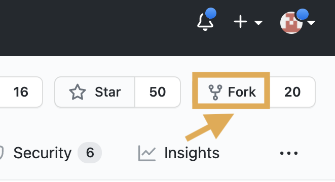
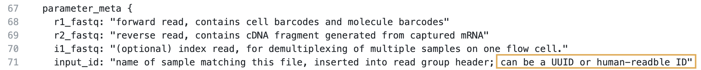
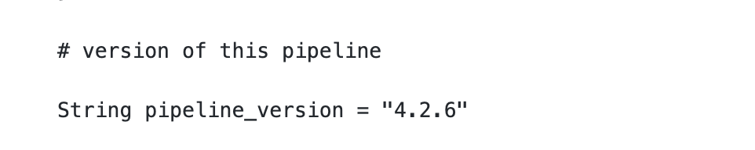
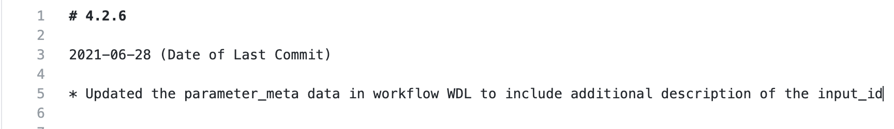
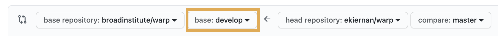
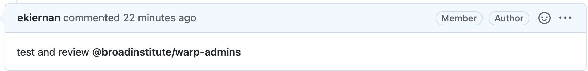
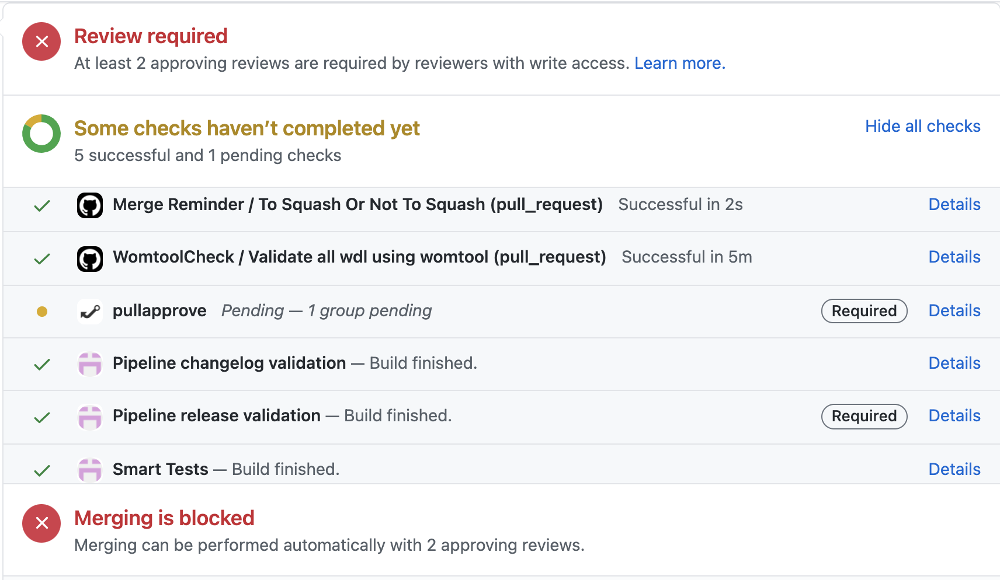

# Example Contribution
## Step-by-step instructions for a small pipeline update
This example provides step-by-step instructions for how to apply the WARP [Contribution Guidelines](./contribution-guidelines.md) to a small pipeline update. 

Read the [Contribution Guidelines](./contribution-guidelines.md) for more information on the contribution process, types of contributions, and the review process.

### Background
For this example contribution, we'll make a simple change to the `input_id` metadata description in the [Optimus workflow](https://github.com/broadinstitute/warp/blob/develop/pipelines/wdl/optimus/Optimus.wdl).  

This parameter description is currently listed in the pipeline's WDL workflow as: 

```WDL
 input_id: "name of sample matching this file, inserted into read group header"
 ```

Our update will add a clarification that this string can be a UUID or a human-readable identifier:

```WDL
input_id: "name of sample matching this file, inserted into read group header; can be a UUID or human-readable ID"
```

### Before starting- what to consider
Any update to a workflow WDL, a task called by a  WDL, or a workflow’s accompanying Docker image or script will require an update to the workflow version number and the changelog for [testing](https://broadinstitute.github.io/warp/docs/About_WARP/TestingPipelines) purposes. Since our example update will be added to the Optimus WDL, we should be aware that our change will require these changelog and version updates.

For this update, we’ll also assume that we do **not** have permissions to the WARP repository, meaning that we'll need to make a fork of the repository where we can make commits.

### 1. Scope the work.
Our update is very small, so we don’t need to [file an issue](https://github.com/broadinstitute/warp/issues/new) first unless we want to confirm with the WARP team that our update is accurate before making the change.

### 2. Read the guidelines for changelog updates.
Since we’re making an update to the workflow WDL and need to update the changelog, we need to read the [changelog style guide](https://broadinstitute.github.io/warp/docs/contribution/contribute_to_warp/changelog_style) and [versioning guide](https://broadinstitute.github.io/warp/docs/About_WARP/VersionAndReleasePipelines) to identify the new version number.

In this example case, the existing pipeline version is `4.2.5`. Since our change does not break the pipeline, affect inputs/outputs or cause scientific changes, the guides tell us that this update is a patch. The new pipeline version will be `4.2.6`. 

### 3. Make a fork of the WARP repository.
Since we don't have permission to make a branch in WARP, we’ll need to [make a fork](https://docs.github.com/en/get-started/quickstart/fork-a-repo) instead. To do this from the GitHub UI, we navigate to [WARP](https://github.com/broadinstitute/warp) and click the fork icon.



### 4. Make the updates on the fork.
Either locally or the in UI, we’ll edit the existing parameter description in the Optimus workflow and commit the changes to our fork.



### 5. Assess and make any additional pipeline file changes.
Since our update requires a new version number and changelog entry, we need to update the WDL version and the accompanying changelog. The pipeline version number is indicated in the workflow WDL by the string variable `pipeline_version`. We'll make a patch and change this to `4.2.6`.



We’ll also update the Optimus changelog according to the style guide to reflect the version change.



### 6. Make a pull request to the **develop** branch of WARP.
To merge our updates to the WARP repository, we'll need to create a pull request (PR). Since we're making a PR from a fork, we can follow the instructions outlined in the GitHub Docs [guide for making a PR from a fork](https://docs.github.com/en/github/collaborating-with-pull-requests/proposing-changes-to-your-work-with-pull-requests/creating-a-pull-request-from-a-fork).   

When we create the PR, we need to specify a WARP branch to use as the base. All updates should be merged into the WARP **develop** branch, which we can specify in the GitHub UI when we open the PR.

 


After the PR is created, we can tag the WARP team by making a comment in the PR: `test and review @broadinstitute/warp-admins`.



The team will then work with us to kick off any necessary [tests](https://broadinstitute.github.io/warp/docs/About_WARP/TestingPipelines).
When the tests are successful, we'll see a green check to the left of the test name on the PR's Conversation tab in the GitHub UI.



Even if the tests pass, merging will be blocked until the review is complete and at least two reviewers have approved the PR, as outlined in the [Contribution Guidelines](contribution-guidelines.md/#review-process).


### 7. Make revisions based on feedback.
If the WARP team has comments or requires changes, they'll note these directly in the PR. Once the PR and revisions are approved by two reviewers, the PR is ready for merging.

### 8. Merge the PR.
Since we don't have permission for the repository, we don't need to take any action for this step. The WARP team will merge our changes when the PR is ready, reviewed, and all tests have passed.

After merging, the WARP team will merge all updates on the **develop** branch into **staging**, and then the **staging** branch into the **master** branch. 

Once our updates are merged to the **master** branch, the pipeline will be released and available to the community!   


## Have questions?
Contact us by [filing an issue](https://github.com/broadinstitute/warp/issues/new). 
