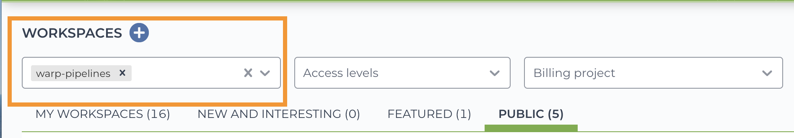

# Documentation Style Guide

This guide provides some examples about how to add new documentation that can be properly rendered on this website. Please note most of the Github flavored [Markdown](https://github.github.com/gfm/) syntax should work natrually, this guide just tries to elaboratethe extension syntax to it.

## 1. Insert code blocks

This site supports inserting code blocks with highlighted lines, for examples, the following:

````md
```wdl {3-4,7-11} title="SortBam.wdl"
task SortBam {
    input {
        File bam_input
        String sort_order = "coordinate"

        # runtime values
        String docker = "us.gcr.io/broad-gotc-prod/picard-cloud:2.26.10"
        Int machine_mem_mb = 8250
        Int machine_overhead_mb = 500
        Int cpu = 1
        Int preemptible = 3
    }

    Int command_mem_mb = machine_mem_mb - machine_overhead_mb
    Int disk = ceil(size(bam_input, "Gi") * 6) + 50

    meta {
        description: "Sorts bam"
    }

    command {
        set -e

        java -Xmx${command_mem_mb}m -jar /usr/picard/picard.jar SortSam \
              I=${bam_input} \
              O=sorted.bam \
              SORT_ORDER=${sort_order}
    }

    runtime {
        docker: docker
        memory: "${machine_mem_mb} MiB"
        disks: "local-disk ${disk} HDD"
        cpu: cpu
        preemptible: preemptible
    }

    output {
        File bam_output = "sorted.bam"
    }
}
```
````

will result in a rendered code block like:

```wdl {3-4,7-11} title="SortBam.wdl"
task SortBam {
    input {
        File bam_input
        String sort_order = "coordinate"

        # runtime values
        String docker = "us.gcr.io/broad-gotc-prod/picard-cloud:2.26.10"
        Int machine_mem_mb = 8250
        Int machine_overhead_mb = 500
        Int cpu = 1
        Int preemptible = 3
    }

    Int command_mem_mb = machine_mem_mb - machine_overhead_mb
    Int disk = ceil(size(bam_input, "Gi") * 6) + 50

    meta {
        description: "Sorts bam"
    }

    command {
        set -e

        java -Xmx${command_mem_mb}m -jar /usr/picard/picard.jar SortSam \
              I=${bam_input} \
              O=sorted.bam \
              SORT_ORDER=${sort_order}
    }

    runtime {
        docker: docker
        memory: "${machine_mem_mb} MiB"
        disks: "local-disk ${disk} HDD"
        cpu: cpu
        preemptible: preemptible
    }

    output {
        File bam_output = "sorted.bam"
    }
}
```

## 2. Insert tables

```md
| Some Table Col 1 | Some Table Col 2 |
| :--------------: | :--------------: |
|       Val1       |       Val4       |
|       Val2       |       Val5       |
|       Val3       |       Val6       |
```

| Some Table Col 1 | Some Table Col 2 |
| :--------------: | :--------------: |
|       Val1       |       Val4       |
|       Val2       |       Val5       |
|       Val3       |       Val6       |

:::tip TIP
It's worth mentioning that [Tables Generator](https://www.tablesgenerator.com/markdown_tables) is a great tool for generating and re-formatting markdown tables.
:::

## 3. Cross-reference and anchor

To link to another section within the same article, you would use `[Return to ## 1. Insert code blocks](#1-insert-code-blocks)`: [Return to ## 1. Insert code blocks](#1-insert-code-blocks).

To link to sections in other articles, use the following syntax (note the relative paths):

- `[Return to Changelog Style Guide](../contribute_to_warp/changelog_style)`: [Return to Changelog Style Guide](../contribute_to_warp/changelog_style)
- `[Return to The Documentation](../../About_WARP/BestPractices.md#Best-Practices-for-Building-Data-Processing Pipelines)`: [Return to The Documentation](../../About_WARP/BestPractices.md#Best-Practices-for-Building-Data-Processing-Pipelines)

## 4. Centered text block

To make a text block centered, use:

```md
<center>
Centered Text Block!
</center>
```

<center>
Centered Text Block!
</center>


:::danger NOTE
For images, you **HAVE TO** insert blank lines to make them work:

```md
<center>


</center>
```
:::

## 5. Text with color backgorund

You could use the following to highlight your text:

```html
<span id="inline-blue"> Text with blue background </span>,
<span id="inline-purple"> Text with purple background </span>,
<span id="inline-yellow"> Text with yellow background </span>,
<span id="inline-green"> Text with green background </span>
```

<span id="inline-blue"> Text with blue background </span>,
<span id="inline-purple"> Text with purple background </span>,
<span id="inline-yellow"> Text with yellow background </span>,
<span id="inline-green"> Text with green background </span>

## 6. Custom containers

As we already saw in this guide several places, we could add custom containers:


```md
:::tip
This is a tip without title!
:::
```

:::tip
This is a tip without title!
:::

```md
:::tip TITLE
This is a tip with a title!
:::
```

:::tip TITLE
This is a tip with a title!
:::


```md
:::caution WARNING
This is a warning!
:::
```

:::caution WARNING
This is a warning!
:::

```md
:::danger DANGER
This is a danger!
:::
```

:::danger DANGER
This is a danger!
:::

```md
:::info INFO
This is a info!
:::
```

:::info INFO
This is a info!
:::

## 7. Code groups

You could also insert tab-based code groups:

import Tabs from '@theme/Tabs';
import TabItem from '@theme/TabItem';

<Tabs
  defaultValue="apple"
  values={[
    {label: 'Apple', value: 'apple'},
    {label: 'Orange', value: 'orange'},
    {label: 'Banana', value: 'banana'},
  ]}>
  <TabItem value="apple">

  ```python
  print("This is an apple pipeline!")
  ```

  </TabItem>
  <TabItem value="orange">This is an orange 🍊</TabItem>
  <TabItem value="banana">This is a banana 🍌</TabItem>
</Tabs>

```js
import Tabs from '@theme/Tabs';
import TabItem from '@theme/TabItem';

<Tabs
  defaultValue="apple"
  values={[
    {label: 'Apple', value: 'apple'},
    {label: 'Orange', value: 'orange'},
    {label: 'Banana', value: 'banana'},
  ]}>
  <TabItem value="apple">This is an apple 🍎</TabItem>
  <TabItem value="orange">This is an orange 🍊</TabItem>
  <TabItem value="banana">This is a banana 🍌</TabItem>
</Tabs>;
```
For more details, please refer to [Docusaurus Docs](https://docusaurus.io/docs/markdown-features/tabs)

## 8. Footnotes

It is important to cite the references, to do so, use the `markdown-it`'s footnotes syntax:

```md
This sentence has a footnote[^1]. (See footnote at the bottom of this guide.)

[^1]: I'm a footnote!
```

which results in:

---

This sentence has a footnote[^1]. (See footnote at the bottom of this guide.)

[^1]: I'm a footnote!

---

We could also write in-line footnotes, which is much easier to write without counting back and forth:

```md
This sentence has another footnote ^[I'm another footnote] (See footnote at the bottom of this page.)
```

which has the same effect:

---

This sentence has another footnote ^[I'm another footnote] (See footnote at the bottom of this page.)

---

## 9. Insert images

Insert images is as straight-forward as using the ordinary markdown syntax:

```md

```


## 10. Insert Table of Contents (ToC)

You could use:

```js
import TOCInline from '@theme/TOCInline';

<TOCInline toc={toc} />;
```

to insert in-line ToC:

import TOCInline from '@theme/TOCInline';

<TOCInline toc={toc} />
