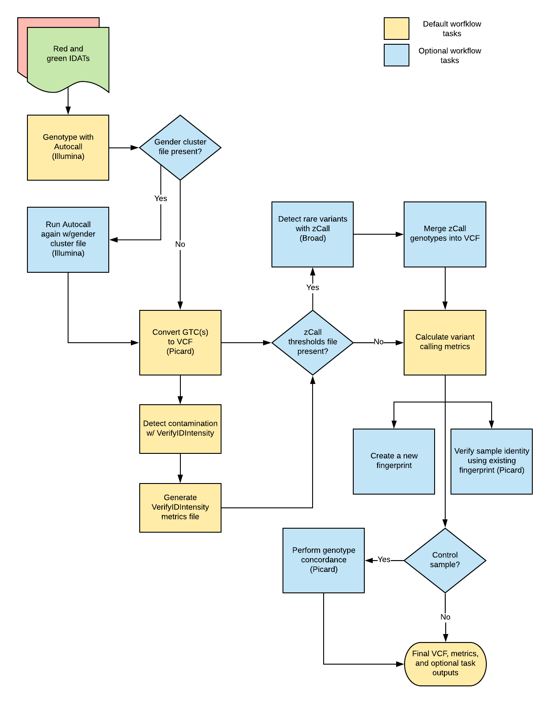

# Illumina Genotyping Array Overview

| Pipeline Version | Date Updated | Documentation Author | Questions or Feedback |
| :----: | :---: | :----: | :--------------: |
| [Version 1.11.0](https://github.com/broadinstitute/warp/releases) | May 1, 2021 | [Elizabeth Kiernan](mailto:ekiernan@broadinstitute.org) | Please file GitHub issues in warp or contact [Kylee Degatano](mailto:kdegatano@broadinstitute.org) |

## Introduction to the Illumina Genotyping Array Pipeline

The Illumina Genotyping Array Pipeline was developed by the Broad DSDE Pipelines team to process Illumina genotyping array data in the form of IDAT files. Overall, the pipeline performs gender-specific genotyping, sample contamination detection, and summary metric collection. It optionally performs rare variant calling and genotype concordance, creates a fingerprint VCF which can be used for sample verification in parallel processes, and evaluates an existing sample fingerprint to confirm sample identity. The pipeline outputs annotated [VCFs](./illumina_array_spec), index files, and summary metrics.

## Set-up

### Workflow Installation and Requirements

The Illumina Genotyping Array workflow is written in the Workflow Description Language [WDL](https://openwdl.org/) and can be downloaded by cloning the GitHub repository [warp](https://github.com/broadinstitute/warp/tree/develop/pipelines/broad/genotyping/illumina). The workflow can be deployed using [Cromwell](https://cromwell.readthedocs.io/en/develop/), a GA4GH compliant, flexible workflow management system that supports multiple computing platforms. For the latest workflow version and release notes, please see the Illumina Genotyping Array changelog [IlluminaGenotypingArray.changelog.md](https://github.com/broadinstitute/warp/blob/develop/pipelines/broad/genotyping/illumina/IlluminaGenotypingArray.changelog.md). For beta updates, you can also view release notes tagged with "IlluminaGenotypingArray_develop" [here](https://github.com/broadinstitute/warp/releases).

### Inputs

The workflow requires that each input is specified in a JSON file. All sample and reference files should be stored in cloud storage, such as a Google Bucket, and the path to the file location should be specified in the JSON. Some tasks, such as rare variant calling, fingerprinting, and genotype concordance, are optional. An example of all workflow inputs (both required and optional) can be found in the [example.json](https://github.com/broadinstitute/warp/blob/develop/pipelines/broad/genotyping/illumina/example.json) file. The tables below describe the required inputs and their formats. When applicable, the inputs for the workflow tasks listed below are marked as required or optional.

#### Sample Data Inputs

| Input name | Description | Input format |
| --- | --- | --- |
| chip_well_barcode | Unique identifier of the array chip section on which sample was run. Can be concatenation of chip barcode and sample coordinates (Ex: 7991775143_R01C01). This is a prefix for output files | String |
| sample_alias | Name of sample run on barcode-specific chip segment | String |
| red_idat_cloud_path | Cloud path to the red IDAT file | String |
| green_idat_cloud_path | Cloud path to the green IDAT file | String |
| reported_gender | Reported sample sex/gender | String |

#### Chip Metadata Inputs
| Input name | Description | Required or Optional | Input format |
| --- | --- | --- | --- |
| bead_pool_manifest_file | Cloud path to the Illumina array-specific bead pool manifest (bpm file) | Required | String |
| extended_chip_manifest_file | Cloud path to an [extended CSV-formatted Illumina array-specific chip manifest](https://gatk.broadinstitute.org/hc/en-us/articles/360037431851-GtcToVcf-Picard-#--EXTENDED_ILLUMINA_MANIFEST) | Required | String |
| cluster_file | Cloud path to the Illumina array-specific cluster EGT file | Required | String |
| gender_cluster_file | Cloud path to the Illumina array-specific gender cluster EGT file | Optional | String |
| zcall_thresholds_file | Cloud path to a thresholds file to be used with the rare variant calling tool [zCall](https://www.ncbi.nlm.nih.gov/pmc/articles/PMC3463112/) | Optional | String |

#### Reference Data Inputs
| Input name | Description | Required or Optional | Input format |
| --- | --- | --- | --- |
| ref_fasta | Cloud path to the reference FASTA (only validated for [Hg19](https://storage.cloud.google.com/gcp-public-data--broad-references/hg19/v0/Homo_sapiens_assembly19.fasta)) | Required | String |
| ref_fasta_index | Cloud path to the reference FASTA index file | Required | String |
| ref_dict | Cloud path to the reference FASTA dictionary file | Required | String |
| dbSNP_vcf | Cloud path to the dbSNP VCF, used for metrics collection | Required | String |
| dbSNP_vcf_index | Cloud path of the dbSNP VCF index file | Required | String |

#### Fingerprinting Inputs

| Input name | Description | Required or Optional | Input format |
| --- | --- | --- | --- |
| variant_rsids_file | Cloud path to file containing the rsids list for fingerprint sites (used for creating a new fingerprint VCF) | Optional | String |
| fingerprint_genotypes_vcf_file | Cloud path to a 'fingerprint' VCF (containing a set of genotypes - typically generated on an orthogonal genotyping platform). Used to confirm sample identity | Optional | String |
| fingerprint_genotypes_vcf_index_file | Cloud path to 'fingerprint' VCF index file. Used to confirm sample identity | Optional | String |
| haplotype_database_file | Cloud path to a file containing the haplotype block information for the 'fingerprint' VCF sites. Used to confirm sample identity | Optional | String |

#### Genotype Concordance Inputs
| Input name | Description | Required or Optional | Input format |
| --- | --- | --- | --- |
| control_sample_vcf_file | Cloud path to a VCF containing the genotypes from a control sample | Optional | String |
| control_sample_vcf_index_file | Cloud path to the control sample VCF index file | Optional | String |
| control_sample_intervals_file | Cloud path to the interval list for the control sample VCF | Optional | String |
| control_sample_name | Name of the control sample listed in the control_sample_vcf_file | Optional | String |
| genotype_concordance_threshold | Minimal numeric value for sample to have a passing genotype concordance | Optional | Value |

#### Additional Inputs

| Input name | Description | Required or Optional | Input format |
| --- | --- | --- | --- |
| call_rate_threshold | Minimal numeric value for a sample to have a passing call rate | Required | Value |
| minor_allele_frequency_file | Cloud path to a chip-specific text file containing locus-id to minor allele frequency | Optional | String |
| contamination_controls_vcf | Cloud path to a VCF of samples run on this chip type to be used to supplement contamination calling | Optional | String |
| subsampled_metrics_interval_list | Cloud path to a file containing a subset sites for which the workflow generate metrics and outputs a VCF | Optional | String |
| disk_size | Default disk (in GiB) for this workflow's cloud VMs | Required | Value |
| premptible_tries | Number of times a task may be preempted by GCE before it is submitted to a non-preemptible VM | Required | Value |
| analysis_version_number | Numeric value used track number of pipeline runs on chip_well_barcode | Required | Value |

## Workflow Tools and Tasks

The Illumina Genotyping Array workflow imports a series of tasks from the [IlluminaGenotypingArrayTasks.wdl](https://github.com/broadinstitute/warp/blob/master/tasks/broad/IlluminaGenotypingArrayTasks.wdl). The following sections summarize the tasks and software tools the workflow uses, as well as the relevant inputs and outputs.

### Tools

The following table provides a summary of the tasks and tools called by the Illumina Array Genotyping workflow. Note that sometimes a task and tool have the same name. The task refers to the task listed in the [IlluminaGenotypingArrayTasks.wdl](https://github.com/broadinstitute/master/blob/develop/tasks/broad/IlluminaGenotypingArrayTasks.wdl).

| Task | Tool | Source |
| --- | --- | --- |
| Autocall | [iaap-cli gencall](https://support.illumina.com/downloads/iaap-genotyping-cli.html) | Illumina |
| GtcToVcf | [GtcToVcf](https://gatk.broadinstitute.org/hc/en-us/articles/360037595031-GtcToVcf-Picard-) | Picard |
| BafRegress | [BafRegress](https://genome.sph.umich.edu/wiki/BAFRegress) | https://genome.sph.umich.edu/wiki/File:BafRegress.tar.gz |
| VcfToAdpc | [VcfToAdpc](https://gatk.broadinstitute.org/hc/en-us/articles/360036484712-VcfToAdpc-Picard-) | Picard |
| VerifyIDIntensity | [VerifyIDIntensity](https://github.com/gjun/verifyIDintensity) | https://github.com/gjun/verifyIDintensity |
| CreateVerifyIDIntensityContaminationMetricsFile | [CreateVerifyIDIntensityContaminationMetricsFile](https://gatk.broadinstitute.org/hc/en-us/articles/360047217911) | Picard |
| zCall | [zCall](https://github.com/jigold/zCall) | Python |
| MergePedIntoVcf | [MergePedIntoVcf](https://gatk.broadinstitute.org/hc/en-us/articles/360037592091) | Picard |
| CollectArraysVariantCallingMetrics | [CollectArraysVariantCallingMetrics](https://gatk.broadinstitute.org/hc/en-us/articles/360037593871) | Picard |
| SubsetArrayVCF | [SubsetArrayVCF](https://gatk.broadinstitute.org/hc/en-us/articles/360036362532) | GATK |
| CollectArraysVariantCallingMetrics | [CollectArraysVariantCallingMetrics](https://gatk.broadinstitute.org/hc/en-us/articles/360037593871) | Picard |
| SelectVariants | [SelectVariants](https://gatk.broadinstitute.org/hc/en-us/articles/360036362532) | GATK |
| CheckFingerprint | [CheckFingerprint](https://gatk.broadinstitute.org/hc/en-us/articles/360036358752) | Picard |
| VcfToIntervalList | [VcfToIntervalList](https://gatk.broadinstitute.org/hc/en-us/articles/360036897672) | Picard |
| GenotypeConcordance | [GenotypeConcordance](https://gatk.broadinstitute.org/hc/en-us/articles/360036348932) | Picard |

### Task Summary

Overall, the workflow imports the ["IlluminaGenotypingArrayTasks.wdl"](https://github.com/broadinstitute/warp/blob/develop/tasks/broad/IlluminaGenotypingArrayTasks.wdl) task to:

1. Perform genotype calling
2. Detect contamination
3. Call rare variants (optional)
4. Collect metrics
5. Create a new fingerprint output (optional)
6. Evaluate an existing fingerprint (optional)
7. Evaluate genotype concordance with control sample (optional)

#### 1. Genotype Calling

Illumina BeadChip Genotyping technology demarcates small-nucleotide variants (and polymorphisms- SNPs) present on an individual's alleles by labeling them with red and green fluorescent signals. These signals are quantified and stored in red and green IDAT files, which the Illumina Genotyping Array workflow can use to call genotypes. To do this, the workflow requires the Illumina array-specific chip well barcode, an Illumina bead pool manifest file containing a list of all SNPs on the BeadChip, and an Illumina cluster file containing the fluorescent signal intensity cut-offs for a given genotype. These are used as inputs for the workflow's Autocall task, which excutes the [iaap- gencall tool](https://support.illumina.com/downloads/iaap-genotyping-cli.html), a command line implementation of the Illumina genotyping software GenCall. This tool normalizes each SNP's red and green fluorescent signals and then clusters each SNP into one of the three genotype possibilities (i.e. homozygous A, homozygous B, or heterozygous- A/B). The overall task generates a genotype call file (GTC) as output. If the GTC file is empty, the workflow will end.

| Gender-specific genotype calling (optional) |
| :-- |
| If a gender_cluster_file is listed in the input JSON, the Illumina Genotyping workflow will repeat the Autocall task to get a more accurate gender call. It produces an additional GTC file that is only used to call gender and is not included in the final output VCF. |

After genoytping, the workflow calls the GtcToVcf task, which runs the Picard tool [GtcToVcf](https://software.broadinstitute.org/gatk/documentation/tooldocs/current/picard_arrays_GtcToVcf.php) to convert the GTC into a VCF.

#### 2. Contamination Detection

Intra-species DNA contamination is a common problem for genotyping samples.

The Illumina Array workflow uses two tools to detect contamination.  These are BafRegress and VerifyIDIntensity.  The use of VerifyIDIntensity is deprecated as it can overestimate estimated contamination when used in single-sample mode (as it is run typically)

[BafRegress](https://genome.sph.umich.edu/wiki/BAFRegress) is a software that detects and estimates sample contamination using B allele frequency data from Illumina genotyping arrays using a regression model.  It requires a file formatted as an Illumina Final Report.  The workflow takes care of this in the BafRegress task (which contains functionality to both create the Illumina Final Report from the VCF generated by GtcToVcf and then run the BafRegress tool itself.  The output of a BafRegress task is a text file containing the estimated contamination along with associated metrics.

[VerifyIDIntensity](https://www.ncbi.nlm.nih.gov/pmc/articles/PMC3487130/) requires an 'adpc.bin' file (a binary file containing array intensity data that can be used with Illumina software) as input. The workflow first calls the [VcfToAdpc](https://gatk.broadinstitute.org/hc/en-us/articles/360036484712) task to convert the VCF output from  genotype calling into an 'adpc.bin' file.  Next, the [VerifyIDIntensity](https://www.ncbi.nlm.nih.gov/pmc/articles/PMC3487130/) task uses this input file to measure contamination. The [CreateVerifyIDIntensityContaminationMetricsFile](https://gatk.broadinstitute.org/hc/en-us/articles/360047217911) task then converts the VerifyIDIntensity output into a Picard-standard metrics file (chip_well_barcode.verifyidintensity_metrics), suitable for uploading to a metrics database.

#### 3. Rare Variant Calling (Optional)

After running default genotype processing with Autocall, the Illumina Genotyping Array workflow optionally uses the [zCall](https://www.ncbi.nlm.nih.gov/pmc/articles/PMC3463112/) task to improve calls on rare variants. To run this task, the workflow requires a zCall threshold file. If the workflow identifies the file, it will output a PLINK .ped and .map file. The [MergePedIntoVcf](https://gatk.broadinstitute.org/hc/en-us/articles/360037592091) task then merges these outputs into the VCF generated during genotype calling.

#### 4. Metric Collection

Quality metrics can be assessed using the genotyping output VCF (from the GtctoVcf task) or alternatively, a subset of the VCF. The CollectArraysVariantCallingMetrics task calls the Picard tool [CollectArraysVariantCallingMetrics](https://gatk.broadinstitute.org/hc/en-us/articles/360037593871) to generate these metrics.

| Metric collection on a VCF subset (optional) |
| :-- |
| If an input interval list is provided (the subsampled_metrics_interval_list file in the sample JSON), the workflow will run the optional task SubsetArrayVCF which uses the GATK tool [SelectVariants](https://gatk.broadinstitute.org/hc/en-us/articles/360036362532) to select variants within the specified interval. The overall workflow will then run the CollectArraysVariantCallingMetrics to generate metrics. |

#### 5. Creating a New Fingerprint Output (Optional)

DNA fingerprinting helps maintain sample identity and avoid sample-swaps. The Illumina Genotyping Array workflow can optionally create a new fingerprint VCF output that can be used to verify sample identity if the sample is used for additional applications (downstream sequencing, etc.). To do this, the SelectFingerprintVariants task uses a reference SNP identifier file (rsid) to run the GATK tool [SelectVariants](https://gatk.broadinstitute.org/hc/en-us/articles/360036362532). This tool selects variants in the genotyping output VCF based on the variants present in the rsids file. The task then outputs a new subseted fingerprint VCF and index file.

#### 6. Evaluating an Existing Fingerprint (Optional)

If the genotyping sample already has a corresponding fingerprint VCF file, the workflow can also optionally check the existing fingerprint to confirm sample identity. It uses the CheckFingerPrints task to calculate genotype concordance between the workflow’s genotyping output VCF (final_output_vcf) and the known genotype specified in a fingerprint_genotypes_vcf_file. The workflow returns a boolean for if the sample genotype failed concordance, as well as a Logarithm of Odds (LOD) score for concordance.

#### 7. Genotype Concordance (Optional)

If control inputs (VCF, index, and sample_name string) are provided, the workflow can examine genotype concordance. First, the VcfToIntervalList task uses the Picard tool [VcfToIntervalList](https://gatk.broadinstitute.org/hc/en-us/articles/360036897672) to prepare an interval list from the genotype calling output VCF (produced with the [above GtcToVCF task](#1-genotype-calling). Next, the SelectVariantsForGenotypeConcordance task runs the the GATK tool [SelectVariants](https://gatk.broadinstitute.org/hc/en-us/articles/360036362532) to exclude filtered sites from the VCF that will be used for GenotypeConcordance. Lastly, the GenotypeConcordance task uses the Picard tool [GenotypeConcordance](https://gatk.broadinstitute.org/hc/en-us/articles/360036348932) to calculate genotype concordance between the workflow’s output VCF and the control VCF.

### Workflow Outputs

The tables below summarize all of the workflow's output according to task. Outputs from optional tasks are marked as optional. If the workflow output is written to a file, the file format is listed. Otherwise, the file format is listed as N/A. Note that file outputs are named with the chip_well_barcode prefix.

For more information on the VCF output, see the pipeline's [VCF Overview](./illumina_array_spec).

#### Genotype Calling and Metric Outputs

| Output name | Description | Required or Optional | Output file format |
| --- | --- | --- | --- |
| <chip_well_barcode>.vcf.gz | VCF generated by the pipeline | Required | Compressed VCF (vcf.gz) |
| <chip_well_barcode>.vcf.gz.tbi | Index file of the VCF generated by the pipeline | Required | tabix index (vcf.gz.tbi) |
| <chip_well_barcode>.gtc | GTC file generated by Autocall | Required | GTC |
| <chip_well_barcode>.bafregress_metrics | Text output file generated by BafRegress | Optional | txt |
| <chip_well_barcode>.verifyidintensity_metrics | File containing metrics generated by VerifyIDIntensity | Required | txt |
| <chip_well_barcode>.arrays_variant_calling_detail_metrics | Detailed metrics file for the output VCF generated by CollectArraysVariantCallingMetrics.detail_metrics | Required | txt |
| <chip_well_barcode>.arrays_variant_calling_summary_metrics | Summary metrics file for the output VCF as generated by CollectArraysVariantCallingMetrics | Required | txt |
| <chip_well_barcode>.arrays_control_code_summary_metrics | Control code metrics file for the output VCF as generated by CollectArraysVariantCallingMetrics | Required | txt |
| <chip_well_barcode_subset>.arrays_variant_calling_detail_metrics | Detailed metrics file for the subsetted VCF as generated by CollectArraysVariantCallingMetrics| Optional | txt |
| <chip_well_barcode_subset>.arrays_subset_variant_calling_summary_metrics | Summary metrics file for the subsetted VCF as generated by CollectArraysVariantCallingMetrics | Optional | txt |
| <chip_well_barcode_subset>.arrays_subset_variant_calling_control_metrics | Control code metrics file for the subsetted VCF as generated by CollectArraysVariantCallingMetrics | Optional | txt |

#### Fingerprinting Outputs

| Output name | Description | Required or Optional | Output file format |
| --- | --- | --- | --- |
| <chip_well_barcode>.fingerprint.vcf.gz | VCF containing genotypes selected from the output_vcf at certain designated sites | Optional | Compressed VCF (vcf.gz) |
| <chip_well_barcode>.fingerprint.vcf.gz.tbi | Index file of the output_fingerprint_vcf | Optional | tabix index (vcf.gz.tbi) |
| check_fingerprint_lod | LOD score as calculated by CheckFingerprint between the pipeline output VCF and the optionally specified input fingerprint VCF | Optional | N/A |
| <chip_well_barcode>.fingerprinting_summary_metrics | Summary metrics as calculated by CheckFingerprint between the pipeline output VCF and the optionally specified input fingerprint VCF | Optional | txt |
| <chip_well_barcode>.fingerprinting_detail_metrics | Detail metrics as calculated by CheckFingerprint between the pipeline output VCF and the optionally specified input fingerprint VCF | Optional | txt |

#### Genotype Concordance Outputs

| Output name | Description | Required or Optional | Output format |
| --- | --- | --- | --- |
| genotype_concordance_failed | Boolean flag to indicate whether the genotype concordance check between the pipeline output VCF and the optionally specified input control VCF failed | Optional | N/A |
| <chip_well_barcode>.genotype_concordance_summary_metrics| Summary metrics as calculated by GenotypeConcordance between the pipeline output VCF and the optionally specified control VCF | Optional | txt |
| <chip_well_barcode>.genotype_concordance_detail_metrics | Detail metrics as calculated by GenotypeConcordance between the pipeline output VCF and the optionally specified control VCF | Optional | txt |
| <chip_well_barcode>.genotype_concordance_contingency_metrics | Contingency metrics as calculated by GenotypeConcordance between the pipeline output VCF and the optionally specified control VCF | Optional | txt |

## Versioning

All Illumina Genotyping Array workflow releases are documented in the [workflow changelog](https://github.com/broadinstitute/warp/blob/develop/pipelines/broad/genotyping/illumina/IlluminaGenotypingArray.changelog.md).

## Try the Pipeline in Terra

The Illumina Genotyping Array Pipeline is available on the cloud-based platform [Terra](https://app.terra.bio). If you have a Terra account, you can access the Featured Workspace using this address: `https://app.terra.bio/#workspaces/warp-pipelines/Illumina-Genotyping-Array`. The workspace is preloaded with instructions and sample data. For more information on using the Terra platform, please view the [Support Center](https://support.terra.bio/hc/en-us).

## Feedback and Questions

Please help us make our tools better by contacting [Kylee Degatano](mailto:kdegatano@broadinstitute.org) for pipeline-related suggestions or questions.
